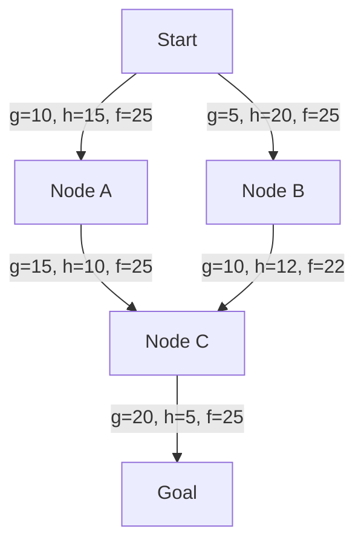

# 搜索算法 (Search Algorithms)

## 一、概述 (Overview)

搜索算法用于在数据结构中定位目标元素或满足条件的解。按搜索空间可分为线性搜索、区间搜索、图搜索、子串搜索等。

搜索问题形式化定义：给定集合 $S$ 和谓词 $P$，找到 $x \in S$ 使得 $P(x)$ 为真。

## 二、线性搜索 (Linear Search)

最简单的搜索方式，逐个遍历元素。

### 2.1 算法描述

```python
def linear_search(arr, target):
    for i, val in enumerate(arr):
        if val == target:
            return i
    return -1
```

### 2.2 复杂度

| 情况 | 复杂度 |
|------|--------|
| 最优 | $O(1)$（目标在首位） |
| 平均 | $O(n)$ |
| 最差 | $O(n)$ |

适用于：无序小数据集。哨兵优化可减少比较次数。

## 三、二分搜索 (Binary Search)

在有序数组中通过不断折半缩小搜索范围。

### 3.1 算法核心

$$mid = \left\lfloor \frac{low + high}{2} \right\rfloor$$

$$Search(low, high) = \begin{cases}
mid & A[mid] = target \\
Search(low, mid-1) & A[mid] > target \\
Search(mid+1, high) & A[mid] < target
\end{cases}$$

```mermaid
flowchart TD
    A[有序数组] --> B[计算 mid]
    B --> C{A[mid] == target？}
    C -->|是| D[返回 mid]
    C -->|否| E{A[mid] > target？}
    E -->|是| F[high = mid-1]
    E -->|否| G[low = mid+1]
    F --> B
    G --> B
```

### 3.2 复杂度

$$T(n) = T(n/2) + O(1) = O(\log n)$$

空间复杂度：递归 $O(\log n)$，迭代 $O(1)$。

### 3.3 变体

| 变体 | 描述 | 应用场景 |
|------|------|----------|
| 查找第一个等于 target | 当 $A[mid]=target$ 时继续向左 | 重复元素的范围 |
| 查找最后一个等于 target | 当 $A[mid]=target$ 时继续向右 | 重复元素的范围 |
| 查找第一个大于等于 target | 下界 (Lower Bound) | 插入位置 |
| 查找最后一个小于等于 target | 上界 (Upper Bound) | 插入位置 |
| 二分答案 | 将最优化问题转化为判定问题 | 最大化最小值 |

```cpp
// 查找第一个大于等于 target（C++ lower_bound）
int lowerBound(vector<int>& arr, int target) {
    int l = 0, r = arr.size();
    while (l < r) {
        int mid = l + (r - l) / 2;
        if (arr[mid] < target) l = mid + 1;
        else r = mid;
    }
    return l;
}
```

### 3.4 二分答案示例

给定单调函数 $f(x)$，求满足 $f(x) \geq target$ 的最小 $x$：

```python
def binary_search_answer():
    lo, hi = min_possible, max_possible
    while lo < hi:
        mid = (lo + hi) // 2
        if feasible(mid):
            hi = mid
        else:
            lo = mid + 1
    return lo
```

## 四、插值搜索 (Interpolation Search)

二分搜索的改进版，根据目标值在值域中的位置估计索引。

$$pos = low + \left\lfloor \frac{target - A[low]}{A[high] - A[low]} \cdot (high - low) \right\rfloor$$

| 情况 | 复杂度 |
|------|--------|
| 平均 | $O(\log \log n)$（数据均匀分布） |
| 最差 | $O(n)$（数据分布极不均匀） |

```mermaid
flowchart LR
    subgraph 数据均匀
        A[索引线性增长] --> B[O(log log n)]
    end
    subgraph 数据不均匀
        C[指数增长] --> D[O(n)]
    end
```

## 五、指数搜索 (Exponential Search)

先找到目标可能所在的区间 $[2^k, 2^{k+1}]$，再在该区间内二分搜索。

$$k = \min\{i \mid 2^i > n \text{ or } A[2^i] \geq target\}$$

时间复杂度 $O(\log n)$，适用于无界/无限长数组。

## 六、三分搜索 (Ternary Search)

在单峰函数上寻找极值点：

```python
def ternary_search(f, l, r, eps=1e-9):
    while r - l > eps:
        m1 = l + (r - l) / 3
        m2 = r - (r - l) / 3
        if f(m1) < f(m2):
            l = m1
        else:
            r = m2
    return (l + r) / 2
```

适用于凸函数 (Convex Function) 或凹函数 (Concave Function) 的极值搜索。

## 七、图搜索算法 (Graph Search)

### 7.1 广度优先搜索 (BFS)

按距起点的距离逐层展开，使用队列。

$$T(V,E) = O(V + E)$$

适用于无权图最短路径、连通分量、二分图检测。

### 7.2 深度优先搜索 (DFS)

一路探索到底，回溯后继续，使用栈或递归。

$$T(V,E) = O(V + E)$$

适用于拓扑排序、强连通分量、环检测、路径存在性。

### 7.3 A* 搜索

启发式搜索算法，结合实际距离 $g(v)$ 和启发估计 $h(v)$：

$$f(v) = g(v) + h(v)$$

启发函数 $h$ 需满足可采纳性 (Admissible)：$h(v) \leq h^*(v)$（真实代价的下界）。



### 7.4 Dijkstra 算法

$f(v) = g(v)$，即只使用实际距离。等价于 $h(v) = 0$ 的 A*。

## 八、字符串搜索 (String Search)

| 算法 | 预处理 | 匹配 | 说明 |
|------|--------|------|------|
| 朴素 (Brute Force) | — | $O(nm)$ | 逐个字符比较 |
| KMP | $O(m)$ | $O(n)$ | 失配时利用 next 数组回退 |
| BM | $O(m+\Sigma)$ | $O(n/m)$ 平均 | 坏字符+好后缀跳跃 |
| Rabin-Karp | $O(m)$ | $O(n)$ 平均 | 滚动哈希 |
| Sunday | $O(m)$ | $O(n)$ 平均 | 关注下一字符 |
| Aho-Corasick | $O(m)$ | $O(n)$ | 多模匹配自动机 |

见 [[ArraysAndStrings]] 的字符串匹配章节。

## 九、回溯搜索 (Backtracking)

通过试错 (Trial and Error) 搜索解空间，不满足约束时回退。

| 问题 | 搜索空间 | 剪枝策略 |
|------|----------|----------|
| N 皇后 | $N!$ | 行列对角线约束 |
| 数独 | $9^{81}$ | 唯一候选数、排除法 |
| 子集和 | $2^n$ | 排序+剪枝 |
| 图着色 | $k^n$ | 向前检查、约束传播 |

$$T_{backtracking} = O(b^d)$$

$b$ 为分支因子，$d$ 为深度。剪枝可大幅缩小搜索空间。

## 十、搜索算法对比 (Algorithm Comparison)

| 算法 | 时间复杂度 | 空间 | 数据要求 |
|------|-----------|------|----------|
| 线性搜索 | $O(n)$ | $O(1)$ | 无 |
| 二分搜索 | $O(\log n)$ | $O(1)$ | 有序 |
| 插值搜索 | $O(\log\log n)$ 平均 | $O(1)$ | 有序+均匀分布 |
| 指数搜索 | $O(\log n)$ | $O(1)$ | 有序 |
| 三分搜索 | $O(\log n)$ | $O(1)$ | 单峰函数 |
| BFS | $O(V+E)$ | $O(V)$ | 图 |
| DFS | $O(V+E)$ | $O(V)$ | 图 |
| A* | $O(E)$ 取决于启发式 | $O(V)$ | 图+启发函数 |
| KMP | $O(n+m)$ | $O(m)$ | 字符串 |
| 回溯 | $O(b^d)$ | $O(d)$ | 解空间 |

## 十一、搜索的空间与时间权衡 (Space-Time Tradeoffs)

| 策略 | 预处理时间 | 查询时间 | 内存 | 适用场景 |
|------|-----------|---------|------|----------|
| 直接查找 | $O(0)$ | $O(n)$ | $O(n)$ | 小数据集 |
| 排序+二分 | $O(n\log n)$ | $O(\log n)$ | $O(n)$ | 静态数据多查询 |
| 哈希表 | $O(n)$ | $O(1)$ 平均 | $O(n)$ | 等值查询 |
| 索引表 | $O(n)$ | $O(1)$ | $O(n+k)$ | 固定有限键值 |
| 倒排索引 | $O(n)$ | $O(1)$ | $O(n \cdot avg\_term)$ | 全文搜索 |
| 线段树 | $O(n)$ | $O(\log n)$ | $O(n)$ | 区间查询 |
| 后缀数组 | $O(n\log n)$ | $O(m + \log n)$ | $O(n)$ | 子串搜索 |

## 十二、搜索算法在 AI 中的应用 (AI Search)

### 12.1 博弈树搜索

Minimax 算法配合 Alpha-Beta 剪枝是博弈 AI 的核心：

$$\alpha\text{-}\beta\ pruning:\ \begin{cases}
\alpha = \max(\alpha, \text{child\_value}) & \text{MAX 节点} \\
\beta = \min(\beta, \text{child\_value}) & \text{MIN 节点} \\
\text{剪枝} & \alpha \geq \beta
\end{cases}$$

### 12.2 Monte Carlo Tree Search (MCTS)

MCTS 分为四步迭代：选择 (Selection) → 扩展 (Expansion) → 模拟 (Simulation) → 回传 (Backpropagation)。

$$UCT = \bar{X}_i + C_p \sqrt{\frac{\ln N}{n_i}}$$

其中 $\bar{X}_i$ 为节点胜率，$N$ 为父节点访问次数，$n_i$ 为当前节点访问次数，$C_p$ 为探索常数。

### 12.3 约束满足问题 (CSP)

搜索启发式：
- **MRV** (Minimum Remaining Values)：选择剩余值最少的变量
- **LCV** (Least Constraining Value)：选择约束最少的赋值
- **Forward Checking**：赋值后删除冲突域
- **AC-3** (Arc Consistency)：弧一致性传播

$$\text{CSP}:\ (X, D, C) \text{ where } X=\text{vars}, D=\text{domains}, C=\text{constraints}$$

## 十三、搜索算法的并行化 (Parallel Search)

| 算法 | 并行策略 | 加速上限 |
|------|----------|----------|
| BFS | 分层并行 | $\approx O(V+E)/P$ |
| DFS | 分支并行 | 加速取决于分支 |
| 二分搜索 | 无（数据依赖） | 1 |
| 回溯 | 搜索空间分块 | 近线性 |
| A* | 并行扩展，冲突管理 | 取决于启发质量 |

## 相关条目
- [[SortingAlgorithms]]
- [[Graphs]]
- [[Trees]]
- [[ArraysAndStrings]]
- [[INDEX|当前目录索引]]
