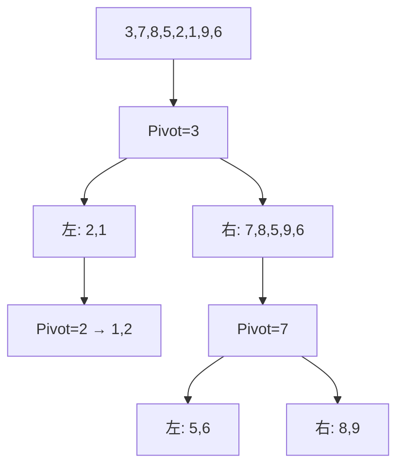

# 排序算法 (Sorting Algorithms)

## 一、概述

排序是将一组数据按特定顺序排列的操作，是计算机科学中最基础、研究最充分的算法问题之一。

### 1.1 排序分类

| 分类维度 | 类型 | 说明 |
|----------|------|------|
| 原地性 | In-place / Out-of-place | 是否需要额外 $O(n)$ 空间 |
| 稳定性 | Stable / Unstable | 相等元素的相对顺序是否保持 |
| 比较性 | Comparison-based / Non-comparison | 是否依赖元素比较 |
| 适应性 | Adaptive / Non-adaptive | 是否利用输入有序性 |
| 递归性 | Recursive / Iterative | 实现方式 |

## 二、比较排序

下界定理：任何比较排序在最坏情况下至少需 $\Omega(n \log n)$ 次比较。

$$\text{决策树高度} \geq \log_2(n!) \approx n\log_2 n - 1.44n$$

### 2.1 冒泡排序 (Bubble Sort)

重复遍历数组，交换相邻逆序对。每轮确定一个最大值到尾端。

$$T(n) = \frac{n(n-1)}{2} = O(n^2)$$

| 情况 | 复杂度 | 说明 |
|------|--------|------|
| 最优 | $O(n)$ | 已有序，加标志位优化 |
| 平均 | $O(n^2)$ | 随机排列 |
| 最坏 | $O(n^2)$ | 逆序 |

稳定，原地，$O(1)$ 额外空间。

### 2.2 选择排序 (Selection Sort)

每轮从未排序部分选出最小值，放到已排序部分末尾。

$$T(n) = \sum_{i=0}^{n-1} (n-i-1) = \frac{n(n-1)}{2} = O(n^2)$$

不稳定（因交换可能破坏相对顺序），原地。

### 2.3 插入排序 (Insertion Sort)

将每个元素插入到已排序部分的正确位置。

$$T(n) = 
\begin{cases}
O(n) & \text{已有序} \\
O(n^2) & \text{逆序}
\end{cases}$$

稳定，原地。$O(n)$ 交换次数优于冒泡排序。小规模数据效率高，常作为高级排序的底层层优化。

```python
def insertion_sort(arr):
    for i in range(1, len(arr)):
        key = arr[i]
        j = i - 1
        while j >= 0 and arr[j] > key:
            arr[j + 1] = arr[j]
            j -= 1
        arr[j + 1] = key
```

### 2.4 希尔排序 (Shell Sort)

插入排序的改进版，通过增量序列 (Gap Sequence) 进行分组插入排序。

增量序列常用 $h_{k+1} = 3h_k + 1$（Knuth 序列）。最坏时间复杂度 $O(n^{3/2})$。

不稳定（分组跨越交换）。

### 2.5 归并排序 (Merge Sort)

分治法：将数组分成两半，递归排序后合并。

$$T(n) = 2T(n/2) + O(n) = O(n \log n)$$

```mermaid
flowchart TD
    A[5,2,4,7,1,3,6,0] --> B1[5,2,4,7]
    A --> B2[1,3,6,0]
    B1 --> C1[5,2]
    B1 --> C2[4,7]
    B2 --> C3[1,3]
    B2 --> C4[6,0]
    C1 --> D1[5] D2[2]
    C2 --> D3[4] D4[7]
    C3 --> D5[1] D6[3]
    C4 --> D7[6] D8[0]
    D1 D2 --> E1[2,5]
    D3 D4 --> E2[4,7]
    D5 D6 --> E3[1,3]
    D7 D8 --> E4[0,6]
    E1 E2 --> F1[2,4,5,7]
    E3 E4 --> F2[0,1,3,6]
    F1 F2 --> G[0,1,2,3,4,5,6,7]
```

| 特性 | 值 |
|------|-----|
| 时间复杂度 | $O(n\log n)$ |
| 空间复杂度 | $O(n)$ |
| 稳定性 | 稳定 |
| 适用 | 链接排序、大数据量 |

### 2.6 快速排序 (Quick Sort)

选取 Pivot（基准），将数组分为左右两部分，递归排序。

$$T(n) = T(k) + T(n-k-1) + O(n)$$

| 情况 | 复杂度 |
|------|--------|
| 最优 | $O(n \log n)$（每次平分） |
| 平均 | $O(n \log n)$ |
| 最坏 | $O(n^2)$（每次选最小/最大） |



优化策略：随机 Pivot、三数取中、小规模转插入排序、三向切分（处理重复元素）。

不稳定，原地，但递归栈空间 $O(\log n)$。

### 2.7 堆排序 (Heap Sort)

利用最大堆/最小堆排序。

$$T(n) = O(n) + n \cdot O(\log n) = O(n \log n)$$

不稳定，原地。见堆章节。

## 三、非比较排序

### 3.1 计数排序 (Counting Sort)

适用于整数范围较小的情况。统计每个值出现次数，计算前缀和确定位置。

$$T(n,k) = O(n + k)$$

空间 $O(k)$，$k$ 为值域大小。

稳定。当 $k = O(n)$ 时最为高效。

### 3.2 基数排序 (Radix Sort)

按位排序，可 LSD（最低位优先）或 MSD（最高位优先）。每位使用稳定排序（如计数排序）。

$$T(n,d,k) = O(d \cdot (n + k))$$

$d$ 为位数，$k$ 为基数（通常 10 或 256）。

```python
def radix_sort(arr):
    max_val = max(arr)
    exp = 1
    while max_val // exp > 0:
        counting_sort_by_digit(arr, exp)
        exp *= 10
```

### 3.3 桶排序 (Bucket Sort)

将元素分到 $m$ 个桶中，桶内排序后合并。

平均时间复杂度 $O(n + m)$，最坏 $O(n^2)$。要求数据均匀分布。

## 四、排序算法对比

| 算法 | 最优 | 平均 | 最坏 | 空间 | 稳定 | 原地 |
|------|------|------|------|------|------|------|
| 冒泡 | $n$ | $n^2$ | $n^2$ | 1 | 是 | 是 |
| 选择 | $n^2$ | $n^2$ | $n^2$ | 1 | 否 | 是 |
| 插入 | $n$ | $n^2$ | $n^2$ | 1 | 是 | 是 |
| 希尔 | $n\log n$ | $n^{1.5\sim2}$ | $n^{4/3}$ | 1 | 否 | 是 |
| 归并 | $n\log n$ | $n\log n$ | $n\log n$ | $n$ | 是 | 否 |
| 快排 | $n\log n$ | $n\log n$ | $n^2$ | $\log n$ | 否 | 是 |
| 堆排 | $n\log n$ | $n\log n$ | $n\log n$ | 1 | 否 | 是 |
| 计数 | $n+k$ | $n+k$ | $n+k$ | $k$ | 是 | 否 |
| 基数 | $d(n+k)$ | $d(n+k)$ | $d(n+k)$ | $n+k$ | 是 | 否 |
| 桶 | $n+m$ | $n+m$ | $n^2$ | $n+m$ | 是 | 否 |

## 五、实际工程中的排序

| 语言/库 | 使用的排序算法 | 说明 |
|----------|---------------|------|
| C++ std::sort | IntroSort | 快排 + 堆排 + 插入排序混合 |
| Java Arrays.sort | Dual-Pivot QuickSort | 双轴快排（基本类型） |
| Java Collections.sort | TimSort | 归并 + 插入排序混合 |
| Python list.sort | TimSort | 自适应稳定排序 |
| .NET | IntroSort | 同 C++ |
| Go sort | Pattern-Defeating QuickSort | PDQSort |

TimSort 通过识别已有序的 run（连续有序片段），对每个 run 排序后合并。在已部分有序的数据上性能接近 $O(n)$。

$$T_{TimSort}(partially\ sorted) = O(n)$$

## 六、排序算法选择指南

| 数据特征 | 推荐算法 | 原因 |
|----------|----------|------|
| 小规模 ($n < 50$) | 插入排序 | 常数小，缓存友好 |
| 基本有序 | 插入排序 / TimSort | 自适应 $O(n)$ |
| 大规模随机 | 快速排序 / TimSort | $O(n\log n)$ |
| 链表 | 归并排序 | 无需随机访问 |
| 大值域整数 | 基数排序 | $O(n)$ |
| 短范围整数 | 计数排序 | $O(n+k)$ |
| 数据分布在磁盘 | 外排序 (多路归并) | 最小化 I/O |
| 需要稳定性 | 归并排序 / TimSort | 稳定 |
| 内存受限 | 堆排序 | 原地 $O(1)$ 空间 |

### 6.1 外排序 (External Sorting)

当数据量超过内存时，使用外排序：

1. 生成 run：读取可在内存中排序的数据块，排序后写入临时文件
2. 多路归并：同时打开所有 run，使用优先队列合并

$$T_{external} = sort\_passes \times (read\_cost + write\_cost)$$

$$sort\_passes = 1 + \lceil \log_{M/B} (N/M) \rceil$$

其中 $N$ 为总数据量，$M$ 为可用内存，$B$ 为块大小。

### 6.2 并行排序

| 方法 | 原理 | 加速比 |
|------|------|--------|
| 并行快排 | 递归时并行处理两半 | $O(n\log n / P)$ |
| Sample Sort | 采样划分后并行排序 | 接近线性 |
| Bitonic Sort | 双调排序网络 | $O(\log^2 n)$ 步 |
| GPU 基数排序 | CUDA 并行基数排序 | 数百倍加速 |

## 七、部分排序与选择算法

### 7.1 QuickSelect (第 k 小元素)

$$T(n) = T(n/2) + O(n) = O(n)$$

最坏 $O(n^2)$，BFPRT (Median of Medians) 算法可保证 $O(n)$。

### 7.2 堆实现 Top-K

```python
def top_k(arr, k):
    return heapq.nlargest(k, arr)  # 最小堆，O(n log k)
```

## 相关条目
- [[HeapsAndPriorityQueues]]
- [[SearchAlgorithms]]
- [[ArraysAndStrings]]
- [[INDEX|当前目录索引]]
