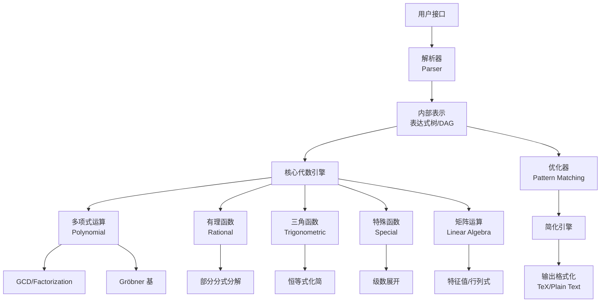

# 符号计算

符号计算（Symbolic Computation），又称计算机代数（Computer Algebra），是指用计算机对数学表达式进行精确符号操作的计算范式。与数值计算（Numerical Computation）的浮点近似不同，符号计算保持数学表达式的精确形式，例如将 $\sqrt{2}$ 保留为符号而非输出 1.41421356。典型计算机代数系统（CAS）包括 Mathematica、Maple、Maxima 和 SymPy（Python 符号计算库）。

## 符号计算 vs 数值计算

| 特性 | 符号计算 | 数值计算 |
|:---|:---|:---|
| 表示方式 | 精确表达式 | 浮点近似 |
| 误差 | 无舍入误差 | 有截断/舍入误差 |
| 速度 | 较慢（表达式膨胀） | 快速（定点运算） |
| 反例 | $ \sin(\pi/4) \to \sqrt{2}/2 $ | $ \sin(\pi/4) \to 0.707106781 $ |
| 适用场景 | 公式推导、定理证明 | 模拟、大规模计算 |
| 计算复杂度 | NP-hard 问题常见 | 通常多项式时间 |

## 核心运算

### 多项式运算 （Polynomial Operations）

- 展开（Expand）：$ (x + y)^n \to \sum_{k=0}^n \binom{n}{k} x^{n-k} y^k $
- 因式分解（Factor）：$ x^2 - 1 \to (x-1)(x+1) $
- 最大公因式（GCD）：Euclid 算法、子结式算法（Subresultant PRS）
- Gröbner 基：多项式方程组求解的核心工具

#### Gröbner 基

Gröbner 基是 Buchberger 于 1965 年提出的算法，用于处理多元多项式理想：

$$ \langle f_1, f_2, \dots, f_k \rangle \xrightarrow{\text{Buchberger}} G = \{g_1, \dots, g_m\} $$

应用包括多项式方程组求解、几何定理自动证明、整数规划等。

### 符号微分 （Symbolic Differentiation）

符号微分应用链式法则、乘积法则和商法则的精确规则：

$$ \frac{d}{dx} \sin(x^2) = \cos(x^2) \cdot 2x $$

$$ \frac{d}{dx} (f \cdot g) = f' \cdot g + f \cdot g' $$

$$ \frac{d}{dx} \left(\frac{f}{g}\right) = \frac{f' \cdot g - f \cdot g'}{g^2} $$

与自动微分（Automatic Differentiation）的区别：

| 方法 | 符号微分 | 自动微分（正向模式） | 自动微分（反向模式） |
|:---|:---|:---|:---|
| 实现方式 | 表达式重写 | 计算图+链式法则 | 计算图+反向传播 |
| 表达式膨胀 | 严重 | 可控 | 可控 |
| 存储需求 | 高 | 低 | 中 |
| 计算效率 | 低 | $O(n)$ | $O(1)$ |

### 符号积分 （Symbolic Integration）

符号积分比微分困难得多。核心算法包括 Risch 算法（处理初等函数积分）和 Meijer G 函数方法：

$$ \int e^{-x^2} \, dx = \frac{\sqrt{\pi}}{2} \operatorname{erf}(x) $$

$$ \int \frac{1}{\sqrt{1 + x^3}} \, dx \quad \text{— 涉及椭圆积分} $$

Risch 算法的核心思想：若 $f$ 为初等函数，则其原函数可表示为初等函数当且仅当积分落在 Liouville 扩展域中。

### 表达式简化 （Simplification）

| 简化类型 | 示例 | 简化结果 |
|:---|:---|:---|
| 代数化简 | $ \sin^2 x + \cos^2 x $ | 1 |
| 对数合并 | $ \log a + \log b $ | $ \log(ab) $ |
| 根式简化 | $ \sqrt{4} $ | 2 |
| 三角恒等式 | $ \sin(2x) $ | $ 2\sin x \cos x $ |
| 分式约简 | $ (x^2 - 1)/(x - 1) $ | $ x + 1 $ |

## 计算机代数系统的体系结构

## 典型 CAS 系统对比

| 系统 | 语言 | 开源 | 特点 |
|:---|:---|:---:|:---|
| Mathematica | Wolfram | ✗ | 最强符号引擎、笔记本界面 |
| Maple | Maple | ✗ | 符号积分能力强 |
| Maxima | Common Lisp | ✓ | 历史最悠久 |
| SymPy | Python | ✓ | 与 Python 生态集成 |
| SageMath | Python | ✓ | 整合多个 CAS |
| Axiom | SPAD | ✓ | 类型化代数系统 |
| Reduce | Lisp | ✓ | 轻量级 |
| Singular | C++ | ✓ | 专注于多项式 |

## 多项式系统的数值-符号混合求解

### 结式方法 （Resultant）

两个多项式的结式 $\text{Res}(f, g)$ 用于判定它们是否有公共根：

$$ \text{Res}(f, g) = a_m^n \prod_{i=1}^m g(\alpha_i) = (-1)^{mn} b_n^m \prod_{j=1}^n f(\beta_j) $$

### 柱形代数分解 （Cylindrical Algebraic Decomposition, CAD）

CAD 是 Collins 于 1975 年提出的算法，用于将 $\mathbb{R}^n$ 分解为半代数集，使每个半代数集上的一组多项式具有常值符号。CAD 在实代数几何和量词消去（Quantifier Elimination）中起核心作用。

## 符号矩阵运算

### 符号行列式

$$ \det(A) = \sum_{\sigma \in S_n} \operatorname{sgn}(\sigma) \prod_{i=1}^n a_{i,\sigma(i)} $$

Bareiss 算法可在符号领域高效计算精确行列式，避免分数累计。

### 符号特征值

符号计算用友矩阵（Companion Matrix）的特征多项式求解精确特征值：

$$ p(\lambda) = \det(\lambda I - C) = \lambda^n + c_{n-1}\lambda^{n-1} + \cdots + c_0 $$

## 符号级数展开

### Taylor 级数

$$ f(x) = \sum_{n=0}^{\infty} \frac{f^{(n)}(a)}{n!} (x - a)^n $$

### Laurent 级数与留数计算

$$ f(z) = \sum_{n=-\infty}^{\infty} a_n (z - z_0)^n, \quad \oint_\gamma f(z) \, dz = 2\pi i \cdot \operatorname{Res}(f, z_0) $$

符号计算可以自动化求解 Laurent 展开的系数和留数。

### 渐近展开

对于特殊函数，符号系统可自动生成渐近级数：

$$ \Gamma(z) \sim \sqrt{2\pi} z^{z-1/2} e^{-z} \left( 1 + \frac{1}{12z} + \frac{1}{288z^2} - \cdots \right), \quad |z| \to \infty $$

## 微分方程符号求解

### 常微分方程 （ODE）

符号 CAS 支持求解多种 ODE 类型：

- 可分离方程：$dy/dx = g(x)h(y)$
- 一阶线性：$dy/dx + P(x)y = Q(x)$
- Bernoulli 方程：$dy/dx + P(x)y = Q(x)y^n$
- Euler-Cauchy 方程：$x^2 y'' + axy' + by = 0$
- 具有常数系数的线性 ODE：$y^{(n)} + a_{n-1}y^{(n-1)} + \cdots + a_0 y = f(x)$

### 偏微分方程 （PDE）

CAS 可通过对称性分析和分离变量法求解部分 PDE：

$$ \frac{\partial u}{\partial t} = \alpha \frac{\partial^2 u}{\partial x^2} \quad \text{（热传导方程）} $$

$$ \frac{\partial^2 u}{\partial t^2} = c^2 \frac{\partial^2 u}{\partial x^2} \quad \text{（波动方程）} $$

## 符号计算与形式验证

符号计算在形式验证（Formal Verification）中扮演关键角色：

### 符号模型检验

- **二元决策图**（Binary Decision Diagram, BDD）：符号表示布尔函数，用于硬件验证
- **符号轨迹评估**（Symbolic Trajectory Evaluation）：以符号化方式验证电路时序行为
- **SMT 求解器**：可满足性模理论（Satisfiability Modulo Theories）结合符号推理和约束求解

### 计算机代数在定理证明中的应用

- ACL2、Coq、Isabelle 等证明助理使用符号计算处理代数重写
- 多项式理想和 Gröbner 基用于自动证明几何定理
- 循环不变式的符号发现和归纳推理

## 符号计算中的数据结构

### 表达式树 （Expression Tree）

$$ (a + b) \times (c - d) \to \begin{array}{c}
\text{*} \\
\swarrow \searrow \\
\text{+} \quad \text{-} \\
\swarrow \searrow \swarrow \searrow \\
a \quad b \quad c \quad d
\end{array} $$

### 有向无环图 （DAG）

DAG 表示通过公共子表达式共享消除冗余，比树结构更紧凑。

### 规范形式 （Canonical Form）

每个表达式都有唯一的规范表示，是简化判定和匹配的基础。

## 符号计算在工程中的应用

### 自动公式推导

在物理建模中，符号计算自动推导拉格朗日方程、运动方程和守恒律：

$$ \frac{d}{dt} \left(\frac{\partial L}{\partial \dot{q}_i}\right) - \frac{\partial L}{\partial q_i} = 0 $$

### 控制器设计

传递函数自动化简和符号极点配置：

$$ G(s) = \frac{K}{s^2 + 2\zeta \omega_n s + \omega_n^2} $$

### 代码生成

从符号表达式自动生成 C/Fortran 代码，用于高性能数值计算。

## 挑战与前沿

- **表达式膨胀**（Expression Swell）：中间表达式可能呈指数级增长
- **代数数域计算**：有限域、数域上的精确运算
- **混合计算**：符号 + 数值 + 区间计算的混合范型
- **并行符号计算**：分布式 Gröbner 基计算
- **机器学习辅助符号计算**：用神经网络预测积分结果和化简策略

## 符号计算的教育资源与实践

### 推荐学习路径

1. **入门**：SymPy 教程 + 基础代数简化
2. **进阶**：Gröbner 基算法实现 + 符号积分 Risch 算法概述
3. **高级**：CAS 核心引擎开发、模式匹配和简化策略

### 实践场景示例

- 用 SymPy 验证三角恒等式和微积分公式
- 用 Mathematica 推导广义相对论中的 Christoffel 符号
- 用 Maple 求解非线性微分方程组的符号解
- 用 SageMath 进行数论中的代数数域计算

## 相关条目

- [[05_ComputerScience/DataStructuresAndAlgorithms/ComputerAlgebra|计算机代数]]
- [[05_ComputerScience/DataStructuresAndAlgorithms/NumericalComputation|数值计算]]
- [[05_ComputerScience/DataStructuresAndAlgorithms/AutomaticDifferentiation|自动微分]]
- [[05_ComputerScience/Mathematics/PolynomialTheory|多项式理论]]
- [[05_ComputerScience/DataStructuresAndAlgorithms/SymPy|SymPy 库]]
