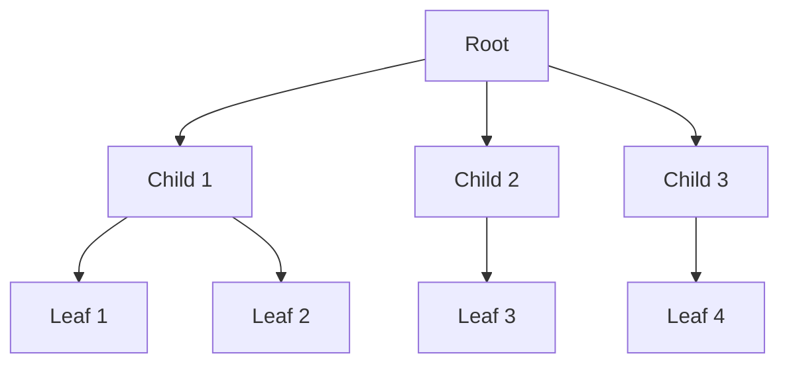
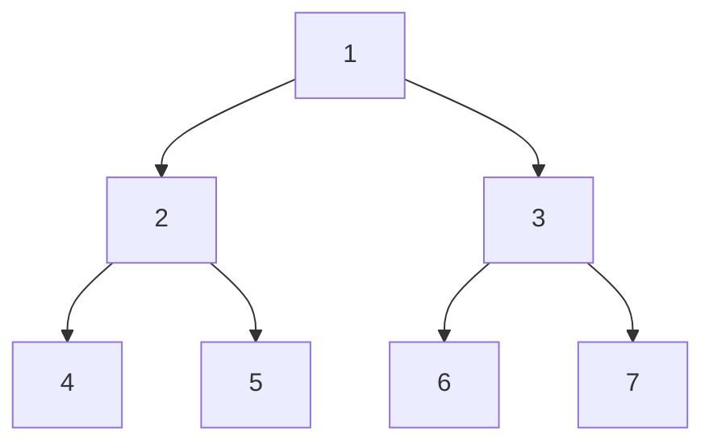
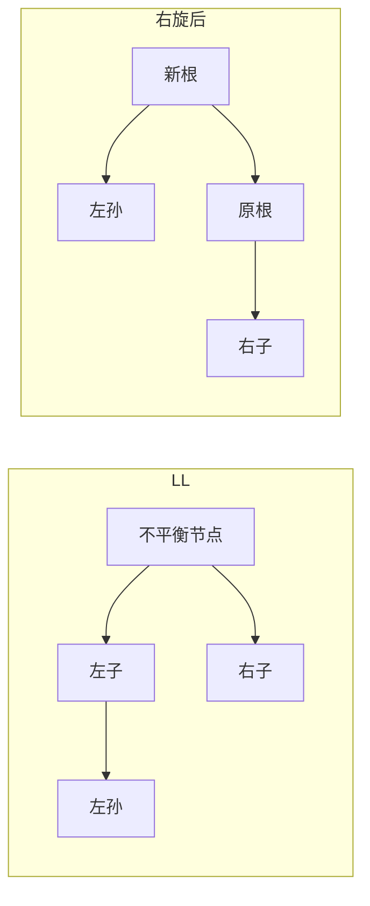
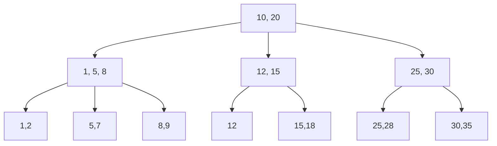
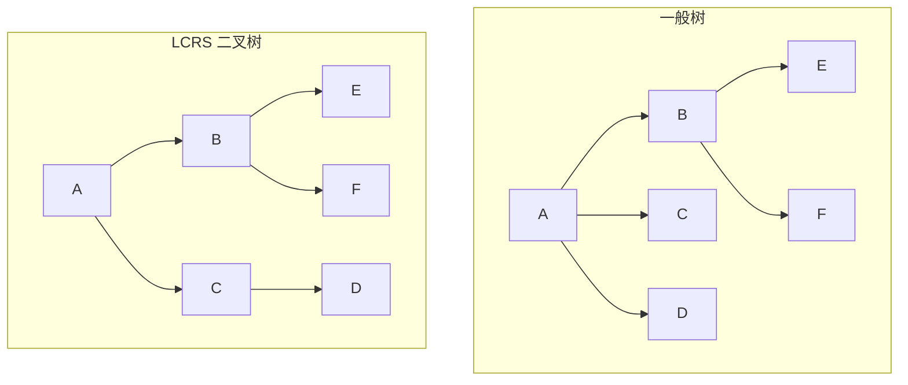

# 树 (Trees)

## 一、概述

树是一种非线性层次数据结构，由节点 (Node) 和边 (Edge) 组成。树是连通无环图 (Connected Acyclic Graph)。形式化定义：一棵树 $T = (V, E)$，其中 $V$ 是顶点集合，$E$ 是边集合，满足 $|E| = |V| - 1$ 且任意两节点间存在唯一路径。

### 1.1 基本术语

| 术语 | 英文 | 定义 |
|------|------|------|
| 根节点 | Root | 没有父节点的节点 |
| 叶节点 | Leaf | 没有子节点的节点 |
| 子树 | Subtree | 节点及其所有后代构成的树 |
| 深度 | Depth | 根到该节点的边数 |
| 高度 | Height | 该节点到最深叶节点的边数 |
| 度 | Degree | 节点的子节点个数 |

树的高度与节点数的关系：对于一棵度为 $d$ 的满树，高度 $h$ 与节点数 $N$ 满足：

$$N = \frac{d^{h+1} - 1}{d - 1}$$



## 二、二叉树 (Binary Tree)

每个节点最多有两个子节点，分别称为左子节点 (Left Child) 和右子节点 (Right Child)。

### 2.1 二叉树性质

- 第 $i$ 层最多有 $2^{i-1}$ 个节点（根为第 1 层）
- 深度为 $h$ 的二叉树最多有 $2^h - 1$ 个节点
- $n_0 = n_2 + 1$（叶节点数 = 度为 2 的节点数 + 1），其中 $n_0$ 为叶节点数，$n_2$ 为度 2 节点数

### 2.2 特殊二叉树

| 类型 | 英文 | 特征 |
|------|------|------|
| 满二叉树 | Full Binary Tree | 所有节点度为 0 或 2 |
| 完全二叉树 | Complete Binary Tree | 除最后一层外全满，最后一层靠左 |
| 完美二叉树 | Perfect Binary Tree | 所有叶节点在同一层 |
| 斜树 | Skewed Tree | 所有节点只有左或右子节点 |

### 2.3 遍历方式 (Traversal)



| 遍历 | 英文 | 顺序 | 结果 |
|------|------|------|------|
| 前序 | Preorder | 根 → 左 → 右 | 1, 2, 4, 5, 3, 6, 7 |
| 中序 | Inorder | 左 → 根 → 右 | 4, 2, 5, 1, 6, 3, 7 |
| 后序 | Postorder | 左 → 右 → 根 | 4, 5, 2, 6, 7, 3, 1 |
| 层序 | Level-order | 逐层从左到右 | 1, 2, 3, 4, 5, 6, 7 |

递归实现的时间复杂度 $O(n)$，空间复杂度 $O(h)$，其中 $h$ 为树高。

```cpp
// 前序遍历递归实现
void preorder(TreeNode* root) {
    if (root == nullptr) return;
    visit(root);
    preorder(root->left);
    preorder(root->right);
}
```

## 三、二叉搜索树 (BST)

二叉搜索树 (Binary Search Tree) 满足：左子树所有节点值 < 根节点值 < 右子树所有节点值。

### 3.1 操作复杂度

| 操作 | 平均 | 最坏 |
|------|------|------|
| 查找 | $O(\log n)$ | $O(n)$ |
| 插入 | $O(\log n)$ | $O(n)$ |
| 删除 | $O(\log n)$ | $O(n)$ |

最坏情况发生在插入有序数据时形成斜树。为解决此问题，出现了平衡二叉树。

### 3.2 查找算法

```python
def search_bst(root, key):
    if root is None or root.val == key:
        return root
    if key < root.val:
        return search_bst(root.left, key)
    return search_bst(root.right, key)
```

## 四、平衡二叉树 (Balanced BST)

### 4.1 AVL 树

AVL 树要求任意节点的左右子树高度差不超过 1：

$$|\text{height}(left) - \text{height}(right)| \leq 1$$

平衡因子 (Balance Factor) $BF = \text{height}(L) - \text{height}(R)$。四种旋转操作：



| 失衡类型 | 旋转方式 | 描述 |
|----------|----------|------|
| LL（左左）| 右旋 | 在左子树的左子树插入 |
| RR（右右）| 左旋 | 在右子树的右子树插入 |
| LR（左右）| 左右旋 | 先左旋再右旋 |
| RL（右左）| 右左旋 | 先右旋再左旋 |

### 4.2 红黑树 (Red-Black Tree)

红黑树是近似平衡的 BST，性质：
1. 每个节点是红色或黑色
2. 根节点是黑色
3. 叶节点 (NIL) 是黑色
4. 红色节点的子节点必为黑色
5. 任一节点到叶节点的所有路径含相同数量的黑节点

红黑树保证最长路径不超过最短路径的 2 倍，故 $h \leq 2\log_2(n+1)$。

## 五、B 树与 B+ 树

用于磁盘存储的多路搜索树，减少 I/O 次数。

### B 树定义

一棵 $m$ 阶 B 树满足：
- 每个节点最多 $m$ 个子节点
- 除根和叶节点外，每个节点至少 $\lceil m/2 \rceil$ 个子节点
- 根节点至少 2 个子节点（除非是叶节点）
- 所有叶节点在同一层



B+ 树将数据全存于叶节点，内部节点仅存索引，叶节点间有指针链接。

## 六、堆 (Heap)

堆是一种完全二叉树，可用数组实现。$parent(i) = \lfloor i/2 \rfloor$，$left(i) = 2i$，$right(i) = 2i+1$。

### 6.1 最大堆与最小堆

| 类型 | 性质 | 根节点 |
|------|------|--------|
| 最大堆 (Max-Heap) | $A[parent] \geq A[i]$ | 最大值 |
| 最小堆 (Min-Heap) | $A[parent] \leq A[i]$ | 最小值 |

建堆操作 `build_heap` 时间复杂度 $O(n)$：

$$T(n) = \sum_{h=0}^{\log n} \frac{n}{2^{h+1}} \cdot O(h) = O(n)$$

## 七、并查集 (Union-Find)

用于处理不相交集合的合并与查询问题。支持两种操作：
- `find(x)`：查找元素所属集合
- `union(x, y)`：合并两个集合

路径压缩 (Path Compression) 和按秩合并 (Union by Rank) 可将均摊时间复杂度优化至近似 $O(1)$，确切为 $O(\alpha(n))$，其中 $\alpha$ 为阿克曼函数的反函数。

```cpp
int find(int x) {
    if (parent[x] != x)
        parent[x] = find(parent[x]);  // 路径压缩
    return parent[x];
}
```

## 八、树的应用

| 应用场景 | 使用的树结构 | 原因 |
|----------|-------------|------|
| 文件系统 | 多叉树 | 目录层次结构 |
| 编译器 AST | 语法树 | 程序结构解析 |
| 数据库索引 | B+ 树 | 磁盘 I/O 优化 |
| 路由协议 | Trie（前缀树）| IP 前缀匹配 |
| 表达式求值 | 表达式树 | 运算符优先级 |
| 决策系统 | 决策树 | 分类与回归 |

另外，线段树 (Segment Tree) 和树状数组 (Fenwick Tree) 用于区间查询问题。Trie（字典树）用于字符串前缀匹配，时间复杂度 $O(L)$，其中 $L$ 为字符串长度。

## 九、树的序列化与反序列化

树的序列化 (Serialization) 是将树结构转换为线性字符串的过程，反序列化 (Deserialization) 为其逆过程。常见方法：

| 方法 | 遍历方式 | 特点 |
|------|----------|------|
| 前序序列化 | 前序遍历 + 标记空节点 | 简单直观 |
| 层序序列化 | 层序遍历 | 适合完全二叉树 |
| 括号表示法 | 嵌套括号 `A(B,C)` | 紧凑，人类可读 |

前序序列化示例：将二叉树转换为字符串 `"1,2,4,#,#,5,#,#,3,6,#,#,7,#,#"`，其中 `#` 表示空节点，使用逗号分隔。反序列化时按前序递归重建，遇到 `#` 返回空节点。时间与空间复杂度均为 $O(n)$。

## 十、树与森林的转换

### 10.1 二叉树表示一般树

任何有序树 (General Tree) 可用左孩子右兄弟 (Left-Child Right-Sibling, LCRS) 表示法转换为二叉树：



- `left` 指针指向第一个子节点
- `right` 指针指向下一个兄弟节点

这种表示将 $k$ 叉树转换为二叉树，空间更紧凑，且可应用二叉树的所有算法。

### 10.2 森林与二叉树的对应

森林 (Forest) 是若干棵树的集合。将每棵树的根视为兄弟节点，用 LCRS 法可合并为单棵二叉树。森林的前序遍历等于对应二叉树的前序遍历，森林的中序遍历等于对应二叉树的中序遍历。

## 十一、树形动态规划

树形 DP 是 DP 在树结构上的应用，在 DFS 遍历过程中计算状态转移。

### 11.1 树的最大独立集

选取不相邻的节点，使权重和最大：

$$dp[u][0] = \sum_{v \in children(u)} \max(dp[v][0], dp[v][1])$$
$$dp[u][1] = w_u + \sum_{v \in children(u)} dp[v][0]$$

其中 $dp[u][0]$ 表示不选 $u$ 时的最优值，$dp[u][1]$ 表示选 $u$ 时的最优值。

### 11.2 树的直径

树中任意两节点间最长路径的长度。两次 BFS/DFS 即可求解：第一次从任意点找到最远点 $p$，第二次从 $p$ 找到最远点 $q$，$p$ 到 $q$ 的距离即为直径。

$$diameter(G) = \max_{u,v \in V} dist(u,v)$$

也可用树形 DP：对每个节点，计算经过该节点的最长路径（两个最深子树深度之和），取全局最大值。

### 11.3 树的重心

删去重心后，所得各连通分量的大小均不超过 $n/2$。使用 DP 求各节点删除后的最大子树大小：

$$size(u) = 1 + \sum_{v \in children(u)} size(v)$$
$$max\_part(u) = \max(\max_{v \in children} size(v), n - size(u))$$
$$center = \arg\min_u max\_part(u)$$

## 十二、树上倍增与 LCA

最近公共祖先 (Lowest Common Ancestor, LCA) 问题：求树中两节点的最深共同祖先。

倍增法（Binary Lifting）：预处理每个节点向上 $2^k$ 层的祖先 $up[u][k]$

$$up[u][0] = parent[u]$$
$$up[u][k] = up[up[u][k-1]][k-1]$$

查询时先将较深节点上提至同层，然后从大到小尝试跳跃。时间复杂度：预处理 $O(n\log n)$，查询 $O(\log n)$。

```python
def lca(u, v):
    if depth[u] < depth[v]: u, v = v, u
    # 上提 u 至与 v 同深
    for k in range(LOG-1, -1, -1):
        if depth[u] - (1 << k) >= depth[v]:
            u = up[u][k]
    if u == v: return u
    for k in range(LOG-1, -1, -1):
        if up[u][k] != up[v][k]:
            u = up[u][k]
            v = up[v][k]
    return up[u][0]
```

树链剖分 (Heavy-Light Decomposition) 也可解决 LCA，还可支持路径修改和查询。

## 相关条目
- [[Graphs]]
- [[HeapsAndPriorityQueues]]
- [[SortingAlgorithms]]
- [[SearchAlgorithms]]
- [[AdvancedDataStructures]]
- [[INDEX|当前目录索引]]
