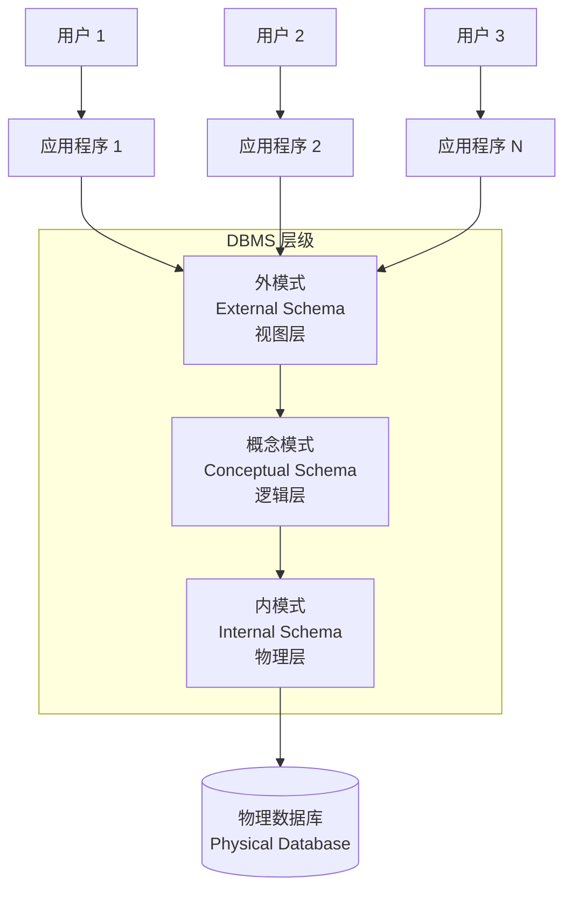
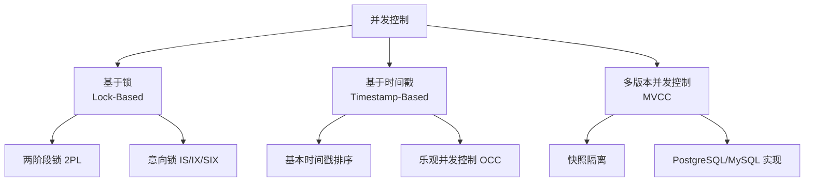

---
aliases: [DatabaseSystems]
tags: ['05_ComputerScience', 'DatabasesAndInformationSystems']
created: 2026-05-17
updated: 2026-05-17
---

# 数据库系统 (Database Systems)

数据库系统（Database System）是组织、存储和管理数据的软件系统，由数据库、数据库管理系统（DBMS）和相关应用程序组成。它是现代信息系统的核心基础设施。

## 数据库系统体系结构



### 三级模式和二层映像

| 层级 | 描述 | 关注点 |
|------|------|--------|
| 外模式 | 用户可见的数据视图 | 安全、简化接口 |
| 概念模式 | 整体数据结构描述 | 实体、属性、关系 |
| 内模式 | 物理存储结构 | 索引、数据页、存储路径 |

**数据独立性**：
- **逻辑独立性**：概念模式变化不影响外模式（如增加字段）
- **物理独立性**：物理存储变化不影响概念模式（如增加索引）

## 数据模型 (Data Models)

### 主要数据模型对比

| 模型 | 结构 | 关系表示 | 查询方式 | 代表系统 |
|------|------|---------|---------|---------|
| 层次模型 | 树 | 父子指针 | 导航式（IMS DL/I） | IMS |
| 网状模型 | 有向图 | 系（Set） | 导航式（CODASYL） | IDMS, IMAGE |
| 关系模型 | 二维表 | 外键 + 连接 | 声明式（SQL） | Oracle, MySQL, PostgreSQL |
| 实体-联系模型 | ER 图 | 联系类型 | 概念设计工具 | 设计阶段使用 |
| 面向对象模型 | 对象 | 对象引用 | OQL, 导航 | ObjectStore |
| 文档模型 | 文档（JSON） | 嵌套/引用 | MapReduce, 聚合管道 | MongoDB, Couchbase |
| 图模型 | 节点和边 | 边 | Gremlin, Cypher, SPARQL | Neo4j, ArangoDB |

### 关系模型基础

**关系**：一个二维表，每一行是一个元组（Tuple），每一列是一个属性（Attribute）。
$$ \text{关系 } R(A_1:A_2:\dots:A_n) \subseteq D_1 \times D_2 \times \dots \times D_n $$

**键**：

| 键类型 | 定义 |
|--------|------|
| 超键 | 能唯一标识元组的属性集合 |
| 候选键 | 最小的超键（任意真子集都不是超键） |
| 主键 | 从候选键中选择的一个 |
| 外键 | 参照另一个关系的主键的属性集 |
| 代理键 | 无业务含义的人造主键（如自增 ID） |

### 关系代数 (Relational Algebra)

| 操作 | 符号 | 含义 |
|------|------|------|
| 选择 | $\sigma_{条件}(R)$ | 选取满足条件的元组 |
| 投影 | $\pi_{列}(R)$ | 选取指定的列 |
| 笛卡尔积 | $R \times S$ | 所有可能的元组组合 |
| 连接 | $R \bowtie_{条件} S$ | 按条件关联两个关系 |
| 除 | $R \div S$ | 包含所有 S 中属性的元组 |
| 并集 | $R \cup S$ | 出现在 R 或 S 中的元组 |
| 差集 | $R - S$ | 在 R 中但不在 S 中的元组 |
| 交集 | $R \cap S$ | 同时在 R 和 S 中的元组 |

## SQL 语言 (SQL Language)

### SQL 分类

| 类别 | 功能 | 代表语句 |
|------|------|---------|
| DDL（数据定义） | 定义数据库结构 | CREATE, ALTER, DROP, TRUNCATE |
| DML（数据操作） | 操作数据 | INSERT, UPDATE, DELETE, SELECT |
| DCL（数据控制） | 权限管理 | GRANT, REVOKE |
| TCL（事务控制） | 事务管理 | BEGIN, COMMIT, ROLLBACK, SAVEPOINT |

### 关联子查询示例

```sql
-- 查询工资高于部门平均工资的员工
SELECT e.name, e.salary, e.department_id
FROM employee e
WHERE e.salary > (
    SELECT AVG(salary)
    FROM employee
    WHERE department_id = e.department_id
);

-- 等价于使用窗口函数
SELECT name, salary, department_id
FROM (
    SELECT name, salary, department_id,
           AVG(salary) OVER (PARTITION BY department_id) AS avg_dept_salary
    FROM employee
) sub
WHERE salary > avg_dept_salary;
```

### 窗口函数 (Window Functions)

```sql
-- 排名和窗口聚合
SELECT
    name,
    department_id,
    salary,
    ROW_NUMBER()    OVER (PARTITION BY department_id ORDER BY salary DESC) AS rn,
    RANK()          OVER (PARTITION BY department_id ORDER BY salary DESC) AS rk,
    DENSE_RANK()    OVER (PARTITION BY department_id ORDER BY salary DESC) AS dr,
    AVG(salary)     OVER (PARTITION BY department_id) AS avg_dept_salary,
    LAG(salary, 1)  OVER (PARTITION BY department_id ORDER BY salary) AS prev_salary,
    LEAD(salary, 1) OVER (PARTITION BY department_id ORDER BY salary) AS next_salary
FROM employee;
```

## 事务管理 (Transaction Management)

### ACID 特性

| 特性 | 含义 | 违反后果 |
|------|------|---------|
| 原子性（Atomicity） | 事务要么全做要么全不做 | 部分更新导致数据不一致 |
| 一致性（Consistency） | 事务前后满足所有约束 | 数据违反完整性规则 |
| 隔离性（Isolation） | 并发事务互不干扰 | 脏读、不可重复读、幻读 |
| 持久性（Durability） | 提交的事务永久保存 | 系统崩溃后数据丢失 |

### 隔离级别 (Isolation Levels)

| 隔离级别 | 脏读 | 不可重复读 | 幻读 | 实现方式 |
|---------|------|-----------|------|---------|
| READ UNCOMMITTED | ✅ 可能 | ✅ 可能 | ✅ 可能 | 不加锁 |
| READ COMMITTED | ❌ | ✅ 可能 | ✅ 可能 | 行级锁（写），MVCC |
| REPEATABLE READ | ❌ | ❌ | ✅ 可能 | 行级锁 + 间隙锁 |
| SERIALIZABLE | ❌ | ❌ | ❌ | 表级锁 / 范围锁 |

### 并发控制协议



## 查询优化 (Query Optimization)

### 选择率和代价估算

查询优化器使用统计信息估算每种执行计划的代价：
```sql
-- 查看 PostgreSQL 执行计划
EXPLAIN (ANALYZE, BUFFERS, FORMAT JSON)
SELECT o.*, c.name
FROM orders o
JOIN customers c ON o.customer_id = c.id
WHERE o.total > 1000 AND c.city = 'Beijing'
ORDER BY o.created_at DESC
LIMIT 100;
```

### 连接算法对比

| 算法 | 复杂度 | 适用场景 | 内存需求 |
|------|--------|---------|---------|
| Nested Loop Join | $O(\|R\| \times \|S\|)$ | 小表驱动大表，有索引 | 低 |
| Block Nested Loop | $O(\|R\| \times \|S\| / B)$ | 无索引的等值连接 | 中等 |
| Hash Join | $O(\|R\| + \|S\|)$ | 大表等值连接 | 高 |
| Sort-Merge Join | $O(\|R\|\log\|R\| + \|S\|\log\|S\|)$ | 已排序数据或不等值连接 | 中等 |

### 索引类型 (Index Types)

| 索引类型 | 数据结构 | 适用查询 | 特点 |
|---------|---------|---------|------|
| B+ 树索引 | B+ 树 | 范围查询、精确匹配 | 最常用 |
| 哈希索引 | 哈希表 | 精确等值匹配 | 不支持范围查询 |
| 位图索引 | 位图 | 低基数（<100）列 | 列存储 |
| GiST | 平衡树 | 空间/全文搜索 | 可扩展 |
| GIN | 倒排索引 | 数组、JSON、全文 | 复合值查询 |
| 全文索引 | 倒排列表 | 文本搜索 | 语言感知 |
| 空间索引（R 树） | R 树 | 空间数据 | 地理空间 |

## 事务日志与恢复 (Transaction Log & Recovery)

### ARIES 恢复算法

ARIES（Algorithms for Recovery and Isolation Exploiting Semantics）是广泛使用的事务恢复算法：

| 阶段 | 操作 | 目的 |
|------|------|------|
| 分析阶段 | 从检查点正向扫描日志 | 确定崩溃时哪些事务处于活动状态 |
| Redo 阶段 | 重放所有已提交事务的更新 | 恢复到崩溃前的状态 |
| Undo 阶段 | 回滚未提交事务的更新 | 撤销事务的部分影响 |

## 分布式数据库 (Distributed Databases)

### CAP 理论与 BASE

| 特性 | 传统 SQL（ACID） | NoSQL（BASE） |
|------|-----------------|--------------|
| 一致性 | 强一致性 | 最终一致性 |
| 可用性 | 次优先 | 高可用性优先 |
| 分区容忍 | 通常弱 | 强分区容忍 |
| 模型 | 关系模型 | 灵活模型（文档、键值、宽列） |

### 数据分片策略

| 策略 | 方法 | 优点 | 缺点 |
|------|------|------|------|
| 水平分片 | 按行划分（哈希/范围/列表） | 扩展写能力 | 跨分片查询复杂 |
| 垂直分片 | 按列划分 | 分离热点列 | 需重新组合 |
| 目录分片 | 查找表定位数据 | 灵活 | 额外查找开销 |
| 一致性哈希 | 哈希环虚拟节点 | 动态扩缩容 | 数据倾斜需平衡 |

## 数据库安全 (Database Security)

| 安全领域 | 措施 | 说明 |
|---------|------|------|
| 身份认证 | 密码、SSL 证书、Kerberos | 验证用户身份 |
| 授权 | DAC/MAC/RBAC | 最小权限原则 |
| 审计 | 日志记录、触发器审计 | 追踪数据访问历史 |
| 加密 | TDE、列级加密 | 透明数据加密 |
| 注入防护 | 参数化查询、ORM | 防止 SQL 注入 |
| 掩码 | 动态数据掩码 | 非授权用户看到脱敏数据 |

## 相关条目
- [[关系数据库]]
- [[SQL 深度]]
- [[查询优化]]
- [[事务管理]]
- [[05_ComputerScience/DatabasesAndInformationSystems/NoSQL/NoSQL|NoSQL]]
- [[大数据技术]]
- [[INDEX|当前目录索引]]


