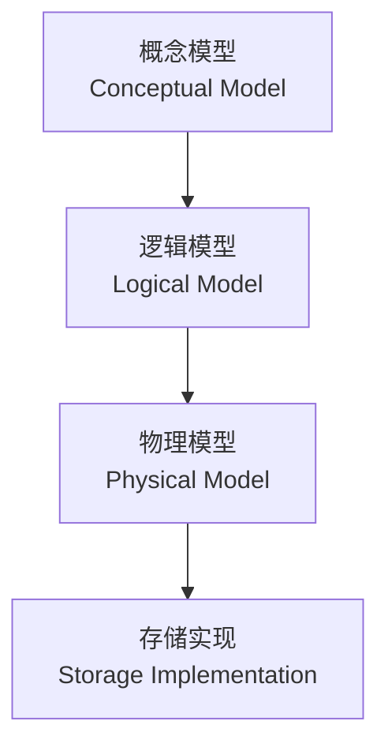
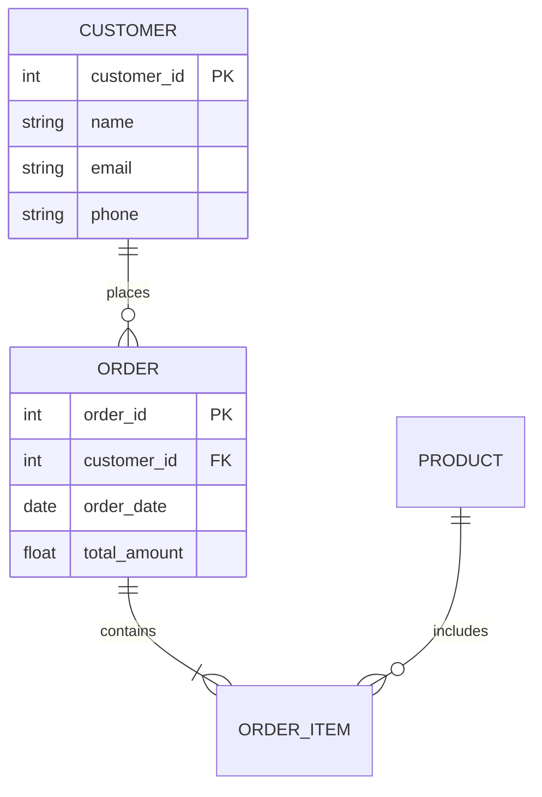

# 数据库系统概述 Database Systems Overview

## 数据库系统定义

数据库系统（Database System）是由数据库（Database）、数据库管理系统（DBMS）以及应用程序组成的完整系统。DBMS 负责数据的定义、存储、查询、更新和管理，是现代软件系统的核心基础设施。

## 数据库管理系统核心功能

| 功能 | 说明 | 典型实现 |
|------|------|---------|
| 数据定义 DDL | 定义数据库结构 | CREATE、ALTER、DROP |
| 数据操纵 DML | 数据的增删改查 | INSERT、UPDATE、DELETE、SELECT |
| 数据控制 DCL | 权限与安全管理 | GRANT、REVOKE |
| 事务管理 | 保证数据一致性 | COMMIT、ROLLBACK、SAVEPOINT |

## 数据库分类

### 关系型数据库 RDBMS

基于关系模型（Relational Model），使用 SQL 作为查询语言。典型产品包括 MySQL、PostgreSQL、Oracle、SQL Server。支持 ACID 事务，适用于金融、ERP 等强一致性场景。

### NoSQL 数据库

针对特定场景设计的非关系型数据库，主要包括：

| 类型 | 特点 | 代表产品 |
|------|------|---------|
| 文档型 (Document) | 存储 JSON/BSON 文档 | MongoDB, CouchDB |
| 键值型 (Key-Value) | 高吞吐低延迟 | Redis, DynamoDB |
| 列族型 (Column-Family) | 适合宽表和大规模分析 | Cassandra, HBase |
| 图数据库 (Graph) | 处理复杂关系网络 | Neo4j, Amazon Neptune |

### NewSQL 数据库

结合关系型数据库的 ACID 特性和 NoSQL 的伸缩能力，如 Google Spanner、CockroachDB、TiDB。

## 核心概念

### 数据模型

### 事务 ACID 特性

事务（Transaction）是数据库操作的最小逻辑单元，具有 ACID 特性：

$$ \text{ACID} = \{ \text{Atomicity}, \text{Consistency}, \text{Isolation}, \text{Durability} \} $$

- **原子性 (Atomicity)**：事务中的所有操作要么全部成功，要么全部回滚
- **一致性 (Consistency)**：事务执行前后数据库状态保持一致
- **隔离性 (Isolation)**：并发事务互不干扰，通过隔离级别控制
- **持久性 (Durability)**：已提交事务的修改永久保存

### 事务隔离级别

| 隔离级别 | 脏读 | 不可重复读 | 幻读 | 性能 |
|---------|------|-----------|------|------|
| 读未提交 (Read Uncommitted) | 可能 | 可能 | 可能 | 最高 |
| 读已提交 (Read Committed) | 避免 | 可能 | 可能 | 高 |
| 可重复读 (Repeatable Read) | 避免 | 避免 | 可能 | 中 |
| 可序列化 (Serializable) | 避免 | 避免 | 避免 | 最低 |

## 数据库设计

### 实体-关系模型 ER Model

ER 模型是数据库逻辑设计的核心工具，ER 图由实体（Entity）、属性（Attribute）和关系（Relationship）构成。

### 范式理论 Normalization

范式是衡量关系模式规范化程度的等级标准：

| 范式 | 要求 | 解决的问题 |
|------|------|-----------|
| 1NF | 属性值不可再分（原子性） | 重复组 |
| 2NF | 满足 1NF 且非主属性完全依赖于主键 | 部分依赖 |
| 3NF | 满足 2NF 且没有传递依赖 | 传递依赖 |
| BCNF | 每个决定因素都是候选键 | 主属性内的函数依赖 |
| 4NF | 消除多值依赖 | 多值依赖 |
| 5NF | 消除连接依赖 | 连接依赖 |

## 数据库性能优化

### 索引策略

索引（Index）是加速数据检索的核心技术。常见索引类型包括 B+ 树索引、哈希索引、全文索引、空间索引和位图索引。B+ 树索引支持范围查询和排序，哈希索引仅支持等值查询但性能极高。索引的设计需要权衡查询加速和写入开销。

### 查询优化

查询优化器（Query Optimizer）负责将用户编写的 SQL 语句转换为高效的执行计划。优化策略包括：
- 代价估算（Cost-based Optimization）
- 连接算法选择（Nested Loop Join、Hash Join、Merge Join）
- 索引利用（Index Scan、Index Only Scan）
- 谓词下推（Predicate Pushdown）
- 物化视图（Materialized View）

### 数据库缓存

缓存机制减少磁盘 I/O 次数，提升数据库响应速度。内存数据库（In-Memory Database）如 Redis 和 Memcached 用作缓存层，可显著降低关系数据库的负载。

## 分布式数据库

分布式数据库系统将数据存储在多台服务器上，提供水平扩展和高可用性。主要挑战包括数据分片（Sharding）、副本一致性（Replication Consistency）和分布式事务。

CAP 定理指出分布式系统在一致性（Consistency）、可用性（Availability）和分区容错性（Partition Tolerance）三者中最多同时满足两个。

$$ CAP \in \{ C, A, P \}, \text{ choose at most 2} $$

BASE 理论（Basically Available, Soft State, Eventually Consistent）是对 ACID 在分布式场景下的妥协，强调最终一致性。

## 数据仓库与大数据

数据仓库（Data Warehouse）用于分析型处理（OLAP），与事务型处理（OLTP）的数据库有本质区别。数据仓库采用星型模式（Star Schema）或雪花型模式（Snowflake Schema），通过 ETL 流程将数据从源系统接入。

大数据技术如 Hadoop、Spark、Flink 进一步扩展了数据库系统对海量数据的处理能力，支持批处理、流处理和实时分析等多种计算模式。

## 数据库发展趋势

- **云原生数据库**：Amazon Aurora、Azure Cosmos DB、Google Cloud Spanner
- **HTAP 混合负载**：同时支持 OLTP 和 OLAP，如 TiDB、ClickHouse
- **AI 增强数据库**：自动调优、智能索引推荐、自然语言查询
- **NewSQL 与分布式 SQL**：兼顾 ACID 与水平扩展
- **多模型数据库**：支持关系、文档、图等多种数据模型

## 数据库备份与恢复

备份策略是数据库可靠性管理的重要组成部分，决定了系统在数据丢失后能够恢复的状态和时间。

| 备份类型 | 描述 | 恢复速度 | 存储开销 |
|---------|------|---------|---------|
| 全量备份 Full Backup | 备份全部数据 | 最慢 | 最大 |
| 增量备份 Incremental | 备份自上次备份后的变更 | 快 | 小 |
| 差异备份 Differential | 备份自上次全量备份后的变更 | 中 | 中 |
| 日志备份 Log Backup | 备份事务日志 | 支持时间点恢复 | 可变 |

### 恢复模式

- **时间点恢复 (Point-in-Time Recovery, PITR)**：将数据库恢复到某个特定时间点
- **闪回查询 (Flashback Query)**：查询历史时间点的数据状态，无需恢复
- **主从复制恢复**：从从库故障切换，减少恢复时间

## 数据库监控与调优

### 关键监控指标

| 指标类别 | 具体指标 | 阈值告警 |
|---------|---------|---------|
| 连接数 | 活动连接数、等待连接数 | 达到池上限的 80% |
| 查询性能 | 慢查询数量、平均查询时间 | P99 > 1s |
| 缓存命中率 | Buffer Pool 命中率、查询缓存命中率 | < 95% |
| 磁盘 I/O | 读写 IOPS、延迟 | 延迟 > 10ms |
| 锁等待 | 锁等待次数、死锁次数 | 持续增长 |
| 复制延迟 | 主从复制延迟时间 | > 5s |

### 数据库参数调优

数据库参数调优根据工作负载特征调整系统配置：

- **连接池大小**：公式为 `(核心数 × 2) + 有效磁盘数`，避免过大连接数导致上下文切换
- **缓冲池大小**：设置为可用内存的 70%~80%，过大导致操作系统内存不足
- **日志缓冲区**：批处理写入量大时增大日志缓冲区
- **排序内存**：复杂排序操作时适当增加排序缓冲区

### 压测方法

数据库性能测试通过模拟实际负载评估系统能力：

1. **基准测试 (Benchmark)**：使用标准测试工具（SysBench, pgbench, TPC-C/TPC-H）测试吞吐量
2. **负载测试 (Load Test)**：模拟正常峰值负载下的系统表现
3. **压力测试 (Stress Test)**：超出正常负载测试系统极限
4. **稳定性测试 (Endurance Test)**：长时间运行检测内存泄漏和性能衰退

## 数据库安全

数据库安全保护数据免受未经授权的访问和泄露：

- **身份认证**：强密码策略、双因素认证、Kerberos 集成
- **权限管理**：最小权限原则、基于角色的访问控制（RBAC）
- **审计日志**：记录所有 DDL/DML 操作、登录尝试
- **数据加密**：TDE 透明数据加密、列级加密、传输加密 TLS
- **SQL 注入防护**：预编译语句、输入验证、WAF 防护
- **数据脱敏**：动态脱敏、静态脱敏，保护敏感信息

## 数据库选型决策

选择数据库系统时需权衡以下维度：

| 评估维度 | 考量要点 | 适合场景 |
|---------|---------|---------|
| 一致性要求 | ACID vs BASE | 金融交易 vs 社交平台 |
| 数据结构 | 固定 vs 灵活 Schema | ERP vs 内容管理 |
| 查询模式 | 简单 CRUD vs 复杂分析 | 在线交易 vs BI 报表 |
| 扩展需求 | 垂直 vs 水平扩展 | 中小规模 vs 大规模 |
| 运维能力 | 自运维 vs 托管服务 | 有 DBA 团队 vs 无 |
| 成本预算 | 许可费 vs 开源 | 企业级 vs 初创 |

## 相关条目

- [[RelationalDatabases]]
- [[BigDataOverview]]
- [[NoSQL]]
- [[ACID]]
- [[CloudServices]]
