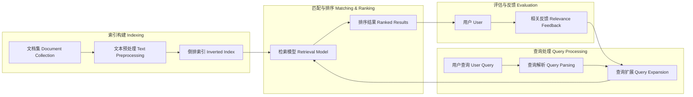
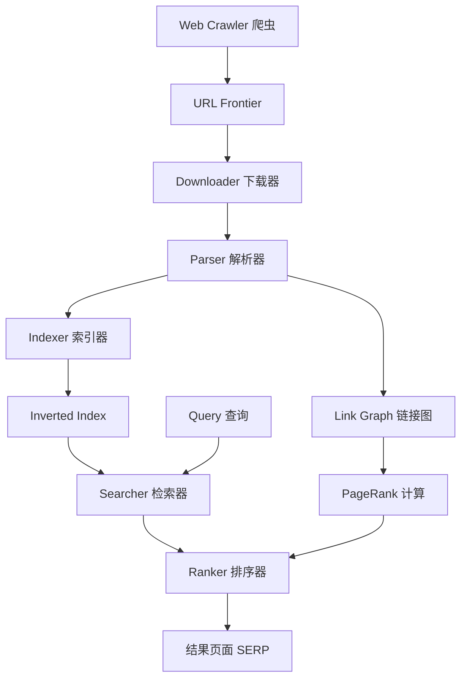

---
aliases: [InformationRetrieval, IR, 信息检索]
tags: ['05_ComputerScience', 'Databases', 'InformationRetrieval']
created: 2026-05-17
updated: 2026-05-17
---

# 信息检索概述 (Information Retrieval Overview)

## 一、引言

信息检索 (Information Retrieval, IR) 是从大规模文档集合中查找满足用户信息需求的相关资源的过程。IR 系统的核心目标是在相关性和效率之间取得平衡，搜索引擎是其最广为人知的应用形式。

## 二、IR 系统架构 (IR System Architecture)



## 三、索引 (Indexing)

### 3.1 倒排索引 (Inverted Index)

倒排索引是 IR 系统中最核心的数据结构，将每个词 (Term) 映射到包含它的文档列表：

```
term₁ → [(doc₁, freq₁), (doc₃, freq₃), ...]
term₂ → [(doc₂, freq₂), (doc₅, freq₅), ...]
```

**构建步骤**：
1. 文档分词 (Tokenization)
2. 去除停用词 (Stop Words Removal)
3. 词干提取 (Stemming) / 词形还原 (Lemmatization)
4. 构建词项-文档矩阵
5. 压缩存储 (变长编码、差值编码)

### 3.2 索引压缩

| 方法 | 原理 | 压缩比 |
|------|------|--------|
| 变长字节编码 (VByte) | 每个字节最高位标识是否继续 | 2-4x |
| Gamma 编码 | 一元编码差值 | 适合小值分布 |
| PForDelta | 打包帧 + 异常值单独存储 | 5-10x |
| 块间跳跃 (Skip List) | 加速 AND 查询合并 | 快速定位 |

## 四、检索模型 (Retrieval Models)

### 4.1 布尔模型 (Boolean Model)

基于集合论，查询为布尔表达式 (AND, OR, NOT)：

- 优点：精确、无排名开销
- 缺点：无部分匹配，结果不分相关性排序

### 4.2 向量空间模型 (Vector Space Model, VSM)

文档和查询表示为 $n$ 维向量，相关度通过余弦相似度 (Cosine Similarity) 度量：

$$
\text{cosine}(q, d) = \frac{q \cdot d}{\|q\| \cdot \|d\|} = \frac{\sum_{i=1}^n w_{q,i} \cdot w_{d,i}}{\sqrt{\sum_{i=1}^n w_{q,i}^2} \cdot \sqrt{\sum_{i=1}^n w_{d,i}^2}}
$$

### 4.3 概率模型 (Probabilistic Model)

BM25 (Okapi BM25) 是目前最广泛使用的概率检索模型：

$$
\text{BM25}(q, d) = \sum_{t \in q} \text{IDF}(t) \cdot \frac{\text{TF}(t, d) \cdot (k_1 + 1)}{\text{TF}(t, d) + k_1 \cdot \left(1 - b + b \cdot \frac{|d|}{\text{avgdl}}\right)}
$$

其中：

- $\text{IDF}(t) = \log \frac{N - n_t + 0.5}{n_t + 0.5}$
- $k_1$ 控制词频饱和度 (通常 1.2-2.0)
- $b$ 控制文档长度归一化 (通常 0.75)

### 4.4 学习排序 (Learning to Rank, LTR)

使用机器学习模型优化排序：

| 方法 | 类型 | 示例 |
|------|------|------|
| Pointwise | 回归/分类预测相关性 | RankNet |
| Pairwise | 比较文档对排序 | LambdaRank |
| Listwise | 直接优化排序列表 | LambdaMART, ListNet |
| 神经排序 | 深度神经网络匹配 | BERT, ColBERT |

## 五、TF-IDF

TF-IDF (Term Frequency-Inverse Document Frequency) 评估词项在文档中的重要程度：

$$
\text{TF-IDF}(t, d) = \text{TF}(t, d) \times \text{IDF}(t)
$$

- **词频 (TF)**：$TF(t, d) = \frac{f_{t,d}}{\sum_{t' \in d} f_{t',d}}$
- **逆文档频率 (IDF)**：$IDF(t) = \log \frac{N}{1 + n_t}$

## 六、查询处理 (Query Processing)

### 6.1 查询扩展

| 方法 | 原理 |
|------|------|
| 相关反馈 (Relevance Feedback) | 利用用户标注的相关文档扩展 |
| 伪相关反馈 (Pseudo RF) | 假设 Top-k 结果相关，提取关键词 |
| 同义词扩展 | WordNet / 词向量 同义词添加 |
| 词向量扩展 | Word2Vec / BERT 嵌入近义词 |

### 6.2 查询重写

- 拼写纠正 (Did you mean?)
- 分词歧义消解
- 停用词处理
- 意图分类 (导航/信息/交易型)

## 七、搜索引擎 (Search Engines)

### 7.1 Web 搜索引擎架构



### 7.2 PageRank 算法

PageRank 利用网页间的链接关系评估网页重要性：

$$
PR(p_i) = \frac{1 - d}{N} + d \sum_{p_j \in M(p_i)} \frac{PR(p_j)}{L(p_j)}
$$

其中 $d$ 为阻尼系数 (通常 0.85)，$L(p_j)$ 为页面 $p_j$ 的出链数。

## 八、评估 (Evaluation)

### 8.1 核心指标

| 指标 | 公式 | 说明 |
|------|------|------|
| Precision | $|R_{\text{ret}} \cap R_{\text{rel}}| / |R_{\text{ret}}|$ | 检索结果的精确度 |
| Recall | $|R_{\text{ret}} \cap R_{\text{rel}}| / |R_{\text{rel}}|$ | 检索结果的覆盖率 |
| F1 | $2 \cdot P \cdot R / (P + R)$ | 精确率和召回率的调和平均 |
| MAP | $\frac{1}{|Q|} \sum_{q \in Q} \text{AveP}(q)$ | 多查询平均精确率 |
| nDCG | $\frac{\text{DCG}}{\text{IDCG}}$ | 考虑排序位置的归一化折扣累积增益 |
| MRR | $\frac{1}{|Q|} \sum_{q \in Q} \frac{1}{\text{rank}_q}$ | 首个相关结果的倒数排名 |

### 8.2 测试集

| 数据集 | 文档数 | 任务 |
|--------|--------|------|
| TREC | 多种规模 | Ad-hoc 检索、QA、Web |
| ClueWeb09/12 | 10 亿+ 网页 | Web 检索 |
| MS MARCO | 880 万文档 | 问答、段落检索 |
| NDCG@k | 千级 | 排序质量评估 |

## 九、应用场景

- **Web 搜索引擎**：Google、Bing、百度
- **企业搜索**：Elasticsearch、Algolia、Meilisearch
- **法律/专利检索**：Westlaw、专利数据库
- **学术搜索**：Google Scholar、Semantic Scholar
- **推荐系统**：协同过滤、内容推荐融合 IR 技术
- **问答系统**：IR 提供候选段落配合阅读器
- **对话系统**：检索增强生成 (RAG)

## 相关条目

- [[DatabaseSystems|数据库系统]]
- [[05_ComputerScience/ArtificialIntelligence/NaturalLanguageProcessing/NaturalLanguageProcessing|自然语言处理 (NLP)]]
- [[05_ComputerScience/ArtificialIntelligence/MachineLearning/MachineLearning|机器学习 (ML)]]
- [[07_InterdisciplinarySciences/DataScience/DataMining|数据挖掘]]
- [[Elasticsearch|Elasticsearch]]
- [[RAG|检索增强生成 (RAG)]]


