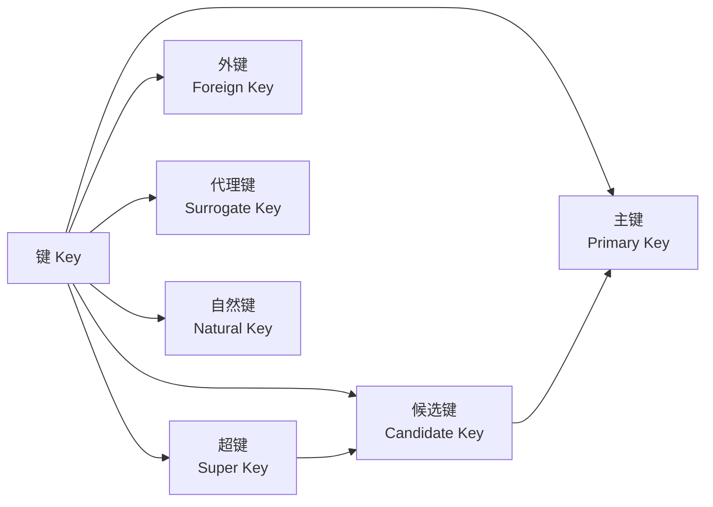
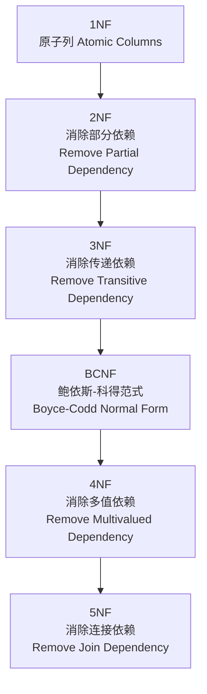
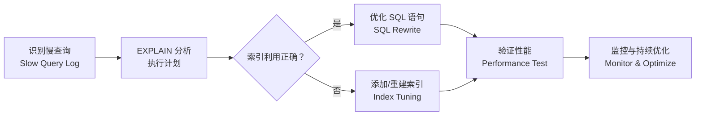

# 关系数据库 Relational Databases

## 关系模型概述

关系数据库（Relational Database）基于 E. F. Codd 于 1970 年提出的关系模型（Relational Model），以二维表（Table/Relation）作为基本数据组织方式。关系模型使用集合论和一阶谓词逻辑作为数学基础，通过元组（Tuple/Row）和属性（Attribute/Column）来组织数据。

Codd 的 12 条规则定义了关系数据库系统的完整性标准，包括信息规则、保证访问规则、空值系统化处理规则等。

## SQL 语言体系

SQL（Structured Query Language）是关系数据库的标准操作语言，主要分为以下子集：

| 子集 | 全称 | 主要命令 |
|------|------|---------|
| DDL | Data Definition Language | CREATE, ALTER, DROP, TRUNCATE |
| DML | Data Manipulation Language | SELECT, INSERT, UPDATE, DELETE |
| DCL | Data Control Language | GRANT, REVOKE |
| TCL | Transaction Control Language | COMMIT, ROLLBACK, SAVEPOINT |

## 表结构与键

### 关系的基本约束

每个关系表中的数据必须满足以下完整性约束：

- **实体完整性 (Entity Integrity)**：主键（Primary Key）唯一标识每一行，且不可为 NULL
- **参照完整性 (Referential Integrity)**：外键（Foreign Key）的值必须在被引用表的主键中存在或为 NULL
- **域完整性 (Domain Integrity)**：列的值必须符合定义的数据类型和约束条件
- **用户定义完整性 (User-defined Integrity)**：业务规则约束，如 CHECK 约束

### 键的类型

## 表连接 Join

连接操作是关系数据库最核心的查询机制，将多个表中的数据按照关联条件组合。

### 连接类型对比

| 连接类型 | 语法 | 返回结果 | 使用场景 |
|---------|------|---------|---------|
| 内连接 INNER JOIN | `INNER JOIN` | 仅匹配的行 | 取交集数据 |
| 左外连接 LEFT JOIN | `LEFT JOIN` | 左表全部 + 右表匹配行 | 主表带可选关联 |
| 右外连接 RIGHT JOIN | `RIGHT JOIN` | 右表全部 + 左表匹配行 | 从表带可选关联 |
| 全外连接 FULL JOIN | `FULL OUTER JOIN` | 两表全部行 | 合并数据 |
| 交叉连接 CROSS JOIN | `CROSS JOIN` | 笛卡尔积 | 生成组合数据 |
| 自连接 Self JOIN | 别名方式 | 表与自身关联 | 层级数据查询 |

### 连接算法

$$\text{Cost}_{\text{NLJ}} = |R| + |R| \times |S| \times \text{sel}$$

$$\text{Cost}_{\text{HashJoin}} = 2 \times (|R| + |S|)$$

$$\text{Cost}_{\text{SortMerge}} = |R| \log|R| + |S| \log|S| + |R| + |S|$$

## 范式理论 Normalization

范式是衡量数据库设计规范化程度的等级体系，目的是减少数据冗余和避免更新异常。

### 范式递进关系

### 反范式化 Denormalization

反范式化是有控制地引入冗余以提升查询性能的策略。常见手段包括添加冗余列、预计算汇总字段等。反范式化适用于读密集型场景，但需要在写入时维护数据一致性。

## 事务与并发控制

### ACID 特性

$$ \text{ACID} = \{ \text{Atomicity, Consistency, Isolation, Durability} \} $$

事务通过日志机制（Undo Log / Redo Log）实现原子性和持久性，通过锁和 MVCC 实现一致性。

### 锁机制

| 锁类型 | 粒度 | 并发度 | 开销 |
|-------|------|-------|------|
| 表锁 Table Lock | 整表 | 最低 | 最小 |
| 页锁 Page Lock | 数据页 | 中 | 中 |
| 行锁 Row Lock | 单行 | 最高 | 最大 |
| 间隙锁 Gap Lock | 索引间隙 | 高 | 中 |

### 多版本并发控制 MVCC

MVCC（Multi-Version Concurrency Control）通过保存数据的多个版本，使读操作不被写操作阻塞，写操作不被读操作阻塞。每行数据维护创建版本号和删除版本号，事务只能看到在其开始之前提交的数据版本。

## 索引技术 Indexing

### B+ 树索引

B+ 树是多路平衡搜索树，所有数据都存储在叶子节点，叶子节点间形成链表便于范围查询。非叶子节点只存储键值和指针。

$$ \text{树高} = \log_m(n) $$

其中 m 为阶数（每个节点的子节点数），n 为总记录数。对于百万级数据，B+ 树通常只需 3-4 层 I/O。

### 索引策略

| 索引类型 | 特点 | 适用场景 |
|---------|------|---------|
| 主键索引 Clustered Index | 数据物理排序 | 等值/范围查询 |
| 辅助索引 Secondary Index | 叶子存主键值 | 覆盖索引查询 |
| 组合索引 Composite Index | 多列联合排序 | 多条件过滤 |
| 唯一索引 Unique Index | 保证值唯一 | 唯一标识列 |
| 位图索引 Bitmap Index | 按位存储 | 低基数列 |
| 全文索引 Full-Text Index | 支持分词搜索 | 文本搜索 |
| 哈希索引 Hash Index | O(1) 查找 | 等值查询 |

### 索引设计原则

- 为 WHERE 子句、JOIN 条件和 ORDER BY 列建立索引
- 区分度高的列优先
- 避免对频繁更新的列建立过多索引
- 控制单表索引数量（通常不超过 5-8 个）
- 使用覆盖索引（Covering Index）避免回表查询

## SQL 查询优化

### 执行计划分析

查询优化器选择代价最小的执行计划。通过 EXPLAIN 命令分析查询执行路径，识别全表扫描、索引失效等性能瓶颈。

### 优化技巧

- 避免 `SELECT *`，只查询需要的列
- 使用 EXISTS 替代 IN（子查询数据量大时）
- 合理使用 UNION ALL 替代 UNION（避免去重排序）
- 分页优化：使用键集分页（Keyset Pagination）替代 OFFSET
- 避免在 WHERE 中对索引列使用函数或表达式
- 使用 JOIN 替代子查询（部分场景）
- 定期更新统计信息，确保优化器有准确的数据分布

### 慢查询处理流程

## 数据库安全

- 最小权限原则（Principle of Least Privilege）
- 行级安全策略（Row-Level Security）
- SQL 注入防御（Prepared Statement / Parameterized Query）
- 数据加密：TDE（Transparent Data Encryption）、列级加密
- 审计日志（Audit Log）

## 存储引擎

### InnoDB

MySQL 默认存储引擎，支持事务、行级锁和外键约束。InnoDB 使用聚簇索引（Clustered Index），数据按主键顺序物理存储。

InnoDB 的关键特性：
- **Change Buffer**：缓存二级索引的插入/更新操作，合并后批量写入
- **Doublewrite Buffer**：双重写入防止页损坏（Partial Page Write）
- **Adaptive Hash Index**：自动构建哈希索引加速热点数据查询
- **Redo Log**：预写日志（Write-Ahead Logging, WAL）实现持久性

### PostgreSQL 存储引擎

PostgreSQL 通过 TOAST（The Oversized-Attribute Storage Technique）处理大字段。MVCC 实现使用事务 ID 快照，每个元组存储创建和删除的 XID。

### 存储引擎对比

| 特性 | InnoDB (MySQL) | PostgreSQL | SQL Server |
|------|---------------|-----------|-----------|
| 事务隔离 | 4 级 | 4 级 + SSI | 4 级 + Snapshot |
| MVCC 实现 | Undo Log | XID 快照 | Tempdb 版本存储 |
| 索引类型 | B+ Tree, Hash, FullText | B-Tree, Hash, GiST, GIN | B-Tree, ColumnStore, FullText |
| 复制方式 | 异步/半同步 | 流复制 + 逻辑复制 | Always On AG |
| 分区支持 | RANGE, LIST, HASH | 表继承 + 声明式分区 | 表分区 + 分区视图 |
| JSON 支持 | JSON (binary) | JSONB (二进制索引) | JSON (原生) |

## 复制技术 Replication

数据库复制维护多个副本，实现高可用和读写分离。

### 复制类型对比

| 复制类型 | 一致性 | 延迟 | 适用场景 |
|---------|--------|------|---------|
| 异步复制 (Async) | 最终一致 | 低 | 读写分离、报表 |
| 半同步复制 (Semi-Sync) | 至少 1 副本确认 | 中 | 主从高可用 |
| 同步复制 (Sync) | 强一致 | 高 | 金融级高可用 |
| 组复制 (Group Replication) | 多数派确认 | 中 | 多主写入 |

### 读写分离架构

主库处理写操作，从库处理读操作。应用层（如 ProxySQL、MyCat）或中间件（如 MaxScale）透明路由流量。

## 分片技术 Sharding

### 分片策略

| 策略 | 描述 | 优点 | 缺点 |
|------|------|------|------|
| 哈希分片 Hash | 对分片键取模或一致性哈希 | 数据分布均匀 | 范围查询跨分片 |
| 范围分片 Range | 按数据范围（如 ID 范围）分片 | 支持范围查询 | 热点问题 |
| 列表分片 List | 按预定义值列表分片 | 地域隔离 | 灵活性差 |
| 目录分片 Directory | 维护分片映射表 | 灵活调整 | 映射表瓶颈 |

### 分布式事务

分布式事务确保跨多数据库操作的原子性。XA 协议和 Saga 模式是两种主流方案。XA 使用两阶段提交（2PC），确保强一致性但性能较低。Saga 将长事务拆分为多个本地事务，每个事务都有对应的补偿操作。

## 查询优化器深入

### 代价估算模型

优化器为每个执行计划计算总代价，选择代价值最小的计划：

$$ \text{Cost}_{\text{Total}} = \text{Cost}_{\text{CPU}} \times \text{Cardinality} + \text{Cost}_{\text{I/O}} \times \text{Pages} $$

其中 Cardinality 是优化器估算的中间结果行数，Pages 是需读取的页面数。

### 统计信息

统计信息（Statistics）是优化器进行代价估算的基础数据，包括表的行数、列的直方图、NULL 值比例、列间相关性等。过时的统计信息会导致优化器选择次优执行计划。

## 数据库管理最佳实践

### 日常维护

- 定期更新统计信息（ANALYZE/UPDATE STATISTICS）
- 重建/重组索引（REBUILD/REORGANIZE INDEX）
- 清理碎片数据（DBCC CLEANTABLE/VACUUM）
- 归档历史数据，控制表大小

### 变更管理

- 使用迁移工具（Flyway, Liquibase）管理 Schema 变更
- 在线 DDL（pt-online-schema-change, gh-ost）避免锁表
- 变更前备份、变更后验证

## 相关条目

- [[DatabaseSystemsOverview]]
- [[ACID]]
- [[SQL]]
- [[QueryOptimization]]
- [[BigDataOverview]]
