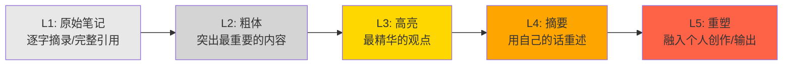
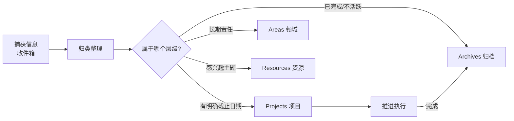
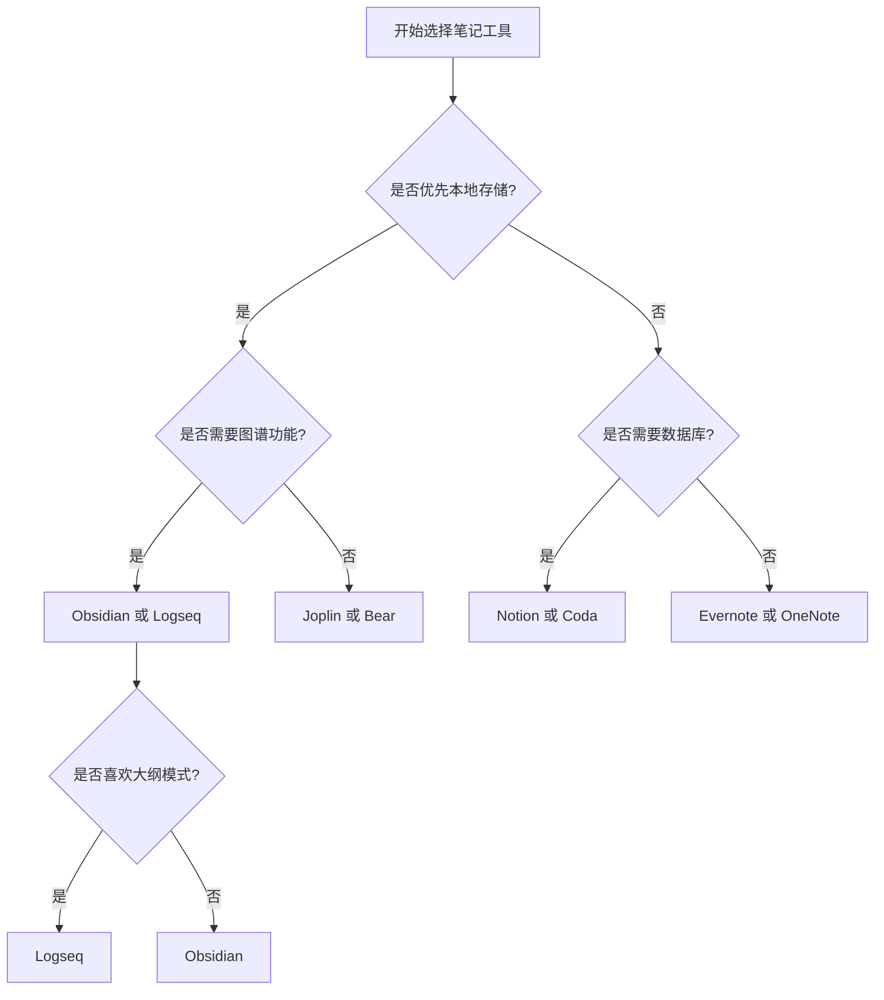
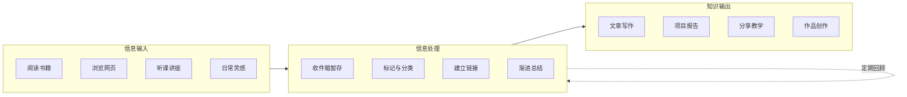

# 数字化笔记 (Digital Note-Taking)

> 数字化笔记 (Digital Note-Taking) 是指利用电子设备和软件进行信息的捕获、组织、存储和检索的系统化方法。相比传统纸笔笔记，数字化笔记具有可搜索、可链接、可同步、可多媒体融合等显著优势，是现代个人知识管理 (PKM) 的核心组成部分。

## 数字化笔记的核心原则 (Core Principles)

### 信息处理的层次模型
| 层次 | 操作 | 工具/方法 | 目标 |
|------|------|-----------|------|
| L1 捕获 | 快速记录原始信息 | 收件箱、语音笔记 | 不丢失想法 |
| L2 整理 | 分类、标记、链接 | 标签系统、文件夹 | 结构化组织 |
| L3 提炼 | 改写、总结、关联 | 渐进式总结 | 深度理解 |
| L4 输出 | 写作、分享、教学 | 博客、文档、演示 | 知识外化 |
| L5 回顾 | 定期复习和应用 | 间隔重复、周回顾 | 长期记忆与运用 |

### 四大核心原则
- **可检索性 (Retrievability)** — 全文搜索 + 标签体系 + 结构化元数据，确保任何信息在需要时能被快速找到
- **双向链接 (Bi-directional Linking)** — 建立知识间的关联网络，将孤立的笔记转变为互相连接的知识图谱
- **渐进式总结 (Progressive Summarization)** — 从原始信息到提炼洞察的多层处理，每一层增加一份价值
- **跨平台同步 (Cross-platform Sync)** — 多设备无缝衔接，确保在任何设备上都能访问和编辑笔记

### 渐进式总结五层模型



## 主流笔记方法论 (Major Methodologies)

### ① 卡片盒笔记法 (Zettelkasten)

源自德国社会学家尼克拉斯·卢曼 (Niklas Luhmann) 的工作方法。他凭借这个系统在30年间出版了70多本书和数百篇文章。

| 原则 | 说明 | 示例 |
|------|------|------|
| 原子化 (Atomic) | 每张卡片只记录一个想法 | 一张卡片 = 一个概念/观点 |
| 自主性 (Autonomous) | 每张卡片独立可理解 | 脱离上下文也能看懂 |
| 链接性 (Connected) | 通过链接建立关系网络 | `[[相关概念]]` |
| 索引性 (Indexed) | 使用入口笔记引导导航 | 主题索引笔记 |

**卡片类型**：
- **文献笔记 (Literature Notes)** — 阅读时记录，含出处的简短笔记
- **永久笔记 (Permanent Notes)** — 经过思考加工的原子化知识单元
- **索引笔记 (Index Notes)** — 汇集同一主题下链接的导航笔记
- **项目笔记 (Project Notes)** — 与特定项目相关的临时笔记

### ② PARA 组织框架

由 Tiago Forte 在《Building a Second Brain》中提出。

```
PARA 四层结构：
┌─────────────────────────────────────────┐
│  1. Projects (项目)                      │
│     - 有截止日期的短期目标               │
│     - 例：完成论文初稿、搭建个人网站     │
├─────────────────────────────────────────┤
│  2. Areas (领域)                         │
│     - 没有截止日期的长期责任             │
│     - 例：健康、财务、编程技能           │
├─────────────────────────────────────────┤
│  3. Resources (资源)                     │
│     - 感兴趣的主题和素材                 │
│     - 例：设计模式笔记、Python 技巧收集   │
├─────────────────────────────────────────┤
│  4. Archives (归档)                      │
│     - 已完成或不活跃的条目               │
│     - 例：完成的项目、不再关注的领域     │
└─────────────────────────────────────────┘
```

**PARA 的操作流程**：


### ③ GTD 收件箱法 (Inbox Method)

源自 David Allen 的《Getting Things Done》。

```markdown
收件箱处理流程：
1. 收集 (Collect) → 把所有想法和任务放入收件箱
2. 处理 (Process) → 逐条决定如何处理
   - 2分钟内能完成？→ 立即做
   - 需要别人做？→ 委派
   - 有明确完成时间？→ 放入日历
   - 多步骤任务？→ 放入项目清单
   - 暂时不做？→ 放入"将来/也许"清单
   - 无用的？→ 删除
3. 组织 (Organize) → 分类存放
4. 回顾 (Review) → 每周检查所有清单
5. 执行 (Engage) → 根据优先级行动
```

### ④ 每日笔记 + 周回顾 (Daily Notes & Weekly Review)

**每日笔记模板**：
```markdown
# 2025-05-17 周六

## 📥 捕获
- 

## ✅ 今日完成
- 

## 💡 想法与洞察
- 

## 📖 学习记录
- 

## ⏭️ 明日待办
1. 
2. 
3. 
```

**周回顾流程**：
1. 清理收件箱至零
2. 回顾本周每日笔记，提炼重点
3. 更新项目和任务状态
4. 迁移完成项目到归档
5. 处理"将来/也许"清单
6. 规划下周重点工作
7. 运行一次知识图谱或链接检查

### 方法论对比

| 方法 | 侧重点 | 最佳适用 | 复杂度 |
|------|--------|----------|--------|
| Zettelkasten | 知识发现与创造 | 研究人员、学者、作家 | 高 |
| PARA | 行动管理与组织 | 项目经理、知识工作者 | 中 |
| GTD | 任务与时间管理 | 事务繁忙的任何人 | 中高 |
| 每日笔记 | 日常记录与反思 | 所有人 | 低 |
| 康奈尔笔记法 | 听课与学习记录 | 学生 | 低 |
| 子弹笔记 (Bullet Journal) | 快速记录与追踪 | 追求简洁者 | 低 |

## 工具对比 (Tool Comparison)

### 主流笔记应用横向对比

| 工具 | 平台 | 核心特点 | 链接机制 | 搜索能力 | 价格 | 最适合 |
|------|------|----------|----------|----------|------|--------|
| Obsidian | Win/Mac/Linux/Mobile | 本地优先、插件生态、图谱 | `[[双向链接]]` | 全文搜索+正则 | 免费 | 知识管理重度用户 |
| Notion | Web/Mobile/Desktop | 数据库驱动、协作、多功能 | 页面引用+数据库关联 | 全文搜索/过滤 | 免费/付费 | 团队协作+项目管理 |
| Roam Research | Web/Mobile | 块级引用、大纲模式 | `((块引用))` | 全文搜索 | $15/月 | Zettelkasten 实践者 |
| Logseq | Win/Mac/Linux/Mobile | 开源、大纲、本地优先 | `[[双向链接]]` | 全文搜索 | 免费/开源 | 隐私敏感用户 |
| Bear | Mac/iOS | 优雅设计、Markdown | `[[链接]]` | 全文搜索+标签 | 免费/付费 | Apple 生态系统 |
| Joplin | Win/Mac/Linux/Mobile | 开源、支持同步 | `[[链接]]` | 全文搜索 | 免费/开源 | 跨平台需求 |
| Evernote | All platforms | 老牌、OCR 扫描、网页剪藏 | 内部链接 | 高级搜索(付费) | 免费/付费 | 资料收集整理 |
| OneNote | Win/Mac/Mobile | 自由画布、Office 集成 | 页面链接 | 全文搜索+OCR | 免费 | 手写+多媒体笔记 |

### 工具选择决策树



### 工具链推荐组合

| 使用场景 | 推荐组合 | 说明 |
|----------|----------|------|
| 学生知识管理 | Obsidian + Zotero | 笔记管理 + 文献管理 |
| 团队项目协作 | Notion + Slack | 知识库 + 即时通讯 |
| 技术开发者 | VS Code + Foam/ Dendron | 代码编辑器中的笔记系统 |
| 创意工作者 | Bear/ Obsidian + Readwise Reader | 笔记 + 阅读管理 |
| 极简主义者 | Logseq + iCloud | 一个应用搞定所有 |

## 笔记工作流 (Note-Taking Workflows)

### 输入到输出的完整流程



### 阅读笔记工作流
1. **标记**：在阅读时用高亮和批注标记重要内容
2. **摘录**：将标记内容录入笔记系统，附上完整出处信息
3. **改写**：用自己的话重述核心观点 (避免直接复制)
4. **链接**：将新笔记与已有笔记建立关联
5. **提炼**：为笔记添加标签和摘要
6. **输出**：将笔记整合到文章、报告或教学材料中

### 听课笔记工作流 (基于康奈尔笔记法)

```
┌─────────────────────────────────────┐
│ 📒 课程: ________  日期: ________   │
├──────────────────┬──────────────────┤
│  笔记区 (Note)   │  线索区 (Cue)   │
│                  │                  │
│  课堂记录内容    │  关键词/问题     │
│  概念和例子      │  提示性短语      │
│  图表和公式      │  思考性问题      │
│                  │                  │
│                  │                  │
├──────────────────┴──────────────────┤
│  总结区 (Summary)                   │
│  课后5-10分钟的复盘摘要             │
│  用1-3句话概括本节核心内容           │
└─────────────────────────────────────┘
```

## 组织与标签策略 (Organization & Tagging)

### 文件夹 vs 标签 vs 链接

| 组织方式 | 优势 | 劣势 | 适用场景 |
|----------|------|------|----------|
| 文件夹 (Folder) | 结构清晰、层次分明 | 不支持多分类、修改成本高 | 项目文档、归档资料 |
| 标签 (Tag) | 灵活多分类、支持组合筛选 | 标签膨胀、一致性难维护 | 主题分类、按状态标注 |
| 链接 (Link) | 创建知识网络、发现隐含关系 | 需要主动维护、初期成本高 | Zettelkasten、知识图谱 |
| MOC (Map of Content) | 内容地图、导航索引 | 需要手动维护 | 主题入口、知识连接 |

### 标签系统设计建议
```yaml
# 标签分类体系示例
类型标签：
  - #type/book         # 笔记类型：书籍
  - #type/article      # 笔记类型：文章
  - #type/lecture      # 笔记类型：讲座
  - #type/idea         # 笔记类型：想法
  - #type/project     # 笔记类型：项目

状态标签：
  - #status/seed       # 初始想法
  - #status/growing    # 发展中
  - #status/evergreen  # 成熟的永久笔记
  - #status/done       # 已完成的任务

主题标签：
  - #topic/cs          # 计算机科学
  - #topic/math        # 数学
  - #topic/psychology  # 心理学
```

### MOC (Map of Content) 示例

MOC 是连接同一主题下所有笔记的导航入口。

```markdown
# 机器学习 MOC

## 核心概念
- [[监督学习]] • [[无监督学习]] • [[强化学习]]
- [[过拟合与欠拟合]] • [[偏差-方差权衡]]

## 算法分类
### 回归
- [[线性回归]] • [[逻辑回归]] • [[多项式回归]]

### 分类
- [[决策树]] • [[随机森林]] • [[支持向量机]]
- [[K 近邻]] • [[朴素贝叶斯]]

### 聚类
- [[K-means]] • [[层次聚类]] • [[DBSCAN]]

### 神经网络
- [[感知机]] • [[多层感知机]] • [[卷积神经网络]]
- [[循环神经网络]] • [[Transformer]]

## 相关领域
- [[深度学习]] • [[自然语言处理]] • [[计算机视觉]]
- [[数据预处理]] • [[特征工程]] • [[模型评估]]
```

## 相关条目
- [[Zettelkasten|卡片盒笔记法]]
- [[NoteTakingApps|笔记应用对比]]
- [[KnowledgeManagement|知识管理方法论]]
- [[00_KnowledgeFramework/Templates/MarkdownTemplates|Markdown 模板]]
- [[SecondBrain|第二大脑概念]]
- [[ProgressiveSummarization|渐进式总结]]
- [[ObsidianWorkflow|Obsidian 工作流]]
