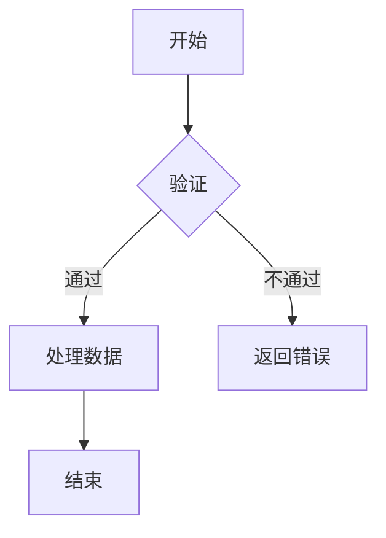
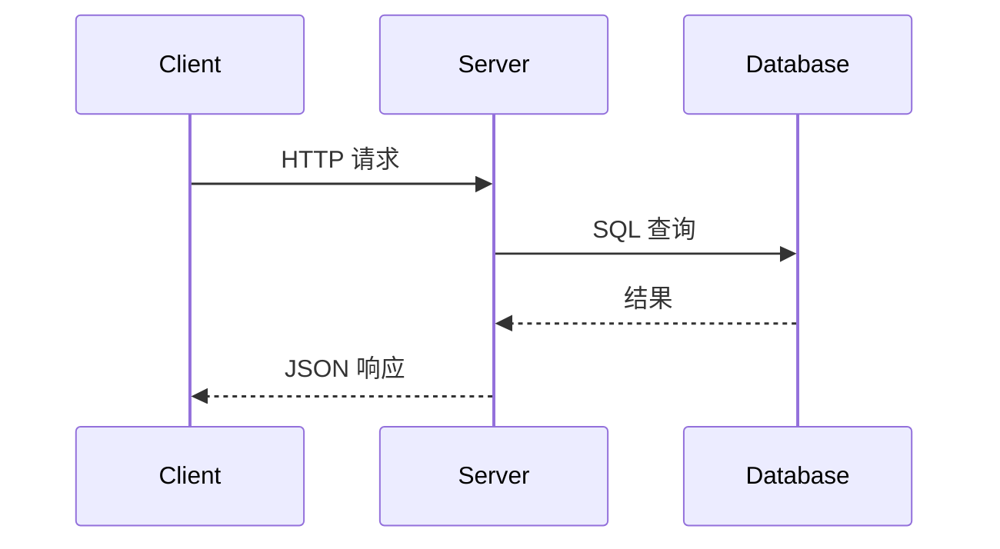
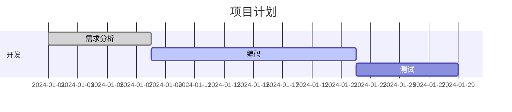

# Markdown 完全指南

## 概述

Markdown 是一种轻量级标记语言，由 John Gruber 于 2004 年创建。其核心理念是"易读易写"——纯文本格式的内容即使未经渲染也具有良好的可读性。Markdown 已成为开发文档、笔记、静态网站和论坛帖子的标准格式。

---

## 一、基本语法

### 1.1 标题

```markdown
# H1 一级标题
## H2 二级标题
### H3 三级标题
#### H4 四级标题
##### H5 五级标题
###### H6 六级标题
```

### 1.2 段落与换行

```
段落之间用空行分隔。

行尾加两个空格然后回车 → 硬换行（但推荐段落间用空行）。
```

### 1.3 文本格式

```markdown
**粗体**      或 __粗体__
*斜体*        或 _斜体_
***粗斜体***  或 ___粗斜体___
~~删除线~~
`行内代码`
<u>下划线</u> (HTML)
```

### 1.4 列表

```markdown
无序列表:
- 项目一
- 项目二
  - 子项目（缩进 2 空格）
  - 子项目

有序列表:
1. 第一步
2. 第二步
3. 第三步

任务列表:
- [x] 已完成任务
- [ ] 未完成任务
```

### 1.5 链接与图片

```markdown
链接:
[显示文本](https://example.com "悬停提示")
[相对路径](docs/index.md)
[锚点](#一基本语法)

图片:


```

### 1.6 引用

```markdown
> 第一层引用
>
> > 嵌套引用
>
> — 引用来源
```

---

## 二、代码块

### 2.1 行内代码

```markdown
使用 `printf("hello world")` 函数打印信息。

反引号内的 `_` 和 `*` 等符号按原样显示。
```

### 2.2 围栏代码块

````markdown
```python
def fibonacci(n):
    a, b = 0, 1
    for _ in range(n):
        yield a
        a, b = b, a + b
```

```javascript
const sum = (a, b) => {
    return a + b;
};
```

```bash
# 安装依赖
npm install
npm run build
```
````

### 2.3 支持的语言标识

```
常见的语言标识: python, javascript, java, c, cpp, go, rust, bash,
sql, json, yaml, xml, html, css, typescript, ruby, php, lua
```

---

## 三、表格

### 3.1 基础表格

```markdown
| 左对齐 | 居中对齐 | 右对齐 |
|:-------|:--------:|-------:|
| 内容   | 内容     | 内容   |
| 较长内容| 较长内容  | 较长内容|
```

渲染结果：

| 左对齐 | 居中对齐 | 右对齐 |
|:-------|:--------:|-------:|
| 内容   | 内容     | 内容   |
| 较长内容 | 较长内容 | 较长内容 |

### 3.2 表格中的格式

```markdown
| 特性   | 描述                        |
|--------|-----------------------------|
| **粗体** | 这是粗体文字              |
| `代码`  | 行内代码                  |
| [链接](https://example.com) | 超链接  |
```

---

## 四、扩展语法 (GFM)

GitHub Flavored Markdown (GFM) 在标准 Markdown 基础上添加了多项扩展：

| 特性 | 语法 | 效果 |
|------|------|------|
| 任务列表 | `- [x] done` | ✓ 支持勾选 |
| 删除线 | `~~text~~` | ~~text~~ |
| 自动链接 | `https://example.com` | 自动转为链接 |
| 表格 | 见上 | 支持对齐 |
| 表情符号 | `:smile:` | :smile: (在 GitHub 上) |
| 脚注 | `[^1]` | 底部注释 |
| 提及 | `@username` | 通知用户 |
| 引用问题 | `#123` | 链接到 Issue |

```markdown
脚注示例:
内容需要脚注说明[^1]。

[^1]: 这里是脚注的详细内容。
```

---

## 五、数学公式

### 5.1 MathJax / KaTeX

许多 Markdown 渲染器支持 LaTeX 数学公式：

```markdown
行内公式: $E = mc^2$

行间公式:
$$\sum_{i=1}^{n} i = \frac{n(n+1)}{2}$$

$$
f(x) = \frac{1}{\sigma\sqrt{2\pi}} e^{-\frac{(x-\mu)^2}{2\sigma^2}}
$$

矩阵:
$$
\begin{bmatrix}
    a & b \\
    c & d
\end{bmatrix}
$$
```

### 5.2 支持差异

| 特性 | MathJax | KaTeX |
|------|---------|-------|
| 渲染速度 | 较慢 | 非常快（约 10x） |
| 支持范围 | 几乎完整 LaTeX | 大部分 LaTeX |
| 浏览器兼容性 | 好 | 好 |
| 依赖大小 | 较大 | 轻量 |
| 自定义 | 灵活 | 有限 |

---

## 六、图表 (Mermaid)

Mermaid 是一款基于文本的图表生成工具，被广泛集成到 Markdown 环境中。

### 6.1 流程图



### 6.2 时序图



### 6.3 甘特图



---

## 七、Markdown 风味对比

| 特性 | CommonMark | GFM | MultiMarkdown | Pandoc Markdown |
|------|-----------|-----|---------------|-----------------|
| 表格 | 不支持 | 支持 | 支持 | 支持 |
| 任务列表 | 不支持 | 支持 | 支持 | 支持 |
| 脚注 | 不支持 | 支持 | 支持 | 支持 |
| 数学公式 | 不支持 | 不支持 | 支持 (LaTeX) | 支持 |
| 交叉引用 | 不支持 | 不支持 | 支持 | 支持 |
| YAML 头 | 不支持 | 支持 | 支持 | 支持 |
| MD 版本 | 1.0+ | 0.29+ | 自定 | 自定 |

---

## 八、常用工具

| 工具 | 平台 | 特点 |
|------|------|------|
| VS Code | 全平台 | 内置 MD 预览，扩展丰富 |
| Typora | Windows/macOS | 所见即所得，极简设计 |
| Obsidian | 全平台 | 知识图谱、双向链接、插件生态 |
| Jupyter Lab | 全平台 | Notebook 格式，支持代码执行 |
| Markdown Here | 浏览器扩展 | 邮件中渲染 MD |

---

## 九、Front Matter (YAML 头)

许多静态网站生成器使用 YAML front matter 定义页面元数据：

```yaml
---
title: Markdown 完全指南
date: 2024-01-15
tags: [markdown, documentation, tutorial]
author: example
description: 一份全面的 Markdown 语法参考
categories: 技术文档
draft: false
---
```

通用字段：

| 字段 | 描述 | 适用 |
|------|------|------|
| `title` | 页面标题 | 所有 |
| `date` | 创建/更新日期 | 博客 |
| `tags` | 标签列表 | 博客、文档 |
| `categories` | 分类 | 博客 |
| `draft` | 是否为草稿 | 静态网站 |
| `layout` | 页面布局模板 | Jekyll, Hugo |
| `permalink` | 自定义 URL | 所有 |

---

## 十、Pandoc 文档转换

Pandoc 是一个强大的文档格式转换工具：

```bash
# Markdown → HTML
pandoc input.md -o output.html

# Markdown → PDF (需要 LaTeX)
pandoc input.md -o output.pdf

# Markdown → Word
pandoc input.md -o output.docx

# Markdown → LaTeX
pandoc input.md -o output.tex

# Markdown → EPUB (电子书)
pandoc input.md -o output.epub

# 多个文件合并转换
pandoc chapter1.md chapter2.md -o book.html
```

| 输入格式 | 输出格式 |
|----------|----------|
| Markdown, reStructuredText | HTML, PDF, EPUB |
| LaTeX, HTML, Docx | Markdown (多种风味) |
| Jupyter Notebook (.ipynb) | Docx, PDF, HTML |
| MediaWiki, Org-mode | LaTeX, PDF |

---

## 相关条目

- [[LaTeX]]
- [[NoteTaking]]
- [[AcademicWriting]]
- Documentation

## 参考资源

- John Gruber 原始规范: https://daringfireball.net/projects/markdown
- CommonMark 规范: https://commonmark.org
- GitHub Flavored Markdown: https://github.github.com/gfm
- Mermaid 官方文档: https://mermaid.js.org
- Pandoc 用户指南: https://pandoc.org/MANUAL.html
- Obsidian 帮助: https://help.obsidian.md
