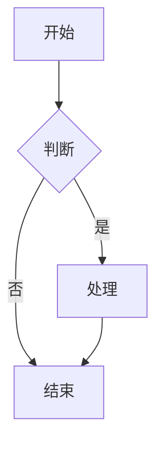

# Markdown扩展与工具链

## 一、Markdown核心语法回顾

Markdown是一种轻量级标记语言，由John Gruber于2004年设计。核心语法包括：

- 标题：`# H1` 到 `###### H6`
- 加粗：`**bold**` 和斜体：`*italic*`
- 列表：无序列表 `- item`，有序列表 `1. item`
- 链接：`[text](url)`
- 图片：``
- 代码块：三个反引号包裹
- 引用：`> quote`
- 水平线：`---`

CommonMark规范（2014年）统一了Markdown的语法标准，消除了不同实现之间的歧义。

## 二、GFM扩展语法

GitHub Flavored Markdown（GFM）在CommonMark基础上增加了重要扩展：

| 扩展 | 语法 | 用途 |
|------|------|------|
| 任务列表 | `- [ ] task` | 待办事项 |
| 表格 | `\| col1 \| col2 \|` | 数据展示 |
| 删除线 | `~~text~~` | 删除内容 |
| 自动链接 | `http://...` | URL自动识别 |
| 围栏代码块 | 三个反引号+语言名 | 代码高亮 |
| Emoji | `:smile:` | 表情符号 |

任务列表示例：

```markdown
- [x] 已完成任务
- [ ] 待完成任务
  - [ ] 子任务1
  - [ ] 子任务2
```

表格增强（对齐控制）：

```markdown
| 左对齐 | 居中 | 右对齐 |
|:-------|:----:|-------:|
| 内容1  | 内容2 | 内容3  |
```

## 三、Markdown渲染引擎对比

不同渲染引擎对Markdown的支持程度差异显著：

| 引擎 | 语言 | 标准支持 | 扩展支持 | 速度 |
|------|------|----------|----------|------|
| marked | JavaScript | CommonMark | 中等 | 快 |
| remark | JavaScript | CommonMark | 插件丰富 | 中等 |
| pandoc | Haskell | 全面 | 格式转换 | 较慢 |
| goldmark | Go | CommonMark | 可扩展 | 极快 |
| cmark | C | CommonMark严格 | 有限 | 极快 |
| mistune | Python | CommonMark | 中等 | 快 |

remark生态使用AST（抽象语法树）处理Markdown，通过插件机制实现扩展：

```javascript
import { remark } from 'remark'
import remarkToc from 'remark-toc'
import remarkMath from 'remark-math'
import remarkRehype from 'remark-rehype'

const result = await remark()
  .use(remarkToc)
  .use(remarkMath)
  .use(remarkRehype)
  .process(content)
```

## 四、数学公式与图表

LaTeX数学公式支持：

```markdown
行内公式: $E = mc^2$
块级公式:
$$
\oint_C \vec{E} \cdot d\vec{l} = -\frac{d}{dt} \iint_S \vec{B} \cdot d\vec{S}
$$
```

流程图使用Mermaid语法：

```markdown

```

Mermaid支持流程图、时序图、类图、甘特图等多种图表类型，是Markdown生态中最流行的图表工具。

## 五、Markdown预处理与宏

使用Pandoc的Lua过滤器实现动态内容：

```lua
-- 自定义过滤: 将@date替换为当前日期
function Str(elem)
  if elem.text == "@date" then
    return pandoc.Str(os.date("%Y-%m-%d"))
  end
  return elem
end
```

Pandoc支持从多种格式互转：

```bash
pandoc input.md -o output.pdf --pdf-engine=xelatex
pandoc input.md -o output.html --self-contained
pandoc input.md -o output.docx --reference-doc=template.docx
```

## 六、静态站点生成

基于Markdown的静态站点生成器对比：

| 工具 | 语言 | 特点 | 适用场景 |
|------|------|------|----------|
| Jekyll | Ruby | GitHub Pages原生支持 | 博客、文档 |
| Hugo | Go | 构建速度极快 | 大型文档 |
| Docusaurus | React | 文档网站专用 | 开源项目文档 |
| MkDocs | Python | 简单易用 | 技术文档 |
| VuePress | Vue | SPA体验 | 前端项目文档 |
| Next.js | React | 全功能框架 | 复杂站点 |

Hugo目录结构示例：

```
content/
  posts/
    article1.md
    article2.md
  about.md
themes/
  mytheme/
    layouts/
    static/
config.toml
```

## 七、Markdown编辑器生态

现代Markdown编辑器功能对比：

| 编辑器 | 平台 | 核心特性 | 价格 |
|--------|------|----------|------|
| Typora | Win/Mac/Linux | 所见即所得 | 付费 |
| VS Code | 跨平台 | 插件丰富、可定制 | 免费 |
| Obsidian | 跨平台 | 双向链接、图谱 | 免费 |
| MarkText | 跨平台 | 开源免费 | 免费 |
| Notion | Web/App | 数据库结合 | 免费增值 |
| Logseq | 跨平台 | 大纲式笔记 | 免费 |

VS Code推荐Markdown插件：

```json
{
  "recommendations": [
    "yzhang.markdown-all-in-one",
    "shd101wyy.markdown-preview-enhanced",
    "bierner.markdown-mermaid",
    "mushan.vscode-paste-image",
    "darkriszty.markdown-table-prettify"
  ]
}
```

## 八、自定义Markdown方言

创建自定义Markdown解析器：

```python
import re
from mistune import Markdown, Renderer

class CustomRenderer(Renderer):
    def custom_block(self, text, **attrs):
        return f'<div class="custom">{text}</div>'

def parse_custom_block(text):
    pattern = r':::custom\s(.*?)\n(.*?)\n:::'
    return re.sub(pattern, r'<div class="custom">\2</div>', text, flags=re.DOTALL)

markdown = Markdown(renderer=CustomRenderer())
```

## 九、Markdown与版本控制

Git对Markdown文件的diff支持较好，适合文档的版本管理：

```bash
# 查看Markdown文件的变更
git diff --word-diff README.md
# 使用Pandoc比较变更
pandoc README.md -t plain | git diff --no-index - old.txt
```

在CI/CD中自动构建Markdown文档：

```yaml
name: Build Documentation
on: [push]
jobs:
  build:
    runs-on: ubuntu-latest
    steps:
      - uses: actions/checkout@v3
      - run: |
          pip install mkdocs mkdocs-material
          mkdocs build
      - uses: actions/upload-pages-artifact@v1
```

## 十、高级技巧与最佳实践

跨平台Markdown编写注意事项：

```
1. 统一换行符（LF而非CRLF）
2. 中英文之间加空格
3. 代码块指定语言名以便语法高亮
4. 引用外部资源时使用相对路径
5. 大文档拆分为多个子文件
6. 使用front matter存储元数据
```

Front Matter示例（YAML格式）：

```yaml
---
title: Markdown扩展与工具链
author: Tianshang Knowledge Base
date: 2026-05-10
tags: [markdown, documentation, tools]
status: draft
---
```

Markdown文档质量检查工具：

```bash
# markdownlint - 语法检查
npx markdownlint-cli "content/**/*.md"
# textlint - 文本规范检查
npx textlint "content/**/*.md"
# 拼写检查
npx cspell "content/**/*.md"
```

## 参考资源

1. CommonMark规范：https://spec.commonmark.org
2. GFM规范：https://github.github.com/gfm
3. Pandoc用户手册：https://pandoc.org/MANUAL.html
4. Mermaid官方文档：https://mermaid.js.org
5. Markdown Guide：https://www.markdownguide.org
6. 《Markdown实战》书籍
7. Awesome Markdown：https://github.com/mundimark/awesome-markdown
