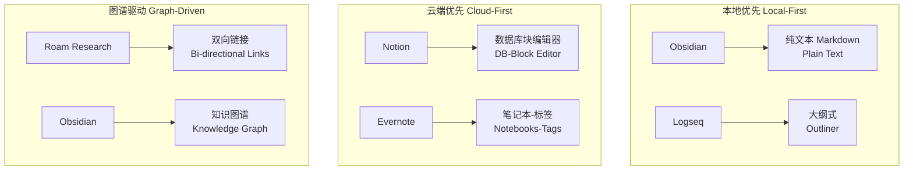
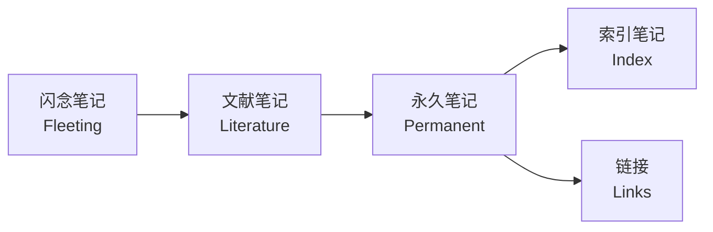

---
aliases:
  - 笔记应用
  - Note-Taking Apps
  - 知识管理
  - 笔记软件
tags:
created: 2026-05-17
updated: 2026-05-17
  - notes
  - knowledge-management
  - productivity
  - apps
  - obsidian
  - notion
---

# 笔记应用 (Note-Taking Apps)

## 笔记应用概览 (Overview of Note-Taking Apps)

笔记应用是现代知识工作者管理信息的重要工具。从简单的文本记录到复杂的知识图谱系统，不同工具满足不同场景的需求。

## 主流笔记应用对比 (Comparison of Popular Note-Taking Apps)



## 核心特性对比 (Core Feature Comparison)

| 特性 (Feature) | Obsidian | Notion | Evernote | Roam Research | Logseq |
|---|---|---|---|---|---|
| 本地存储 | ✅ | ❌ | ❌ | ❌ | ✅ |
| Markdown | ✅ | ⚡ 部分 | ❌ | ❌ | ✅ |
| 双向链接 | ✅ | ❌ | ❌ | ✅ | ✅ |
| 知识图谱 | ✅ | ❌ | ❌ | ✅ | ✅ |
| 数据库 | ❌ | ✅ | ❌ | ❌ | ❌ |
| 离线访问 | ✅ | ⚡ 有限 | ✅ | ⚡ 有限 | ✅ |
| 价格 | 免费 | 订阅 | 订阅 | 订阅 | 免费 |
| 开源 | ❌ | ❌ | ❌ | ❌ | ✅ |

## Obsidian

### 核心概念 (Core Concepts)

Obsidian 是基于本地 Markdown 文件的知识管理工具，核心哲学是 **"你的笔记属于你"**。

- **库 (Vault)** — 笔记的根文件夹
- **笔记 (Note)** — 纯 Markdown 文件
- **链接 (Link)** — `[[双向链接]]`
- **图谱 (Graph)** — 笔记连接的可视化
- **插件 (Plugin)** — 社区扩展生态

### 常用插件 (Popular Plugins)

| 插件 (Plugin) | 功能 (Function) | 用途 (Use Case) |
|---|---|---|
| Dataview | 元数据查询 | 用 SQL-like 语法查询笔记 |
| Templater | 模板引擎 | 自动化模板填充 |
| Kanban | 看板视图 | 任务管理 |
| Excalidraw | 手绘图表 | 可视化思维 |
| Calendar | 日历视图 | 日记管理 |
| Spaced Repetition | 间隔重复 | 主动回忆复习 |

### 笔记组织方法 (Organization Methods)

```
文件夹分类:
├── 00_Inbox/       # 临时收集
├── 01_Projects/    # 项目笔记
├── 02_Areas/       # 领域笔记
├── 03_Resources/   # 资源笔记
├── 04_Archives/    # 归档笔记
└── 05_Daily/       # 日记笔记
```

## Notion

### 核心概念 (Core Concepts)

Notion 是集笔记、数据库、项目管理于一体的**全能型工作空间**。

- **页面 (Page)** — 基本单位
- **块 (Block)** — 最小元素（文本、图片、数据库等）
- **数据库 (Database)** — 表格、看板、日历等视图
- **模板 (Template)** — 预制页面结构
- **集成 (Integration)** — API 与第三方连接

### Notion 数据库公式示例

```
// 计算任务进度
prop("已完成任务") / prop("总任务数") * 100

// 标签计数
length(filter(prop("标签"), contains(current, "重要")))
```

### 适用场景 (Use Cases)

- **项目管理** — 看板 + 甘特图
- **知识库** — 文档与 Wiki
- **CRM** — 客户关系管理
- **OKR 追踪** — 目标与关键结果
- **个人 Dashboard** — 聚合视图

## Evernote

### 历史与定位 (History & Positioning)

Evernote 是笔记应用的老牌玩家，以**强大的搜索**和**跨平台同步**著称。

### 特色功能 (Key Features)

- 网页剪藏 (Web Clipper)
- 文档扫描 (Document Scanning)
- 手写笔记 (Handwriting Notes)
- 标签系统 (Tagging System)
- 笔记本堆栈 (Notebook Stacks)

## Roam Research

### 核心创新 (Core Innovation)

Roam Research 引入了**块级引用** (Block Reference) 和**块级嵌入** (Block Embed) 的概念。

```
Block Reference 示例:
- 每天写一个想法 #想法
  - ((引用已有块))  # 块级引用
  - !((嵌入已有块))  # 块级嵌入
```

### 核心概念

- **页面与块** — 每个块有唯一 ID
- **每日笔记** — 默认日记驱动
- **属性 (Attributes)** — `::` 语法
- **查询 (Queries)** — Datalog 查询语言

## 知识管理方法论 (Knowledge Management Methodologies)

### Zettelkasten (卡片盒笔记法)



### PARA 方法 (Tiago Forte)

| 层级 (Level) | 含义 (Meaning) | 内容 (Content) |
|---|---|---|
| Projects | 当前项目 | 有截止日期的任务 |
| Areas | 责任领域 | 持续关注的范围 |
| Resources | 主题资源 | 未来参考的信息 |
| Archives | 归档 | 非活跃内容 |

### 日记方法 (Journaling Methods)

- **Bullet Journal** — 符号系统快速记录
- **Morning Pages** — 晨间自由写作
- **Gratitude Journal** — 感恩记录
- **Commonplace Book** — 摘录与反思

## 工作流集成 (Workflow Integration)

### 自动化工具链

```
Readwise → Obsidian/Notion (高亮同步)
Zotero   → Obsidian (文献管理)
IFTTT    → Evernote (自动化收集)
Web Clipper → 任何笔记应用 (网页保存)
```

### 个人知识管理流程 (PKM Workflow)

1. **收集 (Capture)** — 快速记录灵感与信息
2. **整理 (Organize)** — 分类、标签、链接
3. **提炼 (Distill)** — 用自己的话重述
4. **连接 (Connect)** — 发现概念之间的关系
5. **创作 (Create)** — 产出生成果

## 选择指南 (Choosing Guide)

| 如果你需要... | 推荐 (Recommendation) |
|---|---|
| 本地隐私控制 | Obsidian |
| 团队协作数据库 | Notion |
| 快速搜索剪藏 | Evernote |
| 双向链接图谱 | Roam / Logseq |
| 开源免费 | Logseq |
| 极简纯文本 | Obsidian |

## 参考资源 (References)

- obsidian.md - 官方文档
- notion.so/help - 帮助中心
- RoamResearch.com - 官方指南
- "How to Take Smart Notes" - Sönke Ahrens

---

> 最好的笔记系统不是最复杂的，而是最能让你坚持使用的。

