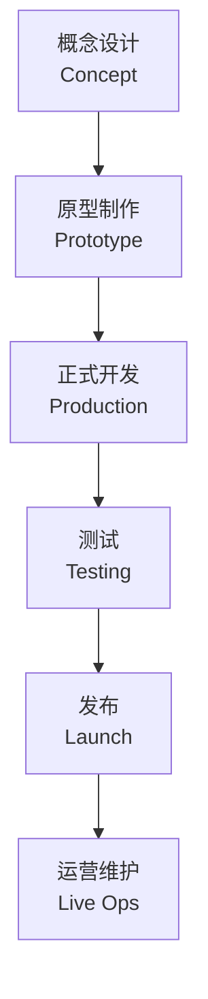
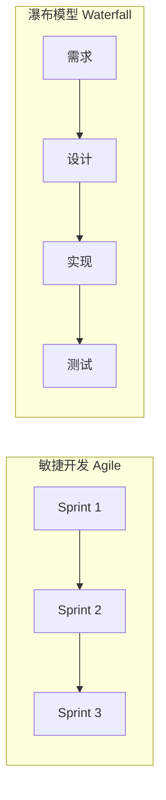

---
aliases:
  - 游戏开发
  - Game Development
  - 游戏制作
tags:
created: 2026-05-17
updated: 2026-05-16
  - game-dev
  - engineering
  - software-development
  - gamedev
---

# 游戏开发概述 (Game Development Overview)

## 什么是游戏开发 (What Is Game Development)

游戏开发是创建电子游戏的过程，涉及**设计**、**编程**、**美术**、**音效**和**项目管理**等多个学科。游戏可以面向多种平台，包括 PC、游戏主机、移动设备和 Web 浏览器。

## 游戏开发的核心阶段 (Core Stages of Game Development)

### 1. 概念设计 (Concept)
- 游戏设计文档 (Game Design Document, GDD)
- 核心玩法机制 (Core Mechanics)
- 目标受众与市场分析 (Target Audience)

### 2. 原型制作 (Prototyping)
- 最小可行产品 (Minimum Viable Product, MVP)
- 核心循环验证 (Core Loop Validation)
- 快速迭代 (Rapid Iteration)

### 3. 正式开发 (Production)
- 内容创作 (Asset Creation)
- 功能实现 (Feature Implementation)
- 里程碑管理 (Milestone Management)

### 4. 测试 (Testing)
- QA 测试 (Quality Assurance)
- 回归测试 (Regression Testing)
- 用户接受测试 (User Acceptance Testing, UAT)

### 5. 发布 (Launch)
- 平台审核 (Platform Certification)
- 市场推广 (Marketing)
- 版本管理 (Version Management)

### 6. 运营维护 (Live Operations)
- 热更新 (Hotfixes)
- 社区管理 (Community Management)
- 数据分析 (Data Analytics)

## 游戏开发角色 (Game Development Roles)

| 角色 (Role) | 职责 (Responsibilities) | 工具/技能 (Tools/Skills) |
|---|---|---|
| 游戏设计师 | 设计规则、关卡、系统 | Figma, Excel, 文档 |
| 程序员 | 编写游戏逻辑、引擎定制 | C++, C#, Unreal, Unity |
| 美术师 | 创建视觉资源 | Blender, Maya, Photoshop |
| 音效设计师 | 音乐、音效、配音 | Ableton, FMOD, Wwise |
| 制作人 | 项目管理、团队协调 | Jira, Confluence, Scrum |
| QA 测试员 | 发现并报告漏洞 | TestRail, Bug 追踪系统 |

## 游戏引擎 (Game Engines)

| 引擎 (Engine) | 语言 (Language) | 主要平台 (Primary Platforms) | 典型游戏 (Notable Games) |
|---|---|---|---|
| Unity | C# | 移动端、PC、主机 | 原神、纪念碑谷 |
| Unreal Engine | C++ | PC、主机 | 黑神话：悟空、堡垒之夜 |
| Godot | GDScript/C# | PC、移动端 | 多款独立游戏 |
| Cocos | TypeScript | 移动端、Web | 多款手游 |

## 游戏类型概览 (Game Genre Overview)

- **动作游戏 (Action)** — 强调反应速度与手眼协调
- **角色扮演 (RPG)** — 角色成长与叙事驱动
- **策略游戏 (Strategy)** — 资源管理与战术决策
- **模拟游戏 (Simulation)** — 模拟真实或虚构系统
- **解谜游戏 (Puzzle)** — 逻辑推理与问题解决
- **多人竞技 (Multiplayer)** — 玩家对抗或合作

## 性能优化要点 (Performance Optimization)

### CPU 优化 (CPU Optimization)
- 减少 Draw Call 数量
- 使用对象池 (Object Pooling)
- 优化物理计算频率

### GPU 优化 (GPU Optimization)
- LOD (Level of Detail) 系统
- 纹理压缩 (Texture Compression)
- 光照烘焙 (Light Baking)

### 内存优化 (Memory Optimization)
- 资源按需加载 (Asset Bundling)
- 内存池管理 (Memory Pool)
- 垃圾回收调优 (GC Optimization)

## 游戏数学基础 (Game Math Basics)

变换矩阵 (Transformation Matrix):
$$
M = T \cdot R \cdot S
$$

插值公式 (Lerp):
$$
Lerp(a, b, t) = a + (b - a) \cdot t
$$

## 开发流程模型 (Development Process Models)

## 游戏发布平台 (Game Publishing Platforms)

- **Steam** — PC 数字发行最大平台
- **Epic Games Store** — 竞争性分发平台
- **App Store / Google Play** — 移动端发行
- **Nintendo eShop / PlayStation Store / Xbox Store** — 主机发行
- **itch.io** — 独立游戏发行平台

## 行业趋势 (Industry Trends)

- **云游戏 (Cloud Gaming)** — 无需高性能硬件
- **AI 生成内容 (AI-Generated Content)** — 程序化叙事与资产
- **跨平台联机 (Cross-Platform Play)** — 统一玩家群体
- **区块链与 NFT** — 数字所有权与交易
- **UGC (User-Generated Content)** — 玩家创作模式

## 参考资源 (References)

- Game Programming Patterns (Robert Nystrom)
- The Art of Game Design (Jesse Schell)
- Unreal Engine 官方文档
- Unity Learn 教程平台

---

> 游戏开发是技术与艺术的交叉领域，需要多学科协作与持续学习。
