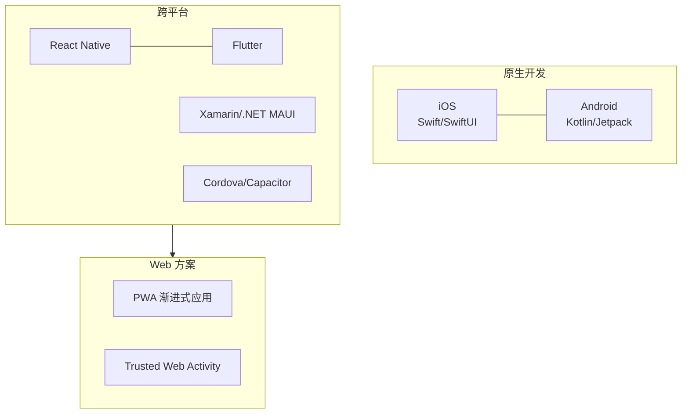
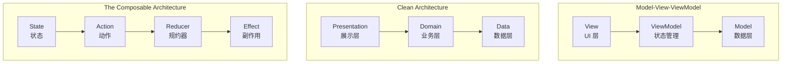
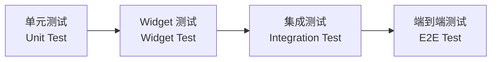

---
aliases:
  - 移动开发
  - Mobile Development
  - 移动应用
  - 手机开发
tags:
created: 2026-05-17
updated: 2026-05-17
  - mobile-dev
  - ios
  - android
  - cross-platform
  - engineering
---

# 移动开发概述 (Mobile Development Overview)

## 什么是移动开发 (What Is Mobile Development)

移动开发是指为智能手机、平板电脑等移动设备创建应用程序的过程。主要涵盖三大平台：**iOS**、**Android** 以及**跨平台**方案。

## 移动开发生态 (Mobile Development Ecosystem)



## iOS 开发 (iOS Development)

### 技术栈 (Tech Stack)

| 层 (Layer) | 技术 (Technology) | 说明 (Description) |
|---|---|---|
| 语言 | Swift, Objective-C | Swift 是现代首选 |
| UI 框架 | SwiftUI, UIKit | SwiftUI 是未来趋势 |
| 架构 | MVVM, MVC, TCA | MVVM 与 SwiftUI 搭配 |
| 存储 | Core Data, UserDefaults | 本地持久化 |
| 网络 | URLSession, Alamofire | HTTP 通信 |
| 依赖管理 | CocoaPods, SPM | Swift Package Manager |
| 发布 | App Store Connect | App Store 审核 |

### iOS App 生命周期 (App Lifecycle)

```
Not Running → Inactive → Active → Background → Suspended
                  ↓                    ↓
             前台运行              后台任务执行
```

## Android 开发 (Android Development)

### 技术栈 (Tech Stack)

| 层 (Layer) | 技术 (Technology) | 说明 (Description) |
|---|---|---|
| 语言 | Kotlin, Java | Kotlin 是官方推荐 |
| UI 框架 | Jetpack Compose, XML | Compose 是趋势 |
| 架构 | MVVM, MVI, Clean | Google 推荐 MVVM |
| 存储 | Room, DataStore | 本地数据库与偏好 |
| 网络 | Retrofit, Ktor | HTTP 通信 |
| 依赖注入 | Hilt, Koin | DI 框架 |
| 发布 | Google Play Console | Play Store 审核 |

### Android App 生命周期

```
onCreate() → onStart() → onResume() → onPause() → onStop() → onDestroy()
                ↑                            ↓
                └───── onRestart() ←─────────┘
```

## 跨平台方案对比 (Cross-Platform Comparison)

| 方案 (Solution) | 语言 (Language) | 性能 (Performance) | 原生体验 | 学习成本 |
|---|---|---|---|---|
| React Native | JavaScript/TS | 中 | 良 | 中 |
| Flutter | Dart | 高 | 优 | 中 |
| .NET MAUI | C# | 中 | 良 | 中 |
| Kotlin Multiplatform | Kotlin | 高 | 优 | 高 |
| Capacitor | JavaScript/TS | 低 | 中 | 低 |

## 应用架构模式 (App Architecture Patterns)



## 关键开发主题 (Key Development Topics)

### 用户界面 (User Interface)

- 响应式布局 (Responsive Layout)
- 深色模式 (Dark Mode)
- 自适应字体 (Dynamic Type)
- 手势交互 (Gesture Interaction)
- 动画与过渡 (Animation & Transition)

### 数据持久化 (Data Persistence)

| 存储方案 (Storage) | 用途 (Use Case) | iOS | Android |
|---|---|---|---|
| 键值存储 | 简单配置 | UserDefaults | DataStore |
| SQL 数据库 | 结构化数据 | Core Data | Room |
| 文件系统 | 大文件 | FileManager | Internal Storage |
| 云端同步 | 跨设备 | CloudKit | Firebase |

### 网络与离线支持 (Networking & Offline)

- RESTful API 集成
- GraphQL 查询
- WebSocket 实时通信
- 离线优先 (Offline-First) 策略
- 本地缓存与同步机制

### 推送通知 (Push Notifications)

- **APNs (Apple Push Notification service)** — iOS 推送
- **FCM (Firebase Cloud Messaging)** — Android 推送
- 本地通知 (Local Notifications)
- 通知分类与交互 (Notification Categories & Actions)

### 性能优化 (Performance Optimization)

$$
\text{启动时间} = \text{初始化} + \text{布局} + \text{首帧渲染}
$$

- 延迟加载 (Lazy Loading)
- 图片缓存与压缩
- 列表回收 (RecyclerView/List 复用)
- 线程管理 (Main Thread vs Background)
- 内存泄漏检测 (Memory Leak Detection)

## 测试策略 (Testing Strategy)



## 发布流程 (Release Process)

### App Store 发布
1. 开发者账号注册 ($99/年)
2. 证书与配置文件管理
3. TestFlight 内测
4. App Review 审核
5. 审核通过后上架

### Google Play 发布
1. 开发者账号注册 ($25 一次)
2. 签名密钥管理
3. 内部/封闭/开放测试
4. Play Console 审核
5. 逐步发布 (Staged Rollout)

## 行业趋势 (Industry Trends)

- **Flutter 增长** — 跨平台统一 UI
- **SwiftUI + Kotlin Compose** — 声明式 UI 范式
- **AI 集成** — 设备端 ML 推理
- **超级应用 (Super App)** — 小程序生态
- **隐私增强 (Privacy-Enhancing)** — 数据最小化与权限控制
- **5G 应用** — 低延迟体验

## 参考资源 (References)

- Apple Developer Documentation
- Android Developer Documentation
- Flutter Documentation
- React Native Documentation

---

> 移动开发的核心挑战在于平衡原生体验、开发效率和跨平台一致性。

