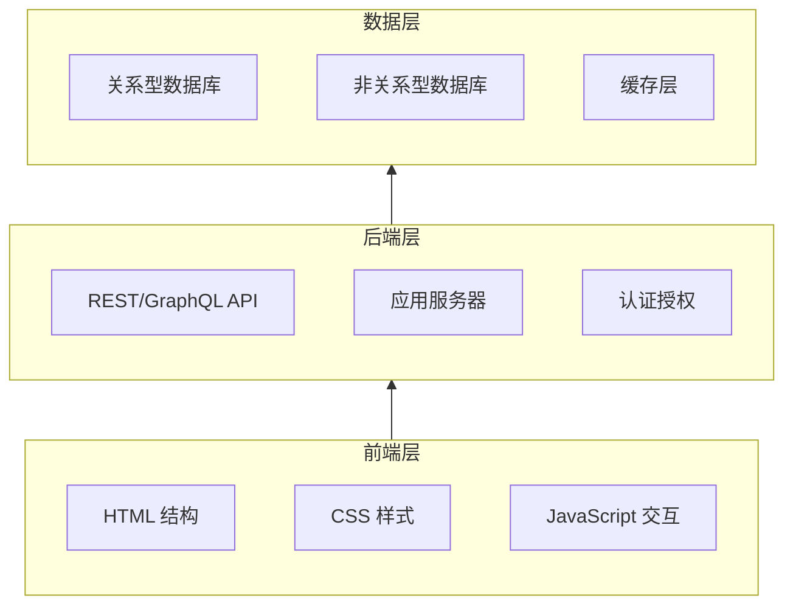
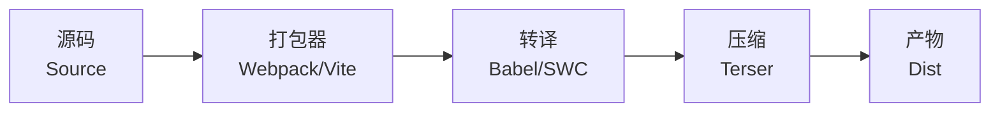
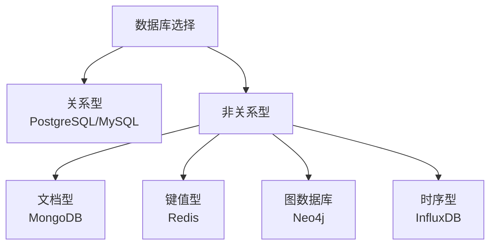
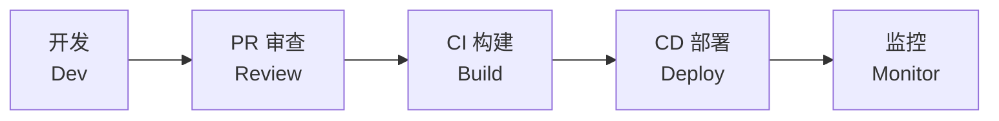

---
aliases:
  - 网站开发
  - Web Development
  - Web 开发
tags:
  - web-dev
  - frontend
  - backend
  - full-stack
  - engineering
---

# 网站开发概述 (Web Development Overview)

## 什么是网站开发 (What Is Web Development)

网站开发是指构建和维护网站的整个过程，涵盖**前端** (Frontend)、**后端** (Backend) 和**数据库** (Database) 三大核心领域。现代 Web 开发还涉及 DevOps、安全性、性能优化和用户体验设计。

## Web 技术栈层次 (Web Technology Stack)



## 核心技术 (Core Technologies)

### HTML (HyperText Markup Language)
HTML 是 Web 内容的骨架。最新标准为 HTML5，支持语义化标签、多媒体嵌入和 Canvas 绘图。

### CSS (Cascading Style Sheets)
CSS 控制页面的视觉表现。现代 CSS 特性包括：

| 特性 (Feature) | 描述 (Description) | 示例 (Example) |
|---|---|---|
| Flexbox | 一维布局模型 | `display: flex` |
| Grid | 二维布局模型 | `display: grid` |
| CSS Variables | 自定义属性 | `--primary-color: #333` |
| Animations | 关键帧动画 | `@keyframes` |
| Media Queries | 响应式断点 | `@media (max-width: 768px)` |

### JavaScript
JavaScript 是 Web 的编程语言，从简单的表单验证发展到全栈应用开发。

```
$$ ECMAScript 版本演进 $$

ES5 (2009) → ES6/ES2015 → ES2016 ... → ES2024

关键特性: Promise, async/await, 箭头函数, 模块化, Proxy, Symbol
```

## 前端开发 (Frontend Development)

### 核心框架对比

| 框架 (Framework) | 类型 (Type) | 学习曲线 | 适用场景 |
|---|---|---|---|
| React | UI 库 | 中等 | 复杂交互 SPA |
| Vue | 渐进式框架 | 较缓 | 中小型项目 |
| Angular | 全功能框架 | 较陡 | 大型企业应用 |
| Svelte | 编译型框架 | 较缓 | 高性能应用 |

### 构建工具链 (Build Toolchain)



## 后端开发 (Backend Development)

### 服务端语言与框架

| 语言 (Language) | 流行框架 (Popular Frameworks) | 特点 (Characteristics) |
|---|---|---|
| Node.js | Express, NestJS, Koa | 事件驱动、NPM 生态 |
| Python | Django, Flask, FastAPI | 简洁高效、AI 集成 |
| Java | Spring Boot, Quarkus | 企业级、类型安全 |
| Go | Gin, Echo, Fiber | 高性能、并发原生 |
| Rust | Actix, Axum | 内存安全、极致性能 |

### API 设计 (API Design)

- **RESTful API** — 资源导向，使用 HTTP 方法
- **GraphQL** — 按需查询，灵活的数据获取
- **gRPC** — 基于 Protocol Buffers 的高性能 RPC
- **WebSocket** — 全双工通信，适合实时应用

## 数据库 (Database)



## 全栈架构模式 (Full-Stack Architecture)

### MPA vs SPA

| 模式 (Pattern) | 描述 (Description) | 优点 (Pros) | 缺点 (Cons) |
|---|---|---|---|
| MPA | 多页应用，后端渲染 | SEO 友好、首屏快 | 页面跳转体验差 |
| SPA | 单页应用，前端路由 | 流畅交互、前后端分离 | SEO 需 SSR、包体大 |
| SSR | 服务端渲染 | SEO 好、首屏快 | 服务器开销大 |
| SSG | 静态站点生成 | 极快、安全 | 不适合动态内容 |

### 部署架构 (Deployment Architecture)

```
用户 → CDN → 负载均衡器 → Web 服务器 → 应用服务器 → 数据库
                        ↓
                   静态资源缓存
```

## Web 安全 (Web Security)

- **XSS (Cross-Site Scripting)** — 防范：输入转义、CSP
- **CSRF (Cross-Site Request Forgery)** — 防范：Token 验证
- **SQL 注入** — 防范：参数化查询
- **HTTPS** — TLS 加密通信
- **CORS** — 跨域资源共享策略

## 性能优化 (Performance Optimization)

### 核心 Web 指标 (Core Web Vitals)

- **LCP (Largest Contentful Paint)** — 最大内容绘制 < 2.5s
- **FID (First Input Delay)** — 首次输入延迟 < 100ms
- **CLS (Cumulative Layout Shift)** — 累积布局偏移 < 0.1

### 优化策略

- 代码分割 (Code Splitting)
- 懒加载 (Lazy Loading)
- 图片优化 (Image Optimization)
- 缓存策略 (Cache Strategy)
- 压缩 (Compression: Gzip/Brotli)

## 开发与部署流程 (DevOps Workflow)



## 参考资源 (References)

- MDN Web Docs
- Web.dev (Google)
- The Odin Project
- Frontend Masters

---

> Web 开发是一个不断演进的领域，保持学习是开发者最重要的能力。
