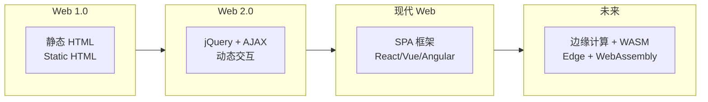
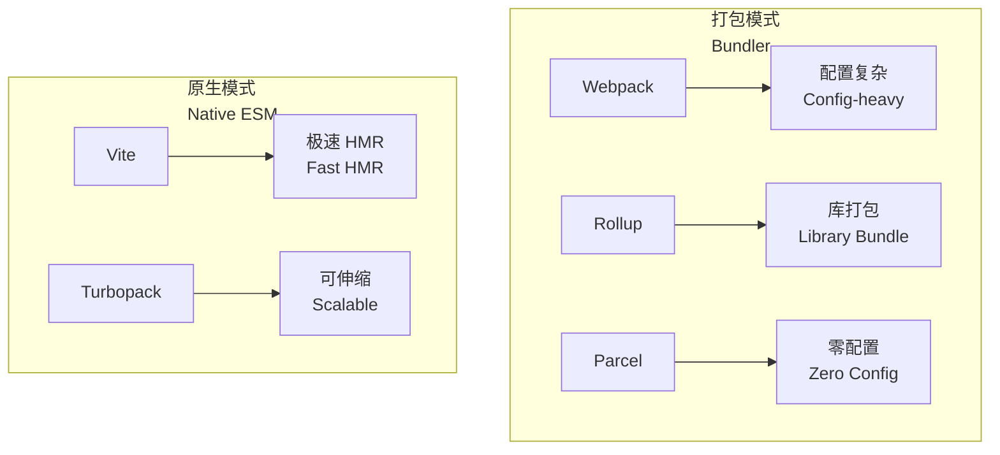
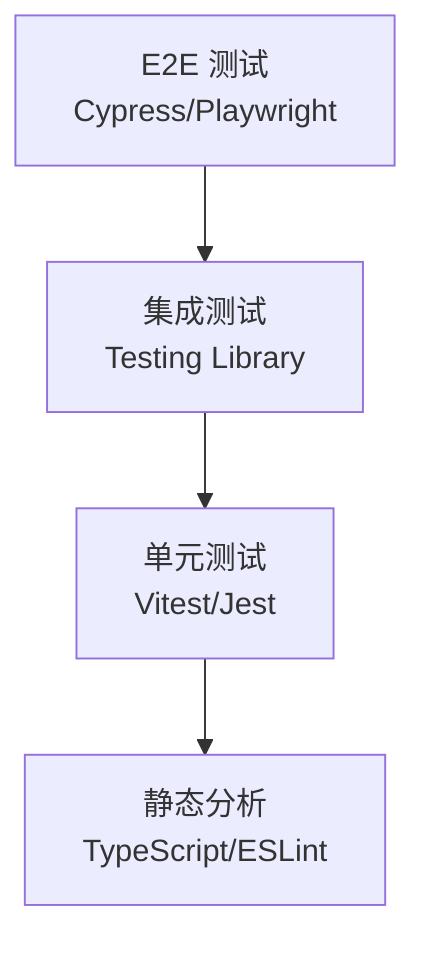

---
aliases:
  - 前端开发
  - 前端架构
  - Frontend Development
  - 前端工程化
tags:
  - frontend
  - react
  - vue
  - architecture
  - engineering
  - web-dev
---

# 前端开发与架构 (Frontend Development and Architecture)

## 前端架构演进 (Evolution of Frontend Architecture)



## 核心框架深入 (Framework Deep Dive)

### React

React 是由 Meta 维护的 UI 库，采用**组件化**和**声明式**编程模型。

```
核心概念:
- 组件 (Component)
- Props (属性传递)
- State (状态管理)
- Hooks (useState, useEffect, useContext)
- 虚拟 DOM (Virtual DOM)
- Fiber 架构 (增量渲染)
```

**Hooks 生命周期映射**：

| 类组件生命周期 | Hooks 等效 | 触发时机 |
|--------------|-----------|---------|
| componentDidMount | useEffect(fn, []) | 首次渲染后 |
| componentDidUpdate | useEffect(fn, [deps]) | 依赖变化后 |
| componentWillUnmount | useEffect(() => fn, []) | 组件卸载前 |
| shouldComponentUpdate | React.memo / useMemo | 重渲染前 |

### Vue

Vue 是由尤雨溪创建的渐进式框架，以**易上手**和**灵活**著称。

```
核心概念:
- 模板语法 (Template Syntax)
- 响应式系统 (Reactivity System)
- 组合式 API (Composition API)
- 单文件组件 (SFC: Single File Component)
- 指令 (v-if, v-for, v-model)
- 插槽 (Slots)
```

### 框架性能对比

| 维度 (Dimension) | React 18 | Vue 3 | Svelte | Solid |
|-----------------|----------|-------|--------|-------|
| 包体积 (min+gzip) | ~42KB | ~33KB | ~2KB | ~7KB |
| 虚拟 DOM | 是 | 是 | 否（编译时） | 否（细粒度响应） |
| 运行时开销 | 中等 | 低 | 极低 | 极低 |
| 类型支持 | TypeScript | TypeScript | TypeScript | TypeScript |

## 状态管理 (State Management)

### 状态分类 (State Categories)

- **本地状态 (Local State)** — 组件内部管理
- **跨组件状态 (Shared State)** — Context / Props 传递
- **全局状态 (Global State)** — 全局数据仓库
- **服务端状态 (Server State)** — 远程数据缓存
- **URL 状态 (URL State)** — 路由参数

### 状态管理方案对比

| 方案 (Solution) | 适用场景 (Scenario) | 复杂度 (Complexity) | 学习成本 (Learning Cost) |
|----------------|-------------------|:------------------:|:----------------------:|
| Redux / Redux Toolkit | 大型应用 | 高 | 中 |
| Zustand | 中小型应用 | 低 | 低 |
| Pinia (Vue) | Vue 项目 | 中 | 低 |
| Jotai / Recoil | React 原子化 | 中 | 中 |
| TanStack Query | 服务端状态 | 中 | 中 |

## 构建工具 (Build Tools)



## 模块化与代码组织 (Modularity & Code Organization)

### 组件设计原则 (Component Design Principles)

- **单一职责** — 每个组件只做一件事
- **可复用性** — 通过 Props 和 Slots 抽象
- **可测试性** — 纯组件易于单元测试
- **组合优于继承** — 使用组合模式扩展功能

### 目录结构推荐 (Recommended Structure)

```
src/
├── components/     # 通用组件
├── pages/          # 页面组件
├── hooks/          # 自定义 Hooks
├── stores/         # 状态管理
├── utils/          # 工具函数
├── services/       # API 服务层
├── types/          # TypeScript 类型
└── assets/         # 静态资源
```

## 性能优化策略 (Performance Optimization)

### 渲染优化 (Rendering Optimization)

$$ FPS = \frac{1000\text{ms}}{\text{Frame Budget}} $$

目标帧预算: 16.67ms (60fps)

- 虚拟列表 (Virtual Scrolling) — 仅渲染可视区域
- 防抖与节流 (Debounce & Throttle)
- Web Workers — 多线程计算
- requestAnimationFrame — 帧同步动画

### 网络优化 (Network Optimization)

- 预加载 (Preload / Prefetch)
- HTTP/2 Server Push
- CDN 边缘缓存
- 资源合并与压缩
- Service Worker 离线缓存

### 性能指标 (Web Vitals)

| 指标 (Metric) | 含义 (Meaning) | 良好 (Good) | 需改进 (Needs Work) | 不良 (Poor) |
|--------------|---------------|:----------:|:------------------:|:----------:|
| LCP | 最大内容绘制 | ≤ 2.5s | ≤ 4.0s | > 4.0s |
| FID | 首次输入延迟 | ≤ 100ms | ≤ 300ms | > 300ms |
| CLS | 累积布局偏移 | ≤ 0.1 | ≤ 0.25 | > 0.25 |
| TTFB | 首字节时间 | ≤ 800ms | ≤ 1800ms | > 1800ms |

## 测试体系 (Testing Pyramid)



## 微前端 (Micro Frontends)

### 实现方案对比

| 方案 (Approach) | 隔离性 (Isolation) | 性能 (Performance) | 学习成本 (Learning Cost) |
|----------------|:-----------------:|:-----------------:|:----------------------:|
| iframe | 高 | 低 | 低 |
| Web Components | 中 | 中 | 中 |
| Module Federation | 中 | 高 | 高 |
| Single-SPA | 中 | 中 | 高 |
| qiankun | 中 | 中 | 中 |

## 前端安全 (Frontend Security)

- **CSP (Content Security Policy)** — 防止 XSS 攻击
- **Subresource Integrity (SRI)** — 确保 CDN 资源完整性
- **HTTPS 强制** — 加密数据传输
- **敏感信息保护** — 不在前端存储令牌

## 未来趋势 (Future Trends)

- **WebAssembly (WASM)** — 高性能计算
- **边缘渲染 (Edge Rendering)** — 更快的首屏
- **AI 辅助开发** — Copilot 代码生成
- **Web Components 标准化** — 跨框架组件
- **Islands Architecture** — 部分水合 (Partial Hydration)

## 参考资源 (References)

- React 官方文档 (react.dev)
- Vue 官方文档 (vuejs.org)
- Web 性能权威指南 (High Performance Browser Networking)
- StateCharts / XState 文档

---

> 好的前端架构不是设计出来的，而是在对业务的理解中不断演进出来的。
