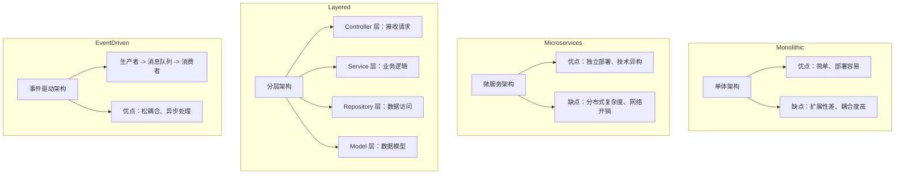
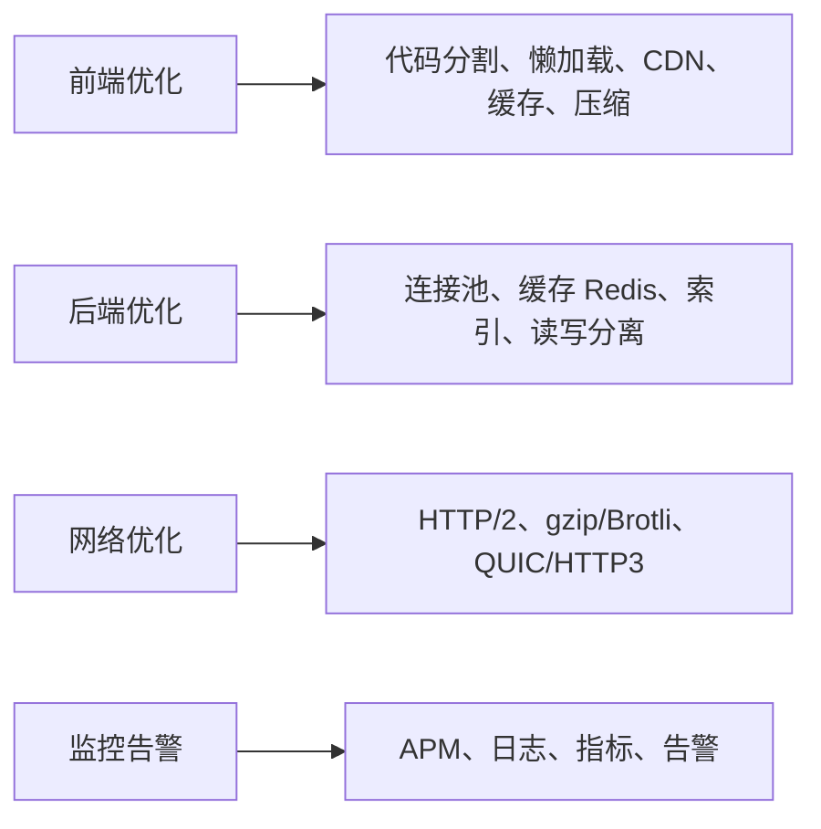
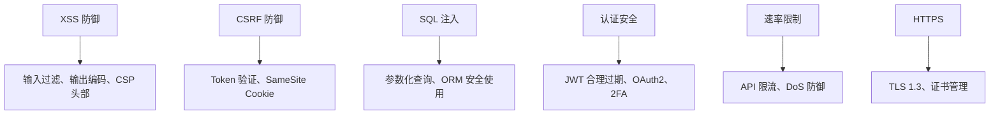

---
aliases: [FrontendBackendArchitecture, 前端框架与后端架构]
tags: ['EngineeringDevelopment', 'WebDevelopment', 'Frontend', 'Backend', 'Architecture']
---

# 前端框架与后端架构

## 一、前端框架生态

现代前端开发以三大框架为主导，辅以新兴解决方案：

| 框架 | 作者 | 首次发布 | 最新版本 | 核心范式 |
|------|------|----------|----------|----------|
| React | Facebook | 2013 | 18.x / 19 RC | 函数式组件 + Hooks |
| Vue | Evan You | 2014 | 3.x | 响应式 + Composition API |
| Angular | Google | 2010 | 18.x | 依赖注入 + TypeScript |
| Svelte | Rich Harris | 2016 | 5.x | 编译时响应式 |
| SolidJS | Ryan Carniato | 2020 | 1.x | Signal 细粒度更新 |

## 二、React 生态详解

React 函数组件与 Hooks：

```jsx
import { useState, useEffect, useCallback } from 'react'

function UserList() {
  const [users, setUsers] = useState([])
  const [loading, setLoading] = useState(true)
  const [error, setError] = useState(null)

  const fetchUsers = useCallback(async () => {
    try {
      setLoading(true)
      const res = await fetch('/api/users')
      const data = await res.json()
      setUsers(data)
    } catch (err) {
      setError(err.message)
    } finally {
      setLoading(false)
    }
  }, [])

  useEffect(() => {
    fetchUsers()
  }, [fetchUsers])

  if (loading) return <div>Loading...</div>
  if (error) return <div>Error: {error}</div>

  return (
    <ul>
      {users.map(user => (
        <li key={user.id}>{user.name}</li>
      ))}
    </ul>
  )
}
```

React 状态管理方案对比：

| 方案 | 适用规模 | 学习曲线 | 性能 |
|------|----------|----------|------|
| useState/useReducer | 小 | 低 | 极好 |
| useContext | 中 | 低 | 中 |
| Redux Toolkit | 中-大 | 中 | 好 |
| Zustand | 中 | 低 | 好 |
| Jotai | 中 | 低 | 极好 |
| Recoil | 中-大 | 中 | 好 |
| MobX | 中-大 | 中 | 好 |

## 三、Vue 生态详解

Vue 3 Composition API：

```vue
<script setup>
import { ref, onMounted, computed } from 'vue'

const users = ref([])
const searchQuery = ref('')
const loading = ref(true)

const filteredUsers = computed(() =>
  users.value.filter(u =>
    u.name.includes(searchQuery.value)
  )
)

async function fetchUsers() {
  try {
    loading.value = true
    const res = await fetch('/api/users')
    users.value = await res.json()
  } finally {
    loading.value = false
  }
}

onMounted(fetchUsers)
</script>

<template>
  <input v-model="searchQuery" placeholder="搜索用户" />
  <div v-if="loading">加载中...</div>
  <ul v-else>
    <li v-for="user in filteredUsers" :key="user.id">
      {{ user.name }}
    </li>
  </ul>
</template>
```

Vue 内置指令与功能对比：

| 指令 | 作用 | React 对应 |
|------|------|-----------|
| v-if/v-else | 条件渲染 | 三元运算符 |
| v-for | 列表渲染 | map() |
| v-model | 双向绑定 | value + onChange |
| v-bind | 属性绑定 | JSX 属性 |
| v-on | 事件监听 | onClick 等 |
| v-show | 显隐切换 | display:none |
| v-slot | 插槽分发 | children / render props |

## 四、后端架构模式

常见后端架构模式：



## 五、Node.js 后端框架

主流 Node.js 框架对比：

| 框架 | 类型 | 特点 | 性能 |
|------|------|------|------|
| Express | 轻量 | 社区最大、灵活 | 中等 |
| Koa | 轻量 | 中间件洋葱模型 | 中等 |
| Fastify | 高性能 | 低开销、验证内置 | 高 |
| NestJS | 全栈 | 模块化、TypeScript | 中等 |
| Hono | 超轻量 | 多运行时支持 | 极高 |
| AdonisJS | 全栈 | Laravel 风格 | 中等 |

NestJS 模块化示例：

```typescript
// user.module.ts
@Module({
  imports: [DatabaseModule],
  controllers: [UserController],
  providers: [UserService],
  exports: [UserService]
})
export class UserModule {}

// user.service.ts
@Injectable()
export class UserService {
  constructor(
    @InjectRepository(User)
    private readonly userRepo: Repository<User>
  ) {}

  async findAll(): Promise<User[]> {
    return this.userRepo.find()
  }
}

// user.controller.ts
@Controller('users')
export class UserController {
  constructor(private readonly userService: UserService) {}

  @Get()
  async getAll(): Promise<User[]> {
    return this.userService.findAll()
  }
}
```

## 六、数据库选择

SQL vs NoSQL 对比：

| 特性 | 关系型数据库 | NoSQL 数据库 |
|------|-------------|-------------|
| 代表产品 | PostgreSQL / MySQL | MongoDB / Redis |
| 数据结构 | 表（Row/Column）| 文档/键值/图 |
| 事务支持 | ACID | BASE（部分支持 ACID）|
| 扩展方式 | 垂直扩展为主 | 水平扩展为主 |
| 查询语言 | SQL | 各产品自定义 API |
| 适用场景 | 金融、ERP、CRM | 日志、缓存、社交 |
| 一致性 | 强一致性 | 最终一致性 |

ORM/ODM 工具对比：

| 语言 | ORM 工具 | 数据库支持 |
|------|---------|-----------|
| TypeScript | TypeORM / Prisma | SQL + MongoDB |
| Python | SQLAlchemy / Django ORM | SQL |
| Go | GORM / Ent | SQL |
| Rust | Diesel / SeaORM | SQL |
| Java | Hibernate / MyBatis | SQL |

## 七、API 设计规范

RESTful API 设计原则：

```
GET    /api/users          - 获取用户列表
GET    /api/users/:id      - 获取单个用户
POST   /api/users          - 创建用户
PUT    /api/users/:id      - 更新用户
DELETE /api/users/:id      - 删除用户
GET    /api/users/:id/orders - 用户关联订单
```

GraphQL 替代方案：

```graphql
type Query {
  users: [User!]!
  user(id: ID!): User
}

type User {
  id: ID!
  name: String!
  email: String!
  posts: [Post!]!
}

type Post {
  title: String!
  content: String!
}
```

## 八、前后端通信

数据传输格式与序列化效率对比：

| 格式 | 可读性 | 传输效率 | 解析速度 | 生态支持 |
|------|--------|----------|----------|----------|
| JSON | 高 | 中 | 快 | 全面 |
| Protocol Buffers | 低 | 高 | 极快 | 广泛 |
| MessagePack | 低 | 高 | 快 | 中等 |
| gRPC | 中 | 高 | 极快 | 良好 |
| GraphQL | 高 | 可变 | 中等 | 广泛 |

## 九、性能优化与安全

Web 性能优化策略：



安全防护要点：



## 相关条目

- [[WebDevelopment]]
- [[05_ComputerScience/EngineeringDevelopment/MobileDevelopment/MobileDevelopment|MobileDevelopment]]
- API
- Database

## 参考资料

1. React 官方文档：https://react.dev
2. Vue 官方文档：https://vuejs.org
3. NestJS 官方文档：https://docs.nestjs.com
4. MDN Web 文档：https://developer.mozilla.org
5. 《前端架构设计》书系
6. 《后端架构设计》书系
7. Web 安全指南：OWASP Top 10

