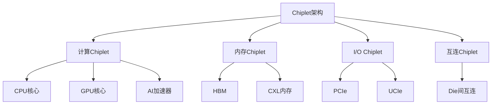

---
aliases: [ComputerArchitecture2026, 计算机体系结构2026, RISC-V, AI加速器]
tags: ['05_ComputerScience', 'ComputerArchitecture', 'RISC-V', 'AI']
created: 2026-06-27
updated: 2026-06-27
---

# 计算机体系结构最新进展（2024-2026）

## 一、概述

2024-2026年，计算机体系结构领域经历重大变革：RISC-V架构生态成熟、AI专用加速器爆发、Chiplet先进封装技术普及、以及新型存储架构的突破。

## 二、RISC-V 架构生态

### 2.1 RISC-V 发展现状

| 指标 | 2022年 | 2024年 | 2026年（预测） |
|------|--------|--------|---------------|
| RISC-V芯片出货量 | 100亿 | 200亿 | 400亿+ |
| RISC-V基金会成员 | 3000+ | 4000+ | 5000+ |
| RISC-V IP供应商 | 10+ | 20+ | 30+ |

### 2.2 主要RISC-V产品

| 公司 | 产品 | 定位 | 核心特点 |
|------|------|------|---------|
| **SiFive** | P870 | 高性能应用处理器 | 12nm, 3.4GHz |
| **阿里平头哥** | 玄铁C910/C920 | 服务器/边缘计算 | 16核, 2.5GHz |
| **赛昉科技** | 昉·惊鸿-7110 | AIoT | 8核, 1.5GHz |
| **Ventana Micro** | Veyron V2 | 数据中心 | 192核, 3.6GHz |
| **Tenstorrent** | Ascalon | AI推理 | RISC-V + AI加速 |
| **Esperanto** | ET-SoC-1 | AI推理 | 1000+ RISC-V核心 |

### 2.3 RISC-V在AI领域的应用

| 应用 | 描述 | 代表产品 |
|------|------|---------|
| AI推理芯片 | 边缘AI推理 | Kendryte K230 |
| AI训练加速 | 数据中心训练 | Esperanto ET-SoC-1 |
| 自动驾驶 | 车载AI | SiFive Intelligence系列 |
| IoT AI | 低功耗AI | 嘉楠科技K230 |

## 三、AI 加速器

### 3.1 数据中心AI加速器

| 产品 | 公司 | 发布时间 | 核心规格 | 应用 |
|------|------|---------|---------|------|
| **B200** | NVIDIA | 2024 | Blackwell架构, 208B晶体管 | AI训练/推理 |
| **GB200** | NVIDIA | 2024 | 双B200 + Grace CPU | 超大规模AI |
| **H200** | NVIDIA | 2024 | H100 + HBM3e | 大模型推理 |
| **MI300X** | AMD | 2023 | CDNA3, 192GB HBM3 | AI训练/推理 |
| **Gaudi 3** | Intel | 2024 | Habana架构 | AI训练 |
| **TPU v5p** | Google | 2023 | 自研ASIC | AI训练/推理 |
| **Trainium 2** | AWS | 2024 | 自研ASIC | AI训练 |
| **MTIA v2** | Meta | 2024 | 自研推理芯片 | AI推理 |

### 3.2 边缘AI加速器

| 产品 | 公司 | 算力 | 功耗 | 应用 |
|------|------|------|------|------|
| **Jetson Orin** | NVIDIA | 275 TOPS | 60W | 机器人、自动驾驶 |
| **Jetson Thor** | NVIDIA | 800 TOPS | 100W | 人形机器人 |
| **Edge TPU** | Google | 4 TOPS | 2W | IoT设备 |
| **Hailo-8** | Hailo | 26 TOPS | 2.5W | 边缘视觉 |
| **K230** | 嘉楠 | 2 TOPS | 0.3W | 低功耗AI |

### 3.3 AI芯片架构趋势

| 趋势 | 描述 | 代表 |
|------|------|------|
| **Chiplet** | 小芯片封装 | AMD MI300, Intel Ponte Vecchio |
| **存内计算** | 在存储器中计算 | Mythic, IBM |
| **光计算** | 光子学计算 | Lightmatter, Luminous |
| **稀疏计算** | 稀疏矩阵加速 | NVIDIA Ampere+ |
| **混合精度** | FP8/FP4训练 | NVIDIA Blackwell |

## 四、Chiplet与先进封装

### 4.1 Chiplet架构

### 4.2 先进封装技术

| 技术 | 公司 | 特点 | 应用 |
|------|------|------|------|
| **CoWoS** | TSMC | 2.5D硅中介层 | H100, MI300 |
| **InFO** | TSMC | 扇出型封装 | Apple M系列 |
| **EMIB** | Intel | 嵌入式桥接 | Ponte Vecchio |
| **Foveros** | Intel | 3D堆叠 | Meteor Lake |
| **UCIe** | 行业标准 | 通用Chiplet互连 | 跨厂商互连 |

### 4.3 先进封装市场

- **2023年**：约400亿美元
- **2026年**：预计超过600亿美元
- **年增长率**：约15%

## 五、新型存储架构

### 5.1 CXL (Compute Express Link)

| 版本 | 发布时间 | 核心特性 | 应用 |
|------|---------|---------|------|
| **CXL 1.0** | 2019 | 基础互连 | 加速器连接 |
| **CXL 2.0** | 2022 | 内存池化 | 内存扩展 |
| **CXL 3.0** | 2024 | 多级互连 | 分布式内存 |
| **CXL 3.1** | 2025 | 增强一致性 | 数据中心 |

### 5.2 HBM (High Bandwidth Memory)

| 版本 | 带宽 | 容量 | 应用 |
|------|------|------|------|
| **HBM2e** | 3.6 Gbps | 16GB | A100 |
| **HBM3** | 6.4 Gbps | 24GB | H100 |
| **HBM3e** | 9.2 Gbps | 36GB | H200, B200 |
| **HBM4** | 10+ Gbps | 48GB+ | 下一代AI芯片 |

### 5.3 新型非易失性存储

| 技术 | 特点 | 状态 |
|------|------|------|
| **MRAM** | 高速、低功耗 | 量产 |
| **ReRAM** | 高密度、低延迟 | 试产 |
| **PCM** | 字节寻址、持久化 | 研究/试产 |
| **FeRAM** | 超低功耗 | 特定应用 |

## 六、处理器架构演进

### 6.1 x86架构

| 产品 | 公司 | 核心数 | 工艺 | 特点 |
|------|------|--------|------|------|
| **Granite Rapids** | Intel | 128+ | Intel 3 | P-core架构 |
| **Sierra Forest** | Intel | 144+ | Intel 3 | E-core架构 |
| **Turin** | AMD | 192+ | TSMC 3nm | Zen 5架构 |
| **Bergamo** | AMD | 128 | TSMC 5nm | Zen 4c |

### 6.2 ARM架构

| 产品 | 公司 | 核心数 | 应用 |
|------|------|--------|------|
| **Neoverse V3** | ARM | - | 服务器 |
| **Graviton 4** | AWS | 96 | 云服务器 |
| **AmpereOne** | Ampere | 192 | 云服务器 |
| **M4 Max** | Apple | 16 | 笔记本/桌面 |
| **Snapdragon X Elite** | Qualcomm | 12 | Windows PC |

### 6.3 异构计算趋势

$$
\text{CPU} + \text{GPU} + \text{AI加速器} + \text{FPGA} + \text{DPU} \rightarrow \text{异构计算平台}
$$

## 七、数据中心架构

### 7.1 数据中心芯片

| 类型 | 功能 | 代表产品 |
|------|------|---------|
| **CPU** | 通用计算 | Intel Xeon, AMD EPYC |
| **GPU** | AI训练/推理 | NVIDIA H100/B200 |
| **DPU** | 数据处理 | NVIDIA BlueField, AMD Pensando |
| **SmartNIC** | 网络加速 | Intel IPU, NVIDIA ConnectX |
| **存储控制器** | 存储加速 | Samsung SmartSSD |

### 7.2 数据中心互连

| 技术 | 速率 | 应用 |
|------|------|------|
| **PCIe 5.0** | 32 GT/s | 设备互连 |
| **PCIe 6.0** | 64 GT/s | 下一代互连 |
| **NVLink** | 900 GB/s | GPU互连 |
| **Infinity Fabric** | 800 GB/s | AMD互连 |
| **UCIe** | 4 GT/s | Chiplet互连 |

## 八、挑战与展望

### 8.1 技术挑战

1. **功耗墙**：数据中心功耗持续增长
2. **内存墙**：计算与内存带宽差距扩大
3. **互连墙**：Chiplet间通信延迟
4. **良率挑战**：先进工艺良率下降
5. **成本上升**：先进封装和工艺成本增加

### 8.2 未来趋势

1. **RISC-V崛起**：从IoT扩展到高性能计算
2. **Chiplet普及**：模块化芯片设计成为主流
3. **存内计算**：打破冯·诺依曼瓶颈
4. **光互连**：芯片间光通信
5. **量子计算**：特定领域量子优势

## 相关条目

- [[ComputerOrganizationAndArchitecture]]
- [[05_ComputerScience/ComputerOrganizationAndArchitecture/ParallelArchitecture|ParallelArchitecture]]
- [[05_ComputerScience/ComputerOrganizationAndArchitecture/CacheMemory|CacheMemory]]
- [[05_ComputerScience/ComputerOrganizationAndArchitecture/InstructionSetArchitecture|InstructionSetArchitecture]]

## 参考资源

1. RISC-V International. "RISC-V Annual Report." 2024.
2. NVIDIA. "Blackwell Architecture Technical Brief." 2024.
3. AMD. "CDNA 3 Architecture." 2023.
4. Intel. "Meteor Lake Architecture Deep Dive." 2023.
5. UCIe Consortium. "UCIe 1.0 Specification." 2022.

