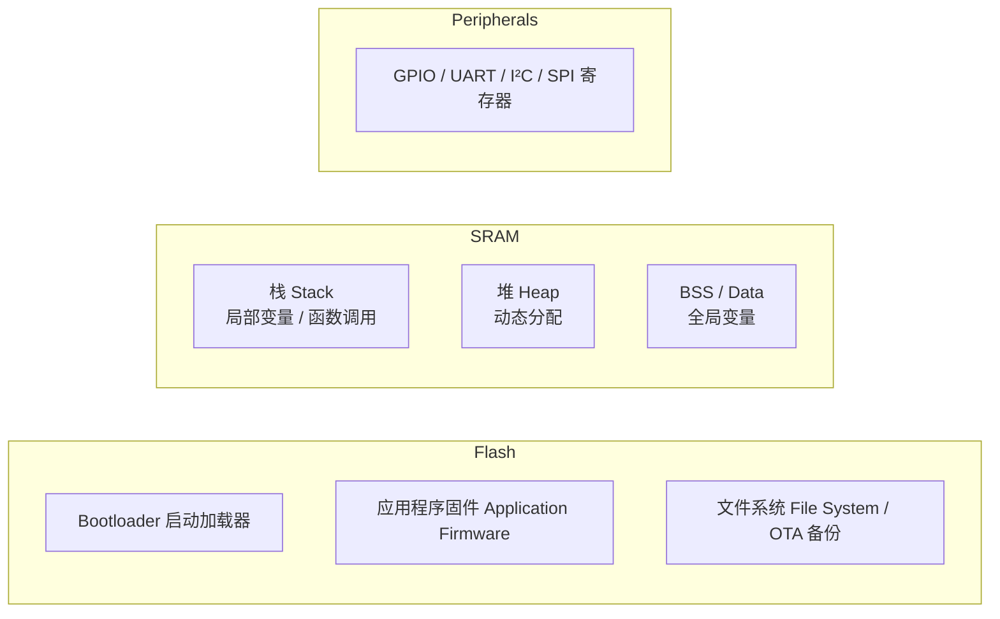

# 嵌入式系统 (Embedded Systems)

## 一、体系结构 (Architecture)

### 1.1 冯·诺依曼 vs. 哈佛架构

| 架构 | 指令与数据 | 特点 | 典型 MCU |
|------|-----------|------|---------|
| 冯·诺依曼 | 共用总线和存储 | 简单，可能瓶颈 | x86 |
| 哈佛 | 分离总线和存储 | 可并行取指/数据 | AVR, 8051 |
| 改进哈佛 | 分离缓存，统一主存 | 兼顾性能与灵活 | ARM Cortex-M |

### 1.2 流水线 (Pipeline)

- **三级流水线**：取指 → 译码 → 执行 (ARM Cortex-M3)
- **五级流水线**：取指 → 译码 → 执行 → 访存 → 写回 (ARM Cortex-A)
- **超标量**：多指令并行发射 (高性能 MPU)

## 二、内存系统 (Memory System)

### 2.1 内存映射

### 2.2 内存保护单元 (MPU)

ARM Cortex-M3/M4/M7 及以上集成 MPU，定义内存区域的访问权限 (读/写/执行) 和属性 (可缓存、可缓冲)，用于：

- **任务隔离**：RTOS 每个任务分配到独立区域
- **Stack Overflow 检测**：为栈设置保护区域
- **特权分级**：内核态 vs. 用户态执行

## 三、外设与接口 (Peripherals & Interfaces)

### 3.1 通用 IO (GPIO)

- **推挽输出 (Push-Pull)**：驱动能力强，输出高/低电平
- **开漏输出 (Open-Drain)**：多设备共享总线 (I²C)
- **上拉/下拉输入**：读取外部电平状态
- **复用功能 (Alternate Function)**：GPIO 引脚映射到 UART/SPI/Timer 等外设

### 3.2 定时器 (Timer)

| 定时器类型 | 功能 |
|-----------|------|
| SysTick | 系统滴答定时器，RTOS 时钟基准 |
| 通用定时器 | PWM 输出、输入捕获、输出比较 |
| 看门狗 (WDT) | 系统异常时复位 |
| RTC | 实时时钟，电池备份 |

### 3.3 DMA (Direct Memory Access)

DMA 不需要 CPU 参与即可在外设和内存之间传输数据：

- **内存→外设**：发送数据到 UART/SPI
- **外设→内存**：ADC 采样数据存入缓冲区
- **内存→内存**：快速数据搬移
- **循环模式**：自动回绕，适合环形缓冲区

## 四、中断系统 (Interrupt System)

### 4.1 中断优先级与嵌套

NVIC (Nested Vectored Interrupt Controller) — ARM Cortex-M 中断控制器：

- **抢占优先级**：高抢占可打断低抢占中断
- **子优先级**：同抢占优先级下，优先响应
- **中断向量表**：中断号映射到中断服务程序 (ISR) 地址
- **Tail-Chaining**：ISR 完成后直接处理下一个挂起中断

### 4.2 中断延迟

关键指标：

$$
t_{\text{latency}} = t_{\text{entry}} + t_{\text{ISR\_dispatch}} + t_{\text{context\_save}}
$$

Cortex-M3 中断延迟仅 12 个时钟周期，适合硬实时场景。

### 4.3 中断设计原则

- ISR 尽可能短 (仅设置标志或更新队列)
- 耗时操作移至任务级 (Bottom Half / Tasklet)
- 临界区用关中断或互斥量保护共享数据
- 避免在 ISR 中使用阻塞函数或动态内存分配

## 五、实时约束 (Real-Time Constraints)

### 5.1 实时性分类

| 类型 | 定义 | 违反后果 | 示例 |
|------|------|---------|------|
| 硬实时 (Hard) | 绝对满足截止时间 | 系统失败 | 安全气囊 |
| 固实时 (Firm) | 偶尔错过可容忍 | 质量下降 | 音视频播放 |
| 软实时 (Soft) | 错过降低性能 | 用户体验差 | 键盘响应 |

### 5.2 可调度性分析

**速率单调调度 (Rate Monotonic, RM)** 可调度条件：

$$
\sum_{i=1}^{n} \frac{C_i}{T_i} \leq n(2^{1/n} - 1)
$$

其中 $C_i$ 为任务最坏执行时间 (WCET)，$T_i$ 为周期。

**最早截止时间优先 (Earliest Deadline First, EDF)**：

$$
\sum_{i=1}^{n} \frac{C_i}{T_i} \leq 1
$$

EDF 利用率上限为 100%，但实现复杂性更高。

## 六、低功耗设计 (Low-Power Design)

### 6.1 电源模式

以 ARM Cortex-M 为例：

| 模式 | 功耗 | 唤醒时间 | CPU 状态 |
|------|------|---------|---------|
| Run | 最高 | — | 全速运行 |
| Sleep (WFI) | 中等 | 几个周期 | 时钟门控，中断唤醒 |
| Deep Sleep | 低 | 微秒级 | 关闭高功耗外设 |
| Standby | 极低 | 毫秒级 | RAM 掉电，RTC 保留 |
| Shutdown | 最低 | 全复位 | 完全断电 |

### 6.2 功耗优化策略

- **动态电压频率调整 (DVFS)**：按需调整频率和电压
- **时钟门控**：关闭未使用的外设时钟
- **异步事件驱动**：事件触发代替轮询
- **编译优化**：Size 优化减少 Flash 访问
- **外设选择**：低频外设替代高频 (如 32 kHz 低速晶振)

## 七、设计约束与权衡

| 约束 | 影响 | 缓解策略 |
|------|------|---------|
| 成本 | 限制芯片选择 | 选用通用 MCU，减少 BOM |
| 功耗 | 电池寿命、散热 | 低功耗模式、制程升级 |
| 实时性 | 响应时间保证 | RTOS + 优先级设计 |
| 可靠性 | 长期稳定运行 | WDT、ECC、冗余设计 |
| 安全性 | 防篡改、加密 | Secure Boot、TEE、加密引擎 |
| 内存 | 资源受限 | 优化算法、编译优化 |

## 八、开发与调试

### 8.1 工具链

- **编译器**：GCC ARM Embedded、IAR EWARM、Keil MDK
- **构建系统**：CMake + Makefile、Meson
- **调试器**：OpenOCD + GDB、J-Link、ST-Link
- **版本控制**：Git、SVN

### 8.2 测试策略

- **单元测试**：Ceedling、Unity、CMock
- **硬件在环 (HIL)**：真实硬件 + 仿真激励
- **压力测试**：极限频率、高温老化
- **静态分析**：Coverity、PC-lint、MISRA C 检查

## 相关条目

- [[EmbeddedSystemsOverview|嵌入式系统概述]]
- [[IoTOverview|物联网 (IoT)]]
- [[RoboticsOverview|机器人学 (Robotics)]]
- [[ComputerArchitecture|计算机体系结构]]
- [[RealTimeSystems|实时系统]]
- [[CProgramming|C 语言编程]]
