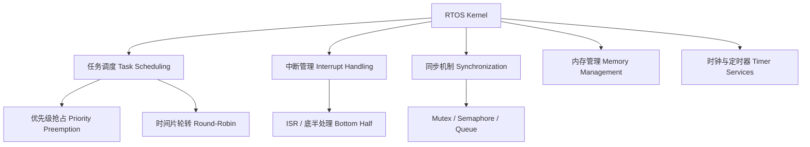
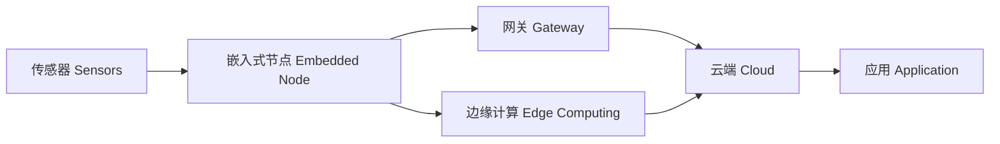

# 嵌入式系统概述 (Embedded Systems Overview)

## 一、引言

嵌入式系统 (Embedded System) 是专用于特定应用场景的计算机系统，嵌入到更大的设备中执行预定义功能。与通用计算机不同，嵌入式系统强调可靠性、实时性、低功耗和成本效益。

## 二、核心组件 (Core Components)

### 2.1 处理器

| 类型 | 示例 | 特点 |
|------|------|------|
| 微控制器 (MCU) | ARM Cortex-M, AVR, PIC | 集成 CPU + RAM + Flash，单芯片方案 |
| 微处理器 (MPU) | ARM Cortex-A, x86 | 外接存储器，性能更强 |
| DSP | TI C6000 系列 | 数字信号处理优化，FFT/滤波硬件加速 |
| FPGA | Xilinx, Intel/Altera | 可重构硬件逻辑，并行处理 |
| SoC | 树莓派、ESP32 | 系统级芯片，集成无线/外设 |

### 2.2 存储器层次

| 存储器 | 类型 | 特性 |
|--------|------|------|
| Flash (NOR/NAND) | 非易失 | 存储固件和文件系统 |
| SRAM | 易失，高速 | 运行时数据和栈 |
| DRAM | 易失，大容量 | 复杂系统主存 |
| EEPROM | 非易失，按字节 | 配置参数存储 |
| FRAM/MRAM | 非易失，高速 | 新兴存储技术，耐磨 |

## 三、实时操作系统 (RTOS)

### 3.1 RTOS 核心特性

### 3.2 常见 RTOS

| RTOS | 许可证 | 内存占用 | 特点 |
|------|--------|---------|------|
| FreeRTOS | MIT | 4-9 KB | 轻量、广泛移植、AWS 支持 |
| Zephyr | Apache 2.0 | 8-50 KB | Linux 基金会、丰富驱动 |
| RT-Thread | Apache 2.0 | 3-10 KB | 国产、POSIX 兼容、IoT 生态 |
| VxWorks | 商业 | 可定制 | 航空航天、汽车安全关键 |
| μC/OS | 商业/开源 | 6+ KB | 教学、确定性调度 |
| ThreadX | Azure RTOS | 2-10 KB | 微软生态、安全认证 |
| Mbed OS | Apache 2.0 | 16+ KB | ARM 官方、快速原型 |

### 3.3 任务调度

- **优先级抢占 (Priority Preemption)**：高优先级任务就绪时立即抢占低优先级
- **时间片轮转 (Round-Robin)**：同优先级任务循环执行固定时间片
- **速率单调调度 (RMS)**：周期越短优先级越高，静态优先级最优

## 四、传感器与执行器 (Sensors & Actuators)

### 4.1 常见传感器

| 传感器 | 测量物理量 | 接口 |
|--------|-----------|------|
| 温度 (DS18B20, DHT22) | 温度、湿度 | 1-Wire, I²C |
| 加速度计 (MPU6050) | 加速度、角速度 | I²C, SPI |
| 气压 (BMP280) | 大气压力、高度 | I²C, SPI |
| 距离 (HC-SR04) | 超声波距离 | GPIO |
| 红外 (MLX90614) | 非接触温度 | I²C |
| 摄像头 (OV2640) | 图像 | DVP, CSI |
| 激光雷达 (LiDAR) | 3D 空间距离 | UART, Ethernet |

### 4.2 通信接口

| 接口 | 速度 | 距离 | 用途 |
|------|------|------|------|
| UART | 115200 bps - 3 Mbps | ~15m | 串口通信、调试 |
| I²C | 100 kHz - 3.4 MHz | ~1m | 片内外设互联 |
| SPI | 10-50 MHz | ~10cm | 高速外设 (Flash, 显示屏) |
| CAN | 1 Mbps | ~40m | 汽车、工业控制 |
| USB | 12 Mbps - 40 Gbps | ~5m | 通用外部设备 |

## 五、物联网 (IoT) 集成

嵌入式系统是物联网的物理基础：

## 六、固件开发 (Firmware Development)

### 6.1 开发流程

1. **需求分析**：功耗、实时性、接口需求
2. **芯片选型**：根据需求选择 MCU/MPU
3. **原理图/PCB 设计** (若需硬件)
4. **驱动开发**：BSP (Board Support Package)
5. **应用层开发**：业务逻辑
6. **调试与测试**：JTAG/SWD、逻辑分析仪
7. **量产烧录**：固件加密、批量烧写

### 6.2 调试工具

| 工具 | 用途 |
|------|------|
| JTAG/SWD 调试器 | 单步调试、断点、寄存器查看 |
| 逻辑分析仪 | 分析数字信号时序 |
| 示波器 | 模拟和数字信号测量 |
| 串口工具 (Putty, minicom) | 打印日志、交互调试 |
| QEMU | 硬件模拟，无硬件调试 |

## 七、应用领域

- **消费电子**：智能家电、可穿戴设备、遥控器、路由器
- **汽车电子**：ECU、ADAS、信息娱乐系统、BMS
- **工业控制**：PLC、电机驱动、SCADA、仪器仪表
- **医疗设备**：监护仪、胰岛素泵、助听器、CT 控制
- **航空航天**：飞控系统、航电设备、卫星通信

## 相关条目

- [[EmbeddedSystems|嵌入式系统 (详细)]]
- [[IoTOverview|物联网 (IoT)]]
- [[RoboticsOverview|机器人学 (Robotics)]]
- [[ComputerArchitecture|计算机体系结构]]
- [[OperatingSystems|操作系统]]
- [[RealTimeSystems|实时系统]]
