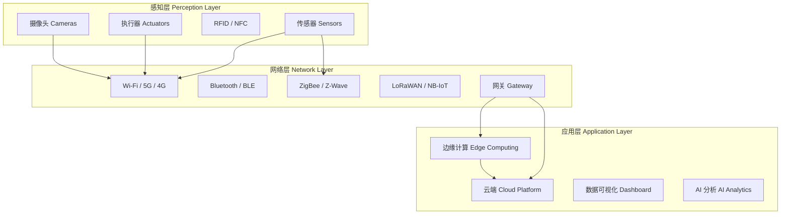

# 物联网概述 (IoT Overview)

## 一、引言

物联网 (Internet of Things, IoT) 通过传感器、执行器与网络连接，将物理世界对象数字化并实现智能管控。IoT 将嵌入式系统、通信技术和云计算相结合，创建万物互联的智能生态。

## 二、IoT 架构 (IoT Architecture)

### 2.1 三层架构

## 三、通信协议 (Communication Protocols)

### 3.1 近距离无线

| 协议 | 频段 | 速率 | 距离 | 功耗 | 应用 |
|------|------|------|------|------|------|
| Bluetooth BLE | 2.4 GHz | 1-2 Mbps | ~100m | 极低 | 可穿戴、信标 |
| Wi-Fi | 2.4/5 GHz | 150 Mbps+ | ~50m | 中 | 智能家居 |
| ZigBee | 2.4 GHz | 250 Kbps | ~100m | 低 | 楼宇自动化 |
| Z-Wave | 868/915 MHz | 100 Kbps | ~30m | 低 | 智能家居 |
| NFC | 13.56 MHz | 106-424 Kbps | ~10cm | 无源 | 支付、门禁 |
| Thread | 2.4 GHz | 250 Kbps | ~30m | 低 | Matter 底层 |

### 3.2 广域网

| 协议 | 频段 | 速率 | 距离 | 功耗 | 特点 |
|------|------|------|------|------|------|
| LoRaWAN | Sub-GHz | 0.3-50 Kbps | 2-15 km | 极低 | 免费频段，长距离 |
| NB-IoT | 授权 LTE | 200 Kbps | 1-15 km | 低 | 蜂窝覆盖，高可靠 |
| LTE-M | 授权 LTE | 1 Mbps | 1-15 km | 低 | 支持移动性 |
| Sigfox | Sub-GHz | 100 bps | 3-50 km | 极低 | 超窄带，极低功耗 |

### 3.3 应用层协议

| 协议 | 传输层 | 模型 | 特点 |
|------|--------|------|------|
| MQTT | TCP | 发布/订阅 | 轻量级，QoS 分级，保留消息 |
| CoAP | UDP | 请求/响应 | REST 风格，资源受限设备 |
| HTTP/HTTPS | TCP | 客户端/服务器 | 通用，Webhook 推送 |
| AMQP | TCP | 消息队列 | 企业级，消息持久化 |
| OPC-UA | TCP | 客户端/服务器 | 工业自动化标准 |

## 四、平台与服务 (Platforms & Services)

| 平台 | 提供商 | 特点 |
|------|--------|------|
| AWS IoT Core | Amazon | 设备影子、规则引擎、Greengrass 边缘计算 |
| Azure IoT Hub | Microsoft | 设备孪生、自动设备管理、时间序列分析 |
| 阿里云 IoT | Alibaba | 国内生态、Link Kit SDK、城市大脑对接 |
| Google Cloud IoT | Google | Cloud Pub/Sub 集成、Edge TPU |
| ThingsBoard | 开源 | 开源仪表盘、规则链、可私有化部署 |
| Home Assistant | 开源 | 本地智能家居平台、Matter 支持 |

## 五、边缘计算 (Edge Computing)

### 5.1 边缘 vs. 云端

| 维度 | 云端 (Cloud) | 边缘 (Edge) |
|------|-------------|-------------|
| 延迟 | 100-500 ms | 1-50 ms |
| 带宽 | 需大量传输 | 本地处理，减少上行 |
| 隐私 | 数据离设备 | 数据本地保留 |
| 算力 | 几乎无限 | 受限 (MCU/MPU/GPU) |
| 持久化 | 中心化存储 | 本地缓存 |

### 5.2 典型边缘设备

- **树莓派 (Raspberry Pi)**：原型验证，轻量级边缘节点
- **Jetson Nano**：边缘 AI 推理，GPU 加速
- **ESP32**：WiFi + BLE，超低功耗传感器节点
- **STM32MP1**：Cortex-A + Cortex-M 异构边缘处理器

## 六、IoT 安全 (IoT Security)

### 6.1 安全威胁

| 威胁 | 说明 | 攻击向量 |
|------|------|---------|
| 设备劫持 | 攻击者控制设备 | 默认密码、固件漏洞 |
| 数据窃听 | 截获通信数据 | 明文传输、弱加密 |
| DDoS 攻击 | 僵尸网络发起流量攻击 | 弱认证、Mirai 变种 |
| 固件篡改 | 植入恶意固件 | 无签名验证、无 Secure Boot |
| 侧信道攻击 | 功耗/电磁分析提取密钥 | 物理接触 |

### 6.2 安全最佳实践

- **安全启动 (Secure Boot)**：验证固件签名再执行
- **硬件安全模块 (HSM/SE)**：TEE、Secure Element 存储密钥
- **TLS/DTLS 加密传输**：端到端加密，证书认证
- **定期 OTA 更新**：签名固件远程升级
- **最小权限**：设备只暴露必要端口和服务
- **网络分段**：IoT 设备和核心网络隔离

## 七、应用领域

| 领域 | 应用 | 关键技术 |
|------|------|---------|
| 智能家居 | 照明、温控、安防、门锁 | ZigBee, Matter, MQTT |
| 工业 4.0 | 预测性维护、数字孪生 | OPC-UA, 边缘计算, ML |
| 智慧城市 | 交通、路灯、垃圾桶 | LoRaWAN, 5G, 云平台 |
| 医疗 IoT | 远程监护、可穿戴 | BLE, MQTT, HIPAA |
| 农业 IoT | 土壤监测、精准灌溉 | LoRa, 太阳能供电 |
| 车联网 | V2X、车载诊断 | Cellular, MQTT, DSRC |

## 八、Matter 标准

Matter (原 Project CHIP) 是 CSA 联盟推出的智能家居互操作标准：

- **统一应用层**：设备可跨 Amazon/Apple/Google 生态
- **IPv6 基础**：使用 Thread + Wi-Fi 传输
- **本地控制**：无需云端，低延迟
- **安全性内置**：DCL (分布式合规数据库)、证书链认证
- **设备类型**：灯、开关、插座、恒温器、门锁、传感器

## 相关条目

- [[MQTT|MQTT 协议]]
- [[LoRaWAN|LoRaWAN 协议]]
- [[EmbeddedSystemsOverview|嵌入式系统]]
- [[IoTSecurity|物联网安全]]
- [[SmartHome|智能家居]]
- [[IndustrialIoT|工业物联网]]
- [[EdgeComputing|边缘计算]]
