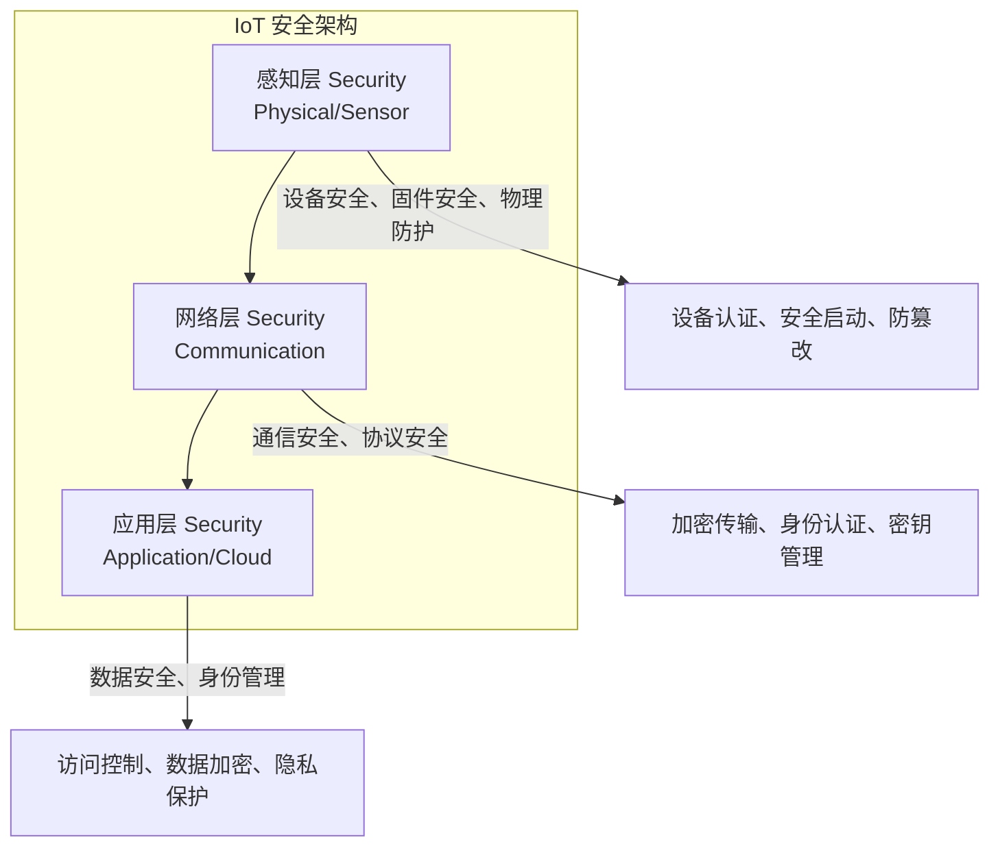
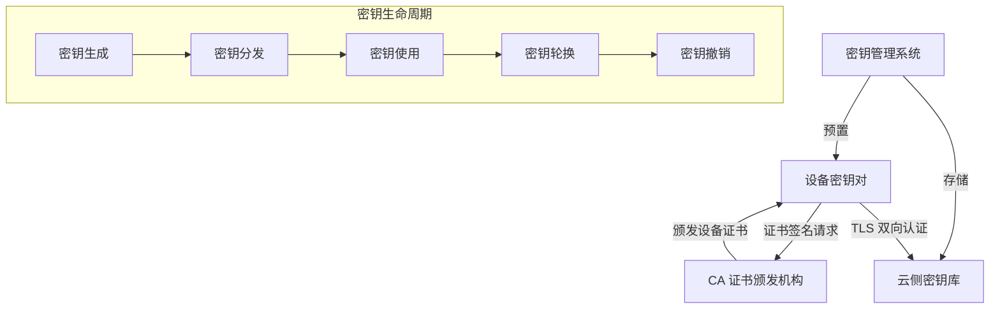
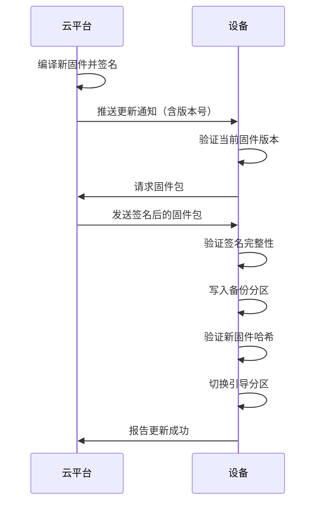

---
aliases: [IoTSecurity]
tags: ['05_ComputerScience', 'HardwareAndEmbeddedSystems', 'IoT']
created: 2026-05-17
updated: 2026-05-17
---

# IoT 安全

物联网（IoT）安全涉及保护连网设备和网络的物理、软件和通信层面。由于 IoT 设备通常具有资源受限、异构性高、部署环境不可控等特点，其安全挑战与传统 IT 系统有显著不同。

## IoT 安全架构分层



## 感知层安全

### 设备安全挑战

| 挑战 | 描述 | 典型攻击 |
|------|------|---------|
| 物理捕获 | 设备暴露在不可控环境 | 侧信道攻击、JTAG 调试接口滥用 |
| 资源受限 | CPU/Memory/电池有限 | 无法运行复杂加密算法 |
| 固件更新难 | OTA 更新机制不完善 | 固件逆向、持久化后门 |
| 默认凭据 | 出厂默认密码未修改 | Mirai 僵尸网络利用默认口令 |

### 安全启动链


安全启动（Secure Boot）确保从硬件 Root of Trust 开始，每一级加载的程序都经过数字签名验证。通常使用硬件集成的密钥（eFuse、OTP）来存储根公钥。

### 物理安全措施

- **防篡改封装**：篡改检测电路会在外壳被打开时触发数据擦除
- **JTAG/SWD 熔断**：生产后熔断调试接口，防止调试器接入
- **屏蔽层**：在芯片封装中加入屏蔽层防止电磁侧信道分析
- **电压/时钟毛刺检测**：检测到异常供电或时钟时自动复位

## 网络层安全

### IoT 通信协议安全对比

| 协议 | 传输层 | 加密方式 | 适用场景 | 安全弱点 |
|------|--------|---------|---------|---------|
| MQTT | TCP | TLS | 传感器数据上报 | 默认无认证，需额外配置 |
| CoAP | UDP | DTLS | 资源极受限设备 | 代理转换时可能降级 |
| HTTP/2 | TCP | TLS | 网关到云 | 头开销大 |
| LoRaWAN | LoRa | AES-128 | 广域低功耗 | 密钥分发管理复杂 |
| Zigbee | 802.15.4 | AES-CCM | 智能家居 | 网络密钥共享风险 |
| BLE | 2.4GHz | AES-CCM | 可穿戴设备 | MITM 攻击 |

### 密钥管理体系



### 常见网络攻击

| 攻击类型 | 描述 | 防御措施 |
|---------|------|---------|
| 嗅探 | 监听无线通信截获数据 | 强制启用 TLS/DTLS 加密 |
| 重放攻击 | 重新发送捕获的合法报文 | 时间戳 + Nonce |
| 中间人攻击 | 攻击者位于设备与服务器之间 | 证书固定（Certificate Pinning） |
| 拒绝服务 | 耗尽设备资源或网络带宽 | 速率限制、防火墙规则 |
| 固件劫持 | 在 OTA 过程中篡改固件 | 签名验证 + 安全通道 |
| 物理克隆 | 复制设备身份 | TPM/SE 绑定密钥 |

## 应用层安全

### 访问控制模型

```kotlin
// 基于角色的访问控制（RBAC）示例
data class Device(val id: String, val owner: String)
data class User(val id: String, val role: Role)

enum class Role { ADMIN, OPERATOR, VIEWER }

fun canControl(device: Device, user: User, action: Action): Boolean {
    return when (user.role) {
        Role.ADMIN   -> true
        Role.OPERATOR -> user.id == device.owner
        Role.VIEWER  -> action == Action.READ
    }
}
```

### 数据生命周期安全

| 阶段 | 安全要求 | 实现方式 |
|------|---------|---------|
| 采集 | 数据源认证 | 数字签名 |
| 传输 | 机密性和完整性 | TLS 1.3 + AEAD 加密 |
| 存储 | 静态加密 | AES-256-GCM |
| 处理 | 访问控制 | 最小权限原则 |
| 销毁 | 安全删除 | 加密擦除 / 物理销毁 |

### 隐私保护技术

- **数据脱敏**：发布前去除直接标识符（PII）
- **差分隐私**：向统计数据中添加噪声以保护个体隐私
- **联邦学习**：模型在本地训练，仅上传梯度而非原始数据
- **同态加密**：直接在加密数据上做计算（计算开销大）

## 固件安全

### 安全 OTA 流程



### 固件分析防御

| 防御技术 | 目的 | 效果 |
|---------|------|------|
| 代码混淆 | 增加逆向难度 | 延缓分析但无法阻止 |
| 压缩/加密 | 隐藏文件系统结构 | 增加静态分析门槛 |
| 反调试检测 | 检测调试器连接 | 触发后跳转到假代码路径 |
| 校验和完整性 | 防止篡改 | 易于绕过（可计算新校验和） |

## IoT 安全评估框架

### OWASP IoT Top 10（2023）

1. **弱密码**：易猜测的默认密码
2. **不安全网络服务**：不必要的开放端口和服务
3. **不安全的生态接口**：Web/App/云 API 缺乏认证
4. **缺乏安全更新机制**：无法修补漏洞
5. **不安全或已过时的组件**：使用了已知漏洞的开源库
6. **隐私保护不足**：过度收集用户数据
7. **不安全的数据存储和传输**：明文存储或传输
8. **缺乏设备管理**：无法远程监控和撤销设备
9. **不安全默认配置**：出厂设置过于宽松
10. **缺乏物理加固**：容易被逆向工程

### 安全等级划分

| 等级 | 描述 | 典型设备 | 安全要求 |
|------|------|---------|---------|
| L1 | 基础保护 | 传感器节点 | 加密通信、基本认证 |
| L2 | 中级保护 | 智能家居网关 | 安全启动、TLS、访问控制 |
| L3 | 高级保护 | 医疗/工业设备 | TPM、密钥轮换、入侵检测 |
| L4 | 最高保护 | 关键基础设施 | HSM、形式化验证、物理防篡改 |

### 安全测试方法

- **固件分析**：使用 binwalk、firmware-mod-kit 提取和分析固件
- **网络扫描**：使用 nmap、Zmap 发现开放端口和服务
- **协议模糊测试**：使用 boofuzz、kitty 对通信协议进行异常报文注入
- **Web 接口测试**：测试默认凭据、SQL 注入、XSS 等常见 Web 漏洞
- **物理接口分析**：检查 UART、JTAG、SPI、I2C 等调试接口是否暴露

## 密码学应用实践

### 设备端算法选择

| 操作 | 推荐算法 | 备选 | 不推荐 |
|------|---------|------|-------|
| 对称加密 | AES-256-GCM | ChaCha20-Poly1305 | DES, RC4 |
| 非对称签名 | ECDSA-P256 | Ed25519 | RSA-1024 |
| 密钥交换 | ECDHE | X25519 | 静态 DH |
| 哈希 | SHA-256 | BLAKE2b | MD5, SHA-1 |
| 随机数生成 | TRNG + DRBG | /dev/urandom | rand() |

### 轻量级密码

针对资源极度受限的 IoT 设备（MCU、KB 级内存），可使用轻量级密码算法：

- **SPECK/SIMON**：NSA 设计的轻量级分组密码
- **PRESENT**：ISO/IEC 29192 标准的轻量级分组密码
- **ASCON**：CAESAR 竞赛优胜，认证加密方案
- **ChaCha20**：软件实现高效的流密码

## 相关标准与法规

| 标准/法规 | 管辖范围 | 主要内容 |
|----------|---------|---------|
| ISO 27001 | 国际 | 信息安全管理体系 |
| IEC 62443 | 国际 | 工业通信网络安全 |
| ETSI EN 303 645 | 欧盟 | 消费类 IoT 安全要求 |
| NIST IR 8259 | 美国 | IoT 设备安全能力核心基线 |
| GDPR | 欧盟 | 数据保护和隐私 |
| 《网络安全法》 | 中国 | 网络运营者安全义务 |
| 《个人信息保护法》 | 中国 | 个人信息处理规则 |

## 相关条目

- [[IoT 通信协议与平台]]
- [[IoTOverview]]
- [[网络安全]]
- [[密码学]]
- [[INDEX|当前目录索引]]

