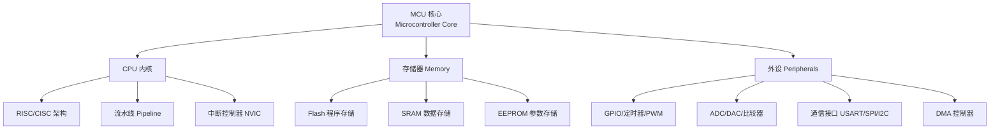
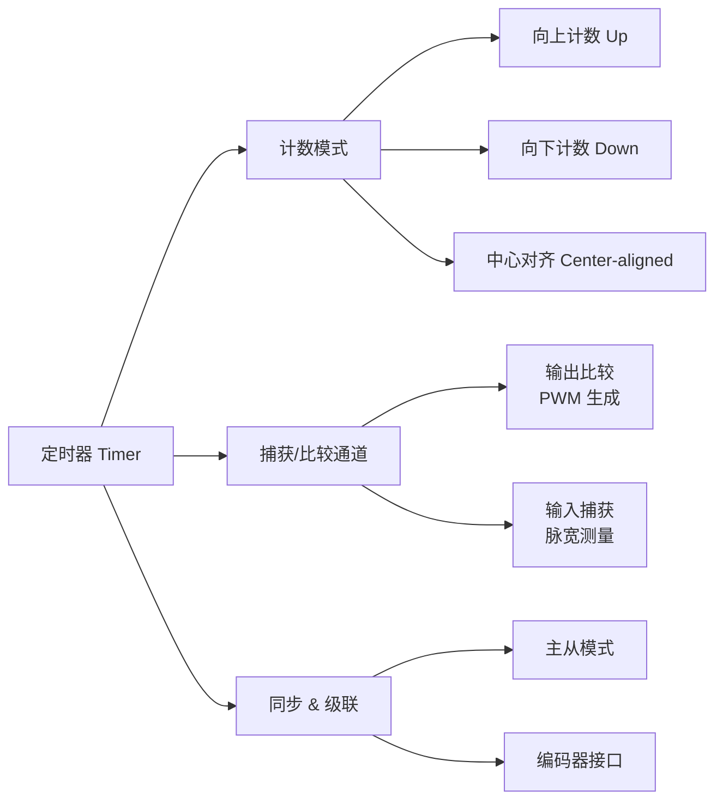
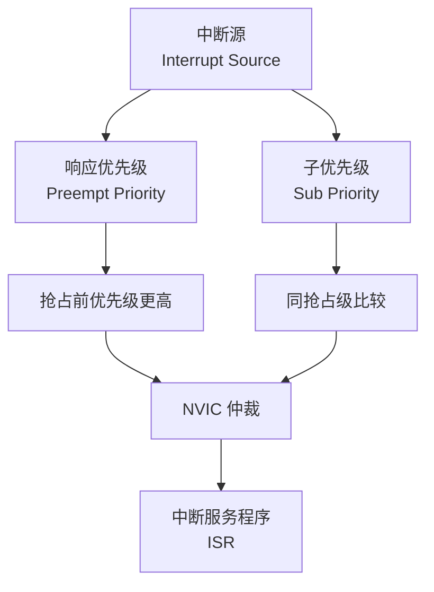

---
aliases: [Microcontrollers, MCU, 微控制器, 单片机]
tags: ['05_ComputerScience', 'HardwareAndEmbeddedSystems', 'Microcontrollers', 'EmbeddedSystems']
created: 2026-05-17
updated: 2026-05-17
---

# 微控制器 Microcontrollers

## 概述 Overview

微控制器（Microcontroller, MCU）是将处理器核心、存储器、可编程输入输出外设集成在单一芯片上的微型计算机系统。与微处理器（MPU）不同，MCU 强调自包含、低功耗和实时控制能力。

$$ \text{MCU} = \text{CPU Core} + \text{Memory (ROM + RAM)} + \text{Peripherals (GPIO, Timers, ADC, etc.)} $$

## 架构 Architecture

### 冯·诺依曼 vs 哈佛架构

| 特性 | 冯·诺依曼 Von Neumann | 哈佛 Harvard | 改进型哈佛 |
|------|----------------------|-------------|-----------|
| 总线 | 单一总线共享 | 指令/数据独立总线 | 独立总线 + 共享内存 |
| 带宽 | 总线瓶颈 | 并行取指/取数 | 灵活性更高 |
| 代表 | x86, ARM Cortex-M3 | AVR, 8051 | ARM Cortex-M4 |
| 应用 | 通用计算 | 嵌入式控制 | DSP + 控制 |

### CPU 核心



### ARM Cortex-M 系列

| 核心 | 位宽 | 流水线 | 特性 |
|------|------|--------|------|
| Cortex-M0 | 32-bit | 2 级 | 超低功耗、极小面积 |
| Cortex-M3 | 32-bit | 3 级 | 高性能、硬件除法 |
| Cortex-M4 | 32-bit | 3 级 | DSP 指令、FPU |
| Cortex-M7 | 32-bit | 6 级 | 双精度 FPU、缓存 |
| Cortex-M33 | 32-bit | 3 级 | TrustZone 安全、协处理器 |

## 存储器 Memory

### 存储层次

| 类型 | 用途 | 特点 |
|------|------|------|
| Flash | 程序代码、常量数据 | 非易失、读取快写入慢 |
| SRAM | 堆栈、全局变量、堆 | 易失、高速、低功耗 |
| EEPROM | 参数配置、校准值 | 非易失、字节可擦写 |
| Option Bytes | 芯片配置 | 一次性编程 |
| Cache (M7+) | 加速 Flash 访问 | 指令/数据缓存 |

### 存储器映射

$$ \text{Address Space} = \begin{cases}
\text{Flash}: & 0x0800\_0000 - 0x0801\_FFFF \text{ (128KB)} \\
\text{SRAM}: & 0x2000\_0000 - 0x2000\_7FFF \text{ (32KB)} \\
\text{Peripherals}: & 0x4000\_0000 - 0x4002\_FFFF \\
\text{SysTick}: & 0xE000\_E010 - 0xE000\_E01F
\end{cases} $$

## 外设 Peripherals

### GPIO (General Purpose Input/Output)

| 模式 | 功能 | 典型应用 |
|------|------|---------|
| 推挽输出 Push-Pull | 主动驱动高低电平 | LED 控制 |
| 开漏输出 Open-Drain | 需要外部上拉 | I²C 总线 |
| 浮空输入 Floating | 高阻抗输入 | 按键检测 |
| 上拉/下拉输入 | 内部电阻偏置 | 开关状态读取 |
| 模拟输入 Analog | 连接 ADC | 传感器读取 |
| 复用功能 Alternate | 映射到外设 | USART TX/RX |

### 定时器 Timers

| 类型 | 计数器位宽 | 功能 |
|------|-----------|------|
| 基本定时器 | 16-bit | 基本定时、时基 |
| 通用定时器 | 16/32-bit | PWM、输入捕获、输出比较 |
| 高级定时器 | 16-bit | 互补 PWM、刹车、编码器 |
| SysTick | 24-bit | OS 滴答定时器 |
| 看门狗 IWDG | 12-bit | 独立硬件看门狗 |
| 窗口看门狗 WWDG | 7-bit | 窗口内刷新 |

### 定时器工作模式

$$ \text{PWM Duty Cycle} = \frac{\text{CCR}}{\text{ARR} + 1} \times 100\% $$



### 串行通信协议

| 协议 | 信号线 | 时钟源 | 速度 | 拓扑 | 双工 |
|------|--------|--------|------|------|------|
| UART | TX, RX | 异步 | 可达 10 Mbps | 点对点 | 全双工 |
| SPI | SCK, MOSI, MISO, CS | 同步主控 | 可达 80 MHz | 一主多从 | 全双工 |
| I²C | SCL, SDA | 同步主控 | 标准 100K/400K/1M | 多主多从 | 半双工 |
| CAN | CAN_H, CAN_L | 异步差分 | 最高 1 Mbps | 多主总线 | 半双工 |
| USB | D+, D- | 同步差分 | 1.5/12/480 Mbps | 主从 | 半/全双工 |

#### UART 帧格式

$$ \text{Frame} = \underbrace{1}_{\text{Start}} + \underbrace{8/9}_{\text{Data}} + \underbrace{0/1}_{\text{Parity}} + \underbrace{1/2}_{\text{Stop}} \text{ bits} $$

#### SPI 模式

| 模式 | CPOL (时钟极性) | CPHA (时钟相位) | 数据采样边沿 |
|------|----------------|-----------------|-------------|
| 0 | 0 (空闲低) | 0 | 第一个跳变沿 |
| 1 | 0 (空闲低) | 1 | 第二个跳变沿 |
| 2 | 1 (空闲高) | 0 | 第一个跳变沿 |
| 3 | 1 (空闲高) | 1 | 第二个跳变沿 |

### ADC (模数转换器)

$$ V_{\text{measured}} = \frac{\text{ADC\_DR}}{2^N - 1} \times V_{\text{REF}} $$

| 参数 | 说明 |
|------|------|
| 分辨率 N | 12-bit (4096 级) |
| 转换时间 | 1 µs (1 MHz) |
| 采样模式 | 单次、连续、扫描、间断 |
| 触发源 | 软件、定时器、外部引脚 |
| 模拟看门狗 | 低阈值/高阈值监测 |

### DMA (直接存储器访问)

DMA 在不占用 CPU 的情况下在存储器与外设间传输数据，支持：

- 外设到存储器（ADC 采集）
- 存储器到外设（DAC 输出）
- 存储器到存储器（内存拷贝）
- 循环模式（环形缓冲区）

## 中断系统 Interrupt System

### NVIC (嵌套向量中断控制器)



### 中断优先级分组

| 分组 | 抢占优先级位数 | 子优先级位数 | 等级数 |
|------|-------------|-------------|--------|
| Group 0 | 0 | 4 | 抢占 1, 子 16 |
| Group 1 | 1 | 3 | 抢占 2, 子 8 |
| Group 2 | 2 | 2 | 抢占 4, 子 4 |
| Group 3 | 3 | 1 | 抢占 8, 子 2 |
| Group 4 | 4 | 0 | 抢占 16, 子 1 |

### 中断延迟

$$ t_{\text{latency}} = t_{\text{stacking}} + t_{\text{vector fetch}} + t_{\text{ISR entry}} $$

## 嵌入式 C 编程 Embedded C

### 位操作 Bit Manipulation

```c
#define SET_BIT(reg, bit)   ((reg) |=  (1UL << (bit)))
#define CLR_BIT(reg, bit)   ((reg) &= ~(1UL << (bit)))
#define TGL_BIT(reg, bit)   ((reg) ^=  (1UL << (bit)))
#define READ_BIT(reg, bit)  (((reg) >> (bit)) & 0x01U)
```

### 寄存器映射 Register Mapping

```c
typedef struct {
    volatile uint32_t CR1;      // Control Register 1
    volatile uint32_t CR2;      // Control Register 2
    volatile uint32_t SR;       // Status Register
    volatile uint32_t DR;       // Data Register
    volatile uint32_t BRR;      // Baud Rate Register
} USART_TypeDef;

#define USART1_BASE   0x40013800U
#define USART1        ((USART_TypeDef *) USART1_BASE)
```

## 低功耗模式 Low Power Modes

| 模式 | CPU 状态 | 外设 | 唤醒源 | 唤醒时间 | 功耗 |
|------|---------|------|--------|---------|------|
| Sleep | 停止 | 运行 | 任意中断 | 极短 | ~mA |
| Stop | 关闭 | 可配置保持 | EXTI、RTC | 短 | ~µA |
| Standby | 关闭 | 关闭 | 唤醒引脚、RTC | 长 | ~nA |
| Shutdown | 关闭 | 全部关闭 | 复位、唤醒引脚 | 最长 | ~nA |

## RTOS 实时操作系统

### 常用 RTOS

| RTOS | 内核大小 | 调度策略 | 认证 |
|------|---------|---------|------|
| FreeRTOS | ~6 KB | 抢占式/协作式 | 广泛使用 |
| RT-Thread | ~3 KB | 抢占式 | 国产开源 |
| μC/OS-III | ~6 KB | 抢占式 | DO-178B |
| Zephyr | ~8 KB | 抢占式 | Linux 基金会 |
| ThreadX | ~2 KB | 抢占式 | 工业安全 |

### 任务调度

$$ \text{Scheduling} \in \{\text{Preemptive}, \text{Cooperative}, \text{Hybrid}\} $$

| 调度算法 | 特点 | 适用场景 |
|---------|------|---------|
| 固定优先级 | 简单、可预测 | 实时控制 |
| 轮转调度 RR | 公平、时间片 | 分时系统 |
| 最早截止时间 EDF | 最优调度 | 硬实时系统 |
| 速率单调 RMS | 周期任务 | 固定周期任务集 |

## 调试与工具 Debug & Tools

- **JTAG/SWD**：片上调试接口，断点、单步、变量查看
- **逻辑分析仪 Logic Analyzer**：捕获数字信号时序
- **示波器 Oscilloscope**：模拟信号测量
- **串口调试 UART Debug**：printf 打印日志
- **IDE**：Keil MDK, IAR EWARM, STM32CubeIDE, VS Code + PlatformIO

## 应用领域 Applications

- **消费电子**：智能家居、可穿戴设备、玩具
- **工业控制**：PLC、电机驱动、传感器节点
- **汽车电子**：ECU、CAN 总线、BMS
- **医疗设备**：血糖仪、心电监护、输液泵
- **物联网 IoT**：无线传感网络、边缘计算节点

## 相关条目

- [[05_ComputerScience/HardwareAndEmbeddedSystems/EmbeddedSystems|EmbeddedSystems]]
- [[ARMArchitecture]]
- [[05_ComputerScience/HardwareAndEmbeddedSystems/RTOS/RTOS|RTOS]]
- [[CommunicationProtocols]]
- [[HardwareDesign]]


