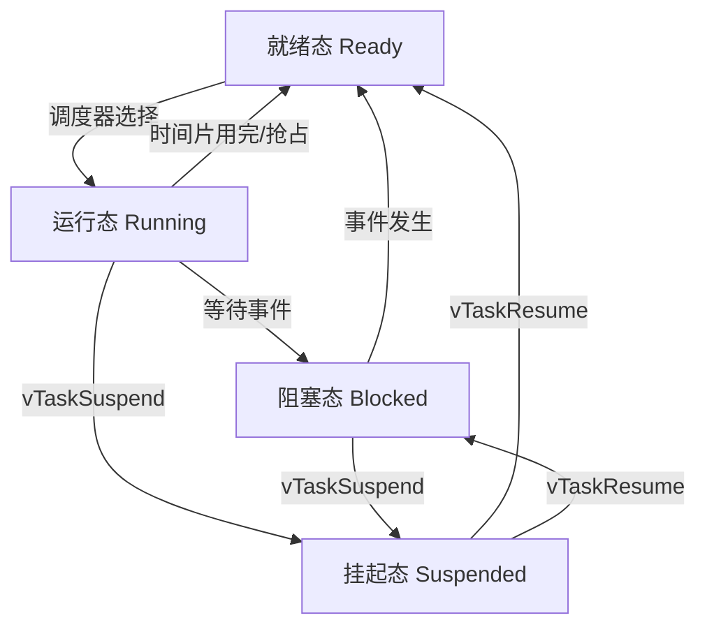

---
aliases: [FreeRTOS 任务与同步]
tags: ['HardwareAndEmbeddedSystems', 'RTOS', 'FreeRTOS']
---

# FreeRTOS 任务与同步

## 一、FreeRTOS 概述

FreeRTOS 是专为嵌入式系统设计的实时操作系统内核，2003年由 Richard Barry 创建。

核心特性：

| 特性 | 说明 |
|------|------|
| 内核类型 | 抢占式实时内核 |
| 调度策略 | 优先级抢占 + 时间片轮转 |
| 任务数量 | 无理论上限（仅由 ROM/RAM 限制） |
| 最小 RAM 需求 | 约 400 字节 |
| 支持架构 | ARM, AVR, RISC-V, x86 等 40+ 架构 |
| IPC 机制 | 队列、信号量、互斥量、事件组、任务通知 |
| 许可证 | MIT 开源 |
| 官方版本 | FreeRTOS V10.x / FreeRTOS SMP |

## 二、任务创建与管理

任务创建 API：`xTaskCreate`

```c
#include "FreeRTOS.h"
#include "task.h"

void vTask1(void *pvParameters) {
    const char *pcTaskName = "Task 1 is running\r\n";

    for (;;) {
        vPrintString(pcTaskName);
        vTaskDelay(pdMS_TO_TICKS(1000));
    }
}

void vTask2(void *pvParameters) {
    const TickType_t xDelay = pdMS_TO_TICKS(500);
    uint32_t ulCount = 0;

    for (;;) {
        ulCount++;
        vPrintStringAndNumber("Task 2 count: ", ulCount);
        vTaskDelay(xDelay);
    }
}

int main(void) {
    TaskHandle_t xTask1Handle = NULL;

    xTaskCreate(
        vTask1,          // 任务函数
        "Task 1",        // 任务名称
        1000,            // 堆栈深度（字）
        NULL,            // 参数
        1,               // 优先级（0是最低）
        &xTask1Handle    // 任务句柄
    );

    xTaskCreate(vTask2, "Task 2", 1000, NULL, 2, NULL);

    vTaskStartScheduler();

    for (;;);
    return 0;
}
```

任务状态转换：



## 三、任务优先级与调度

FreeRTOS 使用固定优先级抢占式调度：

| 优先级值 | 含义 |
|----------|------|
| 0 | 最低优先级（空闲任务使用）|
| 1 - configMAX_PRIORITIES-2 | 用户任务 |
| configMAX_PRIORITIES-1 | 最高优先级 |

调度规则：

1. 始终运行最高优先级的就绪任务
2. 相同优先级任务按时间片轮转
3. 高优先级任务阻塞后，低优先级任务获得 CPU

```c
// 优先级继承示例
void vHighPriorityTask(void *pvParameters) {
    for (;;) {
        // 尝试获取被低优先级任务持有的互斥量
        xSemaphoreTake(xMutex, portMAX_DELAY);
        // 临界区代码
        xSemaphoreGive(xMutex);
    }
}
```

## 四、队列

队列是 FreeRTOS 中任务间通信的主要机制：

```c
#include "queue.h"

QueueHandle_t xQueue;

void vSenderTask(void *pvParameters) {
    int32_t lValueToSend = (int32_t)pvParameters;

    for (;;) {
        xQueueSend(xQueue, &lValueToSend, 0);
        vTaskDelay(pdMS_TO_TICKS(1000));
    }
}

void vReceiverTask(void *pvParameters) {
    int32_t lReceivedValue;

    for (;;) {
        if (xQueueReceive(xQueue, &lReceivedValue, portMAX_DELAY) == pdPASS) {
            vPrintStringAndNumber("Received: ", lReceivedValue);
        }
    }
}

int main(void) {
    xQueue = xQueueCreate(5, sizeof(int32_t));

    xTaskCreate(vSenderTask, "Sender1", 1000, (void*)100, 1, NULL);
    xTaskCreate(vSenderTask, "Sender2", 1000, (void*)200, 1, NULL);
    xTaskCreate(vReceiverTask, "Receiver", 1000, NULL, 2, NULL);

    vTaskStartScheduler();
}
```

队列 API 总结：

| 函数 | 功能 | 上下文 |
|------|------|--------|
| xQueueCreate | 创建队列 | 启动前 |
| xQueueSend | 发送到队尾 | 任务/ISR |
| xQueueSendFromISR | ISR 中发送 | ISR |
| xQueueReceive | 接收（阻塞） | 任务 |
| xQueuePeek | 查看不移除 | 任务 |
| uxQueueMessagesWaiting | 查询消息数 | 任务 |

## 五、信号量

信号量是队列的特殊形式，用于同步和资源管理：

```c
#include "semphr.h"

SemaphoreHandle_t xSemaphore;

void vTask(void *pvParameters) {
    // 等待信号量
    if (xSemaphoreTake(xSemaphore, portMAX_DELAY) == pdPASS) {
        // 访问共享资源
        xSemaphoreGive(xSemaphore);
    }
}

// 中断中给出信号量
void vISR_Handler(void) {
    BaseType_t xHigherPriorityTaskWoken = pdFALSE;
    xSemaphoreGiveFromISR(xSemaphore, &xHigherPriorityTaskWoken);
    portYIELD_FROM_ISR(xHigherPriorityTaskWoken);
}
```

信号量类型对比：

| 类型 | 创建函数 | 初始值 | 用途 |
|------|----------|--------|------|
| 二值信号量 | xSemaphoreCreateBinary | 0 | 事件同步 |
| 计数信号量 | xSemaphoreCreateCounting | 用户定义 | 资源管理 |
| 互斥量 | xSemaphoreCreateMutex | 1 | 互斥访问 |
| 递归互斥量 | xSemaphoreCreateRecursiveMutex | 1 | 递归互斥 |

互斥量与二值信号量的区别：

| 特性 | 互斥量 | 二值信号量 |
|------|--------|-------------|
| 优先级继承 | 是 | 否 |
| 递归获取 | 支持（递归互斥量）| 不支持 |
| 必须由同一任务释放 | 是 | 否 |
| 用途 | 资源互斥访问 | 任务同步 |

## 六、事件组

事件组允许任务等待多个事件条件的组合：

```c
#include "event_groups.h"

#define BIT_TEMP_READY   (1 << 0)
#define BIT_PRESS_READY  (1 << 1)
#define BIT_HUMID_READY  (1 << 2)
#define BIT_ALL_SENSORS  (BIT_TEMP_READY | BIT_PRESS_READY | BIT_HUMID_READY)

EventGroupHandle_t xEventGroup;

void vTempTask(void *pvParameters) {
    for (;;) {
        // 读取温度传感器
        xEventGroupSetBits(xEventGroup, BIT_TEMP_READY);
        vTaskDelay(pdMS_TO_TICKS(100));
    }
}

void vProcessTask(void *pvParameters) {
    EventBits_t uxBits;

    for (;;) {
        // 等待所有传感器就绪
        uxBits = xEventGroupWaitBits(
            xEventGroup,
            BIT_ALL_SENSORS,
            pdTRUE,      // 退出时清除所有位
            pdTRUE,      // 等待所有位
            portMAX_DELAY
        );

        if ((uxBits & BIT_ALL_SENSORS) == BIT_ALL_SENSORS) {
            vPrintString("All sensors ready, processing...\r\n");
        }
    }
}
```

事件组优势：可同时等待多个事件、可选择 AND/OR 条件、不占用额外内存。

## 七、任务通知

任务通知是 FreeRTOS V8.2.0 引入的高效 IPC 机制，每个任务有一个 32 位通知值：

```c
void vTaskToNotify(void *pvParameters) {
    uint32_t ulNotificationValue;

    for (;;) {
        // 等待通知（阻塞）
        ulNotificationValue = ulTaskNotifyTake(pdTRUE, portMAX_DELAY);
        vPrintStringAndNumber("Notification received: ", ulNotificationValue);
    }
}

void vNotifierTask(void *pvParameters) {
    TaskHandle_t xTaskToNotify = ...;

    for (;;) {
        vTaskDelay(pdMS_TO_TICKS(500));

        // 发送通知
        xTaskNotifyGive(xTaskToNotify);

        // 或发送带值的通知
        xTaskNotify(xTaskToNotify, 42, eSetValueWithOverwrite);
    }
}
```

IPC 机制性能对比：

| 机制 | 传输数据量 | 速度 | 功能丰富度 | 适用场景 |
|------|-----------|------|-----------|----------|
| 队列 | 任意大小 | 较慢 | 丰富 | 数据传递 |
| 信号量 | 无 | 快 | 有限 | 同步/互斥 |
| 事件组 | 24位 | 快 | AND/OR | 多条件等待 |
| 任务通知 | 32位 | 最快 | 有限 | 轻量通信 |

## 八、定时器与软件定时

```c
#include "timers.h"

TimerHandle_t xTimer;

void vTimerCallback(TimerHandle_t xExpiredTimer) {
    uint32_t ulTimerId;

    ulTimerId = (uint32_t)pvTimerGetTimerID(xExpiredTimer);
    vPrintStringAndNumber("Timer expired, ID: ", ulTimerId);
}

void vCreateTimers(void) {
    // 一次性定时器
    xTimer = xTimerCreate(
        "OneShot",                     // 名称
        pdMS_TO_TICKS(5000),           // 周期
        pdFALSE,                       // 不自动重载
        (void*)0,                      // 定时器 ID
        vTimerCallback                 // 回调
    );
    xTimerStart(xTimer, 0);

    // 自动重载定时器
    TimerHandle_t xAutoReloadTimer = xTimerCreate(
        "AutoReload",
        pdMS_TO_TICKS(1000),
        pdTRUE,                        // 自动重载
        (void*)1,
        vTimerCallback
    );
    xTimerStart(xAutoReloadTimer, 0);
}
```

## 九、内存管理与临界区

FreeRTOS 提供 5 种内存分配方案（heap_1 到 heap_5）：

| 方案 | 特点 | 适用场景 |
|------|------|----------|
| heap_1 | 简单分配，不支持释放 | 从不删除任务 |
| heap_2 | 最佳匹配，支持释放 | 可变大小分配 |
| heap_3 | 包装 malloc/free | 使用标准库 |
| heap_4 | 首次匹配，合并碎片 | 通用场景 |
| heap_5 | 同 heap_4，支持非连续堆 | 多内存区域 |

临界区保护：

```c
// 方式1: 停止调度器
vTaskSuspendAll();
// 临界区代码（不可调用 FreeRTOS API）
xTaskResumeAll();

// 方式2: 关中断（ISR 中使用）
taskENTER_CRITICAL();
// 临界区代码
taskEXIT_CRITICAL();
```

## 相关条目

- [[RTOS]]
- [[进程调度与同步]]
- [[死锁与并发控制]]
- [[05_ComputerScience/ProgrammingLanguages/Go/Concurrency|Concurrency]]
- [[05_ComputerScience/HardwareAndEmbeddedSystems/Microcontrollers/STM32/INDEX|STM32]]

## 参考资料

1. FreeRTOS 官方文档：https://www.freertos.org/Documentation
2. 《FreeRTOS 内核实现与应用开发实战》书籍
3. FreeRTOS V10.x 源码及示例
4. Master 强化培训手册（FreeRTOS 官方）
5. STM32CubeMX + FreeRTOS 配置指南
6. Amazon FreeRTOS 文档（已更名为 FreeRTOS）
7. FreeRTOS + Tracealyzer 可视化分析工具

