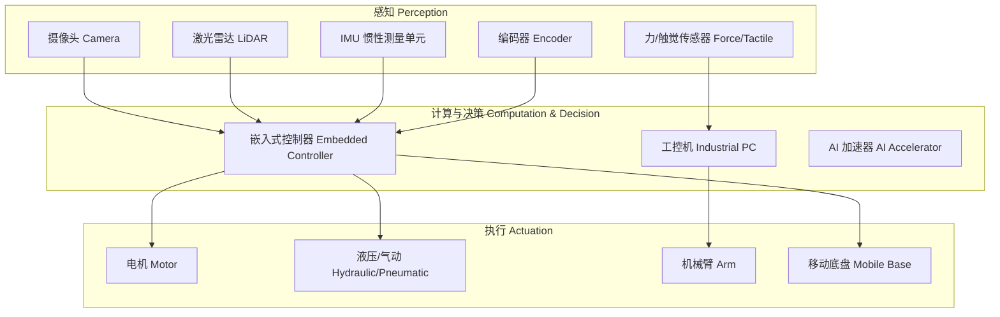

---
aliases: [Robotics, 机器人学]
tags: ['05_ComputerScience', 'Robotics']
created: 2026-05-17
updated: 2026-05-17
---

# 机器人学概述 (Robotics Overview)

## 一、引言

机器人学 (Robotics) 是研究机器人的设计、构建、操作和应用的交叉学科，融合机械工程、电子工程、计算机科学和控制理论。机器人是具有感知环境、处理信息和执行物理动作能力的自动化系统。

## 二、机器人系统架构 (Robot System Architecture)

## 三、运动学 (Kinematics)

### 3.1 正运动学 (Forward Kinematics)

给定关节角度 $\theta = [\theta_1, \theta_2, \ldots, \theta_n]^T$，计算末端执行器位姿。使用 D-H (Denavit-Hartenberg) 参数法建立齐次变换矩阵：

$$
T_n^0 = A_1 A_2 \cdots A_n = \begin{bmatrix}
R & p \\
0 & 1
\end{bmatrix}
$$

### 3.2 逆运动学 (Inverse Kinematics)

给定末端执行器目标位姿 $T_{\text{target}}$，求解关节角 $\theta$。解析法适用于特定构型，数值法 (如 Jacobian 伪逆) 适用于通用情况。

### 3.3 速度运动学

$$
\dot{x} = J(\theta) \dot{\theta}
$$

其中 $J(\theta)$ 为 Jacobian 矩阵，将关节速度映射到末端执行器空间速度。

## 四、控制理论 (Control Theory)

### 4.1 PID 控制

最经典的机器人控制算法：

$$
u(t) = K_p e(t) + K_i \int_0^t e(\tau) d\tau + K_d \frac{de(t)}{dt}
$$

| 参数 | 作用 | 过大影响 |
|------|------|---------|
| $K_p$ (比例) | 快速消除误差 | 震荡、超调 |
| $K_i$ (积分) | 消除稳态误差 | 积分饱和 |
| $K_d$ (微分) | 预测误差趋势，增加阻尼 | 噪声敏感 |

### 4.2 现代控制方法

| 方法 | 描述 | 适用场景 |
|------|------|---------|
| 线性二次调节器 (LQR) | 最优状态反馈控制 | 平衡、轨迹跟踪 |
| 模型预测控制 (MPC) | 带约束的滚动时域优化 | 移动机器人、机械臂 |
| 阻抗控制 | 控制力与位置关系 | 人机协作、装配 |
| 计算力矩控制 | 基于动力学模型前馈补偿 | 高速高精度 |

## 五、感知与环境建模 (Perception & Mapping)

### 5.1 同时定位与地图构建 (SLAM)

| SLAM 方法 | 传感器 | 特点 |
|-----------|--------|------|
| EKF-SLAM | 激光雷达 | 扩展卡尔曼滤波，小规模 |
| FastSLAM | 激光雷达 | 粒子滤波，非线性适应 |
| ORB-SLAM | 单目/双目/RGB-D | 视觉 SLAM，特征法 |
| Cartographer | 激光雷达 | Google 开源，2D/3D |
| LSD-SLAM | 单目 | 直接法，半稠密深度图 |
| DSO (Direct Sparse Odometry) | 单目 | 纯视觉里程计，光度误差 |

### 5.2 状态估计

$$
\hat{x}_{k|k-1} = f(\hat{x}_{k-1|k-1}, u_k)
$$

$$
P_{k|k-1} = F_k P_{k-1|k-1} F_k^T + Q_k
$$

卡尔曼滤波 (Kalman Filter) 是机器人状态估计的基础框架。

## 六、路径规划 (Path Planning)

### 6.1 全局规划

| 算法 | 原理 | 特点 |
|------|------|------|
| A* | 启发式图搜索，$f(n)=g(n)+h(n)$ | 最优，网格地图 |
| Dijkstra | 无权最小路径 | A* 的特例 ($h(n)=0$) |
| RRT | 快速随机探索树 | 高维空间、非完整约束 |
| PRM | 概率路标图 | 多查询，预计算 |
| Hybrid A* | 连续状态 A* | 自动驾驶 (非完整约束) |

### 6.2 局部规划

**动态窗口法 (DWA)**：在速度空间采样 $(v, \omega)$，评估轨迹的安全性和效率。

**时间弹性带 (TEB)**：优化轨迹的时间分配，动态避障。

## 七、机器人操作系统 (ROS)

### 7.1 ROS 核心概念

- **节点 (Node)**：可执行程序，执行特定功能
- **话题 (Topic)**：异步通信，发布/订阅模式
- **服务 (Service)**：同步通信，请求/响应模式
- **动作 (Action)**：带反馈的长时任务
- **参数服务器 (Parameter Server)**：全局共享参数

### 7.2 ROS2 优势

| 特性 | ROS1 | ROS2 |
|------|------|------|
| 中间件 | ROS 自定义 TCPROS | DDS (Data Distribution Service) |
| 实时性 | 不支持 | 支持 (Linux PREEMPT_RT) |
| 安全性 | 无 | SROS2 (加密、认证、权限) |
| 多机器人 | 弱 | 原生 DDS 发现 |
| 嵌入式 | 不支持 | Micro-ROS 支持 MCU |

## 八、应用领域

| 领域 | 应用 | 关键技术 |
|------|------|---------|
| 制造业 | 焊接、装配、喷涂、码垛 | 机械臂、视觉引导、力控 |
| 医疗 | 手术机器人、康复、配送 | 精密控制、触觉反馈、图像引导 |
| 服务 | 清洁、导览、送餐、客服 | 自主导航、人机交互、NLP |
| 农业 | 采收、喷洒、巡检 | 视觉识别、SLAM、自主作业 |
| 物流 | AGV、仓储分拣、无人机配送 | VSLAM、调度优化、多机协作 |
| 探索 | 太空 (火星车)、深海 (ROV) | 遥操作、自主决策、极端环境 |
| 军事 | 排爆、侦察、无人作战 | 自主系统、抗干扰、群组协同 |

## 九、发展前沿

- **人机协作 (Cobot)**：安全力限制、触觉感知、意图预测
- **具身智能 (Embodied AI)**：大模型驱动机器人理解和交互
- **软体机器人**：柔性材料、气动驱动、生物启发
- **群体机器人 (Swarm)**：蚁群算法、分布式决策、大规模协作
- **人形机器人 (Humanoid)**：双足平衡、全身协同、通用任务

## 相关条目

- [[07_InterdisciplinarySciences/CognitiveScience/ArtificialIntelligence|人工智能 (AI)]]
- [[EmbeddedSystemsOverview|嵌入式系统]]
- [[05_ComputerScience/ArtificialIntelligence/ComputerVision/ComputerVisionOverview|计算机视觉 (CV)]]
- [[05_ComputerScience/ArtificialIntelligence/MachineLearning/MachineLearning|机器学习 (ML)]]
- [[05_ComputerScience/ArtificialIntelligence/MachineLearning/ReinforcementLearning/ReinforcementLearning|强化学习]]
- [[ROS|机器人操作系统 (ROS)]]

