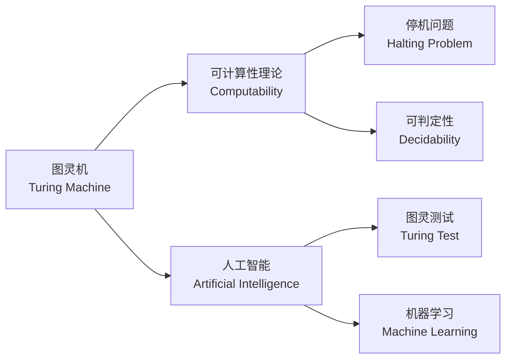
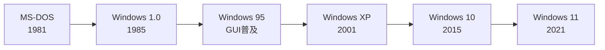
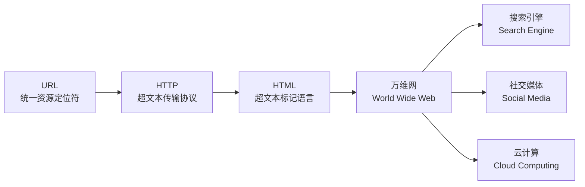

# 计算机先驱

## 概述

计算机科学的发展
凝聚了无数杰出思想家的智慧与远见。
从理论奠基到工程实践。
从硬件突破到软件创新。
这些先驱者（Computer Pioneers）
塑造了现代数字文明（Digital Civilization）的根基。

本条目系统梳理对计算机科学与技术
产生深远影响的关键人物。
涵盖理论计算（Theoretical Computing）。
体系结构（Architecture）。
软件工程（Software Engineering）。
个人计算（Personal Computing）。
互联网（Internet）等领域的奠基者。

每位先驱的贡献不仅在于具体技术发明。
更在于他们对计算机科学与人类关系的深刻思考。
图灵对"机器能否思考"的叩问。
冯·诺依曼对存储程序的构想。
伯纳斯-李对开放互联网的坚持。
都是超越时代的远见。

## 理论奠基者

### 艾伦·图灵

艾伦·图灵（Alan Turing, 1912–1954）
被誉为"计算机科学之父"（Father of Computer Science）。
"人工智能之父"（Father of AI）。

1936年发表论文《论可计算数》
（On Computable Numbers）。
提出图灵机（Turing Machine）的抽象模型。
形式化定义了可计算性（Computability）的边界。

图灵机由以下七元组定义：

$$M = (Q, \Sigma, \Gamma, \delta, q_0, B, F)$$

其中 $Q$ 为有限状态集合。
$\Sigma$ 为输入字母表（Input Alphabet）。
$\Gamma$ 为磁带字母表（Tape Alphabet）。
$\delta$ 为转移函数（Transition Function）。
$q_0$ 为初始状态（Start State）。
$B$ 为空白符号（Blank Symbol）。
$F$ 为接受状态集合（Accepting States）。

图灵利用图灵机解决了**停机问题**（Halting Problem）。
证明存在不可判定问题。
奠定了计算机科学中"不可能性"理论的基础。

二战期间，图灵在布莱切利园（Bletchley Park）
主导破译了德国Enigma密码机。
他设计的"炸弹机"（Bombe）大幅加速了密码分析过程。
据估计，破译工作将战争缩短了至少两年。

图灵测试（Turing Test）至今仍是
衡量机器智能（Machine Intelligence）的思想实验。
1950年发表论文《计算机器与智能》
（Computing Machinery and Intelligence）。
提出"模仿游戏"（Imitation Game）框架。
开创了人工智能的研究范式。

1952年因同性恋身份被判化学阉割。
1954年去世，终年41岁。
2009年英国政府正式道歉。
2013年获皇家赦免。

### 约翰·冯·诺依曼

约翰·冯·诺依曼（John von Neumann, 1903–1957）
是博学者，在数学、物理学、经济学
和计算机科学领域均有卓越贡献。

冯·诺依曼在数学方面做出了开创性贡献。
包括算子理论、测度论、遍历理论等。
在量子力学领域提出了严格的数学基础。
在经济学中创立了博弈论（Game Theory）。
与摩根斯特恩合著《博弈论与经济行为》。

1944年参与ENIAC项目后。
认识到存储程序的重要性。
1945年，他在《EDVAC报告书的第一份草案》中
提出了存储程序计算机（Stored-Program Computer）概念。
即冯·诺依曼架构（von Neumann Architecture）。

该架构的核心特征：
将指令（Instructions）与数据（Data）
以同等地位存储于同一存储器（Memory）中。
通过程序计数器（Program Counter, PC）顺序取指执行。

关键组件包括：
中央处理器（CPU）——控制单元+算术逻辑单元。
存储器（Memory）——存储指令和数据。
输入输出设备（I/O Device）。
系统总线（System Bus）——连接各部件的数据通路。

冯·诺依曼瓶颈（von Neumann Bottleneck）：
CPU与存储器之间数据传输速度的限制。
这一瓶颈催生了缓存（Cache）层级结构。
指令流水线（Instruction Pipeline）。
超标量架构（Superscalar Architecture）。
以及哈佛架构（Harvard Architecture）等改进方案。

冯·诺依曼在生命最后十年还研究了自复制自动机（Self-Replicating Automata）。
提出"细胞空间"（Cellular Space）模型。
直接影响了后来数学形态学和细胞自动机的发展。

## 机械计算先驱

### 查尔斯·巴贝奇与艾达·洛夫莱斯

查尔斯·巴贝奇（Charles Babbage, 1791–1871）
设计了差分机（Difference Engine）和分析机（Analytical Engine）。

差分机通过有限差分法自动计算多项式函数值。
消除人工制表的误差。
英国政府资助了其开发但最终未完成。
巴贝奇与工程师Joseph Clement的合作以争吵告终。

分析机具备现代计算机的核心特征：
存储（Store）——寄存数据的存储器。
运算（Mill）——执行算术运算的单元。
穿孔卡片（Punched Card）——程序控制机制。
条件分支——根据结果选择执行路径。

| 项目 | 差分机No.1 | 差分机No.2 | 分析机 |
|------|-----------|-----------|--------|
| 设计年份 | 1822 | 1849 | 1837 |
| 功能 | 多项式计算 | 多项式计算 | 通用计算 |
| 程序控制 | 凸轮轴 | 凸轮轴 | 穿孔卡片 |
| 存储容量 | 固定 | 固定 | 寄存器组 |
| 条件分支 | 不支持 | 不支持 | 支持 |

艾达·洛夫莱斯（Ada Lovelace, 1815–1852）
是诗人拜伦勋爵之女。
为分析机编写了伯努利数计算算法。
被广泛认为是世界上第一位程序员（First Programmer）。

她预言计算机超越纯数值计算的可能性。
"分析机不能创造任何东西……
但它可以执行任何我们能命令它执行的事情"。
她最早区分了计算机的"功能"与"目的"。
这一洞见超前了一个多世纪。
1980年，美国国防部以她命名了Ada编程语言。

### 赫尔曼·霍勒瑞斯

赫尔曼·霍勒瑞斯（Herman Hollerith, 1860–1929）
发明了制表机（Tabulating Machine）。
使用穿孔卡片存储数据。
将1890年美国人口普查的数据处理时间从8年缩短到1年。

他创办的公司是IBM的前身之一。
穿孔卡片技术主导了数据处理行业近50年。

## 软件工程先驱

### 格蕾丝·霍珀

格蕾丝·霍珀（Grace Hopper, 1906–1992）
是美国海军少将（Rear Admiral）。
编程语言（Programming Language）领域的开拓者。

她主导开发了FLOW-MATIC——
第一个使用英文词汇的编程语言。
直接影响了COBOL的设计。
COBOL是第一个被广泛使用的商业数据编程语言。
至今仍运行在全球银行系统的主机中。

霍珀创造了"bug"和"debug"等术语。
1947年从Mark II计算机中找出飞蛾。
被记录为计算机历史上第一个"bug"。

她推动编译器（Compiler）的诞生——
人类应该用英语而非机器语言编程。
"人类用英语思考，而非机器语言"。
这一信念奠定了高级编程语言（High-Level Language）的哲学基础。
她曾说："不要问'可行吗'，要问'可以实现吗'。"

### 约翰·巴克斯

约翰·巴克斯（John Backus, 1924–2007）
领导开发了FORTRAN（Formula Translation, 1957）。
第一个被广泛使用的高级编程语言。

FORTRAN引入了：
表达式语法。
数组索引。
循环和子程序。
格式化输入输出。

巴克斯还提出了巴克斯-瑙尔范式
（Backus-Naur Form, BNF）。
用于形式化描述编程语言的语法结构。
是编译器构造和编程语言理论的基础工具。
1977年获图灵奖。

## 个人计算机革命

### 比尔·盖茨

比尔·盖茨（Bill Gates, b. 1955）
与保罗·艾伦共同创立了微软（Microsoft, 1975）。

他推动"每张桌子、每个家庭都有一台个人电脑"的愿景。
通过MS-DOS（1981）和Windows（1985）
将计算能力普及到大众。

微软的成功不仅在于技术。
更在于商业模式创新——
将软件从硬件捆绑中分离。
建立软件授权（Software Licensing）的盈利模式。
1990年代通过与英特尔（Wintel联盟）合作主导PC市场。

### 史蒂夫·乔布斯

史蒂夫·乔布斯（Steve Jobs, 1955–2011）
是苹果公司（Apple Inc.）联合创始人。
以对设计与用户体验（User Experience）的极致追求著称。

Macintosh（1984）首次将图形用户界面（GUI）
与鼠标带入主流市场。
iMac（1998）重新定义了消费电子美学。
iPhone（2007）开启了智能手机时代。
iPad（2010）开创了平板电脑新品类。

## 互联网与万维网

### 蒂姆·伯纳斯-李

蒂姆·伯纳斯-李（Tim Berners-Lee, b. 1955）
于1989年在欧洲核子研究中心（CERN）发明了万维网。

他开发了：
统一资源定位符（URL）。
超文本传输协议（HTTP）。
超文本标记语言（HTML）。
第一个网页浏览器（WorldWideWeb, 1990）。

1991年8月6日，他在alt.hypertext新闻组上发布了万维网项目。
第一个网站是http://info.cern.ch。

伯纳斯-李始终坚持互联网的开放性与去中心化（Decentralization）。
拒绝为万维网申请专利。
他致力于推动语义网（Semantic Web）和数据主权（Data Sovereignty）。
创立万维网联盟（W3C）推动Web标准化。

## 其他重要贡献者

| 先驱 | 生卒 | 领域 | 主要贡献 |
|------|------|------|----------|
| 克劳德·香农 | 1916-2001 | 信息论 | 创立信息论，定义比特 |
| 道格拉斯·恩格尔巴特 | 1925-2013 | 人机交互 | 发明鼠标，oN-Line System |
| 肯·汤普森 | b. 1943 | 操作系统 | UNIX, Go语言, UTF-8 |
| 丹尼斯·里奇 | 1941-2011 | 编程语言 | C语言, UNIX |
| 林纳斯·托瓦兹 | b. 1969 | 开源运动 | Linux内核, Git |
| 约翰·麦卡锡 | 1927-2011 | 人工智能 | Lisp语言, AI一词 |
| 唐纳德·克努特 | b. 1938 | 算法分析 | TAOCP, TeX, KMP算法 |
| 范内瓦·布什 | 1890-1974 | 信息科学 | Memex概念预言超文本 |

## 继承与影响

这些计算机先驱的遗产
不仅体现在具体的技术发明中。
更在于他们所树立的科学精神——
对真理的执着追求。
对开放共享的坚定信念。
将复杂问题转化为优雅解决方案的能力。

他们的故事激励着新一代计算机科学家
继续探索未知。
推动人类认知与技术文明的边界。
