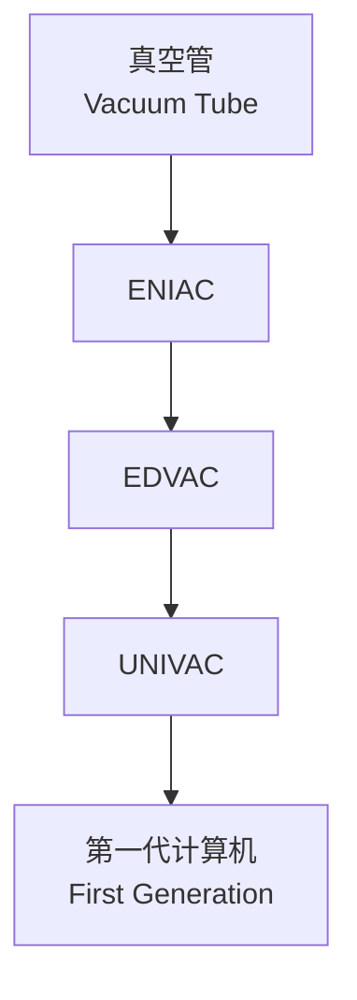
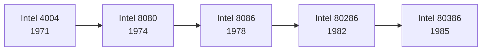
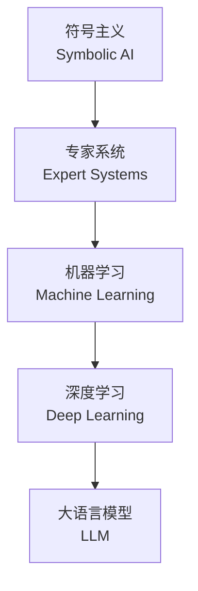

# 计算机发展史 (History of Computing)

计算机的发展是一部人类智力工具演化的宏大史诗。从手动计算装置到人工智能时代，每一次技术跃迁都深刻改变了社会的运行方式与人类的认知边界。

## 前电子时代 (Pre-Electronic Era)

在电子计算机诞生之前，人类借助各种机械与机电装置辅助计算。

### 早期计算工具

- **算盘（Abacus）**：最古老的计算工具之一，起源于公元前 2400 年的美索不达米亚
- **纳皮尔骨（Napier's Bones）**：17 世纪初，约翰·纳皮尔发明的乘法计算辅助工具
- **帕斯卡计算器（Pascaline）**：1642 年，布莱兹·帕斯卡发明，可进行加减运算的机械计算器
- **莱布尼茨轮（Leibniz Wheel）**：1673 年，戈特弗里德·莱布尼茨改进，支持乘除运算

### 机电计算时代

19 世纪末至 20 世纪中叶，机电式计算机占据了主导地位。

| 机器 | 年代 | 特点 |
|------|------|------|
| 制表机（Tabulating Machine） | 1890 | 赫尔曼·何乐礼发明，用于美国人口普查 |
| Z1 | 1936 | 康拉德·楚泽设计，第一台可编程机械计算机 |
| Z3 | 1941 | 第一台可工作的程序控制机电计算机 |
| 马克一号（Mark I） | 1944 | 哈佛-IBM 合作，51 英尺长，750,000 个组件 |

## 电子计算机时代 (Electronic Computing)

### ENIAC 与第一代计算机

1946 年，世界上第一台通用电子数字计算机 ENIAC（Electronic Numerical Integrator and Computer）在宾夕法尼亚大学诞生。它重达 30 吨，占地 1,800 平方英尺，包含 17,468 个真空管。

ENIAC 的运算速度达到每秒 5,000 次加法，但编程需要通过重新连接电缆和开关完成，极为繁琐。冯·诺依曼提出的存储程序概念从根本上解决了这一问题。

### 晶体管与集成电路

1947 年，贝尔实验室的肖克利、巴丁与布拉顿发明了晶体管（Transistor），开启了第二代计算机时代。晶体管相比真空管具有体积小、功耗低、可靠性高的显著优势。

1958 年，杰克·基尔比发明了集成电路（Integrated Circuit, IC），将多个晶体管集成于单一硅片上。摩尔定律（Moore's Law）预测集成电路上可容纳的晶体管数量每 18–24 个月翻一番：

$$
N(t) = N_0 \cdot 2^{t / 18}
$$

其中 $N(t)$ 为 $t$ 个月后的晶体管数量，$N_0$ 为初始数量。

## 大型机与小型机时代 (Mainframes & Minicomputers)

### 大型机（Mainframe）

20 世纪 60 至 70 年代，IBM 主导了大型机市场。System/360 系列引入了兼容机概念，使软件可在不同型号间迁移。

| 系列 | 年代 | 影响 |
|------|------|------|
| IBM 701 | 1952 | IBM 首台科学计算机 |
| IBM System/360 | 1964 | 兼容机家族，投资 50 亿美元 |
| IBM S/370 | 1970 | 虚拟内存与多道程序设计 |

### 小型机（Minicomputer）

数字设备公司（DEC）推出的 PDP 系列使计算能力走出了大型数据中心。PDP-8（1965）和 PDP-11（1970）成为学术研究和工业控制的标杆平台。DEC VAX（1977）则引入了 32 位架构与虚拟内存管理。

## 个人计算机革命 (Personal Computing)

### 微处理器与早期 PC

1971 年，英特尔发布了 4004 微处理器，这是世界上第一款商用微处理器。随后 8008、8080 与 8086 系列推动了微型计算机的普及。

里程碑式的产品包括：

- **Altair 8800**（1975）：基于 Intel 8080 的套件计算机，激发了比尔·盖茨与保罗·艾伦的创业
- **Apple II**（1977）：史蒂夫·沃兹尼亚克设计，首款成功的大规模生产个人电脑
- **IBM PC**（1981）：开放架构设计，确立了 PC 兼容机标准
- **Macintosh**（1984）：图形用户界面与鼠标的革命

### 软件生态的崛起

操作系统从 CP/M 发展到 MS-DOS，再到 Windows 与 macOS。编程语言从 BASIC 到 C/C++，再到 Java 与 Python，软件生态的繁荣进一步释放了硬件的计算潜力。

## 互联网与网络时代 (Internet Era)

### 从 ARPANET 到万维网

1969 年，ARPANET 首次连接了加州大学洛杉矶分校与斯坦福研究院，标志着互联网的起源。TCP/IP 协议 suite 于 1983 年成为标准，奠定了现代互联网的基础。

| 里程碑 | 年份 | 意义 |
|--------|------|------|
| ARPANET 诞生 | 1969 | 分组交换网络的首次实践 |
| TCP/IP 标准化 | 1983 | 异构网络互联的通用协议 |
| DNS 系统 | 1984 | 域名解析，降低网络使用门槛 |
| 万维网公开 | 1991 | 蒂姆·伯纳斯-李释放 HTTP/HTML |
|  Mosaic 浏览器 | 1993 | 图形化浏览体验 |

### 移动互联网

2007 年，苹果发布 iPhone，开启了移动互联网时代。随后 Android 系统的开放生态进一步加速了智能手机的普及，计算从桌面延伸至口袋，随时随地可用。

## 人工智能时代 (AI Era)

### 从符号主义到深度学习

人工智能经历了三次浪潮：

1. **符号主义（1950s–1980s）**：基于逻辑推理与专家系统
2. **统计学习（1990s–2010s）**：支持向量机、随机森林等
3. **深度学习（2010s–至今）**：神经网络复兴，大数据驱动

2012 年，AlexNet 在 ImageNet 竞赛中的突破性表现标志着深度学习时代的来临。此后，GPT、BERT 等大语言模型重新定义了自然语言处理的边界。

### 量子计算与未来展望

量子计算（Quantum Computing）利用量子叠加与纠缠原理，在特定问题上展现出超越经典计算的潜力。量子比特（Qubit）的状态可表示为：

$$
|\psi\rangle = \alpha |0\rangle + \beta |1\rangle
$$

其中 $|\alpha|^2 + |\beta|^2 = 1$，系数 $\\alpha$ 与 $\\beta$ 为复数概率幅。

从 ENIAC 到量子计算机，从主机房到云端，计算机发展史见证了人类不断突破物理极限、拓展智力边界的伟大历程。每一次计算范式的转换都催生了新的产业、新的文化形态与新的社会结构。未来，脑机接口、光子计算与类脑芯片等前沿方向将继续书写这部未完成的史诗。
