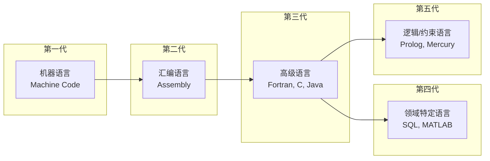
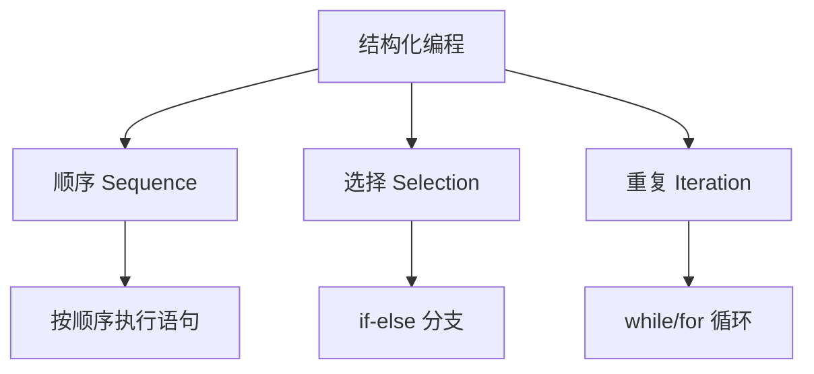
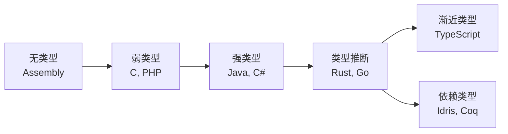

---
aliases:
  - 编程语言历史
  - 编程语言发展
  - 语言演进
  - History of Programming
  - Programming Language Evolution
  - PL History
tags:
created: 2026-05-17
updated: 2026-05-17
  - ComputerScience
  - HistoryOfComputing
  - ProgrammingLanguages
  - SoftwareEngineering
  - LanguageDesign
  - Paradigms
---

# 编程语言发展史

## 一、编程语言发展概述

编程语言的发展史是计算机科学（Computer Science）的重要组成部分，反映了从机器指令到高级抽象（Abstraction）的演进过程。

### 语言世代划分



---

## 二、早期发展（1940s-1950s）

### 机器语言与汇编

最早的计算机使用机器语言（Machine Code），即二进制指令直接编程。后来发展出汇编语言（Assembly Language），使用助记符（Mnemonic）代替二进制码。

```asm
; 汇编语言示例：x86加法
MOV AX, 5      ; 将5存入 AX 寄存器
ADD AX, 3      ; AX = AX + 3
```

### 关键里程碑

| 年份 | 语言/事件 | 开发者 | 意义 |
|------|-----------|--------|------|
| 1949 | 短码（Short Code） | 莫奇利 | 最早的"高级"语言概念 |
| 1951 | 汇编器 | 莫里斯·威尔克斯 | 符号汇编 |
| 1954 | Fortran | IBM / 巴克斯 | 第一个高级语言 |
| 1958 | ALGOL | 国际委员会 | 算法语言、块结构 |
| 1959 | COBOL | 霍普 | 商业数据处理 |
| 1959 | Lisp | 麦卡锡 | 函数式编程、递归 |

### Fortran 的意义

$$ \text{Fortran (Formula Translation)} \rightarrow \text{首次实现编译器 (Compiler)} $$

Fortran 引入的关键概念：
- 表达式求值
- 子程序（Subroutine）
- DO 循环
- 格式化输入输出

---

## 三、结构化编程时代（1960s-1970s）

### C 语言的诞生

1972年，丹尼斯·里奇（Dennis Ritchie）在贝尔实验室设计了 C 语言，用于重写 Unix 操作系统。

```c
#include <stdio.h>

int main() {
    printf("Hello, World!\n");
    return 0;
}
```

### 重要语言

| 语言 | 年份 | 开发者 | 贡献 |
|------|------|--------|------|
| Simula | 1967 | Dahl, Nygaard | 面向对象概念起源 |
| Pascal | 1970 | 沃斯 | 教学语言、结构化编程 |
| C | 1972 | 里奇 | 系统编程、效率高 |
| Smalltalk | 1972 | 凯伊 | 纯面向对象、消息传递 |
| Prolog | 1972 | Colmerauer | 逻辑编程范式 |
| SQL | 1974 | Chamberlin | 关系数据库查询 |

### 结构化编程（Structured Programming）

戴克斯特拉（Dijkstra）倡导的三大结构：



---

## 四、面向对象与脚本语言（1980s-1990s）

### 面向对象编程（OOP）的成熟

| 语言 | 年份 | 开发者 | 特色 |
|------|------|--------|------|
| C++ | 1983 | 斯特劳斯特鲁普 | C + 类、兼容 C |
| Objective-C | 1984 | 考克斯 | C + Smalltalk 消息传递 |
| Eiffel | 1985 | 迈耶 | 设计契约（Design by Contract） |
| Java | 1995 | 高斯林 | 跨平台、JVM、垃圾回收 |

### 脚本语言的兴起

| 语言 | 年份 | 用途 | 特点 |
|------|------|------|------|
| Perl | 1987 | 文本处理 | 正则表达式集成 |
| Python | 1991 | 通用 | 简洁、可读性高 |
| Ruby | 1995 | Web 开发 | 优雅、约定优于配置 |
| JavaScript | 1995 | 浏览器脚本 | Web 前端统治地位 |
| PHP | 1995 | Web 后端 | 嵌入 HTML |

### OOP 四大特性

$$ \text{封装（Encapsulation）} + \text{继承（Inheritance）} + \text{多态（Polymorphism）} + \text{抽象（Abstraction）} $$

---

## 五、现代语言与范式融合（2000s-2010s）

### 现代语言

| 语言 | 年份 | 设计者 | 核心特性 |
|------|------|--------|----------|
| C# | 2000 | 微软 | .NET 生态、类型安全 |
| Scala | 2004 | 奥德斯基 | 函数式+面向对象融合 |
| Go | 2009 | 谷歌 | 并发原语、编译快速 |
| Rust | 2010 | 莫齐拉 | 内存安全、无 GC |
| Kotlin | 2011 | JetBrains | JVM 语言、空安全 |
| TypeScript | 2012 | 微软 | JavaScript 超集、类型系统 |
| Swift | 2014 | 苹果 | 安全、现代、快速 |
| Zig | 2015 | 凯利 | 手动内存管理、无隐式控制流 |

### 编程范式对比

| 范式 | 核心思想 | 代表语言 | 适用场景 |
|------|----------|----------|----------|
| 命令式（Imperative） | 逐步指令 | C, Fortran | 系统编程 |
| 声明式（Declarative） | 描述目标 | SQL, HTML | 查询、标记 |
| 面向对象（OOP） | 对象+消息 | Java, C++ | 大型应用 |
| 函数式（Functional） | 纯函数+不可变 | Haskell, Clojure | 并发、数据处理 |
| 逻辑式（Logic） | 关系+推理 | Prolog | AI、符号计算 |
| 并发式（Concurrent） | Actor/CSP | Erlang, Go | 分布式系统 |

---

## 六、语言设计趋势

### 发展趋势

1. **安全性优先**：类型系统越来越强大（Rust, TypeScript）
2. **并发模型改进**：goroutine, async/await, Actor 模型
3. **生态整合**：包管理器（npm, cargo, pip）标准化
4. **跨平台编译**：LLVM 使新语言开发更容易
5. **DSL 增长**：领域特定语言适应各行业

### 类型系统的演进



---

## 七、编程语言设计的永恒主题

| 主题 | 权衡 |
|------|------|
| 抽象 vs 性能 | 高层抽象降低性能但提高开发效率 |
| 静态 vs 动态 | 静态类型发现错误早、动态类型灵活 |
| 简单 vs 强大 | 简单语言易学但表达能力有限 |
| 通用 vs 专用 | 通用适用面广、专用更高效 |
| 向后兼容 | 兼容旧代码但有时阻碍革新 |

$$ \text{编程语言设计} = \max(\text{表达力}, \text{安全性}, \text{性能}) \quad \text{subject to} \quad \text{可用性} $$
