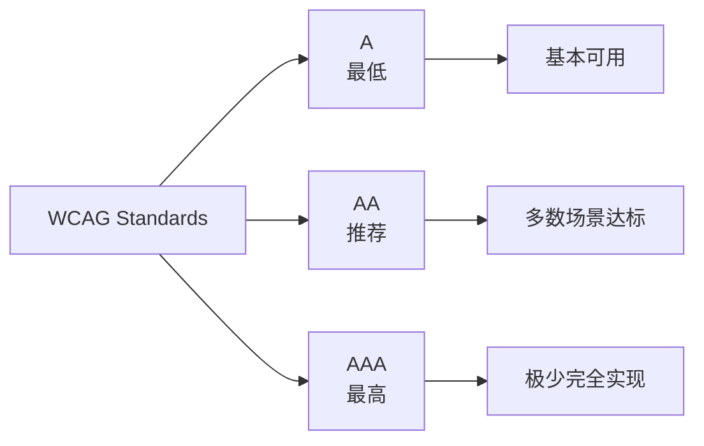
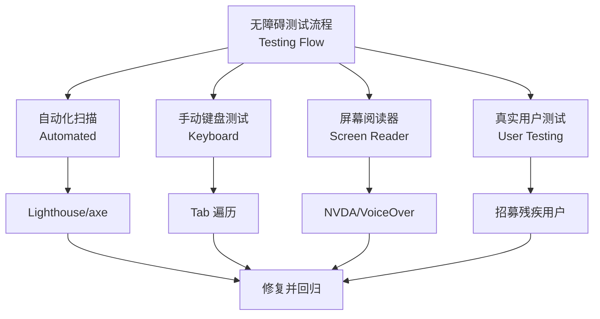

# 无障碍设计 (Accessibility)

## 概述 (Overview)

无障碍设计（Accessibility, a11y）确保产品能被尽可能多的用户使用，无论其能力、情境或设备。全球约 15% 人口存在某种形式的残疾。无障碍设计不仅符合道德与法律要求，也提升全体用户的体验。

> "无障碍不是功能，而是设计的基本属性。"

## WCAG 标准

### 四个原则 (POUR)

Web Content Accessibility Guidelines (WCAG) 定义四项核心原则：

| 原则 | 英文 | 含义 |
|------|------|------|
| 可感知 | Perceivable | 信息必须可通过感官获取 |
| 可操作 | Operable | UI 组件和导航必须可操作 |
| 可理解 | Understandable | 信息与操作必须可理解 |
| 健壮性 | Robust | 内容须能被辅助技术可靠解释 |

### 符合等级



### 关键成功标准

| 标准编号 | 内容 | 等级 |
|---------|------|------|
| 1.1.1 | 非文本内容提供替代文本 | A |
| 1.4.3 | 文本对比度 ≥ 4.5:1 | AA |
| 2.1.1 | 所有功能可通过键盘操作 | A |
| 2.4.7 | 焦点指示器可见 | AA |
| 3.2.2 | 输入时不会自动改变上下文 | A |
| 4.1.2 | 名称、角色、值可被程序化确定 | A |

## 屏幕阅读器 (Screen Readers)

### 主流屏幕阅读器

| 软件 | 平台 | 收费 |
|------|------|------|
| NVDA | Windows | 免费开源 |
| JAWS | Windows | 商业 |
| VoiceOver | macOS/iOS | 内置免费 |
| TalkBack | Android | 内置免费 |
| Narrator | Windows | 内置免费 |

### 开发最佳实践

**语义 HTML (Semantic HTML)** 是无障碍的基础：

```html
<!-- 不推荐 -->
<div class="button" onclick="submit()">提交</div>

<!-- 推荐 -->
<button type="submit">提交</button>
```

**ARIA (Accessible Rich Internet Applications)**：

| 属性 | 用途 |
|------|------|
| `role="navigation"` | 标识导航区域 |
| `aria-label` | 提供元素的辅助标签 |
| `aria-hidden="true"` | 隐藏装饰性元素 |
| `aria-live="polite"` | 动态内容更新的朗读方式 |
| `aria-expanded` | 指示可展开元素的状态 |

### 焦点管理 (Focus Management)

- 使用 `tabindex="0"` 使非交互元素可聚焦
- 使用 `tabindex="-1"` 程序化聚焦而非 Tab 导航
- **跳过导航链接 (Skip Link)** — 允许键盘用户跳过重复内容

```html
<a href="#main-content" class="skip-link">跳到主要内容</a>
```

## 包容性设计 (Inclusive Design)

### 七大原则

1. **公平使用 (Equitable Use)** — 对不同能力用户提供相同体验
2. **弹性使用 (Flexibility in Use)** — 适应不同偏好与能力
3. **简单直观 (Simple and Intuitive)** — 消除不必要的复杂性
4. **信息可感知 (Perceptible Information)** — 多通道传达信息
5. **容错设计 (Tolerance for Error)** — 最小化意外操作的危害
6. **低体力消耗 (Low Physical Effort)** — 减少持续用力与重复动作
7. **可达尺寸 (Size and Space for Approach)** — 适配不同身体尺寸

### 残疾类型与设计考量

$$
\text{用户群体} = \text{永久残疾} + \text{情境性残疾} + \text{临时残疾}
$$

| 类型 | 涵盖 | 设计策略 |
|------|------|----------|
| 视觉障碍 | 盲、低视力、色盲 | 屏幕阅读器、对比度、可缩放文本 |
| 听觉障碍 | 聋、重听 | 字幕、可视化警报、手语视频 |
| 运动障碍 | 帕金森、截肢、RSI | 大点击区域、语音控制、Tab 导航 |
| 认知障碍 | 阅读障碍、ADHD、自闭症 | 简洁语言、一致布局、充足时间 |

## 无障碍测试 (Accessibility Testing)

### 自动化测试工具

- **Lighthouse** — Chrome 内置审计
- **axe DevTools** — 浏览器扩展，深度检测
- **WAVE** — 可视化标注问题
- **Pa11y** — CI 集成自动化测试

### 手动测试清单

1. 仅使用键盘遍历所有交互元素
2. 使用屏幕阅读器验证内容朗读逻辑
3. 检查色彩对比度是否符合 AA 标准
4. 缩放到 200% 验证布局是否完整
5. 禁用 CSS 检查内容结构是否清晰
6. 验证焦点顺序是否与视觉顺序一致



## 法律与规范 (Legal Compliance)

### 各国无障碍法规

| 国家/地区 | 法规 | 适用范围 |
|-----------|------|----------|
| 美国 | ADA / Section 508 | 联邦机构及公共设施 |
| 欧盟 | EN 301 549 | 公共部门网站 |
| 日本 | JIS X 8341 | 公共信息系统 |
| 中国 | GB/T 37668 | 信息技术无障碍 |

## 移动端无障碍 (Mobile Accessibility)

### 手势替代方案

- 提供非手势操作方式：按钮替代滑动手势
- 可调节手势灵敏度
- 支持外部辅助设备（蓝牙键盘、开关控制）

### 触摸目标尺寸

$$
\text{最小触摸目标} \geq 44 \times 44 \text{ dp (Android)} / 44 \times 44 \text{ pt (iOS)}
$$

- 不相邻的目标之间保持至少 8dp 间距

## 参考文献 (References)

- W3C. (2023). *Web Content Accessibility Guidelines (WCAG) 2.2*. https://www.w3.org/TR/WCAG22/
- Horton, S., & Quesenbery, W. (2014). *A Web for Everyone*. Rosenfeld Media.
- Henry, S. L. (2007). *Just Ask: Integrating Accessibility Throughout Design*. Lulu.com.
- Microsoft. *Inclusive Design Toolkit*. https://inclusive.microsoft.design/
