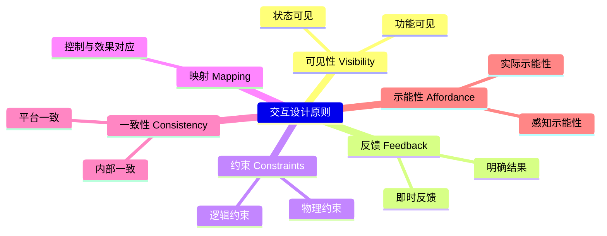
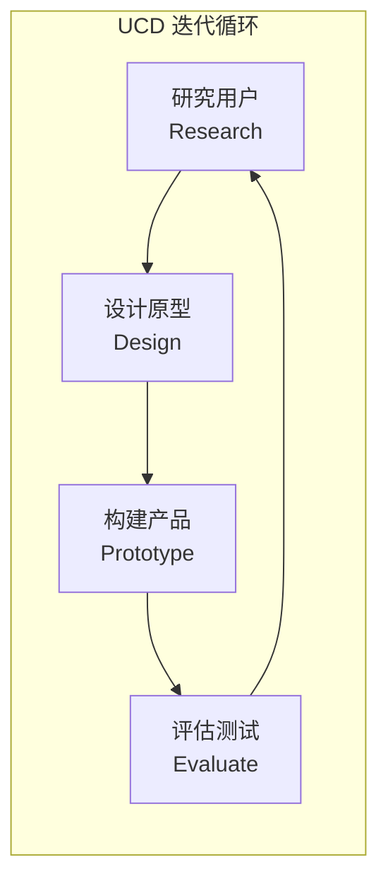

---
aliases:
  - HumanComputerInteraction
  - HCI
  - 人机交互
  - UserExperience
  - UX
tags:
created: 2026-05-17
updated: 2026-05-17
  - '05_ComputerScience'
  - 'HumanComputerInteraction'
  - 'UXDesign'
  - 'InteractionDesign'
---

# 人机交互概述 HCI Overview

人机交互（Human-Computer Interaction, HCI）是研究人与计算机系统之间交互方式的学科，融合计算机科学、认知心理学、人体工程学、设计学和人类学等多学科知识。HCI 的核心目标是设计和评估用户界面（User Interface），使计算机系统更易用、更高效、更安全、更令用户满意。

## 可用性 Usability

可用性（Usability）是 HCI 的核心概念，由国际标准 ISO 9241-11 定义。

### 可用性维度

| 维度 | 定义 | 度量方式 |
|------|------|----------|
| 可学习性 Learnability | 用户首次使用完成任务的难易程度 | 首次任务完成时间 |
| 效率 Efficiency | 熟练用户的操作速度 | 任务完成时间 |
| 可记忆性 Memorability | 间歇使用后恢复操作的容易程度 | 重复使用时错误率 |
| 错误 Errors | 用户的错误频率和严重程度 | 错误次数和恢复时间 |
| 满意度 Satisfaction | 用户的主观感受 | SUS 问卷, NPS 评分 |

系统可用性量表（System Usability Scale, SUS）计算公式：

$$ S = 2.5 \times \sum_{i=1}^{10} (O_i - 1) \quad \text{其中 } O_i \text{ 为第 } i \text{ 题得分} $$

$$ \text{调整后}: \quad S = 2.5 \times \left( \sum_{i=1,3,5,...} (O_i - 1) + \sum_{i=2,4,6,...} (5 - O_i) \right) $$

## 交互设计 Interaction Design

交互设计（Interaction Design, IxD）关注设计交互式数字产品、环境、系统和服务的实践。

### 设计原则 Design Principles

### 交互风格 Interaction Styles

| 风格 | 描述 | 优点 | 缺点 | 示例 |
|------|------|------|------|------|
| 命令行 CLI | 文本指令输入 | 高效，可脚本化 | 学习曲线陡 | Bash, PowerShell |
| 图形界面 GUI | 窗口/图标/菜单/指针 | 直观，所见即所得 | 屏幕空间占用 | Windows, macOS |
| 触摸 Touch | 手势直接操作 | 自然，低学习成本 | 精度有限 | 手机, 平板 |
| 语音 VUI | 自然语言对话 | 解放双手 | 隐私，噪音敏感 | Siri, Alexa |
| 手势 Gesture | 身体动作控制 | 沉浸感 | 识别精度 | Kinect, Leap Motion |
| AR/VR | 虚拟环境交互 | 高沉浸感 | 设备成本 | HoloLens, Meta Quest |

## 以用户为中心的设计 User-Centered Design

UCD 是迭代设计过程，核心是将用户置于开发中心。

## 评估方法 Evaluation Methods

### 可用性测试 Usability Testing

- **形成性评估**（Formative）：在产品开发过程中发现设计问题
- **总结性评估**（Summative）：在产品发布前验证可用性目标

### 专家评估 Expert Evaluation

| 方法 | 评估者 | 依据 | 成本 |
|------|--------|------|------|
| 启发式评估 Heuristic Evaluation | 3-5 名可用性专家 | Nielsen 10 条启发式 | 低 |
| 认知走查 Cognitive Walkthrough | 设计团队 | 用户心理模型 | 中 |
| 多元化走查 Pluralistic Walkthrough | 多角色团队 | 多种视角 | 中 |

Nielsen 10 条可用性启发式（Nielsen's 10 Usability Heuristics）：

1. 系统状态可见性（Visibility of System Status）
2. 系统与现实世界匹配（Match between System and Real World）
3. 用户控制与自由（User Control and Freedom）
4. 一致性与标准（Consistency and Standards）
5. 错误预防（Error Prevention）
6. 识别而非回忆（Recognition rather than Recall）
7. 灵活性与效率（Flexibility and Efficiency of Use）
8. 美学与极简设计（Aesthetic and Minimalist Design）
9. 帮助用户识别、诊断和恢复错误（Help Users Recognize, Diagnose, and Recover from Errors）
10. 帮助与文档（Help and Documentation）

## 可访问性 Accessibility

可访问性（Accessibility / a11y）确保残疾人也能使用产品。

- **WCAG**（Web Content Accessibility Guidelines）：POUR 原则
  - 可感知 Perceivable
  - 可操作 Operable
  - 可理解 Understandable
  - 健壮 Robust
- **辅助技术**：屏幕阅读器（JAWS, NVDA）、语音输入、眼动追踪

## 相关条目

- [[07_InterdisciplinarySciences/CognitiveScience/ArtificialIntelligence|ArtificialIntelligence]]
- [[05_ComputerScience/SoftwareEngineering/SoftwareEngineering|SoftwareEngineering]]
- [[07_InterdisciplinarySciences/DataScience/DataVisualization|DataVisualization]]
- [[05_ComputerScience/HardwareAndEmbeddedSystems/Robotics/Robotics|Robotics]]
- [[05_ComputerScience/EngineeringDevelopment/GameDevelopment/GameDevelopment|GameDevelopment]]

