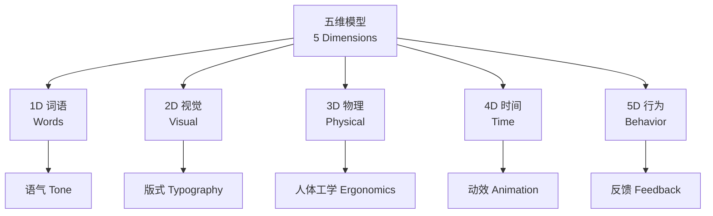
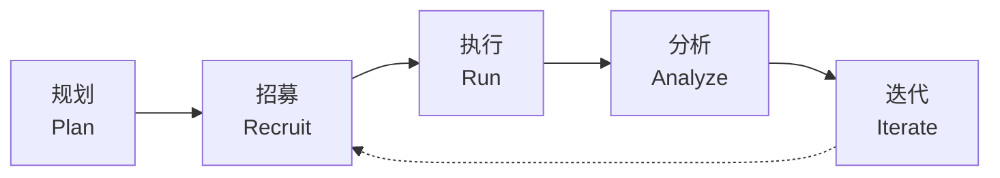

# 交互设计 (Interaction Design)

## 概述 (Overview)

交互设计（Interaction Design, IxD）定义交互式产品的行为与结构。其核心目标是创造满足用户需求且具有愉悦感的体验。交互设计涵盖从物理按钮到屏幕手势、从语音指令到脑机接口的多种交互模态。

> 交互设计是"设计可供性"——让物品"告诉"用户如何使用它。

## 五维模型 (5 Dimensions)

Richard Buchanan 和 Gillian Crampton Smith 提出交互设计的五维模型：

| 维度 | 英文 | 描述 | 设计考量 |
|------|------|------|----------|
| 1D 词语 | Words | 界面中的文本标签、提示、说明 | 语气、长度、阅读层级 |
| 2D 视觉表现 | Visual Representation | 图形、图标、版式、色彩 | 视觉层次、品牌一致性 |
| 3D 物理对象/空间 | Physical Objects/Space | 设备外形、触感、空间布局 | 人体工学、环境适配 |
| 4D 时间 | Time | 动画、过渡、响应延迟 | 反馈时机、动效曲线 |
| 5D 行为 | Behavior | 操作反馈、系统响应、错误恢复 | 容错性、可预测性 |



## 设计思维 (Design Thinking)

设计思维是以人为中心的迭代问题解决方法，包含五个阶段：

1. **共情 (Empathize)** — 观察用户行为、访谈、沉浸式体验
2. **定义 (Define)** — 合成洞察，形成问题陈述（Problem Statement）
3. **构思 (Ideate)** — 头脑风暴、草图、逆向思维
4. **原型 (Prototype)** — 低保真到高保真原型迭代
5. **测试 (Test)** — 可用性测试、A/B 测试、启发式评估

### 低保真原型 (Low-Fidelity Prototyping)

- **纸质原型 (Paper Prototyping)**：快速验证布局与流程
- **线框图 (Wireframing)**：忽略视觉细节，专注信息架构
- **可点击原型 (Clickable Prototype)**：使用 Figma、Axure 等工具

### 高保真原型 (High-Fidelity Prototyping)

高保真原型接近最终产品，用于用户测试和利益相关者演示。常见工具包括：

```
Figma / Sketch / Adobe XD → 界面设计
ProtoPie / Principle     → 微交互与动效
Framer                   → 代码级原型
```

## 可供性 (Affordance)

James J. Gibson 提出"可供性"概念，Don Norman 将其引入设计领域。

| 类型 | 英文 | 定义 | 示例 |
|------|------|------|------|
| 显性可供性 | Explicit Affordance | 视觉上明确提示可操作 | 凸起的按钮暗示"可按" |
| 隐形可供性 | Hidden Affordance | 需探索或学习才能发现 | 长按图标呼出快捷菜单 |
| 模式可供性 | Pattern Affordance | 遵循已有设计惯例 | 蓝色下划线文字→可点击链接 |
| 否定可供性 | False Affordance | 视觉暗示与实际功能不符 | 看起来像按钮的装饰元素 |

### Norman 设计原则

1. **示能性 (Signifier)** — 指示如何操作的信号
2. **映射 (Mapping)** — 控件与结果的关系应自然直观
3. **反馈 (Feedback)** — 操作后即时且信息丰富的回应
4. **约束 (Constraints)** — 限制非法操作，引导正确使用
5. **概念模型 (Conceptual Model)** — 用户对系统如何工作的心理模型

## 用户测试 (User Testing)

### 可用性测试方法

$$
\text{可用性} = \frac{\text{任务完成率} \times \text{效率}}{\text{错误率} \times \text{满意度}}
$$



### 启发式评估 (Heuristic Evaluation)

Nielsen 10 条启发式原则：

1. 系统状态可见性 (Visibility of System Status)
2. 系统与现实世界的匹配 (Match Between System and the Real World)
3. 用户控制与自由 (User Control and Freedom)
4. 一致性与标准 (Consistency and Standards)
5. 错误预防 (Error Prevention)
6. 识别而非回忆 (Recognition Rather Than Recall)
7. 灵活性与效率 (Flexibility and Efficiency of Use)
8. 美学与简约设计 (Aesthetic and Minimalist Design)
9. 帮助用户识别、诊断和恢复错误 (Help Users Recognize, Diagnose, and Recover from Errors)
10. 帮助与文档 (Help and Documentation)

## 交互模式 (Interaction Patterns)

### 导航模式

- **标签式导航 (Tab Bar)** — iOS 标准底部导航
- **抽屉式导航 (Drawer / Hamburger Menu)** — 节省屏幕空间
- **分页导航 (Pagination)** — 多页内容线性浏览
- **手势导航 (Gesture Navigation)** — 滑动手势切换视图

### 输入模式

| 模式 | 适用场景 | 优缺点 |
|------|----------|--------|
| 表单输入 | 注册、设置 | 精确但耗时 |
| 语音输入 | 搜索、命令 | 快速但易受环境干扰 |
| 手势操作 | 画布、游戏 | 直觉但不易发现 |
| 扫描/OCR | 文档录入 | 高效但需后处理校验 |

## 微交互 (Microinteractions)

微交互是完成单一任务的小功能单元，包含四个结构要素：

1. **触发器 (Trigger)** — 用户或系统发起
2. **规则 (Rules)** — 定义如何响应
3. **反馈 (Feedback)** — 告知用户发生了什么
4. **循环与模式 (Loops & Modes)** — 元规则与特殊情况

> 优秀的微交互使产品"活"起来——开关的弹性动画、点赞的心跳效果、加载时的趣味徽标，都是微交互的体现。

## 参考文献 (References)

- Norman, D. (2013). *The Design of Everyday Things*. Basic Books.
- Cooper, A., Reimann, R., Cronin, D., & Noessel, C. (2014). *About Face: The Essentials of Interaction Design*. Wiley.
- Nielsen, J. (1994). *Usability Engineering*. Morgan Kaufmann.
- Saffer, D. (2010). *Designing for Interaction*. New Riders.
