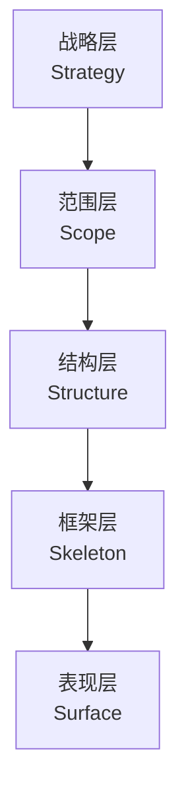
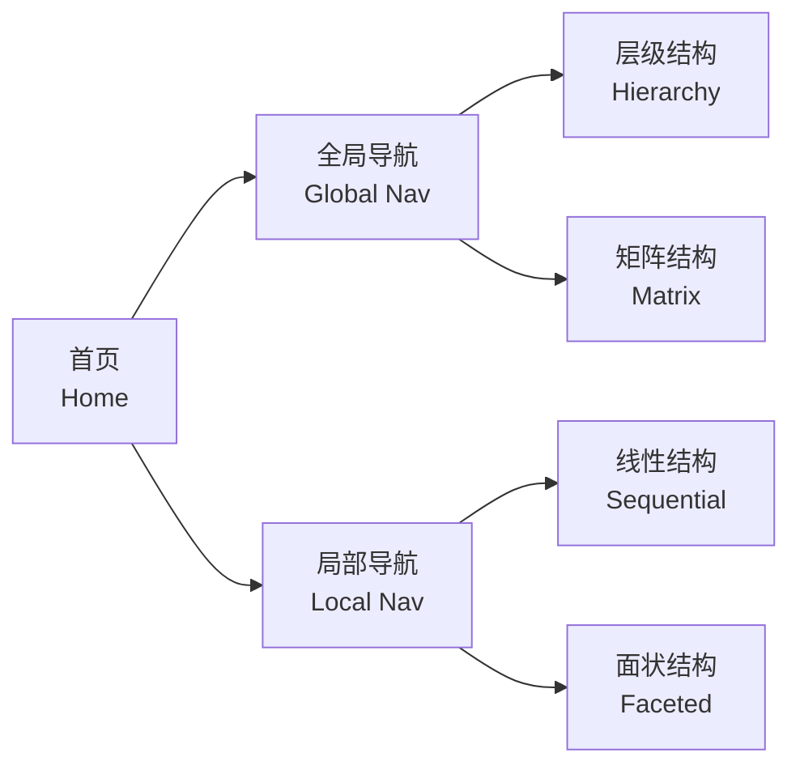

# 用户体验 (User Experience)

用户体验（User Experience, UX）是指用户在使用产品、系统或服务过程中的整体感知与情感反应。它涵盖了从需求分析到界面交互的完整设计流程，旨在创造高效、愉悦且有意义的使用经历。

## 核心概念与定义

用户体验设计以用户为中心（User-Centered Design），强调在产品的每一个生命周期阶段都融入用户视角。根据 ISO 9241-210 的定义，用户体验是「用户与系统交互过程中的所有认知与情感反应的总和」。

### UX 的五大要素

杰西·詹姆斯·加勒特（Jesse James Garrett）提出了经典的五层模型：

- **战略层（Strategy）**：用户需求与商业目标的平衡
- **范围层（Scope）**：功能规格与内容需求的定义
- **结构层（Structure）**：信息架构与交互设计的构建
- **框架层（Skeleton）**：界面布局与导航元素的排布
- **表现层（Surface）**：视觉设计与品牌传达的呈现

## 可用性 (Usability)

可用性是衡量产品易用程度的核心指标，通常由以下五个维度评估：

| 维度 | 英文术语 | 核心含义 |
|------|----------|----------|
| 易学性 | Learnability | 用户首次使用即可快速上手 |
| 效率 | Efficiency | 熟练用户完成任务的速度 |
| 可记忆性 | Memorability | 间隔一段时间后重新使用的难易度 |
| 容错性 | Error Tolerance | 预防与恢复用户错误的能力 |
| 满意度 | Satisfaction | 主观使用感受的愉悦程度 |

可用性测试（Usability Testing）通常采用启发式评估（Heuristic Evaluation）与认知走查（Cognitive Walkthrough）两种经典方法。雅各布·尼尔森（Jakob Nielsen）提出的十大可用性原则至今仍是界面设计的重要参考框架。

### 系统可用性量表 (SUS)

SUS（System Usability Scale）是最广泛使用的可用性量化工具，包含 10 个 Likert 量表题目。最终得分范围为 0–100，计算公式如下：

$$
SUS = 2.5 \times \left(20 + \sum_{i=1}^{10} (-1)^{i+1} \cdot s_i\right)
$$

其中奇数项为正向题，偶数项为反向题。得分超过 68 通常被视为高于平均水平。

## 用户研究 (User Research)

用户研究是 UX 设计的基石，分为定性研究与定量研究两大类别。

### 研究方法分类

| 类型 | 方法 | 适用阶段 |
|------|------|----------|
| 定性 | 用户访谈、焦点小组、民族志观察 | 需求探索 |
| 定量 | 问卷调查、A/B 测试、日志分析 | 验证假设 |
| 混合 | 日记研究、卡片分类、眼动追踪 | 迭代优化 |

用户画像（Persona）是将研究数据聚合而成的典型用户模型，通常包含人口统计信息、行为模式、目标与痛点。同理心地图（Empathy Map）则帮助团队从说、想、做、感四个维度深入理解用户。

### 卡片分类法 (Card Sorting)

卡片分类是构建信息架构的有效手段，参与者将主题卡片分组并命名，从而揭示用户的心理模型。分为开放式（Open）与封闭式（Closed）两种变体：

- **开放式卡片分类**：由用户自主创建类别
- **封闭式卡片分类**：将卡片归入预设类别

## 信息架构 (Information Architecture)

信息架构（IA）关注内容的组织、标注、导航与搜索系统，旨在帮助用户高效地找到所需信息。

### 常见导航结构

网站蓝图（Sitemap）与线框图（Wireframe）是信息架构可视化的核心交付物。层级深度通常遵循「三次点击法则」（Three-Click Rule），即任何页面应在三次点击内可达。

## 交互设计 (Interaction Design)

交互设计聚焦于用户与产品之间的对话机制，涉及行为设计、反馈机制与状态转换。

### 设计原则

- **一致性（Consistency）**：相似操作产生相似结果
- **反馈（Feedback）**：系统状态对用户可见
- **约束（Constraints）**：限制不当操作的可能性
- **映射（Mapping）**：控制与效果之间的自然对应
- **示能（Affordance）**：对象本身暗示其使用方式

微交互（Microinteraction）是交互设计的精细化表达，涵盖触发器（Trigger）、规则（Rules）、反馈（Feedback）与循环（Loops）四个组成部分。

## 无障碍设计 (Accessibility)

无障碍设计确保残障人士也能平等地使用数字产品，遵循 WCAG（Web Content Accessibility Guidelines）2.1 标准。

### WCAG 四大原则 (POUR)

| 原则 | 英文 | 核心要求 |
|------|------|----------|
| 可感知 | Perceivable | 信息能以多种感官通道获取 |
| 可操作 | Operable | 界面元素可被各种输入方式控制 |
| 可理解 | Understandable | 内容与操作逻辑清晰明确 |
| 健壮性 | Robust | 兼容辅助技术与未来标准 |

色彩对比度需满足 WCAG AA 标准，即正文文本与背景的对比度至少为 4.5:1。数学表达式为：

$$
\text{Contrast Ratio} = \frac{L_1 + 0.05}{L_2 + 0.05}
$$

其中 $L$ 为相对亮度，由 RGB 值计算得出。

## 设计系统与设计工具

现代 UX 设计高度依赖设计系统（Design System），它将颜色、字体、组件与模式标准化，确保跨产品的一致性。

### 主流设计工具

| 工具 | 核心优势 | 协作能力 |
|------|----------|----------|
| Figma | 实时协作与原型设计 | ★★★★★ |
| Sketch | 丰富的插件生态 | ★★★★☆ |
| Adobe XD | 与 Creative Cloud 集成 | ★★★★☆ |
| Axure RP | 高保真交互原型 | ★★★☆☆ |

用户体验领域仍在持续演化，从早期的以功能为中心，到情感化设计（Emotional Design），再到如今的服务设计（Service Design）与系统思维（Systems Thinking），其边界不断拓展，但其核心始终不变——以人为本。
