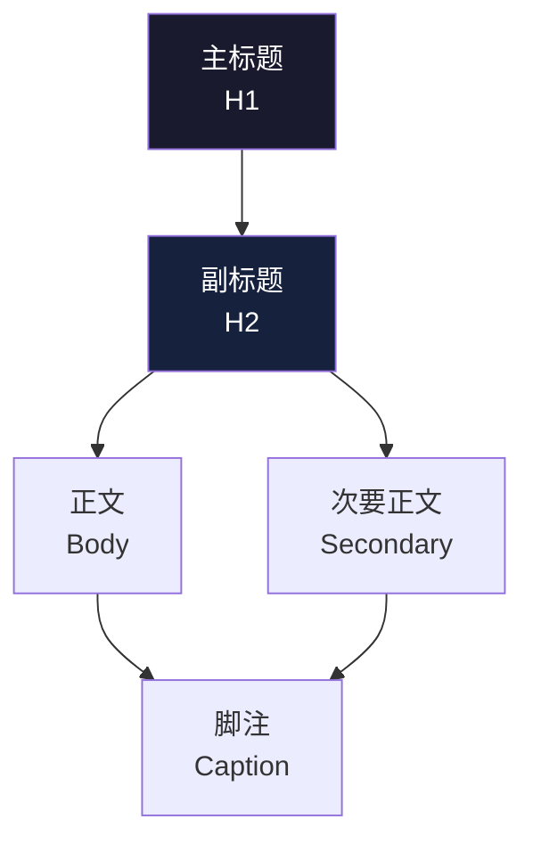
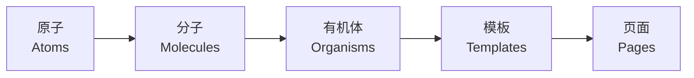

# 用户界面设计 (User Interface Design)

## 概述 (Overview)

用户界面设计（User Interface Design, UI Design）关注产品视觉层与交互层的呈现。UI 设计师负责将信息架构与交互逻辑转化为直观、美观且一致的视觉界面。优秀的 UI 设计降低认知负荷，提升任务效率，并创造品牌识别度。

## 视觉层次 (Visual Hierarchy)

视觉层次组织界面元素以反映其重要性，引导用户的浏览路径。

### 建立层次的技术

1. **尺寸 (Size)** — 重要元素更大、更突出
2. **色彩 (Color)** — 高对比色彩吸引注意力
3. **对比 (Contrast)** — 通过明暗、饱和度差异区分层级
4. **间距 (Spacing)** — 邻近性（Law of Proximity）分组相关元素
5. **对齐 (Alignment)** — 一致的对齐形成秩序感
6. **重复 (Repetition)** — 相似样式表示同类功能



### 格式塔原则 (Gestalt Principles)

| 原则 | 英文 | 说明 |
|------|------|------|
| 邻近性 | Proximity | 靠近的元素被视为一组 |
| 相似性 | Similarity | 外观相似的元素功能相关 |
| 闭合性 | Closure | 大脑自动补全不完整的图形 |
| 连续性 | Continuity | 沿直线或曲线排列的元素被视为整体 |
| 图形-背景 | Figure-Ground | 将注意力集中在"图形"而非"背景" |

## 版式设计 (Typography)

### 字体系列分类

- **衬线体 (Serif)** — 宋体、Times New Roman — 传统、权威、正文印刷
- **无衬线体 (Sans-Serif)** — 微软雅黑、Helvetica — 现代、干净、屏幕显示
- **等宽字体 (Monospace)** — Consolas、Source Code Pro — 代码、表格数据
- **手写体 (Script)** — 装饰性使用，避免长段落

### 排版度量

$$
\text{行高 (Line-height)} \approx \text{字号 (Font-size)} \times 1.5 \sim 1.8
$$
$$
\text{行长 (Measure)} \approx 45 \sim 75 \text{ 字符（英文）}
$$

### 层级系统比率

常用的字体比例 Scale：

```text
H1: 32px / 2rem   →  极重要标题
H2: 24px / 1.5rem →  章节标题
H3: 20px / 1.25rem → 分组标题
H4: 16px / 1rem    →  卡片标题
Body: 14-16px       →  正文阅读
Caption: 12px       →  辅助文字
```

## 色彩系统 (Color Systems)

### 色彩模型

| 模型 | 全称 | 用途 |
|------|------|------|
| RGB | Red-Green-Blue | 屏幕显示（加色模型） |
| CMYK | Cyan-Magenta-Yellow-Key | 印刷（减色模型） |
| HSL | Hue-Saturation-Lightness | 设计师直觉调色 |
| HSV | Hue-Saturation-Value | 色彩选取器 |

### 设计系统色彩分层

```
Primary Brand   →  品牌主色 (#1890FF)
Secondary       →  辅助色 (#52C41A)
Neutral         →  中性色 (#000-#FFF, 灰度渐变)
Danger          →  危险/错误 (#FF4D4F)
Warning         →  警告 (#FAAD14)
Success         →  成功 (#52C41A)
Info            →  信息 (#1890FF)
```

### 无障碍对比

WCAG AA 标准要求：

$$
\text{正常文本对比度} \geq 4.5:1
$$
$$
\text{大文本对比度} \geq 3:1
$$

## 布局系统 (Layout Systems)

### 网格系统 (Grid System)

网页与移动端常用的网格类型：

- **固定网格 (Fixed Grid)** — 列宽固定，居中布局
- **流体网格 (Fluid Grid)** — 使用百分比宽度
- **响应式网格 (Responsive Grid)** — 断点 Breakpoints 切换列数

Bootstrap 12 列网格示例：

```text
| col-2 | col-2 | col-2 | col-2 | col-2 | col-2 |
| col-6             | col-6             |
| col-4       | col-4       | col-4       |
```

### 间距与盒模型

常⻅的间距 Scale (4px 基准)：

```text
4px  (1×)   →  极细微间距
8px  (2×)   →  内边距 / 小间隔
16px (4×)   →  元素间距
24px (6×)   →  卡片边距
32px (8×)   →  区块间距
48px (12×)  →  大区块间距
```

## 组件库 (Component Libraries)

### 原子设计方法论 (Atomic Design)

Brad Frost 提出的五级设计体系：



| 层级 | 定义 | 示例 |
|------|------|------|
| 原子 | 最小不可分割元素 | 按钮、输入框、图标、颜色 |
| 分子 | 原子组合成功能单元 | 搜索栏（输入框 + 按钮） |
| 有机体 | 分子组成复杂区块 | 导航栏、表单卡片、文章列表 |
| 模板 | 有机体的页面布局 | 首页模板、文章详情模板 |
| 页面 | 具体内容填充的模板 | 实际数据的首页 |

### 主流组件库

| 库 | 框架 | 特点 |
|----|------|------|
| Ant Design | React | 企业级、中后台、国际化 |
| Material Design | 跨平台 | Google 设计语言、动效丰富 |
| Element Plus | Vue | 简洁、文档优秀 |
| Shadcn/ui | React | 可定制、Tailwind CSS |
| Fluent UI | React | Microsoft 风格 |

## 响应式设计 (Responsive Design)

### 断点 (Breakpoints)

```text
Extra Small:  <576px   手机竖屏
Small:        576-768px  手机横屏
Medium:       768-992px  平板竖屏
Large:        992-1200px 平板横屏/小桌面
Extra Large:  >1200px    大桌面
```

### 实现策略

1. **移动优先 (Mobile First)** — 从小屏开始设计，逐步增强
2. **渐进增强 (Progressive Enhancement)** — 基础体验 + 高级功能
3. **优雅降级 (Graceful Degradation)** — 全功能 → 兼容方案

## 设计工具与交付 (Tools & Handoff)

### 设计工具

- **Figma** — 协作设计、组件库、原型、开发者标注
- **Sketch** — macOS 原生、符号系统、插件生态
- **Adobe XD** — Adobe 生态、自动动画、语音原型

### 开发者交付

设计稿输出物通常包括：

1. **设计规格 (Design Spec)** — 尺寸、间距、色彩数值
2. **切图资源 (Assets)** — 图标、图片、@2x/@3x 资源
3. **动效参数 (Motion Spec)** — 缓动曲线、持续时长
4. **状态映射 (State Map)** — 默认、悬浮、点击、禁用、加载、空状态

## 参考文献 (References)

- Krug, S. (2014). *Don't Make Me Think*. New Riders.
- Lidwell, W., Holden, K., & Butler, J. (2010). *Universal Principles of Design*. Rockport.
- Brown, D. M. (2010). *Communicating Design*. New Riders.
- Frost, B. (2016). *Atomic Design*. Brad Frost Web.
- Wroblewski, L. (2011). *Mobile First*. A Book Apart.
