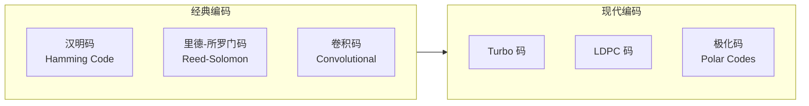

---
aliases:
  - 信息论
  - Information Theory
  - Shannon
  - 香农
tags:
created: 2026-05-17
updated: 2026-05-17
  - information-theory
  - entropy
  - coding
  - compression
  - communication
---

# 信息论 (Information Theory)

## 什么是信息论 (What Is Information Theory)

信息论是克劳德·香农 (Claude Shannon) 于 1948 年创立的一门应用数学学科，研究信息的**量化**、**存储**和**通信**。它奠定了现代数字通信和压缩技术的基础。

## 核心概念 (Core Concepts)

### 信息熵 (Entropy)

熵衡量一个随机变量的不确定性。对于一个离散随机变量 $X$，其熵定义为：

$$
H(X) = -\sum_{i} p(x_i) \log_2 p(x_i)
$$

单位是 **比特 (bits)**。

| $p(x)$ | $-\log_2 p(x)$ | 信息量 (bits) |
|---|---|---|
| 1.0 (确定事件) | 0 | 0 |
| 0.5 (抛硬币) | 1 | 1 |
| 0.125 (掷出特定面) | 3 | 3 |

### 联合熵与条件熵 (Joint & Conditional Entropy)

联合熵 (Joint Entropy):

$$
H(X, Y) = -\sum_{x \in X} \sum_{y \in Y} p(x, y) \log_2 p(x, y)
$$

条件熵 (Conditional Entropy):

$$
H(Y|X) = \sum_{x \in X} p(x) H(Y|X = x)
$$

### 互信息 (Mutual Information)

互信息衡量两个随机变量之间的依赖程度：

$$
I(X; Y) = H(X) - H(X|Y) = H(Y) - H(Y|X)
$$

```mermaid
graph TD
    subgraph Entropy[熵的关系]
        HX[H(X)<br/>X 的熵] --- HY[H(Y)<br/>Y 的熵]
        HX --- MI[I(X;Y)<br/>互信息]
        MI --- HY
        HX_GIVEN[H(X|Y)<br/>条件熵] --- HX
        HY_GIVEN[H(Y|X)<br/>条件熵] --- HY
    end
```

### KL 散度 (Kullback-Leibler Divergence)

KL 散度衡量两个概率分布 $P$ 和 $Q$ 之间的差异：

$$
D_{KL}(P || Q) = \sum_{x} P(x) \log \frac{P(x)}{Q(x)}
$$

注意：KL 散度不对称，且非负。

## 信道容量 (Channel Capacity)

### 定义 (Definition)

信道容量是信道上能够可靠传输的最大信息速率：

$$
C = \max_{p(x)} I(X; Y)
$$

### 常见信道模型

| 信道模型 (Channel Model) | 描述 (Description) | 容量 (Capacity) |
|---|---|---|
| BSC (Binary Symmetric Channel) | 对称二进制信道，错误概率 $p$ | $1 - H(p)$ |
| BEC (Binary Erasure Channel) | 二进制擦除信道，擦除概率 $e$ | $1 - e$ |
| AWGN (Additive White Gaussian Noise) | 加性高斯白噪声信道 | $\frac{1}{2} \log_2(1 + \text{SNR})$ |

### 香农公式 (Shannon-Hartley Theorem)

对于 AWGN 信道：

$$
C = B \log_2\left(1 + \frac{S}{N}\right)
$$

其中 $B$ 是带宽，$S/N$ 是信噪比 (SNR)。

## 信源编码 (Source Coding)

### 无损压缩 (Lossless Compression)

**香农第一定理 (Shannon's Source Coding Theorem)**：无损压缩的极限是信源的熵 $H(X)$。

| 算法 (Algorithm) | 类型 (Type) | 特点 (Characteristics) |
|---|---|---|
| Huffman 编码 | 变长编码 | 最优前缀码，最小编码长度 |
| 算术编码 (Arithmetic Coding) | 变长编码 | 接近熵极限 |
| LZ77 / LZ78 | 字典编码 | 适合通用文本压缩 |
| LZW | 字典编码 | GIF 格式基础 |

### 有损压缩 (Lossy Compression)

**率失真理论 (Rate-Distortion Theory)**：在给定失真 $D$ 下，最小所需码率 $R(D)$。

$$
R(D) = \min_{p(\hat{x}|x): \mathbb{E}[d(x, \hat{x})] \leq D} I(X; \hat{X})
$$

| 应用 (Application) | 标准 (Standard) | 压缩比 (Ratio) |
|---|---|---|
| 图像压缩 | JPEG | 10:1 ~ 20:1 |
| 视频压缩 | H.264 / H.265 | 50:1 ~ 200:1 |
| 音频压缩 | MP3 / AAC | 6:1 ~ 12:1 |

## 信道编码 (Channel Coding)

### 香农第二定理 (Channel Coding Theorem)

对于容量为 $C$ 的信道，若码率 $R < C$，则存在编码使得错误概率任意小。

### 编码类型



| 编码 (Code) | 特点 | 应用 |
|---|---|---|
| 汉明码 (7,4) | 单比特纠错 | 早期内存 ECC |
| 卷积码 | 兼顾效率和复杂度 | 卫星通信 |
| Turbo 码 | 接近香农极限 | 3G/4G 移动通信 |
| LDPC 码 | 高性能、可并行 | Wi-Fi 6, 5G |
| Polar 码 | 香农极限可达 | 5G 控制信道 |

## 率失真理论 (Rate-Distortion Theory)

对于高斯信源，率失真函数为：

$$
R(D) = \frac{1}{2} \log_2 \frac{\sigma^2}{D}, \quad 0 \leq D \leq \sigma^2
$$

其中 $\sigma^2$ 是方差，$D$ 是均方误差失真。

## 应用领域 (Applications)

| 领域 (Field) | 应用 (Application) | 信息论概念 |
|---|---|---|
| 通信 | 信道编码、调制 | 信道容量、互信息 |
| 数据压缩 | ZIP, JPEG, MP3 | 熵、率失真 |
| 机器学习 | 特征选择、模型评估 | 互信息、KL 散度 |
| 密码学 | 完美保密 | 互信息为 0 |
| 自然语言处理 | 语言模型、翻译 | 熵、交叉熵 |
| 生物信息学 | 序列分析 | 熵、互信息 |

## 信息论与机器学习 (Information Theory in ML)

### 交叉熵损失 (Cross-Entropy Loss)

$$
H(P, Q) = -\sum_{x} P(x) \log Q(x) = H(P) + D_{KL}(P || Q)
$$

### 互信息在特征选择中的应用

$$
\text{MI}(X, Y) = \iint p(x, y) \log \frac{p(x, y)}{p(x)p(y)} \, dx \, dy
$$

### 信息瓶颈原理 (Information Bottleneck)

$$
\min_{p(t|x)} I(X; T) - \beta I(T; Y)
$$

## 参考资源 (References)

- Shannon, C. E. (1948). "A Mathematical Theory of Communication"
- Cover, T. & Thomas, J. "Elements of Information Theory"
- MacKay, D. "Information Theory, Inference, and Learning Algorithms"

---

> 信息论不仅是通信的数学基础，更是理解智能系统的重要工具。
