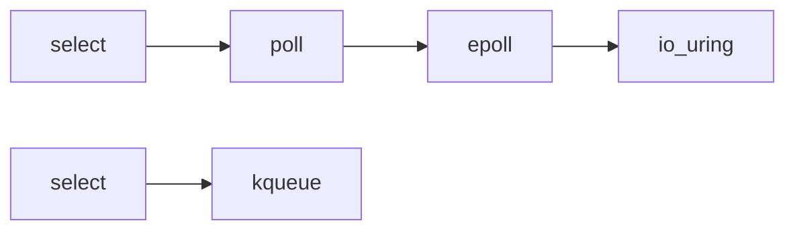

---
aliases: [AsyncIO, 异步IO, epoll, io_uring, Reactor模式]
tags: ['05_ComputerScience', 'OperatingSystems', 'AsyncIO', 'SystemsProgramming']
created: 2026-06-27
updated: 2026-06-27
---

# 异步 I/O (Asynchronous I/O)

## 一、概述

异步 I/O 是现代高并发系统的基础。本文档涵盖操作系统级别的 I/O 多路复用技术：epoll、kqueue、io_uring 以及 Reactor/Proactor 模式。

### 1.1 I/O 模型对比

| 模型 | 描述 | 性能 | 复杂度 |
|------|------|------|--------|
| **阻塞 I/O** | 线程等待 I/O 完成 | 低 | 低 |
| **非阻塞 I/O** | 轮询检查 I/O 状态 | 中 | 中 |
| **I/O 多路复用** | 一个线程监控多个 I/O | 高 | 中 |
| **异步 I/O** | 内核完成 I/O 后通知 | 最高 | 高 |
| **信号驱动 I/O** | I/O 就绪时发送信号 | 高 | 高 |

### 1.2 I/O 多路复用演进



---

## 二、select/poll

### 2.1 select

```c
#include <sys/select.h>

// select: 监控文件描述符集合
fd_set read_fds;
FD_ZERO(&read_fds);
FD_SET(sockfd, &read_fds);

// select(max_fd + 1, &read_fds, NULL, NULL, &timeout)
int ready = select(sockfd + 1, &read_fds, NULL, NULL, &timeout);

if (ready > 0) {
    if (FD_ISSET(sockfd, &read_fds)) {
        // sockfd 可读
        char buffer[1024];
        recv(sockfd, buffer, sizeof(buffer), 0);
    }
}
```

**select 限制**：
- 最大文件描述符数：FD_SETSIZE（通常 1024）
- 每次调用需要复制 fd_set 到内核
- 需要遍历所有 fd 检查就绪状态

### 2.2 poll

```c
#include <poll.h>

// poll: 使用 pollfd 数组
struct pollfd fds[2];
fds[0].fd = sockfd1;
fds[0].events = POLLIN;
fds[1].fd = sockfd2;
fds[1].events = POLLIN;

int ready = poll(fds, 2, timeout);

for (int i = 0; i < 2; i++) {
    if (fds[i].revents & POLLIN) {
        // fds[i].fd 可读
    }
}
```

**poll 改进**：
- 无文件描述符数量限制
- 使用 pollfd 数组，无需每次复制

---

## 三、epoll

### 3.1 epoll 核心 API

```c
#include <sys/epoll.h>

// 1. 创建 epoll 实例
int epfd = epoll_create1(0);

// 2. 添加文件描述符
struct epoll_event ev;
ev.events = EPOLLIN | EPOLLET;  // 边缘触发
ev.data.fd = sockfd;
epoll_ctl(epfd, EPOLL_CTL_ADD, sockfd, &ev);

// 3. 等待事件
struct epoll_event events[MAX_EVENTS];
int nfds = epoll_wait(epfd, events, MAX_EVENTS, timeout);

// 4. 处理事件
for (int i = 0; i < nfds; i++) {
    if (events[i].events & EPOLLIN) {
        // events[i].data.fd 可读
    }
}

// 5. 删除文件描述符
epoll_ctl(epfd, EPOLL_CTL_DEL, sockfd, NULL);

// 6. 关闭 epoll
close(epfd);
```

### 3.2 epoll 事件类型

| 事件 | 描述 |
|------|------|
| **EPOLLIN** | 可读 |
| **EPOLLOUT** | 可写 |
| **EPOLLET** | 边缘触发模式 |
| **EPOLLONESHOT** | 单次触发 |
| **EPOLLRDHUP** | 对端关闭连接 |
| **EPOLLERR** | 错误 |
| **EPOLLHUP** | 挂起 |

### 3.3 水平触发 vs 边缘触发

```c
// 水平触发（LT）- 默认
// 只要缓冲区有数据就会持续触发
ev.events = EPOLLIN;

// 边缘触发（ET）
// 仅在状态变化时触发一次，需要一次性读完所有数据
ev.events = EPOLLIN | EPOLLET;

// 边缘触发读取
void handle_read(int fd) {
    char buffer[4096];
    while (1) {
        ssize_t n = read(fd, buffer, sizeof(buffer));
        if (n <= 0) {
            if (n == 0) {
                // 连接关闭
                close(fd);
            } else if (errno == EAGAIN) {
                // 数据读完
                break;
            } else {
                // 错误
                perror("read");
                close(fd);
            }
            break;
        }
        // 处理数据
        process_data(buffer, n);
    }
}
```

### 3.4 epoll 完整示例

```c
#include <stdio.h>
#include <stdlib.h>
#include <string.h>
#include <unistd.h>
#include <sys/socket.h>
#include <sys/epoll.h>
#include <netinet/in.h>
#include <fcntl.h>

#define MAX_EVENTS 1024
#define BUFFER_SIZE 4096

void set_nonblocking(int fd) {
    int flags = fcntl(fd, F_GETFL, 0);
    fcntl(fd, F_SETFL, flags | O_NONBLOCK);
}

int main() {
    // 创建监听 socket
    int listenfd = socket(AF_INET, SOCK_STREAM, 0);
    set_nonblocking(listenfd);
    
    struct sockaddr_in addr;
    addr.sin_family = AF_INET;
    addr.sin_addr.s_addr = INADDR_ANY;
    addr.sin_port = htons(8080);
    
    bind(listenfd, (struct sockaddr*)&addr, sizeof(addr));
    listen(listenfd, SOMAXCONN);
    
    // 创建 epoll
    int epfd = epoll_create1(0);
    
    struct epoll_event ev;
    ev.events = EPOLLIN;
    ev.data.fd = listenfd;
    epoll_ctl(epfd, EPOLL_CTL_ADD, listenfd, &ev);
    
    struct epoll_event events[MAX_EVENTS];
    
    while (1) {
        int nfds = epoll_wait(epfd, events, MAX_EVENTS, -1);
        
        for (int i = 0; i < nfds; i++) {
            if (events[i].data.fd == listenfd) {
                // 新连接
                int connfd = accept(listenfd, NULL, NULL);
                set_nonblocking(connfd);
                
                ev.events = EPOLLIN | EPOLLET;
                ev.data.fd = connfd;
                epoll_ctl(epfd, EPOLL_CTL_ADD, connfd, &ev);
            } else {
                // 数据可读
                int fd = events[i].data.fd;
                char buffer[BUFFER_SIZE];
                
                while (1) {
                    ssize_t n = read(fd, buffer, sizeof(buffer));
                    if (n <= 0) {
                        if (n == 0 || errno != EAGAIN) {
                            epoll_ctl(epfd, EPOLL_CTL_DEL, fd, NULL);
                            close(fd);
                        }
                        break;
                    }
                    write(fd, buffer, n);  // Echo
                }
            }
        }
    }
    
    close(epfd);
    close(listenfd);
    return 0;
}
```

---

## 四、kqueue（macOS/BSD）

### 4.1 kqueue API

```c
#include <sys/event.h>

// 创建 kqueue
int kq = kqueue();

// 创建事件
struct kevent changes[2];
EV_SET(&changes[0], sockfd, EVFILT_READ, EV_ADD, 0, 0, NULL);
EV_SET(&changes[1], sockfd, EVFILT_WRITE, EV_ADD, 0, 0, NULL);

// 等待事件
struct kevent events[MAX_EVENTS];
int nev = kevent(kq, changes, 2, events, MAX_EVENTS, NULL);

// 处理事件
for (int i = 0; i < nev; i++) {
    if (events[i].filter == EVFILT_READ) {
        // 可读
    } else if (events[i].filter == EVFILT_WRITE) {
        // 可写
    }
}
```

---

## 五、io_uring（Linux 5.1+）

### 5.1 io_uring 核心概念

```c
#include <liburing.h>

// 创建 io_uring 实例
struct io_uring ring;
io_uring_queue_init(256, &ring, 0);

// 提交读请求
struct io_uring_sqe *sqe = io_uring_get_sqe(&ring);
io_uring_prep_read(sqe, fd, buffer, buffer_size, offset);
io_uring_sqe_set_data(sqe, context);

// 提交
io_uring_submit(&ring);

// 等待完成
struct io_uring_cqe *cqe;
io_uring_wait_cqe(&ring, &cqe);

// 处理完成事件
int result = cqe->res;
void *context = io_uring_cqe_get_data(cqe);

// 标记完成
io_uring_cqe_seen(&ring, cqe);
```

### 5.2 io_uring 特性

| 特性 | 描述 |
|------|------|
| **零拷贝** | 减少数据拷贝 |
| **批量提交** | 一次系统调用提交多个请求 |
| **轮询模式** | 避免系统调用开销 |
| **注册文件** | 减少文件描述符查找 |

### 5.3 io_uring 完整示例

```c
#include <liburing.h>
#include <fcntl.h>
#include <string.h>
#include <unistd.h>

#define QUEUE_DEPTH 256
#define BUFFER_SIZE 4096

struct request {
    int fd;
    char buffer[BUFFER_SIZE];
    struct iovec iov;
};

int main() {
    struct io_uring ring;
    io_uring_queue_init(QUEUE_DEPTH, &ring, 0);
    
    // 打开文件
    int fd = open("test.txt", O_RDONLY);
    
    // 创建请求
    struct request req;
    req.fd = fd;
    req.iov.iov_base = req.buffer;
    req.iov.iov_len = BUFFER_SIZE;
    
    // 提交读请求
    struct io_uring_sqe *sqe = io_uring_get_sqe(&ring);
    io_uring_prep_readv(sqe, fd, &req.iov, 1, 0);
    io_uring_sqe_set_data(sqe, &req);
    io_uring_submit(&ring);
    
    // 等待完成
    struct io_uring_cqe *cqe;
    io_uring_wait_cqe(&ring, &cqe);
    
    if (cqe->res >= 0) {
        printf("Read %d bytes: %.*s\n", cqe->res, cqe->res, req.buffer);
    }
    
    io_uring_cqe_seen(&ring, cqe);
    
    close(fd);
    io_uring_queue_exit(&ring);
    
    return 0;
}
```

---

## 六、Reactor 模式

### 6.1 Reactor 模式实现

```python
import selectors
import socket

class Reactor:
    def __init__(self):
        self.selector = selectors.DefaultSelector()
        self.handlers = {}
    
    def register(self, fd, event, handler):
        self.selector.register(fd, event)
        self.handlers[fd] = handler
    
    def unregister(self, fd):
        self.selector.unregister(fd)
        del self.handlers[fd]
    
    def run(self):
        while True:
            events = self.selector.select()
            for key, mask in events:
                handler = self.handlers[key.fd]
                handler(key.fd, mask)

class Acceptor:
    def __init__(self, reactor, host, port):
        self.reactor = reactor
        self.server_socket = socket.socket(socket.socket.AF_INET, socket.SOCK_STREAM)
        self.server_socket.setsockopt(socket.SOL_SOCKET, socket.SO_REUSEADDR, 1)
        self.server_socket.bind((host, port))
        self.server_socket.listen(128)
        self.server_socket.setblocking(False)
        
        reactor.register(self.server_socket, selectors.EVENT_READ, self.handle_accept)
    
    def handle_accept(self, fd, mask):
        client_socket, addr = fd.accept()
        client_socket.setblocking(False)
        handler = EchoHandler(self.reactor, client_socket)
        self.reactor.register(client_socket, selectors.EVENT_READ, handler.handle_read)

class EchoHandler:
    def __init__(self, reactor, socket):
        self.reactor = reactor
        self.socket = socket
    
    def handle_read(self, fd, mask):
        data = fd.recv(4096)
        if data:
            fd.send(data)
        else:
            self.reactor.unregister(fd)
            fd.close()

# 使用
reactor = Reactor()
acceptor = Acceptor(reactor, 'localhost', 8080)
reactor.run()
```

### 6.2 Proactor 模式

```python
import asyncio

# Python asyncio 是 Proactor 模式的实现
async def handle_client(reader, writer):
    while True:
        data = await reader.read(4096)
        if not data:
            break
        writer.write(data)
        await writer.drain()
    writer.close()

async def main():
    server = await asyncio.start_server(handle_client, 'localhost', 8080)
    async with server:
        await server.serve_forever()

asyncio.run(main())
```

---

## 七、I/O 模式对比

| 模型 | 机制 | 适用场景 | 代表实现 |
|------|------|---------|---------|
| **select** | 轮询 | 少量连接 | POSIX |
| **poll** | 轮询 | 中等连接 | POSIX |
| **epoll** | 回调 | 大量连接 | Linux |
| **kqueue** | 回调 | 大量连接 | macOS/BSD |
| **io_uring** | 完成队列 | 超高并发 | Linux 5.1+ |
| **IOCP** | 完成端口 | Windows | Windows |

---

## 相关条目

- [[05_ComputerScience/ProgrammingLanguages/Go/Concurrency|Concurrency]]
- [[04_EngineeringAndTechnology/ComputerAndInformationSciences/OperatingSystems|OperatingSystems]]
- [[05_ComputerScience/SoftwareEngineering/HighConcurrencyDesign|HighConcurrencyDesign]]

## 参考资源

1. Linux. "epoll(7) man page." man7.org
2. Linux. "io_uring(7) man page." kernel.dk
3. Stevens, W. "Unix Network Programming." Addison-Wesley, 1998
4. liburing. "io_uring library." github.com/axboe/liburing

