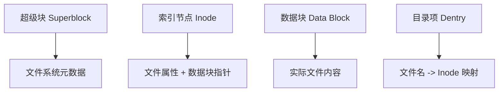

# 日志文件系统与性能优化 (Journaling File Systems and Performance)

## 一、文件系统基础

文件系统管理存储设备上的数据组织和访问。

### 核心组件



| 组件 | 作用 |
|------|------|
| Superblock | 文件系统全局信息（大小、块数、inode 数）|
| Inode | 文件元数据（权限、时间戳、数据块指针）|
| Data Block | 实际存储文件内容的数据单元 |
| Dentry | 目录结构，文件名到 inode 的映射 |

## 二、日志文件系统原理

日志 (Journaling) 机制防止系统崩溃后文件系统不一致。

### 日志写入流程


### 日志模式对比

| 模式 | 日志内容 | 一致性保证 | 性能 | 数据安全 |
|------|----------|-----------|------|----------|
| Writeback | 仅元数据 | 中 | 最快 | 最低（文件数据可能损坏）|
| Ordered | 元数据（先写数据）| 高 | 中等 | 高（数据先写入）|
| Data | 元数据 + 文件数据 | 最高 | 最慢 | 最高 |

### 崩溃恢复过程

当系统崩溃后重启，文件系统会检查日志区：

1. 扫描日志区，查找已提交但未写入磁盘的事务
2. 重放 (Replay) 这些事务到实际位置
3. 丢弃未提交（不完整）的事务
4. 标记日志区为干净状态

## 三、主流日志文件系统对比

| 特性 | ext4 | XFS | Btrfs | ZFS |
|------|------|-----|-------|-----|
| 引入年份 | 2008 | 1994 | 2009 | 2005 |
| 最大文件系统 | 1EB | 8EB | 16EB | 256ZB |
| 最大文件 | 16TB | 8EB | 16EB | 16EB |
| 日志类型 | 元数据日志 | 元数据日志 | 写时复制 (COW) | 写时复制 (COW) |
| 快照 | 否 | 否 | 是 | 是 |
| 压缩 | 否 | 否 | 是 | 是 |
| 去重 | 否 | 否 | 是 | 是 |
| RAID 支持 | 否（需 mdadm） | 否（需 mdadm） | 内置 | 内置 |
| 碎片整理 | 在线 | 在线 | 在线 | — |

## 四、ext4 文件系统详解

### 磁盘布局

```
| 引导块 | 块组0 | 块组1 | ... | 块组N |
         | 超级块 | 块组描述符 | 块位图 | inode位图 | inode表 | 数据块 |
```

### ext4 关键特性

- **段 (Extent)** 取代块映射：减少元数据开销

$$\text{Extent: [起始块号, 连续块数]}$$

- **延迟分配 (Delayed Allocation)**：聚合写入提高连续性
- **预分配 (Preallocation)**：`fallocate()` 系统调用
- **纳秒时间戳**：更高精度的时间记录
- **在线碎片整理**：无需卸载即可整理

```bash
# ext4 文件系统操作
mkfs.ext4 /dev/sda1

# 查看文件系统信息
tune2fs -l /dev/sda1

# 检查并修复
fsck.ext4 -p /dev/sda1

# 调整保留块百分比
tune2fs -m 1 /dev/sda1
```

## 五、XFS 文件系统

XFS 由 SGI 开发，擅长处理大文件和大文件系统。

### 分配组 (Allocation Group) 设计

XFS 将设备分为多个分配组 (AG)，每组可独立并发操作：

```
数据区 (Data Section)
    |-- AG0 | AG1 | AG2 | AG3 | ...
日志区 (Log Section)
运行时区 (Realtime Section) - 可选
```

### XFS 调优

```bash
# 创建时指定 AG 数量和大小
mkfs.xfs -d agcount=8,agsize=16g /dev/sda1

# 日志大小和版本
mkfs.xfs -l size=128m,version=2 /dev/sda1

# 挂载选项
mount -o noatime,nodiratime,allocsize=1m /dev/sda1 /data
```

## 六、写时复制文件系统 (COW)

Btrfs 和 ZFS 使用写时复制 (Copy-on-Write, COW) 替代原地更新。

### COW 写入过程

```
原始: 块A -> 块B -> 块C (数据块链)

1. 读取块A, 修改后写入新位置A'
2. 更新块B的指针指向A'
3. 读取块C, 修改后写入新位置C'
4. 更新块D的指针指向C'

结果: 旧版本 (A->B->C) 和新版本 (A'->B->C') 共存
```

### Btrfs 子卷与快照

```bash
# 创建子卷
btrfs subvolume create /mnt/data
btrfs subvolume create /mnt/snapshots

# 创建只读快照
btrfs subvolume snapshot -r /mnt/data /mnt/snapshots/backup-2026-05

# 创建可写快照
btrfs subvolume snapshot /mnt/data /mnt/data-test

# 发送/接收备份
btrfs send /mnt/snapshots/backup-2026-05 | \
    btrfs receive /backup-storage
```

## 七、性能优化技术

| 优化技术 | 原理 | 影响 | 适用场景 |
|----------|------|------|----------|
| 磁盘调度器 | 优化 IO 请求排序 | 降低延迟 | 机械硬盘 |
| 预读 (readahead) | 预测性读取 | 提高顺序读 | 大文件顺序访问 |
| 页缓存 (Page Cache) | 内存缓存磁盘数据 | 大幅降低 IO | 通用场景 |
| Direct IO | 绕过页缓存 | 减少内存拷贝 | 数据库 |
| AIO/Liburing | 异步 IO | 提高 IOPS | 高并发应用 |
| io_uring | 共享队列异步 IO | 极高 IOPS | 现代 Linux |

### 页缓存调优

```bash
# 查看当前页缓存状态
cat /proc/meminfo | grep -E "(Dirty|Writeback|Cached)"

# 调整脏页比例
sysctl vm.dirty_background_ratio=5
sysctl vm.dirty_ratio=10

# 调整脏页过期时间
sysctl vm.dirty_expire_centisecs=3000
sysctl vm.dirty_writeback_centisecs=500
```

## 八、文件系统基准测试

```bash
# 随机 4K 读写测试
fio --name=randread --ioengine=libaio --iodepth=32 \
    --rw=randread --bs=4k --size=1G --numjobs=4 \
    --runtime=60 --group_reporting

# 顺序读写测试
fio --name=seqwrite --ioengine=libaio --iodepth=16 \
    --rw=write --bs=1m --size=4G --numjobs=1

# 混合读写测试
fio --name=rwmix --ioengine=libaio --iodepth=16 \
    --rw=randrw --rwmixread=70 --bs=4k --size=1G
```

### 典型 SSD vs HDD 性能

| 指标 | SATA SSD | NVMe SSD | 机械硬盘 (15K) |
|------|----------|----------|----------------|
| 顺序读 | 550 MB/s | 3500 MB/s | 200 MB/s |
| 顺序写 | 520 MB/s | 3000 MB/s | 200 MB/s |
| 随机读 IOPS | 90K | 500K+ | 200 |
| 随机写 IOPS | 80K | 400K+ | 200 |
| 延迟 (读) | 0.1ms | 0.05ms | 5ms |
| 延迟 (写) | 0.02ms | 0.01ms | 3ms |

## 九、特定场景优化

### 数据库场景

```bash
# MySQL: 使用 O_DIRECT 绕过页缓存
mount -o rw,noatime,nodiratime,data=ordered /dev/sdb1 /mysql_data

# PostgreSQL: 日志分离到独立 NVMe
mkfs.xfs -l size=512m -d agcount=4 /dev/nvme0n1p1

# 关闭访问时间更新
mount -o noatime,nodiratime /dev/sda1 /data
```

## 相关条目

- [[FileSystems]]
- [[IO]]
- [[MemoryManagement]]
- [[LinuxKernel]]

## 参考资料

1. ext4 官方 Wiki: https://ext4.wiki.kernel.org
2. XFS 用户指南: https://xfs.wiki.kernel.org
3. Btrfs 官方文档: https://btrfs.wiki.kernel.org
4. Linux 存储栈文档: https://www.kernel.org/doc/Documentation/filesystems
5. fio 灵活 IO 测试工具文档
