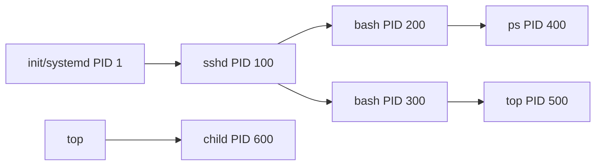

# Linux 系统管理 (Linux Administration)

## 一、概述 (Overview)

Linux 系统管理涉及用户管理、进程管理、存储管理、网络配置、安全加固和自动化运维等核心任务。Linux 作为服务器操作系统的主导地位（>70% 的 Web 服务器），掌握系统管理是 DevOps、SRE 和云计算工程师的基础技能。

## 二、用户和权限管理 (User & Permission Management)

### 用户与组

```bash
# 用户管理
useradd -m -G wheel, docker alice   # 创建用户并加入组
usermod -aG docker bob              # 追加到组
userdel -r alice                     # 删除用户及主目录
passwd alice                         # 设置/修改密码

# 组管理
groupadd developers
groupmod -n devs developers          # 重命名组
gpasswd -a alice devs                # 添加用户到组
```

### 文件权限 (File Permissions)

```text
-rwxr-xr--  1 alice  staff  1024 Mar 15 10:00 script.sh
  │││││││
  ││││││└─ Other: 读 (4)
  │││││└── Other: 执行 (1)
  ││││└─── Group: 读 (4)
  │││└──── Group: 执行 (1)
  ││└───── Owner: 读 (4)
  │└────── Owner: 写 (2)
  └─────── Owner: 执行 (1)
```

$$权限值 = r\times4 + w\times2 + x\times1$$

常用 chmod 指令：
```bash
chmod 755 script.sh     # rwxr-xr-x
chmod u+x script.sh     # 所有者加执行
chmod -R g+w /data      # 递归设置组写
chown alice:devs file   # 修改所有者和组
```

### ACL (Access Control Lists)

更细粒度的权限控制：
```bash
setfacl -m u:bob:rwx /project    # bob 有全部权限
setfacl -m g:devs:rx /project    # devs 组有 rx
getfacl /project                 # 查看 ACL
```

## 三、进程管理 (Process Management)



```bash
ps aux                    # 所有进程详细信息
ps -ef --forest           # 进程树
top / htop                # 动态进程监控
kill -9 PID               # 强制终止（SIGKILL）
kill -15 PID              # 优雅终止（SIGTERM）
kill -1 PID               # 重载配置（SIGHUP）
nice -n -5 command        # 提高优先级（较低值 = 更高优先级）
renice -10 -p PID         # 调整运行中进程优先级
```

### 优先级计算

```text
进程优先级 = Nice Value ( -20 ~ 19 )
  默认: 0
  最低优先级: 19
  最高优先级: -20

实际优先级计算:
  P = Nice + RT_PRIO (实时进程)
  
时间片分配:
  Time Slice ∝ 1 / (Nice Value + 20)
```

## 四、存储管理 (Storage Management)

### LVM (Logical Volume Manager)

```bash
# 创建 PV → VG → LV
pvcreate /dev/sdb /dev/sdc
vgcreate vg_data /dev/sdb /dev/sdc
lvcreate -L 100G -n lv_data vg_data
mkfs.ext4 /dev/vg_data/lv_data
mount /dev/vg_data/lv_data /data

# 扩展逻辑卷（在线）
lvextend -L +50G /dev/vg_data/lv_data
resize2fs /dev/vg_data/lv_data       # ext4 在线扩展
```

### 磁盘监控

```bash
df -h                 # 文件系统使用率
du -sh /var/log       # 目录空间占用
iostat -x 1           # 磁盘 I/O 详细统计
iotop                 # 按进程查看 I/O 使用
lsblk                 # 块设备拓扑
fdisk -l              # 分区表信息
```

### RAID 级别对比

| RAID 级别 | 最低盘数 | 可用容量 | 容错能力 | 读写性能 |
|-----------|---------|---------|---------|---------|
| RAID 0 (条带) | 2 | N | 无 | 读/写 ↑ |
| RAID 1 (镜像) | 2 | N/2 | 1 盘 | 读 ↑ / 写 ↓ |
| RAID 5 (奇偶校验) | 3 | N-1 | 1 盘 | 读 ↑ / 写 ↓ |
| RAID 6 (双校验) | 4 | N-2 | 2 盘 | 读 ↑ / 写 ↓↓ |
| RAID 10 (条带+镜像) | 4 | N/2 | 每组 1 盘 | 读/写 ↑↑ |

## 五、网络配置 (Network Configuration)

```bash
# 查看网络状态
ip addr                   # IP 地址配置
ip route                  # 路由表
ss -tulpn                 # 监听端口（替代 netstat）
ss -tupn                  # 已建立连接

# 网络测试
ping -c 5 example.com
traceroute example.com
mtr example.com           # 持续路由追踪
dig example.com A         # DNS 解析
nslookup example.com

# 防火墙 (firewalld)
firewall-cmd --add-service=http --permanent
firewall-cmd --add-port=8080/tcp --permanent
firewall-cmd --reload
```

## 六、系统监控与日志 (System Monitoring & Logging)

| 监控维度 | 工具/命令 | 关键指标 |
|---------|----------|---------|
| CPU | `top`, `htop`, `mpstat` | 使用率、Load Average、上下文切换 |
| 内存 | `free -h`, `vmstat` | 可用/缓存/Swap 使用 |
| 磁盘 | `iostat`, `iotop`, `df` | IOPS、吞吐量、延迟、使用率 |
| 网络 | `nload`, `iftop`, `ss` | 带宽、连接数、丢包率 |
| 日志 | `journalctl`, `tail -f` | 系统日志 `/var/log/` |

### Systemd 服务管理

```bash
systemctl status nginx        # 查看服务状态
systemctl enable --now nginx  # 启用并立即启动
systemctl restart nginx       # 重启
journalctl -u nginx -f        # 实时查看服务日志
journalctl --since "1 hour ago" -p err  # 过去 1 小时错误日志
```

## 七、安全加固 (Security Hardening)

| 措施 | 配置 | 说明 |
|------|------|------|
| SSH 加固 | `PermitRootLogin no`, `PasswordAuthentication no` | 禁用 root 密码登录 |
| 防火墙 | `firewalld` / `iptables` | 最小开放原则 |
| SELinux / AppArmor | `setenforce 1` | 强制访问控制 |
| 自动更新 | `unattended-upgrades` (Debian), `dnf-automatic` (RHEL) | 安全补丁自动安装 |
| Fail2ban | 配置 jail.local | 暴力破解防护 |
| Auditd | `auditctl` | 系统审计日志 |
| TCP Wrappers | `/etc/hosts.allow` / `deny` | 基于主机的访问控制 |

## 八、自动化运维 (Automation)

| 工具 | 用途 | 架构 |
|------|------|------|
| Ansible | 配置管理、应用部署 | Agentless (SSH) |
| Puppet | 声明式配置管理 | Agent + Master |
| SaltStack | 远程执行、配置管理 | Master + Minion |
| Terraform | IaC (基础设施即代码) | 云资源编排 |
| Shell 脚本 | 常规自动化任务 | 无依赖 |

## 七、Shell 脚本自动化示例 (Automation Scripts)

```bash
#!/bin/bash
# Linux 健康检查脚本
set -euo pipefail

echo "===== 系统信息 ====="
echo "主机名: $(hostname)"
echo "内核: $(uname -r)"
echo "运行时间: $(uptime -p)"
echo ""
echo "===== CPU 使用率 ====="
mpstat 1 1 | tail -1 | awk '{print "CPU: " 100-$NF "% idle"}'
echo ""
echo "===== 内存使用 ====="
free -h | grep -E "^Mem:" | awk '{print "已用: " $3 " / 总计: " $2}'
echo ""
echo "===== 磁盘使用率 ====="
df -h | grep -E "^/dev/" | awk '{print $6 " " $5}'
echo ""
echo "===== 监听端口 ====="
ss -tuln | grep LISTEN
echo ""
echo "===== 登录用户 ====="
who
```

## 八、性能调优 (Performance Tuning)

| 问题 | 诊断命令 | 可能的解决方案 |
|------|---------|-------------|
| CPU 高负载 | `top -bn1`, `perf top`, `mpstat -P ALL 1` | 优化代码、增加核心、减少进程 |
| 内存不足 (OOM) | `free -h`, `vmstat 1`, `dmesg \| grep -i oom` | 增加内存、优化应用、配置 swap |
| I/O 瓶颈 | `iostat -x 1`, `iotop`, `sar -b` | SSD 升级、调整 I/O 调度器、RAID |
| 网络延迟 | `ping`, `mtr`, `ss -i` | 升级带宽、优化 TCP 参数、CDN |
| 上下文切换过高 | `vmstat 1`, `pidstat -w` | 减少线程数、增大线程池、使用 epoll |

### 关键内核参数调优 (/etc/sysctl.conf)

```bash
# 网络优化
net.core.somaxconn = 1024
net.ipv4.tcp_tw_reuse = 1
net.ipv4.tcp_fin_timeout = 15
net.ipv4.tcp_keepalive_time = 300

# 内存优化
vm.swappiness = 10
vm.vfs_cache_pressure = 50

# 文件描述符限制
fs.file-max = 2097152
```

## 相关条目
- [[ShellScripting]]
- [[SystemDesign]]
- [[MemoryModel]]
- [[05_ComputerScience/OperatingSystems/INDEX]]
