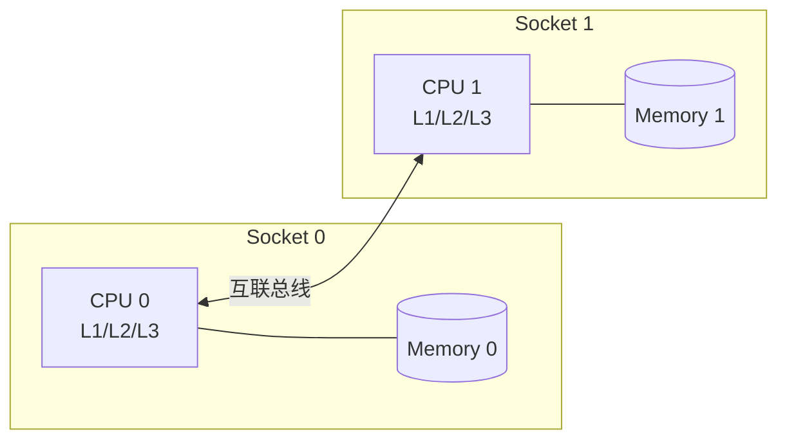

# 分页分段与交换技术 (Paging, Segmentation and Swapping)

## 一、内存管理基础

内存管理的核心目标是在有限的物理内存中高效、安全地运行多个进程。

地址空间概念：

$$\text{逻辑地址 (Logical)} \xrightarrow{MMU} \text{线性地址 (Linear)} \xrightarrow{分页} \text{物理地址 (Physical)}$$

关键挑战：

1. 地址转换：进程使用的地址与实际物理内存地址的映射
2. 内存保护：防止进程间互相干扰
3. 内存共享：支持高效的数据共享（共享库、共享内存）
4. 虚拟化：为每个进程提供独立的地址空间

## 二、连续内存分配

最早的方案是将进程装入连续的物理内存区域。

### 固定分区 vs 动态分区

| 算法 | 描述 | 优点 | 缺点 |
|------|------|------|------|
| 首次适应 (First Fit) | 从低地址开始找到第一个足够大的分区 | 简单，速度快 | 产生较多外部碎片 |
| 最佳适应 (Best Fit) | 找到最小的足够大的分区 | 碎片最小 | 慢，产生很多小碎片 |
| 最差适应 (Worst Fit) | 找到最大的分区 | 碎片较大 | 慢，浪费大空间 |
| 快速适应 (Quick Fit) | 按大小分类的空闲链表 | 分配快 | 维护复杂 |

外部碎片问题：

$$\text{碎片率} = \frac{\sum \text{空闲块总大小}}{\text{空闲块数量} \times \text{最大空闲块}}$$

紧凑 (Compaction) 解决外部碎片，但需要运行时重定位支持。

## 三、分页技术

分页将物理内存划分为固定大小的页框 (Page Frame)，进程的逻辑地址空间划分为相同大小的页 (Page)。

### 逻辑地址结构

$$\text{逻辑地址} = \underbrace{\text{页号 (Page Number)}}_{\text{高位}} + \underbrace{\text{页内偏移 (Offset)}}_{\text{低位}}$$

$$\text{物理地址} = \text{页框号} \times \text{页大小} + \text{页内偏移}$$

### 二级页表地址转换


### x86-64 四级页表结构 (4K 页)

```
逻辑地址 (48位):
+-------+-------+-------+-------+--------+
| PML4  | PDP   | PD    | PT    | Offset |
| 9位   | 9位   | 9位   | 9位   | 12位   |
+-------+-------+-------+-------+--------+
```

## 四、分段技术

分段按逻辑划分（代码段、数据段、堆栈段等），每段大小可变。

### 逻辑地址结构 (x86 保护模式)

$$\text{逻辑地址} = \underbrace{\text{段选择子}}_{\text{16位}} + \underbrace{\text{段内偏移}}_{\text{32位}}$$

### 分段 vs 分页

| 特性 | 分页 | 分段 |
|------|------|------|
| 单元大小 | 固定（通常 4KB） | 可变 |
| 用户视角 | 线性地址空间 | 多段（代码/数据/堆栈）|
| 保护粒度 | 页级 | 段级 |
| 共享粒度 | 页级 | 段级 |
| 碎片问题 | 内部碎片（平均半页） | 外部碎片 |
| 管理复杂度 | 较高 | 较低 |

## 五、页替换算法

当物理内存不足时，操作系统将部分页换出到交换区 (Swap)。

| 算法 | 描述 | 缺页率 | 实现复杂度 | 是否有 Belady 异常 |
|------|------|--------|-----------|-----------------|
| FIFO | 先进先出替换 | 高 | 极低 | 是 |
| OPT | 替换未来最远使用的页 | 最低 | 不可实现 | 否 |
| LRU | 替换最久未使用的页 | 低 | 高 | 否 |
| Clock | 近似 LRU（二次机会） | 中 | 低 | 否 |
| LFU | 替换使用频率最低的页 | 中 | 中 | 否 |
| MFU | 替换使用频率最高的页 | 中 | 中 | 否 |

### Clock 算法实现

```python
class ClockPageReplacer:
    def __init__(self, num_frames):
        self.frames = [None] * num_frames
        self.reference_bits = [0] * num_frames
        self.hand = 0

    def access_page(self, page_number):
        if page_number in self.frames:
            idx = self.frames.index(page_number)
            self.reference_bits[idx] = 1
            return True  # 命中

        # 缺页
        while True:
            if self.reference_bits[self.hand] == 0:
                self.frames[self.hand] = page_number
                self.reference_bits[self.hand] = 1
                self.hand = (self.hand + 1) % len(self.frames)
                return False  # 缺页
            else:
                self.reference_bits[self.hand] = 0
                self.hand = (self.hand + 1) % len(self.frames)
```

## 六、交换技术 (Swapping)

交换将整个进程或部分页面在内存和磁盘间移动。

### Linux 交换空间

```bash
# 创建交换文件
dd if=/dev/zero of=/swapfile bs=1M count=4096
chmod 600 /swapfile
mkswap /swapfile
swapon /swapfile

# 查看交换使用情况
swapon --show
free -h

# 调整交换倾向（0-100，越小越少交换）
sysctl vm.swappiness=10
```

### 交换参数调优

| 参数 | 默认值 | 说明 | 建议 |
|------|--------|------|------|
| swappiness | 60 | 倾向使用交换的程度 | 服务器设 10，桌面为 60 |
| min_free_kbytes | 动态 | 保留的最小空闲内存 | 根据内存大小调整 |
| vfs_cache_pressure | 100 | 回收 dentry/inode 缓存的倾向 | 文件服务器设 200 |
| watermark_scale_factor | 10 | 水位线缩放因子 | 默认 |

## 七、TLB 与性能优化

TLB (Translation Lookaside Buffer) 是页表的硬件缓存。

$$\text{有效访问时间 (EAT)} = (1 - p) \times T_{TLB} + p \times (T_{TLB} + T_{mem})$$

其中 p 为 TLB 未命中率。

### TLB 优化技术

| 技术 | 描述 | 效果 |
|------|------|------|
| 大页 (Huge Pages) | 2MB/1GB 大页 | 减少 TLB 缺失 |
| 多级 TLB | L1/L2 TLB 分级 | 平衡速度和容量 |
| 预取 | 预测性加载页表项 | 减少未命中 |
| 进程上下文 ID (ASID) | 标记 TLB 条目所属进程 | 减少上下文切换刷 TLB |
| 页表行走器 (Page Walker) | 硬件自动查页表 | 加速未命中处理 |

## 八、NUMA 架构

NUMA（非统一内存访问）架构下，访问本地内存和远程内存延迟不同。



### NUMA 感知的内存分配

```c
#include <numa.h>
#include <numaif.h>

void *allocate_on_node(size_t size, int node) {
    void *ptr;
    ptr = mmap(NULL, size, PROT_READ | PROT_WRITE,
               MAP_PRIVATE | MAP_ANONYMOUS, -1, 0);

    struct bitmask *mask = numa_allocate_nodemask();
    numa_bitmask_setbit(mask, node);
    mbind(ptr, size, MPOL_BIND, mask->maskp, mask->size, 0);
    numa_free_nodemask(mask);

    return ptr;
}
```

## 相关条目

- [[MemoryManagement]]
- [[虚拟内存与缓存优化]]
- [[FileSystems]]
- [[IO]]

## 参考资料

1. 《操作系统概念》第 8-9 章：内存管理
2. 《深入理解 Linux 内核》第 2 章：内存寻址
3. Intel 64 和 IA-32 架构软件开发手册（卷 3A）
4. Linux 内核文档：Documentation/admin-guide/mm/
