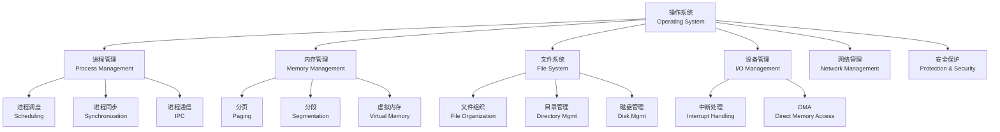

# 操作系统概述 (OS Overview)

## 概述 (Overview)

操作系统 (Operating System, OS) 是管理计算机硬件 (Hardware) 与软件资源 (Software Resources) 的核心系统软件，为上层应用程序提供运行环境和使用接口。操作系统充当硬件与用户之间的中介，负责资源分配 (Resource Allocation)、任务调度 (Task Scheduling)、数据保护 (Data Protection) 和错误恢复 (Error Recovery)。现代操作系统包括 Windows、Linux、macOS、iOS、Android 等。

## 操作系统核心功能



## 进程管理 (Process Management)

进程 (Process) 是程序的一次执行实例，包含代码段、数据段、堆栈和程序计数器。线程 (Thread) 是 CPU 调度的最小单位，同一进程的线程共享地址空间。

```mermaid
graph LR
    subgraph 进程状态<br/>Process States
        A[新建<br/>New] --> B[就绪<br/>Ready]
        B --> C[运行<br/>Running]
        C --> D[阻塞<br/>Blocked/Waiting]
        D --> B
        C --> E[终止<br/>Terminated]
    end
```

### 调度算法 (Scheduling Algorithms)

| 算法 | 类型 | 特点 | 平均等待时间 | 是否抢占 |
|:---|:---:|:---|:---:|:---:|
| 先来先服务 FCFS | 非抢占 | 实现简单， convoy 效应明显 | 高 | 否 |
| 短作业优先 SJF | 非抢占/抢占 | 理论上最优平均等待时间 | 最低 | 可选 |
| 时间片轮转 RR | 抢占 | 时间片 q=10–100 ms，响应快 | 中等 | 是 |
| 优先级调度 | 抢占/非抢占 | 可能出现饥饿 (Starvation) | 依赖优先级 | 可选 |
| 多级反馈队列 MLFQ | 抢占 | 综合多种调度策略优点 | 优化 | 是 |

**调度性能指标**：
- CPU 利用率：$\text{Utilization} = \frac{\text{busy time}}{\text{total time}}$
- 吞吐量 (Throughput)：单位时间完成的进程数
- 周转时间 (Turnaround Time)：$T_{turnaround} = T_{completion} - T_{arrival}$
- 等待时间 (Waiting Time)：进程在就绪队列中等待的总时间
- 响应时间 (Response Time)：从提交到首次响应的时间

### 同步机制 (Synchronization)

**信号量 (Semaphore)**：由 Dijkstra 提出，P(wait) 和 V(signal) 操作：

```
P(S): while S ≤ 0 do no-op; S = S - 1
V(S): S = S + 1
```

**经典同步问题**：
- 生产者-消费者问题 (Bounded-Buffer Problem)
- 读者-写者问题 (Readers-Writers Problem)
- 哲学家就餐问题 (Dining Philosophers Problem)

**死锁 (Deadlock) 四个必要条件**：
1. 互斥 (Mutual Exclusion)
2. 持有并等待 (Hold and Wait)
3. 不可抢占 (No Preemption)
4. 循环等待 (Circular Wait)

**银行家算法 (Banker's Algorithm)** 用于死锁避免：系统在安全状态下分配资源，确保存在安全序列。

## 内存管理 (Memory Management)

内存管理负责分配和回收内存资源，提供虚拟化地址空间 (Virtual Address Space)。

| 技术 | 基本原理 | 优点 | 缺点 |
|:---|:---|:---|:---|
| 连续分配 | 进程占用连续内存分区 | 实现简单 | 外部碎片、内存利用率低 |
| 分页 (Paging) | 固定大小页面 (Page) 映射到物理帧 | 消除外部碎片 | 内部碎片、页表开销 |
| 分段 (Segmentation) | 按逻辑段（代码/数据/堆栈）划分 | 支持共享与保护 | 外部碎片 |
| 段页式 | 分段 + 分页结合 | 兼具两者优点 | 地址转换复杂 |

**地址转换公式**：

逻辑地址 = 页号 (Page Number) × 页大小 + 偏移量 (Offset)

**有效访问时间 (Effective Access Time, EAT)**：

$$
EAT = (1 - p) \times t_{mem} + p \times t_{pf}
$$

其中 $p$ 为缺页率 (Page Fault Rate)，$t_{mem}$ 为内存访问时间，$t_{pf}$ 为缺页处理时间。

**页面置换算法**：
- **FIFO**：先进先出，可能产生 Belady 异常
- **LRU** (Least Recently Used)：基于局部性原理，性能最优但实现成本高
- **Clock (NRU)**：近似 LRU，使用参考位实现，效率高
- **最不常用 LFU**：淘汰访问次数最少的页面

## 文件系统 (File System)

文件系统管理持久化数据的组织、存储、命名和访问控制。

### 文件系统对比

| 文件系统 | 操作系统 | 最大文件 | 最大卷 | 日志 (Journaling) | 压缩/加密 |
|:---|:---|:---:|:---:|:---:|:---:|
| NTFS | Windows | 16 EB | 256 TB | 是 | 支持 |
| ext4 | Linux | 16 TB | 1 EB | 是 | 可选 |
| APFS | macOS | 8 EB | 无限制 | 是 | 原生加密 |
| FAT32 | 跨平台 | 4 GB | 2 TB | 否 | 不支持 |
| Btrfs | Linux | 16 EB | 16 EB | 是 | 支持快照 |

### 磁盘调度算法 (Disk Scheduling)

**寻道时间 (Seek Time)** 是磁盘访问的主要开销：

| 算法 | 描述 | 特点 |
|:---|:---|:---|
| FCFS | 按请求顺序处理 | 公平但可能寻道距离大 |
| SSTF | 选择最近磁道优先 | 可能产生饥饿 |
| SCAN (电梯算法) | 单向来回扫描 | 平均寻道距离中等 |
| C-SCAN | 单向扫描，快速返回 | 均匀等待时间 |

## 设备管理 (I/O Management)

I/O 控制方式及系统调用 (System Call) 开销对比：

| 方式 | CPU 参与度 | 数据传输速率 | 适用场景 |
|:---|:---:|:---:|:---|
| 程序直接控制 (Programmed I/O) | 高（轮询） | 低 | 简单外设 |
| 中断驱动 (Interrupt-driven) | 中（处理中断） | 中 | 键盘、鼠标 |
| DMA (Direct Memory Access) | 低（初始化后） | 高 | 磁盘、GPU |

## 操作系统类型 (Types of OS)

| 类型 | 核心特点 | 典型系统 | 应用场景 |
|:---|:---|:---|:---|
| 批处理 (Batch) | 批量执行无交互 | IBM OS/360 | 大型机计算 |
| 分时 (Time-sharing) | 多用户交互轮流 | Unix, Linux | 服务器、工作站 |
| 实时 (Real-time) | 确定性响应 ≤ 1 ms | VxWorks, FreeRTOS | 工业控制、自动驾驶 |
| 分布式 (Distributed) | 多机资源统一管理 | Amoeba, Plan 9 | 云计算 |
| 嵌入式 (Embedded) | 资源受限专用 | Zephyr, μC/OS | IoT 设备 |

## 进程间通信 (Inter-Process Communication, IPC)

| 通信方式 | 数据量 | 速度 | 同步性 | 适用范围 |
|:---|:---:|:---:|:---:|:---|
| 管道 (Pipe) | 有限 (通常 64 KB) | 快 | 阻塞同步 | 父子进程 |
| 命名管道 (Named Pipe/FIFO) | 有限 | 快 | 阻塞同步 | 任意进程 |
| 共享内存 (Shared Memory) | 极大 | 最快 | 需额外同步 | 高性能计算 |
| 消息队列 (Message Queue) | 消息级 | 中等 | 异步 | 分布式系统 |
| 套接字 (Socket) | 不限 | 中等 | 全双工 | 跨网络通信 |
| 信号 (Signal) | 信号编号 | 最快 | 异步通知 | 事件通知 |

**共享内存同步**通常使用信号量或互斥锁进行访问控制。

## 线程模型 (Thread Models)

| 模型 | 关系 | 特点 | 典型系统 |
|:---|:---|:---|:---|
| 多对一 (Many-to-One) | 多个用户线程映射到一个内核线程 | 并发性受限，一个阻塞全部阻塞 | 旧版 Green Threads |
| 一对一 (One-to-One) | 每个用户线程对应一个内核线程 | 并发性好，线程开销大 | Linux NPTL, Windows |
| 多对多 (Many-to-Many) | 用户线程与内核线程任意映射 | 兼顾并发与效率 | Solaris |

**Amdahl 定律 (Amdahl's Law)** 衡量并行化的理论加速比：

$$
Speedup = \frac{1}{(1 - P) + \frac{P}{N}}
$$

其中 $P$ 为可并行化比例，$N$ 为处理器核心数。即使核心数无限增加，加速比上限为 $1/(1-P)$。

## 操作系统安全 (OS Security)

### 保护机制
- **用户态与内核态 (User Mode vs Kernel Mode)**：使用特权级别分离（x86 R0–R3）
- **系统调用门 (System Call Interface)**：受控的用户-内核空间切换
- **地址空间随机化 (ASLR)**：随机化代码/数据/栈的基地址，增加攻击难度
- **数据执行保护 (DEP/NX)**：标记非可执行内存页，防止缓冲区溢出代码执行
- **访问控制列表 (ACL)**：文件和对象的权限管理

### 特权提升攻击防御
现代操作系统防御缓冲区溢出 (Buffer Overflow) 和提权攻击 (Privilege Escalation) 的核心机制包括内核地址空间布局随机化 (KASLR)、栈金丝雀 (Stack Canary)、控制流完整性 (CFI) 等。

## 虚拟化技术 (Virtualization)

- **Type 1 虚拟化**（裸机型）：VMware ESXi, Xen, Hyper-V，直接运行于物理硬件
- **Type 2 虚拟化**（宿主型）：VirtualBox, VMware Workstation，运行于主机 OS
- **容器化 (Containerization)**：Docker, containerd，共享宿主机内核，启动速度 ms 级

## 发展趋势 (Trends)

- **微内核 (Microkernel)**：最小化内核功能，如 seL4, QNX，提高安全性和可靠性
- **异构计算 (Heterogeneous Computing)**：CPU + GPU + NPU/TPU 协同调度
- **安全增强 (Security)**：可信执行环境 (TEE, 如 Intel SGX)、内核内存保护 (KASLR)
- **云原生 OS**：针对容器和 Serverless 优化的轻量级系统（如 Bottlerocket）
- **Rust 语言内核**：利用 Rust 内存安全特性构建更可靠的内核（如 Redox OS）

## 相关条目 (Related Entries)

- [[ComputerArchitecture]]
- [[CompilerPrinciplesOverview]]
- [[DistributedSystems]]
- [[Virtualization]]
- [[ComputerNetworks]]
