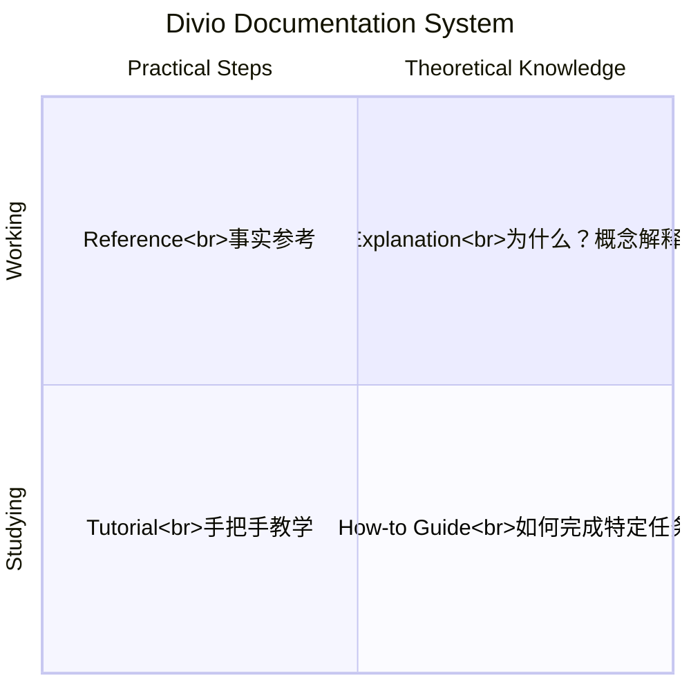

---
aliases: [TechnicalWriting]
tags: ['05_ComputerScience', 'ProfessionalEnglish']
created: 2026-05-17
updated: 2026-05-17
---

# 技术写作 (Technical Writing)

## 一、概述 (Overview)

技术写作是将复杂的技术信息以清晰、准确、易懂的方式传达给目标读者的书面交流过程。技术文档（Technical Documentation）是软件工程、产品开发和科学研究中不可或缺的部分。

### 技术写作的受众

| 受众类型 | 知识水平 | 写作策略 | 文档类型 |
|---------|---------|---------|---------|
| 最终用户 (End User) | 低 | 逐步指导、避免术语 | 用户手册、FAQ |
| 系统管理员 (SysAdmin) | 中 | 配置示例、命令行 | 运维手册、部署指南 |
| 开发者 (Developer) | 高 | API 参考、架构解释 | API 文档、SDK 指南 |
| 项目经理 (PM) | 中 | 高层概述、时间线 | 项目计划、进度报告 |
| 利益相关者 (Stakeholder) | 低 | 商业价值、高层抽象 | 执行摘要、白皮书 |

## 二、文档类型 (Documentation Types)

### 文档分类框架 — Divio 模型



| 类型 | 关注点 | 典型内容 | 写作风格 |
|------|--------|---------|---------|
| **Tutorial (教程)** | 学习路径 | 从零开始逐步完成一个目标 | 引导式、新手友好 |
| **How-to Guide (指南)** | 具体任务 | 完成一个特定目标的具体步骤 | 面向任务、操作导向 |
| **Reference (参考)** | 精确事实 | API 参数、配置项、命令选项 | 精确、完整、无冗余 |
| **Explanation (解释)** | 深入理解 | 设计决策、原理、权衡 | 概念驱动、讨论式 |

## 三、写作原则 (Writing Principles)

### 清晰性 (Clarity)

| 规则 | 不推荐 | 推荐 |
|------|--------|------|
| 主动语态 | The file is read by the program. | The program reads the file. |
| 具体动词 | Make changes to the configuration. | Update the configuration. |
| 短句 (≤ 25 词) | Due to the fact that the connection... | Because the connection... |
| 避免名词堆积 | Data packet loss rate analysis system | System that analyzes packet loss rates |

### 一致性 (Consistency)

在文档中使用统一的术语、格式和风格：
```text
术语一致性:
  × 混用: start / initiate / launch the service
  ✓ 统一: 始终用 "start the service"

格式一致性:
  × 混用: Button `Save`, `Save` button, button "save"
  ✓ 统一: 始终用 "Click the **Save** button"
```

### 简洁性 (Conciseness)

$$\text{写作效率} \propto \frac{\text{信息密度}}{\text{阅读时间}}$$

不推荐："In order to begin the process of installing the software, you need to first navigate to the directory..."

推荐："To install, navigate to the directory..."

## 四、文档结构 (Document Structure)

### API 文档模板

```markdown
# API 名称

## 概述
简要描述此 API 的功能和用途。

## 请求
- **URL**: `POST /api/v1/users`
- **Content-Type**: `application/json`
- **认证**: Bearer Token

### 请求体
| 字段 | 类型 | 必需 | 描述 |
|------|------|------|------|
| name | String | ✓ | 用户名 (2-50 字符) |
| email | String | ✓ | 邮箱地址 |
| role | String | ✗ | 角色 (默认: user) |

### 示例
```json
{
    "name": "Alice",
    "email": "alice@example.com"
}
```

## 响应
- **201 Created**: 创建成功
- **400 Bad Request**: 参数验证失败
- **409 Conflict**: 邮箱已存在
```

### 结构化写作 — DITA (Darwin Information Typing Architecture)

DITA 将文档内容分为三类主题：
- **概念 (Concept)**：解释"是什么"和"为什么"（$What + Why$）
- **任务 (Task)**：描述"怎么做"（$How$）
- **参考 (Reference)**：提供事实数据（$Facts$）

## 五、技术写作工具 (Technical Writing Tools)

| 工具 | 类型 | 特点 | 适用 |
|------|------|------|------|
| Markdown | 标记语言 | 轻量、版本控制友好 | **技术文档首选** |
| reStructuredText (RST) | 标记语言 | Python 生态 | Sphinx 文档 |
| AsciiDoc | 标记语言 | 功能丰富、DocBook 兼容 | 大型文档项目 |
| LaTeX | 排版系统 | 数学公式、学术论文 | 论文、白皮书 |
| Read the Docs | 托管平台 | 自动构建、版本管理 | 开源项目文档 |
| Swagger/OpenAPI | API 规范 | 自动生成交互式 API 文档 | REST API |
| Postman | API 测试 | 协作式 API 文档 | 团队 API 开发 |
| MadCap Flare | 专业工具 | 多格式输出、翻译支持 | 企业级文档 |

## 六、技术英语特点 (Technical English Features)

### 常用句型模式

```text
描述功能:  "[Subject] enables [user] to [action]"
  "The API enables developers to retrieve user data."

描述目的:  "[Subject] is used to [purpose]"
  "The debug flag is used to enable verbose logging."

描述条件:  "If [condition], then [result]"
  "If the status is 'error', the request is retried."

使用列表:  "The report includes: 1) Revenue summary; 2) User growth; 3) Error rates."
```

### 避免的常见错误

| 错误类型 | 不当用法 | 改进 |
|---------|---------|------|
| 句子碎片 | "Click save." 应该是完整句 | "Click the **Save** button." |
| 过度缩写 | "The param must be set." | "The parameter must be set." |
| 隐藏动词 | "make a decision" → "decide" | "The system decides..." |
| 时态不一致 | "The system will check if the file exists." | "The system checks if the file exists." |
| 冗余表达 | "The exact same code" | "The same code" |

## 七、国际化与本地化 (i18n & l10n)

编写面向全球读者的技术文档时：

```text
文化敏感:
  - 避免使用运动/宗教/文化特定比喻（如"hit a home run"）
  - 不使用手指/手势图示（不同文化含义不同）
  - 日期格式: 2024-03-15 (ISO 8601) 而非 03/15/2024

翻译友好:
  - 句子完整（避免省略）
  - 用主动语态
  - 留出 30% 文本空间（翻译后文本可能更长）
```

## 七、技术写作中的图形与数据可视化

### 图表的 Table 类型选择

| 数据类型 | 推荐图表类型 | 工具 |
|---------|-------------|------|
| 趋势变化 | 折线图 (Line Chart) | Matplotlib, D3.js |
| 类别对比 | 柱状图 (Bar Chart) | ECharts, Chart.js |
| 比例分布 | 饼图/环形图 (Pie/Donut) | Canva, Datawrapper |
| 关联关系 | 散点图 (Scatter Plot) | Vega-Lite, Plotly |
| 流程步骤 | 流程图/序列图 | Mermaid, PlantUML |
| 数据表格 | 格式化表格 | Markdown, HTML |

### 代码示例规范

```text
代码块规范:
  ❌ 没有标明语言（无语法高亮）:
  ```
  def hello():
      print("hi")
  ```
  
  ✓ 标明语言和文件名:
  ```python title="hello.py"
  def hello():
      print("Hello, World!")
  ```
  
  ✓ 标明输出结果:
  ```
  $ python hello.py
  Hello, World!
  ```
```

## 八、技术写作的常见陷阱

| 陷阱 | 表现 | 解决方案 |
|------|------|---------|
| **假设读者知识** | 使用未解释的术语 | 定义每个术语的首次出现 |
| **过度抽象** | "处理数据" → 怎么处理？| 给出具体步骤和示例 |
| **信息过载** | 一页塞入太多信息 | 分节，使用可折叠内容 |
| **没有示例** | 纯理论描述 | 至少一个真实示例 |
| **过时内容** | 版本号、截图未更新 | 定期审核，标注最后更新时间 |
| **自指代** | "如上所述"、"见前文" | 直接说明而非指向 |

## 九、检索增强生成 (RAG) 与文档

2024 年起，技术文档的重要新用途是为 LLM (大语言模型) 提供 RAG (Retrieval-Augmented Generation) 的检索源。为此需要：
- **结构化分块**：每个章节有唯一标识符和自包含内容
- **元数据标注**：版本、标签、用途
- **纯文本可解析**：避免仅存在于图片/PDF 中的信息
- **交叉引用清晰**：方便检索时理解上下文

## 八、技术写作中的图表规范

| 图表类型 | 适用数据 | 说明 |
|---------|---------|------|
| 流程图 (Flowchart) | 流程、决策、算法 | 使用标准符号 (圆角=开始/结束, 菱形=判断) |
| 序列图 (Sequence Diagram) | 交互、协议、API 调用 | 展示时间顺序的消息交换 |
| 架构图 (Architecture Diagram) | 系统组件、数据流 | 明确层/模块关系和交互方向 |
| 状态图 (State Diagram) | 状态机、工作流 | 状态 + 转换条件 |
| 表格 (Table) | 对比、参数、规格 | 可排序、列名清晰、避免合并单元格过多 |

### 图表使用原则

1. 一个图/表只传达一个核心信息
2. 每个图/表必须有标题和编号
3. 先结论、后图表（图表的说明在图前）
4. 避免 3D 效果和过度装饰（Chartjunk）
5. 确保颜色在灰度打印和色盲用户下仍可区分

## 九、文档模板速查

### Release Notes 模板

```markdown
# v2.1.0 Release Notes

## 新功能
- ✨ 新增用户头像上传功能
- ✨ 支持 OAuth 2.0 登录

## 改进
- 🔧 搜索性能提升 40%（从 800ms 降到 480ms）
- 🔧 界面响应式适配平板尺寸

## 修复
- 🐛 修复了在 iOS 15 下页面崩溃的问题 (#123)
- 🐛 修复了邮箱验证链接过期的边界情况

## 已知问题
- 深色模式下图表颜色未见优化
```

### Bug 报告模板

```markdown
## 环境
- 版本: v2.1.0
- 操作系统: macOS 14.3, iOS 17.3
- 浏览器: Chrome 122

## 步骤
1. 打开设置页面
2. 点击"切换深色模式"
3. 页面变暗后标题文字变为不可读

## 预期结果
标题在深色模式下应保持可见（白色字）

## 实际结果
标题文字变为深灰色 (#666)，几乎不可读

## 截图/录屏
[附件]

## 严重性
严重 (视觉功能受阻)
```

## 相关条目
- [[05_ComputerScience/SoftwareEngineering/Documentation|Documentation]]
- [[05_ComputerScience/HumanComputerInteraction/UserExperience|UserExperience]]
- [[05_ComputerScience/SoftwareEngineering/RequirementsEngineering|RequirementsEngineering]]
- [[05_ComputerScience/ProfessionalEnglish/INDEX]]

