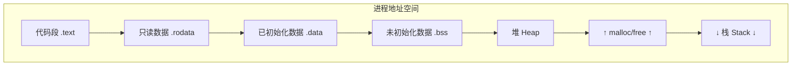
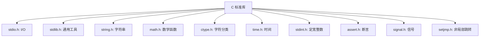
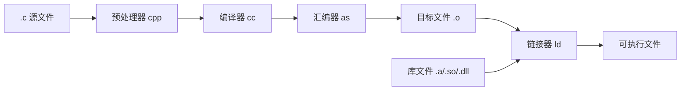

# C 语言 (C Programming Language)

## 一、概述

C 语言由 Dennis Ritchie 于 1972 年在贝尔实验室开发，用于重写 Unix 操作系统。它兼具高级语言的结构化特性和低级语言的内存操控能力，是系统编程的基石。

### 1.1 语言设计哲学

| 原则 | 说明 |
|------|------|
| 信任程序员 | 不强制安全检查 |
| 最小惊奇 | 语法和语义尽量直观 |
| 高效为本 | 语言特性不增加运行时开销 |
| 底层映射 | 语言结构直接对应机器指令 |

### 1.2 发展历程

| 标准 | 年份 | 重要特性 |
|------|------|----------|
| K&R C | 1978 | 第一版《C 程序设计语言》 |
| C89/ANSI C | 1989 | 函数原型、`void` 类型、标准库 |
| C99 | 1999 | 变长数组、行注释 `//`、`stdint.h`、内联函数 |
| C11 | 2011 | 多线程 (`<threads.h>`)、原子操作 (`<stdatomic.h>`) |
| C17 | 2017 | 缺陷修复，无新特性 |
| C23 | 2023 | `auto` 类型推导、`constexpr`、`#embed`、`typeof` |

## 二、核心特性

### 2.1 类型系统

```c
// 基本类型
int a = 42;          // 整型，通常 4 字节
float b = 3.14f;     // 单精度浮点
double c = 3.14159;  // 双精度浮点
char d = 'A';        // 字符类型，1 字节

// 修饰符
short int si;        // 短整型
long long int lli;   // 长整型
unsigned int ui;     // 无符号整型

// 复合类型
int arr[10];         // 数组
struct Point { int x, y; };  // 结构体
union Data { int i; float f; };  // 联合体
enum Color { RED, GREEN, BLUE }; // 枚举
```

### 2.2 指针与内存

指针是 C 语言最强大的特性，直接操作内存地址：

```c
int x = 42;
int *p = &x;         // p 存储 x 的地址
*p = 100;            // 通过指针修改 x

// 指针运算
int arr[5] = {1, 2, 3, 4, 5};
int *ptr = arr;      // 数组名即首元素指针
ptr++;               // 指向下一个 int（4 字节）
int val = *(ptr + 2); // 等价于 arr[3]

// 动态内存
int *heap = (int*)malloc(10 * sizeof(int));
if (heap != NULL) {
    free(heap);      // 必须手动释放
}
```

指针运算公式：

$$\text{ptr} + k = \text{ptr} + k \cdot \text{sizeof}(\text{base\_type})$$

### 2.3 函数与作用域

| 存储类别 | 关键字 | 生命周期 | 作用域 |
|----------|--------|----------|--------|
| 自动 | auto | 函数调用期间 | 块内 |
| 寄存器 | register | 函数调用期间 | 块内（建议寄存器） |
| 静态 | static（局部） | 程序整个运行期 | 块内 |
| 静态 | static（全局） | 程序整个运行期 | 本文件 |
| 外部 | extern | 程序整个运行期 | 跨文件 |

## 三、内存模型



内存对齐规则：

$$\text{sizeof(struct)} = \text{sum}(\text{member sizes}) + \text{padding}$$

## 四、标准库概览



### string.h 核心函数

| 函数 | 说明 |
|------|------|
| `strlen(s)` | 返回字符串长度（不含 `\0`） |
| `strcpy(d, s)` | 复制字符串 |
| `strcat(d, s)` | 连接字符串 |
| `strcmp(s1, s2)` | 比较字符串 |
| `strchr(s, c)` | 查找字符 |
| `strstr(h, n)` | 查找子串 |

## 五、文件操作

```c
// 文件读写
FILE *fp = fopen("data.txt", "r");
if (fp) {
    char buf[256];
    while (fgets(buf, sizeof(buf), fp)) {
        printf("%s", buf);
    }
    fclose(fp);
}

// 二进制 I/O
size_t n = fread(buffer, sizeof(char), 100, fp);
size_t m = fwrite(data, sizeof(Data), 10, fp);
```

## 六、经典问题与最佳实践

| 问题 | 说明 | 解决方案 |
|------|------|----------|
| 缓冲区溢出 | `gets()` 不检查长度 | 用 `fgets()` 替代 |
| 内存泄漏 | `malloc` 后未 `free` | 配对管理、静态分析 |
| 悬空指针 | `free` 后仍使用 | 释放后置 NULL |
| 数组越界 | 下标超过范围 | 边界检查 |
| 未定义行为 | 依赖编译器实现 | 严格遵守标准 |
| 整数溢出 | 运算结果超范围 | 使用 `__builtin_add_overflow` |

## 七、C 与其他语言对比

| 特性 | C | C++ | Rust | Go |
|------|-----|-----|------|-----|
| 内存管理 | 手动 | 半手动 RAII | 所有权系统 | GC |
| OOP 支持 | 无（结构体+函数指针模拟） | 完整 | Trait 系统 | 方法+接口 |
| 泛型 | 宏/void* | 模板 | 泛型 | 泛型 |
| 异常处理 | 无（errno/setjmp） | 异常 | panic/Result | panic/error |
| 零成本抽象 | 是 | 是 | 是 | 否 |
| 学习曲线 | 中等 | 陡峭 | 陡峭 | 平缓 |

## 八、常用编译器与工具链

| 编译器 | 平台 | 特点 |
|--------|------|------|
| GCC | GNU/Linux, 跨平台 | 自由软件，标准参考实现 |
| Clang/LLVM | macOS, 跨平台 | 模块化，快速，诊断信息优秀 |
| MSVC | Windows | Visual Studio 集成，Windows SDK |
| TinyCC | 跨平台 | 极快编译速度，适合脚本 |
| ICC | Intel 平台 | 针对 Intel CPU 深度优化 |
| SDCC | 嵌入式 | 8 位微控制器专用 |

### 构建流程



## 九、调试与测试

```bash
# 编译时启用调试符号
gcc -Wall -Wextra -g -O0 program.c -o program

# Address Sanitizer（内存错误检测）
gcc -fsanitize=address -g program.c -o program

# Valgrind 内存泄漏检测
valgrind --leak-check=full ./program
valgrind --tool=helgrind ./program  # 线程错误检测

# GDB 调试
gdb ./program
break main
run
print variable
next
continue
```

## 相关条目

- [[05_ComputerScience/ProgrammingLanguages/Cpp]]
- [[05_ComputerScience/CompilerPrinciples/CodeGeneration]]
- [[05_ComputerScience/ProgrammingLanguages/INDEX]]
