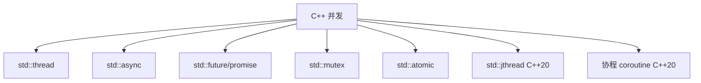

# C++ 语言 (C++ Programming Language)

## 一、概述

C++ 由 Bjarne Stroustrup 于 1985 年在 C 语言基础上扩展而来，支持面向对象、泛型、函数式和元编程等多种编程范式。

### 1.1 发展历程

| 标准 | 年份 | 重要特性 |
|------|------|----------|
| C++98 | 1998 | STL、模板、异常、RTTI |
| C++11 | 2011 | 自动类型推导、Lambda、移动语义、智能指针 |
| C++14 | 2014 | 泛型 Lambda、返回值类型推导 |
| C++17 | 2017 | `if constexpr`、结构化绑定、文件系统库 |
| C++20 | 2020 | 概念 (Concepts)、协程、范围库 (Ranges) |
| C++23 | 2023 | `std::print`、`std::expected`、多维下标运算符 |

## 二、面向对象编程 (OOP)

### 2.1 三大特性

| 特性 | 描述 | C++ 实现 |
|------|------|----------|
| 封装 | 隐藏实现细节 | `class` + `public/private/protected` |
| 继承 | 代码复用 | `class D : public B` |
| 多态 | 统一接口 | `virtual` + 虚函数表 (vtable) |

### 2.2 虚函数与 vtable

当类有虚函数时，对象首部包含指向虚函数表 (Virtual Table) 的指针 `vptr`：

```mermaid
flowchart LR
    subgraph 基类对象
        V[vptr] --> VT[vtable]
        VT --> f1[~Base()]
        VT --> f2[virtual func1]
        VT --> f3[virtual func2]
    end
    subgraph 派生类对象
        V2[vptr] --> VT2[vtable]
        VT2 --> g1[~Derived()]
        VT2 --> g2[override func1]
        VT2 --> f3
    end
```

## 三、现代 C++ 特性

### 3.1 自动类型推导

```cpp
auto x = 42;                 // int
auto y = 3.14;               // double
auto& r = x;                 // int&
const auto& cr = x;          // const int&
decltype(x) z = 0;           // int
```

### 3.2 Lambda 表达式

```cpp
// 基本 Lambda
auto sum = [](int a, int b) { return a + b; };

// 捕获列表
int factor = 2;
auto multiply = [factor](int x) { return x * factor; };

// 泛型 Lambda (C++14)
auto generic = [](auto a, auto b) { return a + b; };

// 模板形式 Lambda (C++20)
auto tlam = []<typename T>(T a, T b) { return a + b; };
```

Lambda 的捕获方式：

$$[capture](params) \to return\_type \{ body \}$$

### 3.3 移动语义 (Move Semantics)

```cpp
std::vector<int> createVector() {
    std::vector<int> v = {1, 2, 3, 4, 5};
    return v;  // 移动语义：无需拷贝
}

void process() {
    std::vector<int> v1 = createVector();
    std::vector<int> v2 = std::move(v1);  // 显式移动
    // v1 处于有效但未指定状态 (moved-from state)
}
```

### 3.4 智能指针

```cpp
// unique_ptr: 独占所有权
auto ptr = std::make_unique<int>(42);

// shared_ptr: 共享所有权（引用计数）
auto sptr1 = std::make_shared<int>(100);
auto sptr2 = sptr1;  // 引用计数 +1

// weak_ptr: 弱引用（不增加计数）
std::weak_ptr<int> wptr = sptr1;
if (auto locked = wptr.lock()) {
    // 使用 locked
}
```

## 四、泛型编程 (Generic Programming)

### 4.1 模板 (Templates)

```cpp
// 函数模板
template<typename T>
T max(T a, T b) {
    return a > b ? a : b;
}

// 类模板
template<typename T, int N>
class Array {
    T data[N];
public:
    T& operator[](int i) { return data[i]; }
};

// 模板特化
template<>
class Array<bool, 8> {
    // 特化实现
};
```

### 4.2 变参模板 (Variadic Templates)

```cpp
template<typename... Args>
auto sum(Args... args) {
    return (args + ...);  // 折叠表达式 (C++17)
}

// 递归展开
template<typename T>
T print(T t) { std::cout << t << std::endl; return t; }

template<typename T, typename... Args>
T print(T t, Args... args) {
    std::cout << t << " ";
    return print(args...);
}
```

## 五、STL 容器与算法

### 5.1 容器

| 容器 | 英文 | 底层 | 特点 |
|------|------|------|------|
| `vector` | Dynamic Array | 连续内存 | 随机访问 $O(1)$，尾部插入 |
| `list` | Doubly Linked List | 节点 | 任意位置插入 $O(1)$ |
| `deque` | Double-ended Queue | 分段连续 | 两端快速插入 |
| `set` / `map` | Ordered Set/Map | 红黑树 | 有序，$O(\log n)$ |
| `unordered_set/map` | Hash Set/Map | 哈希表 | $O(1)$ 平均 |
| `priority_queue` | Heap | 向量 | 最大堆 |

### 5.2 算法复杂度

$$T_{sort} = O(n\log n)$$
$$T_{find(binary)} = O(\log n)$$
$$T_{accumulate} = O(n)$$

```cpp
// 算法示例
std::vector<int> v = {5, 2, 8, 1, 9};
std::sort(v.begin(), v.end());         // 快排
auto it = std::lower_bound(v.begin(), v.end(), 5);  // 二分下界
auto sum = std::accumulate(v.begin(), v.end(), 0);  // 累加
v.erase(std::unique(v.begin(), v.end()), v.end());  // 去重
```

## 六、RAII (Resource Acquisition Is Initialization)

资源获取即初始化是 C++ 的核心惯用法：

```cpp
class File {
    FILE* fp;
public:
    File(const char* name) { fp = fopen(name, "r"); }
    ~File() { if (fp) fclose(fp); }  // 析构时自动释放
    // 禁止拷贝，允许移动
};
```

### RAII 与异常安全

| 保证等级 | 含义 |
|----------|------|
| Nothrow (nofail) | 绝不抛出异常 |
| Strong | 操作失败时保持原状态 |
| Basic | 无资源泄漏，但状态可能改变 |
| No | 无保证 |

## 七、并发与并行



```cpp
std::future<int> result = std::async(std::launch::async, []{
    return compute_answer();
});
int answer = result.get();  // 等待结果
```

## 八、设计模式与惯用法

| 设计模式 | C++ 实现方式 | 常见用例 |
|----------|-------------|----------|
| RAII | 构造函数获取/析构函数释放 | 智能指针、锁管理 |
| Pimpl | 前向声明 + 不透明指针 | 编译防火墙 |
| CRTP | 派生类作模板参数传基类 | 静态多态 |
| SFINAE | 模板实例化失败不报错 | 类型特性检测 |
| Type Erasure | 虚函数包装不同类型 | `std::function` |
| Mixin | 多重继承 + 模板 | 功能组合 |

## 九、异常安全与错误处理

### Copy-and-Swap 惯用法

```cpp
class BigData {
    int* data;
    size_t size;
public:
    friend void swap(BigData& a, BigData& b) noexcept {
        using std::swap;
        swap(a.data, b.data);
        swap(a.size, b.size);
    }
    BigData& operator=(BigData other) {
        swap(*this, other);  // 强异常安全
        return *this;
    }
};
```

## 十、元编程 (Template Metaprogramming)

编译期计算：模板实例化在编译时完成，可在编译期做类型推导和数值计算。

```cpp
// 编译期阶乘
template<int N>
struct Factorial {
    static constexpr int value = N * Factorial<N-1>::value;
};
template<>
struct Factorial<0> {
    static constexpr int value = 1;
};
// Factorial<5>::value == 120（编译期常量）

// C++20 Concepts
template<typename T>
concept Arithmetic = std::is_arithmetic_v<T>;

template<Arithmetic T>
T square(T x) { return x * x; }
```

## 相关条目

- [[05_ComputerScience/ProgrammingLanguages/C]]
- [[05_ComputerScience/ProgrammingLanguages/INDEX]]
