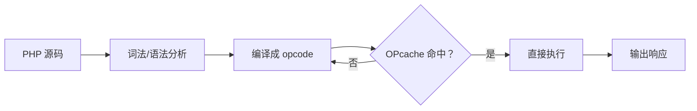

# PHP (PHP: Hypertext Preprocessor)

## 一、概述

PHP 是专为 Web 开发设计的服务器端脚本语言，由 Rasmus Lerdorf 于 1994 年创建。据 W3Techs 统计，超过 75% 的网站使用 PHP。

### 1.1 发展历程

| 版本 | 年份 | 重要特性 |
|------|------|----------|
| PHP/FI 2.0 | 1997 | 表单处理、C 语言基础 |
| PHP 3 | 1998 | Zend 引擎、面向对象 |
| PHP 4 | 2000 | Zend Engine 1.0 |
| PHP 5 | 2004 | Zend Engine 2.0，完整 OOP、PDO |
| PHP 7 | 2015 | Zend Engine 3.0，性能提升 2 倍、标量类型声明 |
| PHP 8 | 2020 | JIT 编译、命名参数、联合类型、Match 表达式 |
| PHP 8.2+ | 2022+ | 只读类、类型系统增强 |

## 二、语言特性

### 2.1 类型系统

PHP 是动态类型语言，从 PHP 7 起支持逐步类型化 (Gradual Typing)：

```php
// 动态类型
$value = 42;
$value = "hello";

// 标量类型声明 (PHP 7+)
function add(int $a, int $b): int {
    return $a + $b;
}

// 联合类型 (PHP 8+)
function process(int|string $input): int|string {
    return match(true) {
        is_int($input) => $input * 2,
        is_string($input) => strtoupper($input),
    };
}

// 只读属性 (PHP 8.1+)
class User {
    public function __construct(
        public readonly string $name,
        public readonly int $age,
    ) {}
}
```

### 2.2 操作符

| 操作符 | 含义 | 示例 | 结果 |
|--------|------|------|------|
| `.` | 字符串连接 | `"Hello " . "World"` | `"Hello World"` |
| `==` | 宽松相等 | `"1" == 1` | `true` |
| `===` | 严格相等 | `"1" === 1` | `false` |
| `<=>` | 宇宙飞船 | `1 <=> 2` | `-1` |
| `??` | Null 合并 | `$a ?? 'default'` | 非 null 则 $a |
| `?->` | Nullsafe (PHP 8+) | `$user?->address?->city` | 链式安全访问 |

### 2.3 数组

PHP 的数组实际上是有序哈希表 (Ordered Hash Map)：

```php
// 索引数组
$fruits = ["apple", "banana", "cherry"];

// 关联数组
$person = [
    "name" => "Alice",
    "age" => 30,
    "hobbies" => ["reading", "coding"]
];

// 数组操作
array_push($fruits, "date");        // 尾部追加
$last = array_pop($fruits);         // 尾部弹出
$keys = array_keys($person);        // 获取键
$values = array_values($person);    // 获取值
$mapped = array_map(fn($x) => $x * 2, [1, 2, 3]);
$filtered = array_filter($arr, fn($x) => $x > 0);
```

## 三、面向对象

### 3.1 类与接口

```php
interface Logger {
    public function log(string $message): void;
}

trait Timestampable {
    public function getCreatedAt(): DateTime {
        return $this->createdAt;
    }
}

class FileLogger implements Logger {
    use Timestampable;

    public function __construct(
        private string $filePath,
        private ?DateTime $createdAt = null
    ) {
        $this->createdAt ??= new DateTime();
    }

    public function log(string $message): void {
        file_put_contents($this->filePath, $message . PHP_EOL, FILE_APPEND);
    }
}
```

### 3.2 魔术方法 (Magic Methods)

| 方法 | 触发场景 |
|------|----------|
| `__construct` | 对象创建 |
| `__destruct` | 对象销毁 |
| `__get` / `__set` | 访问不可访问的属性 |
| `__call` / `__callStatic` | 调用不可访问的方法 |
| `__toString` | 对象转字符串 |
| `__invoke` | 对象作为函数调用 |
| `__clone` | 对象克隆 |

## 四、Web 开发

### 4.1 超全局变量

| 变量 | 内容 |
|------|------|
| `$_GET` | URL 查询参数 |
| `$_POST` | POST 表单数据 |
| `$_SERVER` | 服务器/请求信息 |
| `$_SESSION` | 会话数据 |
| `$_COOKIE` | Cookie 数据 |
| `$_FILES` | 上传文件 |

### 4.2 PDO (PHP Data Objects)

```php
try {
    $pdo = new PDO(
        "mysql:host=localhost;dbname=test;charset=utf8mb4",
        $user, $pass
    );
    $pdo->setAttribute(PDO::ATTR_ERRMODE, PDO::ERRMODE_EXCEPTION);

    // 预处理语句防止 SQL 注入
    $stmt = $pdo->prepare("SELECT * FROM users WHERE email = ?");
    $stmt->execute([$email]);
    $user = $stmt->fetch(PDO::FETCH_ASSOC);
} catch (PDOException $e) {
    error_log($e->getMessage());
}
```

## 五、框架生态系统

| 框架 | 架构 | 模板 | ORM | 特点 |
|------|------|------|-----|------|
| Laravel | MVC | Blade | Eloquent | 生态丰富，优雅语法 |
| Symfony | 组件化 | Twig | Doctrine | 企业级，可复用组件 |
| ThinkPHP | MVC | 内置 | 内置 | 国内流行，中文文档好 |
| Yii 2 | MVC | 内置 | ActiveRecord | 高性能，缓存机制 |
| CodeIgniter | MVC | 内置 | 简单 | 轻量，零配置 |

## 六、性能考量

### 6.1 OPcache

PHP 是解释型语言，OPcache 缓存编译后的字节码：

$$T_{request} = T_{parse} + T_{compile} + T_{execute}$$
$$T_{optimized} \approx T_{execute}$$



### 6.2 JIT 编译 (PHP 8+)

| 模式 | 说明 | 适用 |
|------|------|------|
| `tracing` | 追踪 JIT，编译热点路径 | 数值计算 |
| `function` | 函数级 JIT | 通用 |

## 七、PHP 的优缺点

| 优势 | 局限 |
|------|------|
| 专为 Web 设计，上手快 | 历史遗留设计缺陷 |
| 部署简单（共享主机友好） | 异步并发能力弱 |
| 文档完善，社区庞大 | 类型系统不如静态语言严格 |
| Laravel/Symfony 生态成熟 | 早期版本安全隐患 |
| 现代版本性能大幅改善 | 实时应用需额外工具（如 Swoole） |

## 八、现代 PHP 项目实践

### 8.1 PHP-FIG 标准 (PSR)

| 标准 | 内容 |
|------|------|
| PSR-1 / PSR-12 | 编码规范 |
| PSR-4 | 自动加载规范 (Composer) |
| PSR-3 | 日志接口 |
| PSR-7 | HTTP 消息接口 |
| PSR-11 | 容器接口 |
| PSR-14 | 事件分发 |

### 8.2 测试实践

```php
use PHPUnit\Framework\TestCase;

class UserTest extends TestCase {
    public function testUserCreation(): void {
        $user = new User('Alice', 'alice@example.com');
        $this->assertEquals('Alice', $user->name);
        $this->assertInstanceOf(User::class, $user);
    }

    public function testInvalidEmail(): void {
        $this->expectException(InvalidArgumentException::class);
        new User('Bob', 'not-an-email');
    }
}
```

### 8.3 国际化支持

```php
$collator = new Collator('zh_CN');
$result = $collator->compare('苹果', '香蕉');
$formatter = new NumberFormatter('de_DE', NumberFormatter::DECIMAL);
echo $formatter->format(1234.56);  // 1.234,56
```

## 相关条目

- [[05_ComputerScience/ProgrammingLanguages/SQL]]
- [[05_ComputerScience/ProgrammingLanguages/INDEX]]
