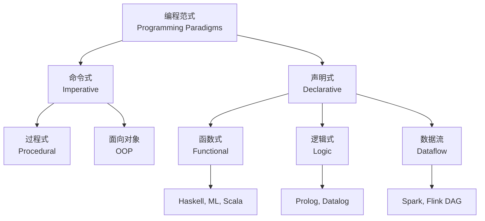
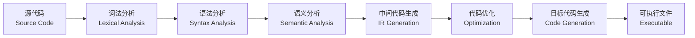
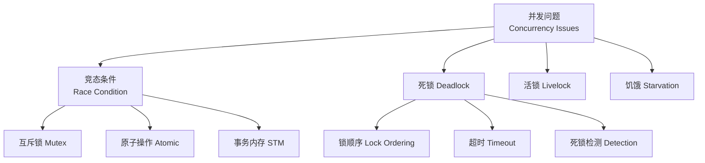
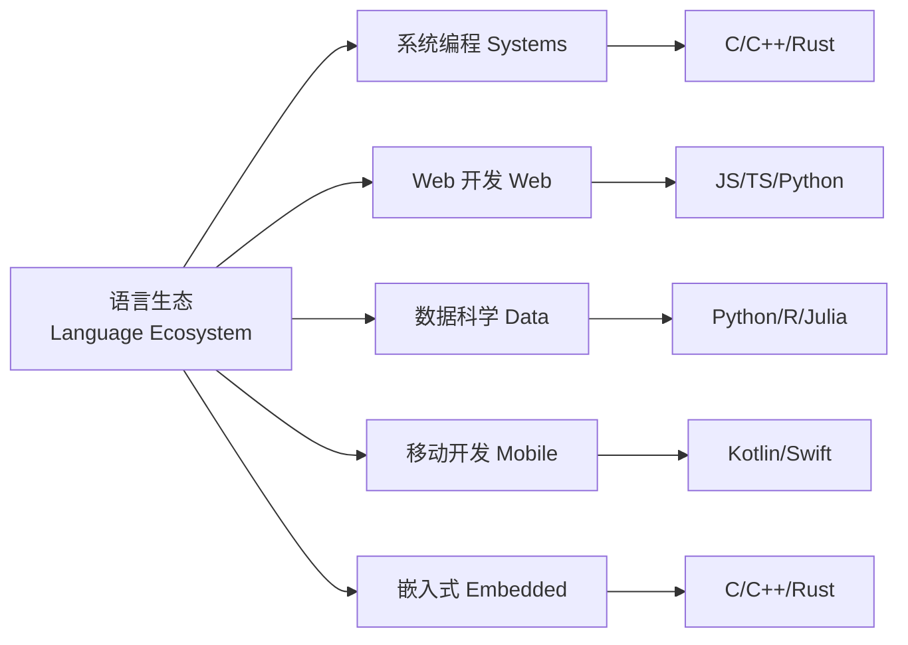

---
aliases: [ProgrammingLanguages, PL, 编程语言]
tags: ['05_ComputerScience', 'ProgrammingLanguages', 'Languages', 'Compilers']
created: 2026-05-17
updated: 2026-05-17
---

# 编程语言 Programming Languages

## 概述 Overview

编程语言（Programming Language）是用于人与计算机之间通信的形式化语言，通过语法（Syntax）和语义（Semantics）定义计算过程。编程语言的研究涵盖语言设计、实现、分析和应用四大领域。

$$ \text{Language} = \text{Syntax} \times \text{Semantics} \times \text{Pragmatics} $$

## 编程范式 Programming Paradigms

### 命令式编程 Imperative Programming

命令式编程以语句序列改变程序状态为核心，描述"如何做"（How to do）而非"做什么"（What to do）。

| 范式 | 特点 | 代表语言 |
|------|------|---------|
| 过程式 Procedural | 子程序、模块化 | C, Pascal, Fortran |
| 面向对象 OOP | 封装、继承、多态 | Java, C++, Python |
| 泛型编程 Generic | 类型参数化 | C++ Templates, Rust, Haskell |

### 声明式编程 Declarative Programming

声明式编程描述"做什么"而非"如何做"，由运行时系统决定执行方式。

### 函数式编程 Functional Programming

函数式编程以纯函数（Pure Function）和不可变性（Immutability）为核心，避免副作用。

$$ \text{Pure Function: } f(x) = y \implies \forall \text{ same } x, \text{ same } y $$

核心概念：
- **高阶函数 (Higher-Order Function)**：函数可作为参数或返回值
- **惰性求值 (Lazy Evaluation)**：表达式在需要时才计算
- **模式匹配 (Pattern Matching)**：通过结构解构进行分支
- **Monad**：处理副作用（IO、状态、异常）的抽象

### 逻辑式编程 Logic Programming

程序由事实（Facts）和规则（Rules）组成，计算通过逻辑推理实现。

$$ \text{Program} = \text{Facts} \cup \text{Rules}, \quad \text{Query} \rightarrow \text{Resolution} \rightarrow \text{Answer} $$

## 类型系统 Type Systems

| 维度 | 分类 | 说明 |
|------|------|------|
| 类型检查时机 | 静态/动态 | 编译时 vs 运行时 |
| 类型安全性 | 强/弱 | 是否允许隐式类型转换 |
| 类型推断 | 自动/显式 | Haskell 全推断 vs Java 部分推断 |
| 子类型 | 协变/逆变/不变 | 类型间的继承关系 |

### 静态类型 vs 动态类型

$$
\begin{aligned}
\text{Static: } & \text{Type Error} \rightarrow \text{Compile Time} \\
\text{Dynamic: } & \text{Type Error} \rightarrow \text{Runtime}
\end{aligned}
$$

### 类型推断 Type Inference

Hindley-Milner 类型推断算法通过约束求解自动推导表达式类型，是函数式语言的基石。

## 编译与执行 Compilation & Execution

### 解释器 vs 编译器

| 特性 | 编译器 Compiler | 解释器 Interpreter | JIT 编译器 |
|------|----------------|-------------------|-----------|
| 执行时机 | 运行前翻译 | 运行时逐行翻译 | 运行时编译热点 |
| 执行速度 | 快 | 慢 | 接近编译型 |
| 跨平台 | 需重新编译 | 天然跨平台 | 需运行时支持 |
| 代表 | C, C++, Rust | Python, Ruby | Java JVM, V8 |

### 内存管理 Memory Management

$$ \text{Memory} = \text{Stack (LIFO)} + \text{Heap (Dynamic)} $$

| 策略 | 机制 | 语言 |
|------|------|------|
| 手动管理 | malloc/free | C, C++ |
| 引用计数 | 循环引用问题 | Python, Swift |
| 追踪 GC | 标记-清除、分代回收 | Java, Go, C# |
| 所有权 Ownership | 借用检查 | Rust |

## 并发与并行 Concurrency & Parallelism

### 并发模型

| 模型 | 描述 | 代表 |
|------|------|------|
| 多线程 Threading | OS 线程共享内存 | Java, C++ |
| Actor 模型 | 消息传递无共享 | Erlang, Akka |
| CSP | 通道通信 | Go, Clojure |
| 协程 Coroutine | 用户态协作调度 | Python, Kotlin |
| 数据并行 Data Parallel | SIMD 指令 | CUDA, OpenCL |

### 并发控制

$$ \text{Data Race} \iff \text{Two threads access same memory} \wedge \text{At least one writes} \wedge \text{No synchronization} $$

## 语言设计 Language Design

### 语法设计 Syntax Design

好的语法应具备：一致性（Consistency）、简洁性（Conciseness）、可读性（Readability）、明确性（Unambiguity）。

### 抽象能力 Abstraction

$$ \text{Abstraction Level} = \frac{\text{Expressiveness}}{\text{Complexity}} $$

| 抽象层次 | 示例 | 优点 | 缺点 |
|---------|------|------|------|
| 机器码 | x86 指令 | 完全控制 | 难以编写 |
| 汇编 | MOV, ADD | 精细控制 | 开发效率低 |
| 系统语言 | C, Rust | 性能 + 控制 | 内存管理复杂 |
| 应用语言 | Java, Python | 开发效率 | 性能开销 |
| 领域特定 DSL | SQL, HTML | 高表达力 | 通用性差 |

## 语言对比 Language Comparison

### 性能对比

| 语言 | 编译/解释 | 类型系统 | 内存管理 | 运行速度 | 开发效率 |
|------|----------|---------|---------|---------|---------|
| C | 编译 | 静态弱 | 手动 | ★★★★★ | ★★ |
| C++ | 编译 | 静态 | 手动/RAII | ★★★★★ | ★★★ |
| Rust | 编译 | 静态强 | 所有权 | ★★★★★ | ★★★★ |
| Java | JIT | 静态强 | GC | ★★★★ | ★★★★ |
| Go | 编译 | 静态强 | GC | ★★★★ | ★★★★★ |
| Python | 解释 | 动态强 | GC | ★★ | ★★★★★ |
| TypeScript | 转译 | 静态强 | GC(JS) | ★★★ | ★★★★★ |
| Haskell | 编译 | 静态强 | GC | ★★★ | ★★★ |

### 应用领域

## 语言演进史 Language Evolution

### 关键里程碑

| 年代 | 语言 | 贡献 |
|------|------|------|
| 1957 | Fortran | 第一款高级语言 |
| 1958 | Lisp | 函数式编程、垃圾回收 |
| 1972 | C | Unix 系统语言 |
| 1983 | C++ | 面向对象 + C |
| 1987 | Perl | 文本处理 |
| 1990 | Haskell | 纯函数式、惰性求值 |
| 1991 | Python | 可读性、胶水语言 |
| 1995 | Java | 跨平台、企业级 |
| 1995 | JavaScript | Web 脚本 |
| 1996 | PHP | 服务器端脚本 |
| 2001 | C# | .NET 生态 |
| 2009 | Go | 并发、简洁 |
| 2010 | Rust | 内存安全、零成本抽象 |
| 2011 | Kotlin | JVM 现代语言 |
| 2014 | Swift | Apple 现代语言 |

## 编程语言理论 PL Theory

### 形式语义 Formal Semantics

| 语义类型 | 描述 | 应用 |
|---------|------|------|
| 操作语义 Operational | 程序执行步骤 | 语言手册 |
| 指称语义 Denotational | 程序含义到数学 | 程序验证 |
| 公理语义 Axiomatic | 前置/后置条件 | Hoare 逻辑证明 |

### Lambda 演算 Lambda Calculus

Lambda 演算是函数式编程的理论基础，仅由三部分构成：

$$ \begin{aligned}
\text{Term} &:= x \ |\ \lambda x.t \ |\ t_1 t_2 \\
\text{Variable} &: x, y, z \\
\text{Abstraction} &: \lambda x.t \ (\text{function}) \\
\text{Application} &: t_1 t_2 \ (\text{function call})
\end{aligned} $$

### 类型论 Type Theory

类型论（Type Theory）是编程语言类型系统的数学基础。与集合论不同，类型论中"类型"是命题，"程序"是证明（Curry-Howard Correspondence）。

$$ \text{Program} : \text{Type} \iff \text{Proof} : \text{Proposition} $$

## 前沿趋势 Future Trends

- **Rust 生态扩展**：Linux 内核、WebAssembly、嵌入式
- **WebAssembly (Wasm)**：浏览器内高性能运行多语言
- **AI 辅助编程**：GitHub Copilot、Cursor 等自动代码生成
- **领域特定语言 DSL**：面向特定领域的定制语言
- **形式化验证**：利用类型系统和证明助手确保程序正确性

## 相关条目

- [[Compilers]]
- [[TypeSystems]]
- [[FunctionalProgramming]]
- [[ConcurrencyModels]]
- [[ProgrammingParadigms]]

