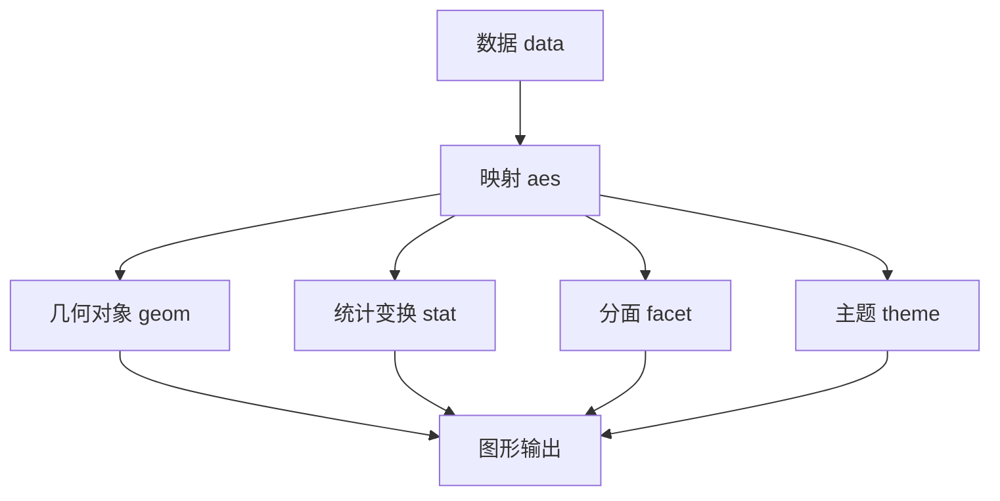

# R 语言

## 一、概述

R 是用于统计计算 (Statistical Computing) 和图形显示 (Graphics) 的编程语言，由 Ross Ihaka 和 Robert Gentleman 于 1995 年创建，是 S 语言的开源实现。现由 R 核心团队和全球社区维护，R 基金会管理。

### 1.1 设计哲学

R 的设计围绕数据分析工作流展开：


## 二、核心语言特性

### 2.1 向量化计算 (Vectorization)

R 的核心运算在向量上操作，无需显式循环：

```r
# 向量化运算（远快于 for 循环）
x <- c(1, 2, 3, 4, 5)
y <- x^2            # 每个元素平方
z <- sin(x) + cos(x)  # 逐元素三角函数
w <- x > 3          # 逻辑向量: FALSE FALSE FALSE TRUE TRUE
```

向量化计算的本质是利用 C/Fortran 级别的循环而非 R 级别的循环，效率差异显著：

$$T_{R\text{-loop}} \gg T_{C\text{-loop}}$$

### 2.2 数据结构

| 类型 | 英文 | 描述 | 创建 |
|------|------|------|------|
| 向量 | Vector | 同类型一维数据 | `c(1,2,3)` |
| 因子 | Factor | 分类变量 | `factor(c("A","B","A"))` |
| 矩阵 | Matrix | 同类型二维数据 | `matrix(1:9, nrow=3)` |
| 数组 | Array | 多维数据 | `array(1:27, dim=c(3,3,3))` |
| 数据框 | Data Frame | 各列可不同类型 | `data.frame(x=1:3, y=c("a","b","c"))` |
| 列表 | List | 递归容器 | `list(a=1, b="x", c=TRUE)` |
| 时间序列 | ts | 时间索引数据 | `ts(data, start=2020, frequency=12)` |

### 2.3 数据框操作

```r
df <- data.frame(
    name = c("Alice", "Bob", "Charlie"),
    age = c(25, 30, 35),
    score = c(85, 92, 78),
    stringsAsFactors = FALSE
)

# 索引
df[1, ]            # 第一行
df[, "age"]        # age 列
df$name            # name 列（$ 操作符）
df[df$age > 28, ]  # 条件筛选

# 常用函数
summary(df)        # 统计摘要
str(df)            # 结构查看
head(df, 10)       # 前 10 行
nrow(df); ncol(df) # 行列数
```

## 三、统计分析核心

### 3.1 描述性统计

```r
x <- rnorm(100, mean=50, sd=10)

mean(x)      # 均值
median(x)    # 中位数
sd(x)        # 标准差
var(x)       # 方差
quantile(x, probs = c(0.25, 0.75))  # 分位数
cor(x, y)    # 相关系数
```

### 3.2 假设检验

| 检验 | 函数 | 适用场景 |
|------|------|----------|
| t 检验 | `t.test()` | 两组均值比较 |
| Wilcoxon 检验 | `wilcox.test()` | 非参数两样本比较 |
| ANOVA | `aov()` | 多组均值比较 |
| 卡方检验 | `chisq.test()` | 分类变量独立性 |
| Kolmogorov-Smirnov | `ks.test()` | 分布拟合检验 |
| Shapiro-Wilk | `shapiro.test()` | 正态性检验 |

### 3.3 线性模型

```r
# 线性回归
model <- lm(score ~ age + hours_studied, data = df)
summary(model)

# 模型输出关键量
# R²: 决定系数
# F-statistic: 整体显著性
# p-value: 各系数的显著性
# Residuals: 残差分布
```

线性回归模型：

$$Y = \beta_0 + \beta_1 X_1 + \beta_2 X_2 + \cdots + \beta_p X_p + \epsilon$$

$$\hat{\beta} = (X^T X)^{-1} X^T Y$$

$$R^2 = 1 - \frac{SS_{res}}{SS_{tot}}$$

### 3.4 广义线性模型 (GLM)

```r
# 逻辑回归 (二分类)
glm_model <- glm(y ~ x1 + x2, data = df, family = binomial())

# 泊松回归 (计数数据)
glm_count <- glm(count ~ x, data = df, family = poisson())
```

## 四、数据可视化

### 4.1 ggplot2 (Grammar of Graphics)

ggplot2 基于图形语法理论，图层化构建图形：

```r
library(ggplot2)

ggplot(mtcars, aes(x = wt, y = mpg, color = factor(cyl))) +
    geom_point(size = 3, alpha = 0.7) +
    geom_smooth(method = "lm", se = TRUE) +
    labs(
        title = "MPG vs Weight",
        x = "Weight (1000 lbs)",
        y = "Miles Per Gallon"
    ) +
    theme_minimal() +
    facet_wrap(~cyl)
```



### 4.2 基础绘图系统

```r
plot(x, y, main = "Scatter Plot", col = "blue", pch = 16)
hist(x, breaks = 30, col = "lightblue")
boxplot(x ~ group, data = df, col = c("red", "green"))
```

## 五、数据科学工作流

### 5.1 Tidyverse 生态系统

| 包 | 功能 | 核心函数 |
|----|------|----------|
| dplyr | 数据操作 | `filter()`, `select()`, `mutate()`, `summarise()`, `group_by()` |
| tidyr | 数据整理 | `pivot_longer()`, `pivot_wider()`, `separate()`, `unite()` |
| readr | 数据导入 | `read_csv()`, `read_table()` |
| purrr | 函数式编程 | `map()`, `reduce()`, `keep()` |
| stringr | 字符串处理 | `str_detect()`, `str_replace()` |
| forcats | 因子处理 | `fct_reorder()`, `fct_lump()` |

```r
library(dplyr)

df %>%
    filter(age > 18) %>%
    group_by(gender) %>%
    summarise(
        mean_score = mean(score, na.rm = TRUE),
        count = n(),
        sd_score = sd(score, na.rm = TRUE)
    ) %>%
    arrange(desc(mean_score))
```

### 5.2 pipe 操作符

`|>` 或 `%>%` 将左值传入右函数的第一个参数：

$$x \%>\% f(y) \equiv f(x, y)$$

## 六、高级主题

### 6.1 R 包开发

```r
# 使用 devtools 和 usethis
usethis::create_package("mypackage")
usethis::use_r("myfunction")
usethis::use_testthat()
devtools::document()
devtools::check()
devtools::install()
```

### 6.2 性能优化

| 优化方法 | 说明 | 加速比 |
|----------|------|--------|
| 向量化 | 避免 for 循环 | 10-100× |
| data.table | 内存高效数据操作 | 10-50× |
| Rcpp | C++ 集成 | 10-100× |
| parallel | 并行计算 | 核心数× |
| profiling | 瓶颈分析 | 目标优化 |

```r
library(Rcpp)
cppFunction('
NumericVector cpp_sum(NumericVector x) {
    int n = x.size();
    double total = 0;
    for (int i = 0; i < n; i++) total += x[i];
    return NumericVector::create(total);
}')
```

## 七、应用领域

| 领域 | 应用 | 流行包 |
|------|------|--------|
| 生物信息学 | 基因组分析、差异表达 | Bioconductor, DESeq2 |
| 金融 | 量化分析、风险建模 | quantmod, PerformanceAnalytics |
| 市场营销 | 客户分群、A/B 测试 | caret, rpart |
| 社会科学 | 调查分析、结构方程 | lavaan, survey |
| 时间序列 | 预测、ARIMA | forecast, tsibble |
| 机器学习 | 分类、回归、聚类 | caret, tidymodels, xgboost |

## 八、R Markdown 与可重复研究

R Markdown 将代码、结果和叙述性文本整合在一个文档中，支持导出为 HTML、PDF、Word 等格式：

```markdown
---
title: "数据分析报告"
author: "作者"
output: html_document
---

```{r}
summary(data)
```

```{r pressure, echo=FALSE}
plot(pressure)
```
```

配合 **knitr** 包，R Markdown 实现了完全可重现的研究范式。每次运行文档时，代码被执行、结果被嵌入、图表被重新生成，确保分析结果的可再现性。

## 九、R 的选代与性能进化

| 版本 | 年份 | 重要改进 |
|------|------|----------|
| R 1.0 | 2000 | 首次发布 |
| R 2.0 | 2004 | S4 类系统、命名空间 |
| R 3.0 | 2013 | 长向量支持 (>2^31) |
| R 4.0 | 2020 | `stringsAsFactors=FALSE` 默认、引用语法改进 |
| R 4.1 | 2021 | 原生 pipe `|>`、匿名函数 `\(x)` |
| R 4.2 | 2022 | 多字节编码改进、LTO 支持 |

## 十、R 的学习资源

| 资源类型 | 推荐 | 内容 |
|----------|------|------|
| 入门书籍 | R for Data Science (Hadley Wickham) | Tidyverse 工作流 |
| 进阶书籍 | Advanced R (Hadley Wickham) | R 语言内部机制 |
| 图形学 | R Graphics Cookbook | ggplot2 实战 |
| 在线课程 | Coursera: Data Science Specialization | JHU 系列课程 |
| 参考网站 | R-bloggers, Stack Overflow | 社区资源 |
| 速查表 | RStudio Cheat Sheets | 各类操作速查 |

R 在数据科学工作流中的定位：虽然 Python 在深度学习和生产部署方面占据优势，但 R 在统计建模、探索性数据分析和数据可视化方面仍然无可替代（尤其是基于 ggplot2 的图形语法体系）。两者的关系更应是互补而非竞争。

## 相关条目
- [[05_ComputerScience/ProgrammingLanguages/INDEX]]
