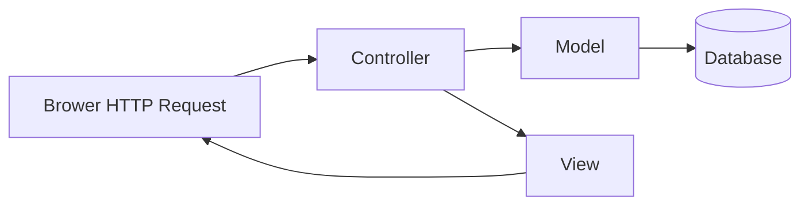

# Ruby (Ruby Programming Language)

## 一、概述

Ruby 由松本行弘 (Yukihiro Matsumoto) 于 1995 年创建，强调"最小惊诧原则" (Principle of Least Surprise, POLS) 和开发者幸福感。Ruby 是纯面向对象的动态脚本语言。

### 1.1 设计哲学

```text
Ruby 的目标是让编程更快乐。—— 松本行弘
```

- **Minimize surprise**：语法直观，行为一致
- **面向对象极致化**：一切皆对象（包括 `nil`、数字、类本身）
- **人性化设计**：代码读起来像自然语言

## 二、核心语言特性

### 2.1 面向对象 (Everything is Object)

```ruby
# 数字也是对象
42.even?                    # => true
-1.abs                      # => 1
3.14.round                  # => 3

# nil 也是对象
nil.nil?                    # => true
nil.to_s                    # => ""

# 类本身也是对象（Class 的实例）
String.superclass           # => Object
```

### 2.2 动态类型与鸭子类型 (Duck Typing)

```ruby
# 无类型声明
x = 42      # Integer
x = "hello" # String（类型可改变）

# 鸭子类型：不关心对象类型，只关心是否有该方法
def make_sound(animal)
  animal.quack  # 只要对象有 quack 方法即可
end

make_sound(Duck.new)     # 有效
make_sound(ToyDuck.new)  # 也有效，如果有 quack 方法
```

### 2.3 Block, Proc 与 Lambda

| 形式 | 语法 | 特点 |
|------|------|------|
| Block | `do...end` 或 `{ }` | 只能跟在方法调用后 |
| Proc | `Proc.new` / `proc` | 对象化 block |
| Lambda | `->` / `lambda` | 检查参数个数，return 行为如方法 |

```ruby
# Block — 最常用
[1, 2, 3].each { |x| puts x * 2 }

# Proc
double = Proc.new { |x| x * 2 }
double.call(5)   # => 10

# Lambda
square = ->(x) { x * x }
square.call(4)   # => 16
```

### 2.4 元编程 (Metaprogramming)

```ruby
# 动态定义方法
class Person
  %w[name age email].each do |attr|
    define_method(attr) do
      instance_variable_get("@#{attr}")
    end

    define_method("#{attr}=") do |value|
      instance_variable_set("@#{attr}", value)
    end
  end
end

# method_missing — 响应任意方法
class DynamicMethod
  def method_missing(name, *args)
    if name.to_s.start_with?("find_by_")
      field = name.to_s.sub("find_by_", "")
      puts "查找: #{field} = #{args.first}"
    else
      super
    end
  end
end
```

## 三、语法特性

### 3.1 核心语法

```ruby
# 一切都是表达式（有返回值）
result = if x > 0
  "positive"
elsif x < 0
  "negative"
else
  "zero"
end

# 符号 (Symbol) — 不可变字符串标识符
:name            # Symbol，非 "name"
{ name: "Alice" }  # 键为 Symbol

# Splat 操作符
first, *rest = [1, 2, 3, 4, 5]
# first = 1, rest = [2, 3, 4, 5]

# 安全导航操作符 (Ruby 2.3+)
city = user&.address&.city  # 避免 nil 链式报错
```

### 3.2 迭代器与 Enumerable

```ruby
[1, 2, 3].map { |x| x * 2 }       # => [2, 4, 6]
[1, 2, 3].select(&:even?)          # => [2]
[1, 2, 3].reduce(0) { |s, x| s + x }  # => 6
(1..10).group_by { |x| x % 3 }     # 按余数分组
```

## 四、Ruby on Rails

### 4.1 MVC 架构



### 4.2 ActiveRecord 核心

```ruby
# 模型定义
class User < ApplicationRecord
  has_many :posts
  validates :email, presence: true, uniqueness: true
  scope :active, -> { where(active: true) }
end

# 查询语法
User.where("age > ?", 18)
    .order(created_at: :desc)
    .includes(:posts)
    .limit(10)
```

## 五、Gem 生态系统

| Gem | 用途 | 说明 |
|-----|------|------|
| Devise | 用户认证 | 完整用户系统 |
| RSpec | 测试框架 | BDD 风格 |
| Sidekiq | 后台作业 | Redis 驱动的异步队列 |
| Puma | Web 服务器 | 多线程 HTTP 服务器 |
| Grape | API 框架 | RESTful API |
| FactoryBot | 测试数据 | 工厂模式构造 |

## 六、Ruby 版本变迁

| 版本 | 年份 | 关键特性 |
|------|------|----------|
| 1.8 | 2003 | 稳定版，标准库完善 |
| 1.9 | 2007 | 字节码虚拟机 (YARV)、新语法、编码支持 |
| 2.0 | 2013 | Refinements、Keyword Arguments |
| 2.3 | 2015 | Safe Navigation `&.`、Frozen String |
| 3.0 | 2020 | 静态分析、并发 Ractor、Type Profiler |

## 七、性能优化

$$Ruby\ 3 \times 3\ 目标: \text{Ruby 3 比 Ruby 2 快 3 倍}$$

| 技术 | 描述 | 示例 |
|------|------|------|
| 预冻结字符串 | `# frozen_string_literal: true` | 减少对象分配 |
| 使用 Symbol 而非 String | Symbol 不可变且唯一 | `:name` vs `"name"` |
| 避免不必要的对象分配 | 合理使用 `each` 而非 `map` 后 `select` | 链式调用优化 |
| 合理使用缓存 | `||=` 记忆化 | `@value ||= compute` |
| 使用 OJ | OJ 是 Ruby 最快的 JSON 解析器 | `require 'oj'` |

## 八、Ruby 社区文化

| 文化元素 | 描述 |
|----------|------|
| Code Golf | 用最简洁的代码实现功能 |
| RubyConf / RailsConf | 全球开发者年度盛会 |
| Gems 生态 | 超过 10 万个开源库 |
| 贡献文化 | 鼓励开源贡献 |
| MINASWAN | Matz Is Nice And So We Are Nice（社区精神） |

## 相关条目

- [[05_ComputerScience/ProgrammingLanguages/INDEX]]
- [[05_ComputerScience/ProgrammingLanguages/Scala]]
