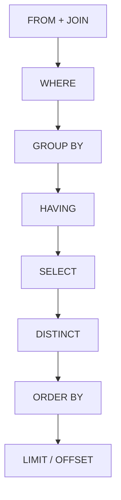

# SQL (Structured Query Language)

## 一、概述

SQL (Structured Query Language) 是管理和操作关系型数据库 (RDBMS) 的标准语言，由 Donald Chamberlin 和 Raymond Boyce 于 1970 年代在 IBM 开发。

### 1.1 语言分类

SQL 按功能分为五大子语言：

| 子语言 | 英文 | 功能 | 代表命令 |
|--------|------|------|----------|
| DDL | Data Definition Language | 数据库对象定义 | `CREATE, ALTER, DROP, TRUNCATE` |
| DML | Data Manipulation Language | 数据操作 | `SELECT, INSERT, UPDATE, DELETE` |
| DCL | Data Control Language | 权限控制 | `GRANT, REVOKE` |
| TCL | Transaction Control Language | 事务管理 | `COMMIT, ROLLBACK, SAVEPOINT` |
| DQL | Data Query Language | 数据查询 | `SELECT` |

## 二、数据定义 (DDL)

### 2.1 表操作

```sql
CREATE TABLE employees (
    id          INT PRIMARY KEY AUTO_INCREMENT,
    name        VARCHAR(100) NOT NULL,
    email       VARCHAR(255) UNIQUE NOT NULL,
    department  VARCHAR(50) DEFAULT 'Engineering',
    salary      DECIMAL(10, 2) CHECK (salary > 0),
    hire_date   DATE DEFAULT CURRENT_DATE,
    is_active   BOOLEAN DEFAULT TRUE,
    CONSTRAINT fk_dept FOREIGN KEY (dept_id) REFERENCES departments(id)
);

-- 修改表结构
ALTER TABLE employees ADD COLUMN phone VARCHAR(20);
ALTER TABLE employees MODIFY COLUMN salary DECIMAL(12, 2);
ALTER TABLE employees DROP COLUMN phone;
ALTER TABLE employees RENAME TO staff;
```

### 2.2 索引

索引是加快查询的核心手段，底层数据结构通常为 B+ 树：

```sql
CREATE INDEX idx_emp_name ON employees(name);
CREATE UNIQUE INDEX idx_emp_email ON employees(email);
CREATE INDEX idx_dept_salary ON employees(department, salary DESC);
DROP INDEX idx_emp_name ON employees;
```

| 索引类型 | 特点 | 适用 |
|----------|------|------|
| B+ Tree | 平衡搜索树，范围查询高效 | 默认大多数场景 |
| Hash | 等值查询 $O(1)$ | `=` 操作 |
| Bitmap | 位图表示，适合低基数 | 性别、状态列 |
| GiST / GIN | 通用倒排索引 | 全文搜索、JSON |
| 空间索引 (R-tree) | 地理空间查询 | GIS 应用 |

## 三、数据查询 (DQL)

### 3.1 SELECT 执行顺序



### 3.2 基本查询

```sql
-- 投影与筛选
SELECT name, salary * 1.1 AS raised_salary
FROM employees
WHERE department IN ('Engineering', 'Product')
  AND salary BETWEEN 50000 AND 150000
  AND name LIKE '%son%';

-- 聚合查询
SELECT
    department,
    COUNT(*) AS emp_count,
    ROUND(AVG(salary), 2) AS avg_salary,
    MAX(salary) AS max_salary,
    SUM(salary) AS total_salary
FROM employees
GROUP BY department
HAVING AVG(salary) > 80000
ORDER BY avg_salary DESC
LIMIT 5;
```

### 3.3 多表连接 (JOIN)

```sql
SELECT e.name, d.dept_name, p.project_name
FROM employees e
INNER JOIN departments d ON e.dept_id = d.id
LEFT JOIN project_assignments pa ON e.id = pa.employee_id
LEFT JOIN projects p ON pa.project_id = p.id
WHERE e.is_active = TRUE;
```


### 3.4 子查询与 CTE

```sql
-- 子查询
SELECT name, salary
FROM employees
WHERE salary > (SELECT AVG(salary) FROM employees);

-- 相关子查询
SELECT e.*
FROM employees e
WHERE e.salary > (
    SELECT AVG(salary)
    FROM employees
    WHERE department = e.department
);

-- CTE (Common Table Expression)
WITH dept_stats AS (
    SELECT
        department,
        AVG(salary) AS avg_sal,
        COUNT(*) AS cnt
    FROM employees
    GROUP BY department
)
SELECT e.name, e.salary, d.avg_sal
FROM employees e
JOIN dept_stats d ON e.department = d.department
WHERE e.salary > d.avg_sal;
```

### 3.5 窗口函数 (Window Functions)

```sql
SELECT
    name,
    department,
    salary,
    RANK() OVER (PARTITION BY department ORDER BY salary DESC) AS dept_rank,
    DENSE_RANK() OVER (PARTITION BY department ORDER BY salary DESC) AS dense_rank,
    ROW_NUMBER() OVER (ORDER BY salary DESC) AS global_row_num,
    LAG(salary, 1) OVER (PARTITION BY department ORDER BY salary) AS prev_salary,
    LEAD(salary, 1) OVER (PARTITION BY department ORDER BY salary) AS next_salary,
    AVG(salary) OVER (PARTITION BY department) AS dept_avg
FROM employees;
```

## 四、数据操作 (DML)

### 4.1 INSERT

```sql
INSERT INTO employees (name, email, department, salary)
VALUES ('Alice', 'alice@example.com', 'Engineering', 120000);

INSERT INTO employees (name, email, department, salary)
SELECT name, email, 'NewDept', salary * 1.1
FROM old_employees
WHERE active = 1;
```

### 4.2 UPDATE

```sql
UPDATE employees
SET salary = salary * 1.05,
    updated_at = CURRENT_TIMESTAMP
WHERE department = 'Engineering'
  AND salary < 100000;
```

### 4.3 DELETE vs TRUNCATE

| 操作 | 速度 | 可回滚 | 重置自增 ID | 触发器 | 空间回收 |
|------|------|--------|-----------|--------|----------|
| DELETE | 慢 | 是 | 否 | 触发 | 不回收 |
| TRUNCATE | 快 | 否（部分数据库可） | 是 | 不触发 | 回收 |
| DROP | 最快 | 否 | — | — | 完全回收 |

## 五、事务 (ACID)

### 5.1 事务隔离级别

| 隔离级别 | 脏读 | 不可重复读 | 幻读 | 实现方式 |
|----------|------|-----------|------|----------|
| READ UNCOMMITTED | 可能 | 可能 | 可能 | 无锁 |
| READ COMMITTED | 不会 | 可能 | 可能 | 行锁（读取提交版本） |
| REPEATABLE READ | 不会 | 不会 | 可能 | MVCC + 间隙锁 |
| SERIALIZABLE | 不会 | 不会 | 不会 | 表锁/谓词锁 |

## 六、查询优化

### 6.1 优化原则

| 原则 | 说明 |
|------|------|
| 覆盖索引 | 索引包含所需列，避免回表 |
| 最左前缀 | 复合索引的列顺序影响 |
| 谓词下推 | WHERE 条件尽早过滤 |
| 小表驱动大表 | JOIN 顺序优化 |
| 避免 `SELECT *` | 只取需要的列 |
| 限制结果集 | 使用 `LIMIT` |
| 批量处理 | 大量 `UPDATE/DELETE` 分批执行 |
| 避免函数索引 | `WHERE DATE(col) = ...` 无法使用索引 |

### 6.2 慢查询分析

$$Q_{cost} = I_O \cdot \text{disk\_cost} + CPU \cdot \text{cpu\_cost}$$

## 七、数据库设计范式

| 范式 | 要求 |
|------|------|
| 1NF | 列不可分（原子性） |
| 2NF | 1NF + 非主键完全依赖主键 |
| 3NF | 2NF + 无传递依赖 |
| BCNF | 3NF + 每个决定因素都是候选键 |
| 反范式 | 为性能设计冗余 |

## 八、数据库分类

| 类型 | 代表 | 特点 |
|------|------|------|
| 关系型 | MySQL, PostgreSQL, Oracle | 事务 + Schema |
| 文档型 | MongoDB, CouchDB | 灵活 Schema |
| 键值型 | Redis, DynamoDB | 高速读写 |
| 列族型 | Cassandra, HBase | 大规模写扩展 |
| 图数据库 | Neo4j, ArangoDB | 复杂关系查询 |
| 时序型 | InfluxDB, TimescaleDB | 时间序列数据 |

## 相关条目

- [[05_ComputerScience/DatabasesAndInformationSystems/INDEX]]
- [[05_ComputerScience/ProgrammingLanguages/INDEX]]
