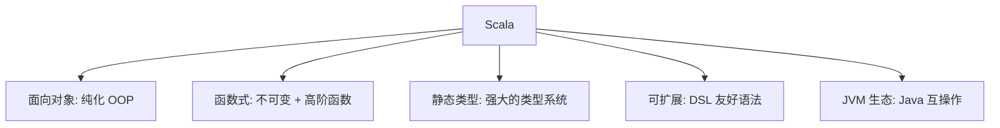
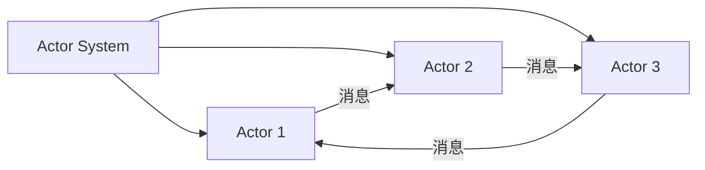
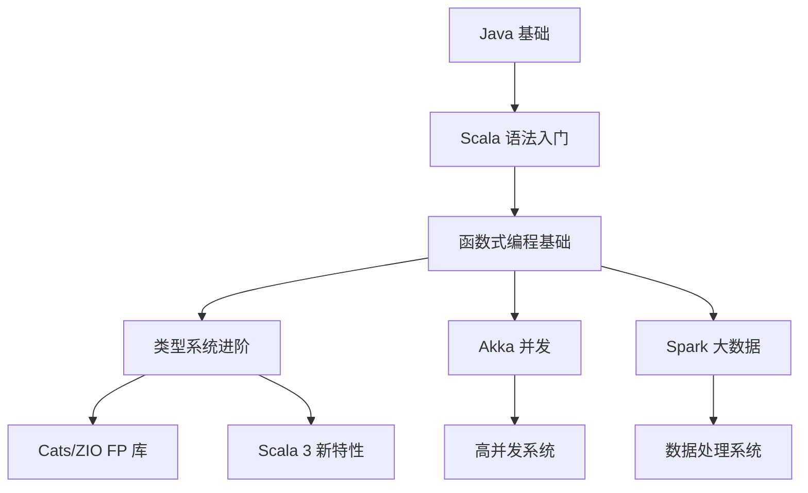

# Scala

## 一、概述

Scala (Scalable Language) 由 Martin Odersky 于 2004 年推出，融合面向对象编程 (OOP) 和函数式编程 (FP) 范式，运行于 JVM（也支持 Scala.js 和 Scala Native）。

### 1.1 设计目标



Scala 的名称源自 "Scalable Language" — 语言本身随应用规模扩展而扩展。

## 二、核心语言特性

### 2.1 类型推断 (Type Inference)

```scala
val x = 42                // 推断为 Int
val y = "hello"           // 推断为 String
val z = List(1, 2, 3)     // 推断为 List[Int]
```

### 2.2 Immutability 优先

```scala
val immutable = 42        // val: 不可变引用
var mutable = 42          // var: 可变引用

val list = List(1, 2, 3)  // 不可变列表
val modified = list :+ 4  // 新列表 [1, 2, 3, 4]
```

### 2.3 函数式编程特性

```scala
// 函数是一等公民
val add = (a: Int, b: Int) => a + b
val multiply: (Int, Int) => Int = _ * _

// 高阶函数
List(1, 2, 3, 4, 5)
  .filter(_ % 2 == 0)      // 筛选偶数
  .map(_ * 2)              // 翻倍
  .reduce(_ + _)           // 求和 = 2*(2+4)=12

// for 推导式
val result = for {
  x <- 1 to 10
  y <- 1 to 10
  if x % 2 == 0 && y % 2 == 0
} yield (x, y)
```

### 2.4 模式匹配 (Pattern Matching)

```scala
sealed trait Shape
case class Circle(radius: Double) extends Shape
case class Rectangle(width: Double, height: Double) extends Shape

def area(shape: Shape): Double = shape match {
  case Circle(r)          => math.Pi * r * r
  case Rectangle(w, h)    => w * h
}

// 提取器 (Extractor)
object Email {
  def unapply(s: String): Option[(String, String)] = {
    val parts = s.split("@")
    if (parts.length == 2) Some(parts(0), parts(1)) else None
  }
}
"user@example.com" match {
  case Email(name, domain) => s"$name at $domain"
}
```

## 三、类型系统

### 3.1 泛型与类型参数

```scala
class Box[T](value: T) {
  def get: T = value
}

// 协变 (Covariant)
trait List[+A]
// 逆变 (Contravariant)
trait Function1[-T, +R]
// 类型边界
def find[T <: Comparable[T]](list: List[T], target: T): Boolean
```

$$Type\ Variance:\ \text{If } A \leq B \text{ then }
\begin{cases}
F[A] \leq F[B] & \text{covariant } (+) \\
F[B] \leq F[A] & \text{contravariant } (-) \\
\text{not comparable} & \text{invariant}
\end{cases}$$

### 3.2 Implicit (隐式)

```scala
// 隐式参数
implicit val ec: ExecutionContext = ExecutionContext.global

def asyncTask(implicit ec: ExecutionContext): Future[Int] = Future {
  compute()
}

// 隐式转换 (Scala 2)
implicit def int2String(x: Int): String = x.toString
```

Scala 3 将 `implicit` 拆分为 `given`/`using` 和 `extension` 方法：

```scala
// Scala 3
given ExecutionContext = ExecutionContext.global
def asyncTask(using ec: ExecutionContext): Future[Int] = ???
```

### 3.3 联合类型与交类型 (Scala 3)

```scala
type Number = Int | Double     // 联合类型 (Union Type)
def process(n: Number): Unit

type Readable & Writable = Readable & Writable  // 交类型 (Intersection Type)
```

## 四、并发与异步

### 4.1 Future & Promise

```scala
import scala.concurrent.ExecutionContext.Implicits.global

val future: Future[Int] = Future {
  Thread.sleep(1000)
  42
}

future.map(_ * 2).recover {
  case e: Exception => 0
}
```

### 4.2 Akka Actor 模型



```scala
class HelloActor extends Actor {
  def receive: Receive = {
    case "hello" => sender() ! "world"
    case _       => println("unknown message")
  }
}

val system = ActorSystem("MySystem")
val actor = system.actorOf(Props[HelloActor](), "helloActor")
actor ! "hello"
```

## 五、生态系统

### 5.1 主要框架

| 框架 | 类型 | 特点 |
|------|------|------|
| Akka | 并发框架 | Actor 模型，弹性并发 |
| Play Framework | Web 框架 | 无状态，热重载 |
| Apache Spark | 大数据处理 | 用 Scala 编写，RDD/DF API |
| Cats | FP 库 | 类型类，纯函数式 |
| ZIO | 异步编程 | ZIO 数据类型，类型安全 |
| http4s | HTTP 服务 | 纯函数式 HTTP |
| Monix | 响应式 | 异步流式编程 |

### 5.2 大数据生态中的位置

Scala 是 Apache Spark 的原生语言：

```scala
val df = spark.read.parquet("data.parquet")
df.groupBy("category")
  .agg(
    avg("price") as "avg_price",
    count("*") as "count"
  )
  .orderBy(desc("count"))
  .show()
```

## 六、Scala 2 vs Scala 3

| 特性 | Scala 2 | Scala 3 |
|------|---------|---------|
| 语法 | 传统 | 缩进敏感（可选） |
| Enum | `sealed case object` | `enum` 关键字 |
| Implicit | `implicit` | `given`/`using` |
| Union types | 无 | 支持 |
| Opaque types | 无 | 支持 |
| 宏 | 不稳定 | 新宏系统 (TASTy) |
| 编译器 | 慢 | 快 2-3 倍 |

## 七、Scala 与 Java 互操作

```scala
// 使用 Java 库
import java.util.{ArrayList, HashMap}
val list = new ArrayList[String]()
list.add("hello")

// Java 调用 Scala
// scala.collection.immutable.List 与 java.util.List 互转
import scala.jdk.CollectionConverters._
val javaList: java.util.List[Int] = scalaList.asJava
val scalaList: Seq[Int] = javaList.asScala.toSeq
```

## 八、应用场景

| 领域 | 应用 | 理由 |
|------|------|------|
| 大数据 | Spark, Flink | 函数式 + 分布式 |
| 高并发后端 | Twitter, LinkedIn | Akka Actor 模型 |
| 金融系统 | 交易引擎 | 类型安全 + 不可变性 |
| Web 开发 | Play Framework | 无状态架构 |
| 机器学习 | Breeze, Smile | 线性代数 DSL |

## 九、Scala 的开发工具

| 工具 | 类型 | 说明 |
|------|------|------|
| sbt | 构建工具 | Scala 标准构建工具，增量编译 |
| Mill | 构建工具 | 更快的替代 sbt 的方案 |
| IntelliJ IDEA | IDE | Scala 最佳 IDE 支持 |
| Metals | LSP 服务器 | VS Code/Vim 语言服务 |
| Ammonite | REPL | 增强版 Scala REPL |
| Bloop | 编译服务器 | 加速增量编译 |

### sbt 构建配置示例

```scala
// build.sbt
name := "my-project"
version := "1.0"
scalaVersion := "3.3.1"

libraryDependencies ++= Seq(
  "org.apache.spark" %% "spark-core" % "3.5.0",
  "org.typelevel" %% "cats-core" % "2.10.0",
  "org.scalatest" %% "scalatest" % "3.2.17" % Test
)

Compile / mainClass := Some("com.example.Main")
```

## 十、Scala 中的函数式编程模式

### 10.1 Functor, Applicative, Monad

| 类型类 | 核心操作 | 签名 | 意义 |
|--------|----------|------|------|
| Functor | `map` | `F[A] => (A=>B) => F[B]` | 在容器内应用函数 |
| Applicative | `pure` + `<*>` | `A => F[A]`, `F[A=>B] => F[A] => F[B]` | 纯值提升和并行应用 |
| Monad | `flatMap` | `F[A] => (A=>F[B]) => F[B]` | 顺序计算（带上下文） |

```scala
// Monad 法则
trait Monad[F[_]] extends Functor[F] {
  def pure[A](a: A): F[A]
  def flatMap[A, B](fa: F[A])(f: A => F[B]): F[B]
  // 左单位元: flatMap(pure(a))(f) == f(a)
  // 右单位元: flatMap(m)(pure) == m
  // 结合律: flatMap(flatMap(m)(f))(g) == flatMap(m)(x => flatMap(f(x))(g))
}
```

### 10.2 惰性求值 (Lazy Evaluation)

```scala
// Stream/LazyList: 惰性求值的链表
val fibs: LazyList[BigInt] =
  BigInt(0) #:: BigInt(1) #:: fibs.zip(fibs.tail).map(_ + _)
fibs.take(10).toList  // List(0, 1, 1, 2, 3, 5, 8, 13, 21, 34)
```

### 10.3 Tagless Final 模式

使用类型类替代具体 Monad 实现，解耦程序定义与解释执行：

```scala
trait Algebra[F[_]] {
  def greet(name: String): F[String]
  def store(key: String, value: String): F[Unit]
}

def program[F[_]: Monad](A: Algebra[F]): F[String] = for {
  msg <- A.greet("World")
  _   <- A.store("greeting", msg)
} yield msg
```

## 十一、Scala 面试常见问题

| 题目 | 考察要点 |
|------|----------|
| `val` vs `var` vs `lazy val` | 不可变性、惰性求值 |
| `sealed` 关键字作用 | 模式匹配穷尽性检查 |
| 协变/逆变/不变的区别 | 类型参数变体标注 |
| Implicit 的解析规则 | 当前作用域、伴生对象 |
| `Option` vs `Either` vs `Try` | 错误处理策略选择 |
| 函数柯里化与部分应用 | 高阶函数 |
| `Future` 的执行模型 | 线程池、ExecutionContext |
| `for` 推导式的 desugar | flatMap/map/filter 调用链 |
| `Nothing` 与 `Null` 的区别 | 类型层级底部 |
| Path-dependent types | 内部类类型依赖外部实例 |

## 十二、Scala 的学习路径



## 相关条目
- [[05_ComputerScience/ProgrammingLanguages/INDEX]]
- [[Ruby]]
