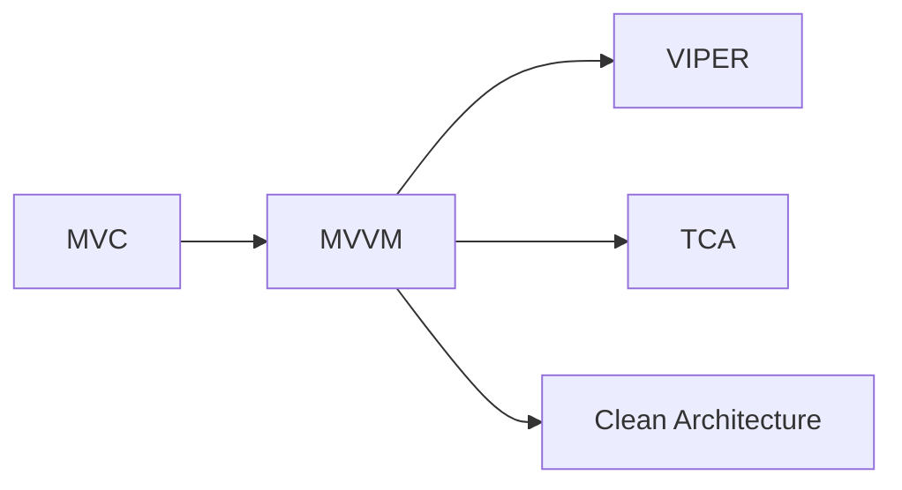
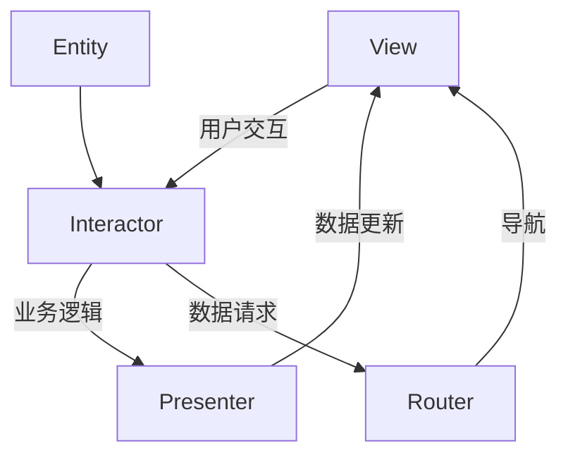
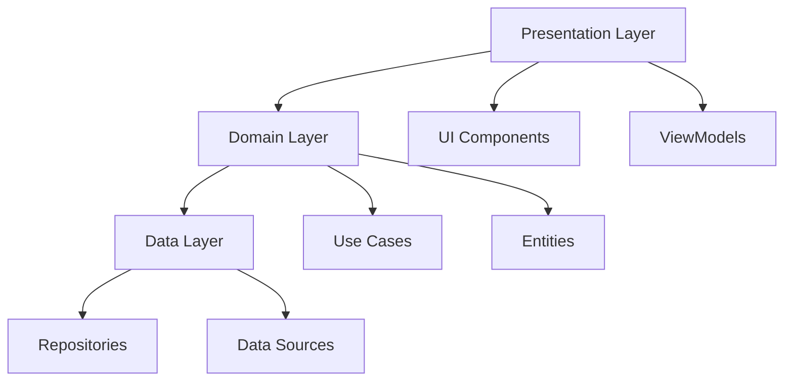

# iOS 应用架构 (iOS App Architecture)

## 一、概述

iOS 应用架构决定了代码的组织方式、职责划分和可维护性。本文档涵盖主流架构模式及其在 Swift 中的实现。

### 1.1 架构演进



### 1.2 架构对比

| 架构 | 复杂度 | 可测试性 | 可维护性 | 适用场景 |
|------|--------|---------|---------|---------|
| **MVC** | 低 | 低 | 低 | 原型、小项目 |
| **MVVM** | 中 | 高 | 高 | 中大型项目 |
| **VIPER** | 高 | 很高 | 很高 | 大型团队项目 |
| **TCA** | 中高 | 很高 | 高 | SwiftUI 项目 |
| **Clean** | 高 | 很高 | 很高 | 企业级项目 |

---

## 二、MVC (Model-View-Controller)

### 2.1 传统 MVC

```swift
// Model
struct User: Codable {
    let id: Int
    let name: String
    let email: String
}

// View (通常由 Storyboard/XIB 实现)
class UserView: UIView {
    @IBOutlet weak var nameLabel: UILabel!
    @IBOutlet weak var emailLabel: UILabel!
    
    func configure(with user: User) {
        nameLabel.text = user.name
        emailLabel.text = user.email
    }
}

// Controller
class UserViewController: UIViewController {
    @IBOutlet weak var userView: UserView!
    
    private var user: User?
    
    override func viewDidLoad() {
        super.viewDidLoad()
        loadUser()
    }
    
    private func loadUser() {
        // 网络请求、数据处理、UI更新都混在Controller中
        URLSession.shared.dataTask(with: userURL) { [weak self] data, _, _ in
            guard let data = data else { return }
            let user = try? JSONDecoder().decode(User.self, from: data)
            DispatchQueue.main.async {
                self?.user = user
                if let user = user {
                    self?.userView.configure(with: user)
                }
            }
        }.resume()
    }
}
```

### 2.2 MVC 的问题

- **Massive View Controller**：所有逻辑集中在 Controller
- **难以测试**：UI、业务逻辑、网络请求耦合
- **低复用性**：逻辑与 UIKit 紧密绑定

---

## 三、MVVM (Model-View-ViewModel)

### 3.1 MVVM 基础

```swift
// Model
struct User: Codable, Identifiable {
    let id: Int
    let name: String
    let email: String
}

// ViewModel
class UserViewModel: ObservableObject {
    @Published var users: [User] = []
    @Published var isLoading = false
    @Published var error: Error?
    
    private let apiService: APIServiceProtocol
    
    init(apiService: APIServiceProtocol = APIService()) {
        self.apiService = apiService
    }
    
    @MainActor
    func fetchUsers() async {
        isLoading = true
        defer { isLoading = false }
        
        do {
            users = try await apiService.fetchUsers()
        } catch {
            self.error = error
        }
    }
    
    var formattedUserCount: String {
        "\(users.count) 位用户"
    }
}

// View (SwiftUI)
struct UserListView: View {
    @StateObject private var viewModel = UserViewModel()
    
    var body: some View {
        List(viewModel.users) { user in
            VStack(alignment: .leading) {
                Text(user.name)
                    .font(.headline)
                Text(user.email)
                    .font(.subheadline)
                    .foregroundColor(.secondary)
            }
        }
        .overlay {
            if viewModel.isLoading {
                ProgressView()
            }
        }
        .task {
            await viewModel.fetchUsers()
        }
    }
}
```

### 3.2 UIKit + MVVM

```swift
// ViewModel
class UserListViewModel {
    var users: [User] = [] {
        didSet { onUsersUpdate?(users) }
    }
    var isLoading: Bool = false {
        didSet { onLoadingChange?(isLoading) }
    }
    var error: Error? {
        didSet { if let error = error { onError?(error) } }
    }
    
    var onUsersUpdate: (([User]) -> Void)?
    var onLoadingChange: ((Bool) -> Void)?
    var onError: ((Error) -> Void)?
    
    func fetchUsers() async {
        isLoading = true
        do {
            users = try await APIService.shared.fetchUsers()
        } catch {
            self.error = error
        }
        isLoading = false
    }
}

// View Controller
class UserListViewController: UITableViewController {
    private let viewModel: UserListViewModel
    private var cancellables = Set<AnyCancellable>()
    
    init(viewModel: UserListViewModel) {
        self.viewModel = viewModel
        super.init(nibName: nil, bundle: nil)
    }
    
    override func viewDidLoad() {
        super.viewDidLoad()
        bindViewModel()
        Task { await viewModel.fetchUsers() }
    }
    
    private func bindViewModel() {
        viewModel.onUsersUpdate = { [weak self] _ in
            self?.tableView.reloadData()
        }
        
        viewModel.onLoadingChange = { [weak self] isLoading in
            // 更新加载状态
        }
    }
}
```

### 3.3 依赖注入

```swift
// 协议定义
protocol APIServiceProtocol {
    func fetchUsers() async throws -> [User]
    func fetchUser(id: Int) async throws -> User
}

// 真实实现
class APIService: APIServiceProtocol {
    func fetchUsers() async throws -> [User] {
        // 真实网络请求
    }
}

// Mock 实现（用于测试）
class MockAPIService: APIServiceProtocol {
    var mockUsers: [User] = []
    var shouldFail = false
    
    func fetchUsers() async throws -> [User] {
        if shouldFail { throw NetworkError.mock }
        return mockUsers
    }
}

// 依赖注入容器
class DependencyContainer {
    static let shared = DependencyContainer()
    
    lazy var apiService: APIServiceProtocol = APIService()
    lazy var database: DatabaseProtocol = SQLiteDatabase()
}

// 使用
let viewModel = UserViewModel(apiService: DependencyContainer.shared.apiService)
```

---

## 四、VIPER

### 4.1 VIPER 架构



| 组件 | 职责 |
|------|------|
| **View** | 显示数据，传递用户交互 |
| **Interactor** | 业务逻辑，数据处理 |
| **Presenter** | 格式化数据，协调各组件 |
| **Entity** | 数据模型 |
| **Router** | 导航逻辑 |

### 4.2 VIPER 实现

```swift
// Entity
struct User: Codable, Identifiable {
    let id: Int
    let name: String
    let email: String
}

// Protocols
protocol UserViewProtocol: AnyObject {
    func showUsers(_ users: [User])
    func showError(_ error: Error)
    func showLoading()
    func hideLoading()
}

protocol UserInteractorProtocol {
    func fetchUsers() async
}

protocol UserPresenterProtocol {
    func viewDidLoad()
    func didSelectUser(_ user: User)
    func didTapRefresh()
}

protocol UserRouterProtocol {
    func navigateToUserDetail(_ user: User)
}

protocol UserInteractorOutputProtocol: AnyObject {
    func didFetchUsers(_ users: [User])
    func didFailWithError(_ error: Error)
}

// View
class UserViewController: UIViewController, UserViewProtocol {
    var presenter: UserPresenterProtocol?
    
    func showUsers(_ users: [User]) {
        // 更新 UI
    }
    
    func showError(_ error: Error) {
        // 显示错误
    }
    
    func showLoading() { /* ... */ }
    func hideLoading() { /* ... */ }
}

// Interactor
class UserInteractor: UserInteractorProtocol {
    weak var presenter: UserInteractorOutputProtocol?
    private let apiService: APIServiceProtocol
    
    func fetchUsers() async {
        do {
            let users = try await apiService.fetchUsers()
            presenter?.didFetchUsers(users)
        } catch {
            presenter?.didFailWithError(error)
        }
    }
}

// Presenter
class UserPresenter: UserPresenterProtocol, UserInteractorOutputProtocol {
    weak var view: UserViewProtocol?
    var interactor: UserInteractorProtocol?
    var router: UserRouterProtocol?
    
    func viewDidLoad() {
        view?.showLoading()
        Task { await interactor?.fetchUsers() }
    }
    
    func didSelectUser(_ user: User) {
        router?.navigateToUserDetail(user)
    }
    
    func didFetchUsers(_ users: [User]) {
        view?.hideLoading()
        view?.showUsers(users)
    }
    
    func didFailWithError(_ error: Error) {
        view?.hideLoading()
        view?.showError(error)
    }
}

// Router
class UserRouter: UserRouterProtocol {
    weak var viewController: UIViewController?
    
    func navigateToUserDetail(_ user: User) {
        let detailVC = UserDetailBuilder.build(with: user)
        viewController?.navigationController?.pushViewController(detailVC, animated: true)
    }
}

// Builder
enum UserBuilder {
    static func build() -> UIViewController {
        let view = UserViewController()
        let interactor = UserInteractor(apiService: APIService())
        let presenter = UserPresenter()
        let router = UserRouter()
        
        view.presenter = presenter
        presenter.view = view
        presenter.interactor = interactor
        presenter.router = router
        interactor.presenter = presenter
        router.viewController = view
        
        return view
    }
}
```

---

## 五、TCA (The Composable Architecture)

### 5.1 TCA 核心概念

```swift
import ComposableArchitecture

// Reducer - 状态转换逻辑
@Reducer
struct UserFeature {
    @ObservableState
    struct State: Equatable {
        var users: [User] = []
        var isLoading = false
        var error: String?
    }
    
    enum Action: Equatable {
        case fetchUsers
        case usersResponse(Result<[User], Error>)
        case deleteUser(id: Int)
    }
    
    @Dependency(\.apiClient) var apiClient
    
    var body: some ReducerOf<Self> {
        Reduce { state, action in
            switch action {
            case .fetchUsers:
                state.isLoading = true
                return .run { send in
                    do {
                        let users = try await apiClient.fetchUsers()
                        await send(.usersResponse(.success(users)))
                    } catch {
                        await send(.usersResponse(.failure(error)))
                    }
                }
                
            case .usersResponse(.success(let users)):
                state.isLoading = false
                state.users = users
                return .none
                
            case .usersResponse(.failure(let error)):
                state.isLoading = false
                state.error = error.localizedDescription
                return .none
                
            case .deleteUser(id: let id):
                state.users.removeAll { $0.id == id }
                return .none
            }
        }
    }
}

// View
struct UserListView: View {
    @Bindable var store: StoreOf<UserFeature>
    
    var body: some View {
        List {
            ForEach(store.users) { user in
                Text(user.name)
                    .swipeActions {
                        Button("删除") {
                            store.send(.deleteUser(id: user.id))
                        }
                    }
            }
        }
        .overlay {
            if store.isLoading {
                ProgressView()
            }
        }
        .task {
            store.send(.fetchUsers)
        }
    }
}
```

### 5.2 TCA 依赖注入

```swift
// 依赖客户端
struct APIClient {
    var fetchUsers: @Sendable () async throws -> [User]
    var fetchUser: @Sendable (Int) async throws -> User
}

extension APIClient: DependencyKey {
    static let liveValue = APIClient(
        fetchUsers: {
            let (data, _) = try await URLSession.shared.data(from: usersURL)
            return try JSONDecoder().decode([User].self, from: data)
        },
        fetchUser: { id in
            let (data, _) = try await URLSession.shared.data(from: userURL(id))
            return try JSONDecoder().decode(User.self, from: data)
        }
    )
    
    static let testValue = APIClient(
        fetchUsers: { User.mocks },
        fetchUser: { _ in User.mock }
    )
}

extension DependencyValues {
    var apiClient: APIClient {
        get { self[APIClient.self] }
        set { self[APIClient.self] = newValue }
    }
}
```

### 5.3 TCA 导航

```swift
@Reducer
struct AppFeature {
    @ObservableState
    struct State {
        var userList = UserFeature.State()
        var userDetail: UserDetailFeature.State?
    }
    
    enum Action {
        case userList(UserFeature.Action)
        case userDetail(UserDetailFeature.Action)
        case showUserDetail(User)
    }
    
    var body: some ReducerOf<Self> {
        Scope(state: \.userList, action: \.userList) {
            UserFeature()
        }
        
        Reduce { state, action in
            switch action {
            case .userList(.userSelected(let user)):
                state.userDetail = UserDetailFeature.State(user: user)
                return .none
                
            case .showUserDetail(let user):
                state.userDetail = UserDetailFeature.State(user: user)
                return .none
                
            default:
                return .none
            }
        }
        .ifLet(\.userDetail, action: \.userDetail) {
            UserDetailFeature()
        }
    }
}
```

---

## 六、Clean Architecture

### 6.1 分层结构



### 6.2 Clean Architecture 实现

```swift
// Domain Layer - Entities
struct User: Equatable, Identifiable {
    let id: Int
    let name: String
    let email: String
}

// Domain Layer - Repository Protocol
protocol UserRepository {
    func fetchUsers() async throws -> [User]
    func fetchUser(id: Int) async throws -> User
    func saveUser(_ user: User) async throws
}

// Domain Layer - Use Cases
class FetchUsersUseCase {
    private let repository: UserRepository
    
    init(repository: UserRepository) {
        self.repository = repository
    }
    
    func execute() async throws -> [User] {
        try await repository.fetchUsers()
    }
}

class FetchUserUseCase {
    private let repository: UserRepository
    
    init(repository: UserRepository) {
        self.repository = repository
    }
    
    func execute(id: Int) async throws -> User {
        try await repository.fetchUser(id: id)
    }
}

// Data Layer - Data Sources
protocol UserRemoteDataSource {
    func fetchUsers() async throws -> [UserDTO]
}

protocol UserLocalDataSource {
    func fetchUsers() async throws -> [UserEntity]
    func saveUsers(_ users: [UserEntity]) async throws
}

// Data Layer - Repository Implementation
class UserRepositoryImpl: UserRepository {
    private let remoteDataSource: UserRemoteDataSource
    private let localDataSource: UserLocalDataSource
    
    init(
        remoteDataSource: UserRemoteDataSource,
        localDataSource: UserLocalDataSource
    ) {
        self.remoteDataSource = remoteDataSource
        self.localDataSource = localDataSource
    }
    
    func fetchUsers() async throws -> [User] {
        do {
            let dtos = try await remoteDataSource.fetchUsers()
            let entities = dtos.map { $0.toEntity() }
            try await localDataSource.saveUsers(entities)
            return dtos.map { $0.toDomain() }
        } catch {
            let entities = try await localDataSource.fetchUsers()
            return entities.map { $0.toDomain() }
        }
    }
}

// Presentation Layer - ViewModel
@MainActor
class UserListViewModel: ObservableObject {
    @Published var users: [User] = []
    @Published var isLoading = false
    
    private let fetchUsersUseCase: FetchUsersUseCase
    
    init(fetchUsersUseCase: FetchUsersUseCase) {
        self.fetchUsersUseCase = fetchUsersUseCase
    }
    
    func loadUsers() async {
        isLoading = true
        do {
            users = try await fetchUsersUseCase.execute()
        } catch {
            // 处理错误
        }
        isLoading = false
    }
}
```

---

## 七、Coordinator 模式

### 7.1 Coordinator 实现

```swift
// Coordinator 协议
protocol Coordinator: AnyObject {
    var childCoordinators: [Coordinator] { get set }
    var navigationController: UINavigationController { get }
    
    func start()
    func addChild(_ coordinator: Coordinator)
    func removeChild(_ coordinator: Coordinator)
}

// 基础实现
class BaseCoordinator: Coordinator {
    var childCoordinators: [Coordinator] = []
    let navigationController: UINavigationController
    
    init(navigationController: UINavigationController) {
        self.navigationController = navigationController
    }
    
    func start() {
        fatalError("Subclasses must implement start()")
    }
    
    func addChild(_ coordinator: Coordinator) {
        childCoordinators.append(coordinator)
    }
    
    func removeChild(_ coordinator: Coordinator) {
        childCoordinators.removeAll { $0 === coordinator }
    }
}

// App Coordinator
class AppCoordinator: BaseCoordinator {
    override func start() {
        let tabBarCoordinator = TabBarCoordinator(
            navigationController: navigationController
        )
        addChild(tabBarCoordinator)
        tabBarCoordinator.start()
    }
}

// User Flow Coordinator
class UserCoordinator: BaseCoordinator {
    var onUserSelected: ((User) -> Void)?
    
    override func start() {
        let viewModel = UserListViewModel()
        let viewController = UserListViewController(viewModel: viewModel)
        
        viewModel.onUserSelected = { [weak self] user in
            self?.showUserDetail(user)
        }
        
        navigationController.setViewControllers([viewController], animated: false)
    }
    
    private func showUserDetail(_ user: User) {
        let detailCoordinator = UserDetailCoordinator(
            navigationController: navigationController,
            user: user
        )
        addChild(detailCoordinator)
        detailCoordinator.start()
    }
}
```

---

## 八、架构选择指南

### 8.1 选择标准

| 考虑因素 | MVC | MVVM | VIPER | TCA | Clean |
|---------|-----|------|-------|-----|-------|
| 团队规模 | 1-2人 | 2-5人 | 5+人 | 2-5人 | 5+人 |
| 项目复杂度 | 低 | 中 | 高 | 中高 | 高 |
| SwiftUI 支持 | 差 | 好 | 一般 | 优秀 | 好 |
| 可测试性 | 低 | 高 | 很高 | 很高 | 很高 |
| 学习曲线 | 低 | 中 | 高 | 中高 | 高 |

### 8.2 推荐方案

| 场景 | 推荐架构 |
|------|---------|
| 快速原型 | MVC |
| SwiftUI 新项目 | TCA |
| UIKit 中型项目 | MVVM |
| 大型团队协作 | VIPER 或 Clean |
| 企业级应用 | Clean + MVVM |

---

## 相关条目

- [[Swift]]
- [[SwiftUI与iOS开发]]
- [[Combine]]
- [[SwiftConcurrency]]

## 参考资源

1. Apple. "App Architecture Guide." developer.apple.com
2. Sutiwong, K. "iOS Architecture Patterns." raywenderlich.com
3. Point-Free. "The Composable Architecture." github.com/pointfreeco
4. Uncle Bob. "Clean Architecture." 2017
