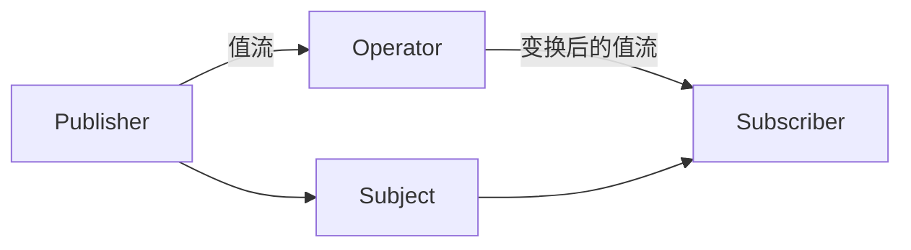

# Combine 框架 (Combine Framework)

## 一、概述

Combine 是 Apple 在 2019 年推出的响应式编程框架，用于处理随时间变化的值流。它提供了声明式的 API 来处理异步事件，是 SwiftUI 状态管理的核心基础。

### 1.1 核心概念



| 概念 | 描述 |
|------|------|
| **Publisher** | 值的生产者，发出值和完成/错误事件 |
| **Subscriber** | 值的消费者，接收并处理事件 |
| **Operator** | 变换操作符，对值流进行中间处理 |
| **Subject** | 既是 Publisher 又是 Subscriber，可手动发送值 |

### 1.2 Combine vs async/await

| 特性 | Combine | async/await |
|------|---------|-------------|
| 编程范式 | 声明式 | 命令式 |
| 学习曲线 | 陡峭 | 平缓 |
| 操作符丰富度 | 非常丰富 | 需手动实现 |
| SwiftUI 集成 | 原生支持 | 需要桥接 |
| 内存管理 | 需要 Cancellable | 自动管理 |
| 适用场景 | 复杂事件流 | 简单异步操作 |

---

## 二、Publisher 协议

### 2.1 Publisher 定义

```swift
// Publisher 协议
protocol Publisher {
    associatedtype Output
    associatedtype Failure: Error
    
    func receive<S: Subscriber>(subscriber: S) 
        where S.Input == Output, S.Failure == Failure
}
```

### 2.2 内置 Publisher

| Publisher | 描述 | 创建方式 |
|-----------|------|---------|
| **Just** | 发出单个值后完成 | `Just(42)` |
| **Future** | 异步操作，发出单个值 | `Future { promise in }` |
| **PassthroughSubject** | 手动发送值，不保留最新值 | `PassthroughSubject<Int, Never>()` |
| **CurrentValueSubject** | 手动发送值，保留最新值 | `CurrentValueSubject<Int, Never>(0)` |
| **Empty** | 立即完成，不发出值 | `Empty()` |
| **Fail** | 立即发出错误 | `Fail(error: .networkError)` |
| **Sequence** | 从序列创建 | `[1,2,3].publisher` |
| **Timer** | 定时发出值 | `Timer.publish(every: 1, on: .main, in: .common)` |
| **NotificationCenter** | 通知中心发布 | `NotificationCenter.default.publisher(for: .didBecomeActive)` |
| **URLSession** | 网络请求 | `URLSession.shared.dataTaskPublisher(for: url)` |

### 2.3 自定义 Publisher

```swift
// 自定义 Publisher
struct CountdownPublisher: Publisher {
    typealias Output = Int
    typealias Failure = Never
    
    let start: Int
    
    func receive<S: Subscriber>(subscriber: S) 
        where S.Input == Int, S.Failure == Never {
        let subscription = CountdownSubscription(
            subscriber: subscriber,
            current: start
        )
        subscriber.receive(subscription: subscription)
    }
}

class CountdownSubscription<S: Subscriber>: Subscription 
    where S.Input == Int, S.Failure == Never {
    
    let subscriber: S
    var current: Int
    var demand: Subscribers.Demand = .none
    
    init(subscriber: S, current: Int) {
        self.subscriber = subscriber
        self.current = current
    }
    
    func request(_ demand: Subscribers.Demand) {
        self.demand = demand
        
        while current > 0 && demand > .none {
            _ = subscriber.receive(current)
            current -= 1
        }
        
        if current <= 0 {
            subscriber.receive(completion: .finished)
        }
    }
    
    func cancel() {
        current = 0
    }
}

// 使用
let countdown = CountdownPublisher(start: 10)
countdown.sink { value in
    print(value)
}
```

---

## 三、Subscriber 协议

### 3.1 内置 Subscriber

```swift
// sink - 最常用的 Subscriber
let cancellable = [1, 2, 3].publisher
    .sink(
        receiveCompletion: { completion in
            switch completion {
            case .finished:
                print("完成")
            case .failure(let error):
                print("错误: \(error)")
            }
        },
        receiveValue: { value in
            print("收到值: \(value)")
        }
    )

// assign - 将值赋给对象属性
class ViewModel: ObservableObject {
    @Published var name: String = ""
}

let viewModel = ViewModel()
let cancellable = ["John", "Jane", "Bob"].publisher
    .assign(to: \.name, on: viewModel)

// 一次性 Subscriber
let result = try await [1, 2, 3].publisher.values.first()
```

### 3.2 自定义 Subscriber

```swift
class StringSubscriber: Subscriber {
    typealias Input = String
    typealias Failure = Never
    
    func receive(subscription: Subscription) {
        subscription.request(.max(3))  // 只请求3个值
    }
    
    func receive(_ input: String) -> Subscribers.Demand {
        print("收到: \(input)")
        return .none  // 不请求更多值
    }
    
    func receive(completion: Subscribers.Completion<Never>) {
        print("完成")
    }
}

let subscriber = StringSubscriber()
["A", "B", "C", "D", "E"].publisher
    .subscribe(subscriber)
// 输出: 收到: A, 收到: B, 收到: C, 完成
```

---

## 四、操作符 (Operators)

### 4.1 变换操作符

```swift
// map - 转换每个值
[1, 2, 3].publisher
    .map { $0 * 2 }
    .sink { print($0) }  // 2, 4, 6

// flatMap - 展平嵌套的 Publisher
[[1, 2], [3, 4], [5, 6]].publisher
    .flatMap { $0.publisher }
    .sink { print($0) }  // 1, 2, 3, 4, 5, 6

// tryMap - 可抛出错误的 map
["1", "2", "abc", "4"].publisher
    .tryMap { str -> Int in
        guard let num = Int(str) else {
            throw ConversionError.invalidNumber
        }
        return num
    }
    .sink(
        receiveCompletion: { print($0) },
        receiveValue: { print($0) }
    )

// scan - 累积计算
[1, 2, 3, 4].publisher
    .scan(0, +)
    .sink { print($0) }  // 1, 3, 6, 10

// reduce - 聚合所有值
[1, 2, 3, 4].publisher
    .reduce(0, +)
    .sink { print($0) }  // 10
```

### 4.2 过滤操作符

```swift
// filter - 过滤值
[1, 2, 3, 4, 5].publisher
    .filter { $0 % 2 == 0 }
    .sink { print($0) }  // 2, 4

// removeDuplicates - 去重
[1, 1, 2, 2, 3, 3].publisher
    .removeDuplicates()
    .sink { print($0) }  // 1, 2, 3

// prefix - 取前N个值
[1, 2, 3, 4, 5].publisher
    .prefix(3)
    .sink { print($0) }  // 1, 2, 3

// dropFirst - 丢弃前N个值
[1, 2, 3, 4, 5].publisher
    .dropFirst(2)
    .sink { print($0) }  // 3, 4, 5

// first/last - 取第一个/最后一个值
[1, 2, 3].publisher
    .first()
    .sink { print($0) }  // 1

// outputAtIndex - 取指定索引的值
[10, 20, 30, 40].publisher
    .output(at: 2)
    .sink { print($0) }  // 30
```

### 4.3 时间操作符

```swift
// debounce - 防抖
searchTextPublisher
    .debounce(for: .milliseconds(300), scheduler: RunLoop.main)
    .sink { searchText in
        // 执行搜索
    }

// throttle - 节流
scrollPositionPublisher
    .throttle(for: .seconds(1), scheduler: RunLoop.main, latest: true)
    .sink { position in
        // 更新UI
    }

// delay - 延迟
[1, 2, 3].publisher
    .delay(for: .seconds(1), scheduler: DispatchQueue.main)
    .sink { print($0) }

// timeout - 超时
longRunningPublisher
    .timeout(.seconds(10), scheduler: DispatchQueue.main) {
        print("超时")
    }
```

### 4.4 合并操作符

```swift
// merge - 合并多个 Publisher
let publisher1 = PassthroughSubject<Int, Never>()
let publisher2 = PassthroughSubject<Int, Never>()

publisher1
    .merge(with: publisher2)
    .sink { print($0) }

publisher1.send(1)
publisher2.send(2)
publisher1.send(3)

// combineLatest - 组合最新值
let usernamePublisher = PassthroughSubject<String, Never>()
let passwordPublisher = PassthroughSubject<String, Never>()

usernamePublisher
    .combineLatest(passwordPublisher)
    .map { username, password in
        !username.isEmpty && password.count >= 8
    }
    .assign(to: \.isEnabled, on: loginButton)

// zip - 按顺序配对
[1, 2, 3].publisher
    .zip(["A", "B", "C"].publisher)
    .sink { print($0, $1) }  // (1, A), (2, B), (3, C)

// append/prepend - 追加/前置
[1, 2].publisher
    .append(3, 4, 5)
    .sink { print($0) }  // 1, 2, 3, 4, 5

// switchToLatest - 切换到最新的内部 Publisher
let searchPublisher = PassthroughSubject<String, Never>()

searchPublisher
    .debounce(for: .milliseconds(300), scheduler: RunLoop.main)
    .map { query in
        URLSession.shared.dataTaskPublisher(for: buildURL(query))
    }
    .switchToLatest()
    .sink { data, response in
        // 处理结果
    }
```

### 4.5 错误处理操作符

```swift
// mapError - 转换错误类型
dataPublisher
    .mapError { error -> NetworkError in
        NetworkError.underlying(error)
    }

// tryCatch - 捕获错误并提供替代 Publisher
primaryPublisher
    .tryCatch { error in
        return fallbackPublisher
    }

// retry - 重试
apiCallPublisher
    .retry(3)
    .sink(
        receiveCompletion: { print($0) },
        receiveValue: { print($0) }
    )

// replaceError - 用默认值替换错误
failingPublisher
    .replaceError(with: "默认值")
    .sink { print($0) }

// ignoreErrors - 忽略错误
failingPublisher
    .catch { _ in Empty() }
```

---

## 五、Subject

### 5.1 PassthroughSubject

```swift
// PassthroughSubject - 不保留最新值
let subject = PassthroughSubject<Int, Never>()

let cancellable = subject.sink { value in
    print(value)
}

subject.send(1)  // 输出: 1
subject.send(2)  // 输出: 2
// 新订阅者不会收到之前的值

// 在 UIKit 中使用
class ViewController: UIViewController {
    let searchTextSubject = PassthroughSubject<String, Never>()
    var cancellables = Set<AnyCancellable>()
    
    override func viewDidLoad() {
        super.viewDidLoad()
        
        searchTextSubject
            .debounce(for: .milliseconds(300), scheduler: RunLoop.main)
            .removeDuplicates()
            .sink { [weak self] text in
                self?.performSearch(text)
            }
            .store(in: &cancellables)
    }
    
    func searchBar(_ searchBar: UISearchBar, textDidChange searchText: String) {
        searchTextSubject.send(searchText)
    }
}
```

### 5.2 CurrentValueSubject

```swift
// CurrentValueSubject - 保留最新值
let subject = CurrentValueSubject<Int, Never>(0)

// 新订阅者立即收到当前值
let cancellable = subject.sink { value in
    print(value)  // 输出: 0（立即）
}

subject.send(1)  // 输出: 1
subject.send(2)  // 输出: 2

// 访问当前值
print(subject.value)  // 2

// 在 SwiftUI 中使用
class Store: ObservableObject {
    let count = CurrentValueSubject<Int, Never>(0)
    
    func increment() {
        count.value += 1
    }
}
```

---

## 六、Combine 与 SwiftUI 集成

### 6.1 @Published 属性包装器

```swift
class UserViewModel: ObservableObject {
    @Published var users: [User] = []
    @Published var isLoading = false
    @Published var error: Error?
    
    private var cancellables = Set<AnyCancellable>()
    
    func fetchUsers() {
        isLoading = true
        
        URLSession.shared.dataTaskPublisher(for: usersURL)
            .map(\.data)
            .decode(type: [User].self, decoder: JSONDecoder())
            .receive(on: DispatchQueue.main)
            .sink(
                receiveCompletion: { [weak self] completion in
                    self?.isLoading = false
                    if case .failure(let error) = completion {
                        self?.error = error
                    }
                },
                receiveValue: { [weak self] users in
                    self?.users = users
                }
            )
            .store(in: &cancellables)
    }
}
```

### 6.2 依赖注入 Combine

```swift
protocol APIServiceProtocol {
    func fetchUsers() -> AnyPublisher<[User], Error>
}

class APIService: APIServiceProtocol {
    func fetchUsers() -> AnyPublisher<[User], Error> {
        URLSession.shared.dataTaskPublisher(for: usersURL)
            .map(\.data)
            .decode(type: [User].self, decoder: JSONDecoder())
            .eraseToAnyPublisher()
    }
}

class MockAPIService: APIServiceProtocol {
    func fetchUsers() -> AnyPublisher<[User], Error> {
        Just([User.mock])
            .setFailureType(to: Error.self)
            .eraseToAnyPublisher()
    }
}
```

---

## 七、内存管理

### 7.1 Cancellable 生命周期

```swift
class ViewModel {
    var cancellables = Set<AnyCancellable>()
    
    func setup() {
        // store(in:) 自动管理生命周期
        publisher.sink { _ in }.store(in: &cancellables)
        
        // 手动取消
        let cancellable = publisher.sink { _ in }
        cancellable.cancel()
    }
    
    deinit {
        // cancellables 被释放时自动取消所有订阅
    }
}
```

### 7.2 避免循环引用

```swift
// 错误：循环引用
publisher.sink { value in
    self.process(value)  // 强引用 self
}

// 正确：使用 weak self
publisher.sink { [weak self] value in
    self?.process(value)
}

// 或使用 receive(on:) + weak
publisher
    .receive(on: DispatchQueue.main)
    .sink { [weak self] value in
        self?.process(value)
    }
    .store(in: &cancellables)
```

---

## 八、实际应用模式

### 8.1 搜索防抖模式

```swift
class SearchViewModel: ObservableObject {
    @Published var searchText = ""
    @Published var results: [SearchResult] = []
    @Published var isSearching = false
    
    private var cancellables = Set<AnyCancellable>()
    
    init() {
        $searchText
            .debounce(for: .milliseconds(300), scheduler: RunLoop.main)
            .removeDuplicates()
            .filter { !$0.isEmpty }
            .map { [weak self] query -> AnyPublisher<[SearchResult], Never> in
                self?.isSearching = true
                return self?.search(query) ?? Empty().eraseToAnyPublisher()
            }
            .switchToLatest()
            .receive(on: DispatchQueue.main)
            .sink { [weak self] results in
                self?.results = results
                self?.isSearching = false
            }
            .store(in: &cancellables)
    }
    
    private func search(_ query: String) -> AnyPublisher<[SearchResult], Never> {
        // 实现搜索
    }
}
```

### 8.2 表单验证模式

```swift
class FormViewModel: ObservableObject {
    @Published var email = ""
    @Published var password = ""
    @Published var confirmPassword = ""
    
    @Published var isEmailValid = false
    @Published var isPasswordValid = false
    @Published var doPasswordsMatch = false
    @Published var isFormValid = false
    
    private var cancellables = Set<AnyCancellable>()
    
    init() {
        $email
            .map { $0.contains("@") && $0.contains(".") }
            .assign(to: &$isEmailValid)
        
        $password
            .map { $0.count >= 8 }
            .assign(to: &$isPasswordValid)
        
        $password
            .combineLatest($confirmPassword)
            .map { $0 == $1 && !$0.isEmpty }
            .assign(to: &$doPasswordsMatch)
        
        $isEmailValid
            .combineLatest($isPasswordValid, $doPasswordsMatch)
            .map { $0 && $1 && $2 }
            .assign(to: &$isFormValid)
    }
}
```

---

## 相关条目

- [[Swift]]
- [[SwiftConcurrency]]
- [[SwiftUI与iOS开发]]
- [[AppArchitecture]]

## 参考资源

1. Apple. "Combine Documentation." developer.apple.com
2. Apple. "Using Combine." WWDC Sessions
3. Shaps, M. "Combine: Asynchronous Programming with Swift." raywenderlich.com
4. Apple. "Combine in Practice." WWDC 2019
